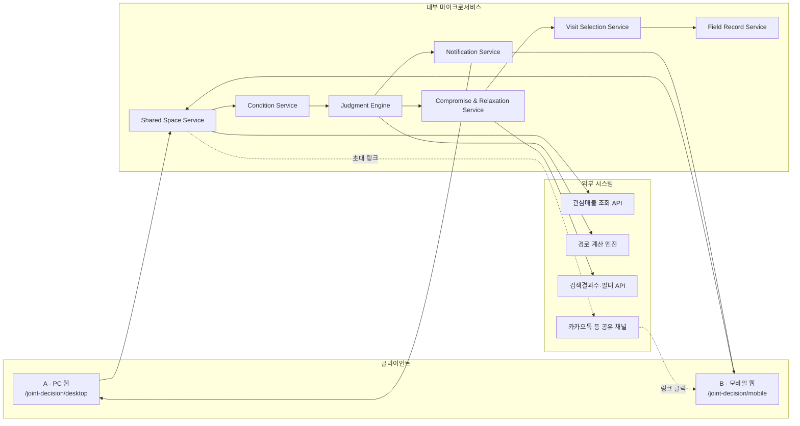
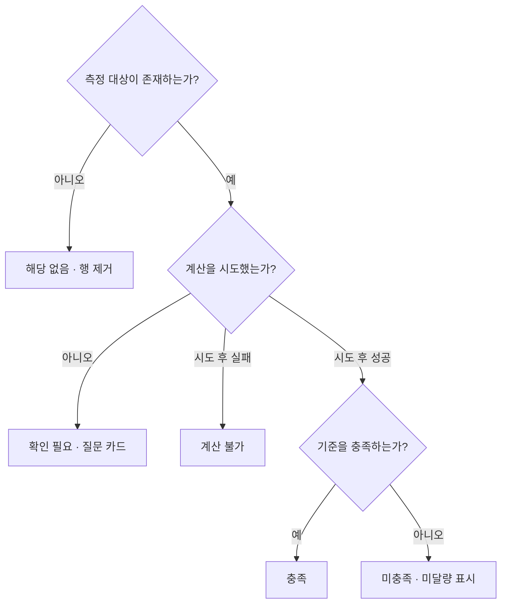
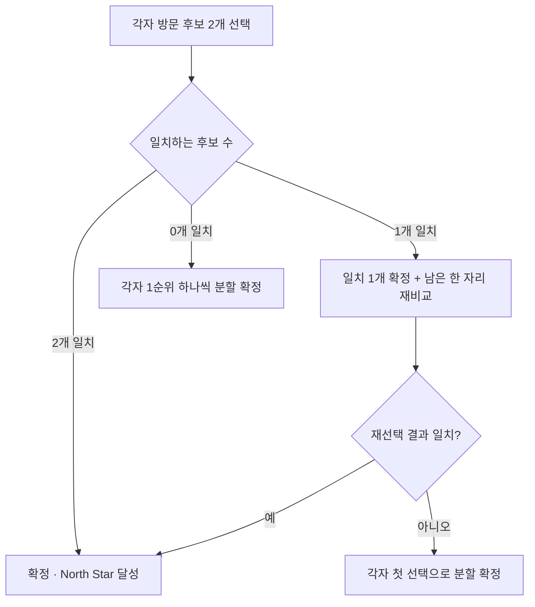
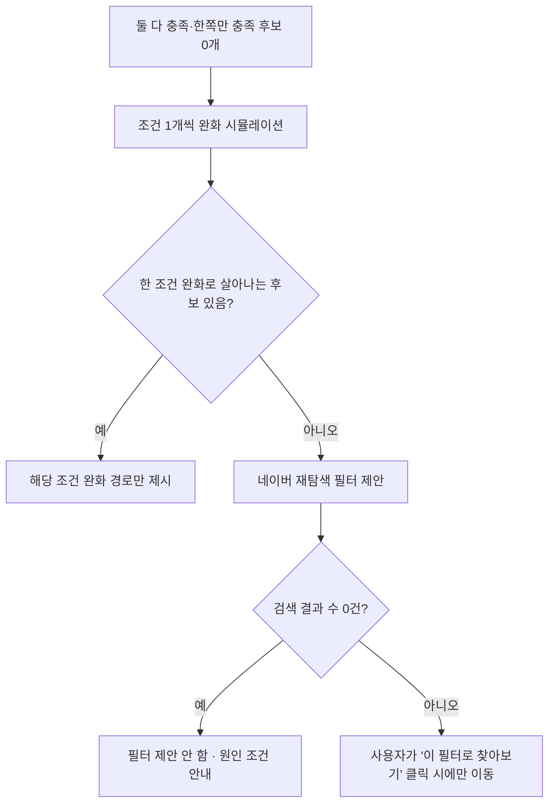
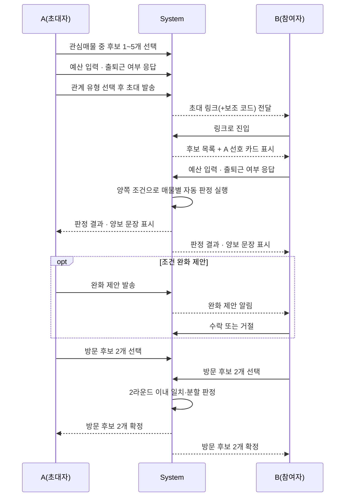
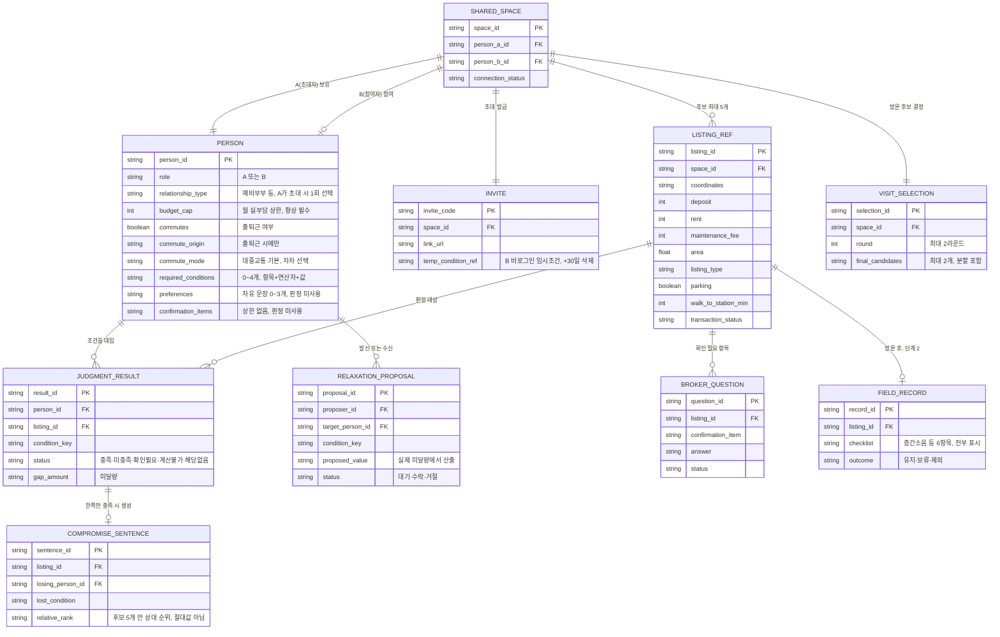

# [SRS 문서] JointHome-Core-Platform (한글)

# [SRS 문서] JointHome-Core-Platform

# 소프트웨어 요구사항 명세서 (SRS)

**문서 ID:** SRS-JOINTHOME-MVP-001

**개정 버전:** 1.0

**날짜:** 2026-08-24

**표준:** ISO/IEC/IEEE 29148:2018

**기준 PRD:** `prd_v0.2_20260824.md` (네이버 부동산 공동 주거 의사결정 기능 PRD)

---

## 1. 서론

### 1.1 목적

본 문서는 ISO/IEC/IEEE 29148:2018 표준에 따라, **네이버 부동산의 관심매물 저장 이후 구간에서 동작하는 2인 공동 주거 의사결정 기능(같이 고르기)**의 소프트웨어 요구사항을 정의한다. 본 SRS는 PRD v0.2의 기능·비기능 요구사항, 데이터 모델, 검증 계획을 구현 가능한 요구사항 단위로 재정리한 것이며, PRD의 결정 사항(`decisions/0001~0004`)을 임의로 변경하지 않는다.

### 1.2 범위

- 조건은 매물이 아니라 **사람에 귀속**되는 조건 모델 (예산 필수 + 출퇴근 조건부 + 추가 필수 0~4개)
- 조건별 실제값·임계값·미달량을 산출하는 **매물별 자동 판정** (충족/미충족/확인 필요/계산 불가/해당 없음 5분류)
- 한쪭만 충족하는 매물에 대한 **양보 문장(Trade-off) 생성** — 총점·순위 없이 문장으로만 서술
- 실제 미달량 기준의 **조건 완화 시뮬레이션**과 상대 조건 완화 제안(제안-수락 구조)
- 전부 불충족 시 **완화 우선 → 네이버 재탐색 필터 제안**의 2단계 구제 로직
- 겹치면 확정, 안 겹치면 최대 2라운드 내 분할로 종료하는 **방문 후보 2개 결정 프로토콜**
- 방문 전 중개사 질문 카드와 방문 후 공통 체크리스트를 포함한 **단계 2(현장 기록)**
- 네이버 관심매물 조회·경로 계산·검색 결과 수·필터 전달을 포함한 **네이버 내부 API 연동** (매물 데이터 쓰기 없음)
- A(PC 웹)·B(모바일 웹) 분리 접근과 **B 비로그인 임시 조건 보관(+30일)**

### 1.3 정의, 약어, 축약어

| 용어 | 정의 |
| --- | --- |
| 공유 객체 (Shared Space) | 두 사람의 비교 후보(매물 ID 최대 5개)와 연결 상태를 담는 프로젝트 데이터. A의 개인 관심매물이 아니다 |
| 사람귀속 조건 (Person-owned Condition) | 조건은 매물이 아니라 사람에 저장된다는 설계 원칙(`decisions/0003`) |
| 판정 (Judgment) | 충족·미충족·확인 필요·계산 불가·해당 없음 5개 상태로 구성된 조건별 대조 결과 |
| 미달량 (Gap Amount) | 사용자 기준값과 매물 실제값의 차이 (예: `+월 15만`, `−7㎡`) |
| 양보 문장 (Compromise Sentence) | 한쪽만 충족 매물에서 누가 무엇을 얼마나 감수하는지 서술하는 문장. 총점으로 합산하지 않는다(`decisions/0001`) |
| 2라운드 분할 프로토콜 | 방문 후보 2개 결정 시 겹치면 확정, 안 겹치면 최대 2라운드 내 분할로 끝내는 규칙(`decisions/0004`) |
| North Star | 초대 발송 후 7일 내 방문 후보 2개가 확정된 비율 |
| MoSCoW | Must / Should / Could / Won't 우선순위 분류 |
| 가드레일 지표 | 주요 지표 개선이 부작용(헛방문, 이탈, 재입력)을 유발하는지 감시하는 보조 지표 |
| E2E 응답 시간 | 초대 링크 클릭부터 B의 첫 화면 응답까지 걸리는 시간 |
| 확인 필요 (Confirmation Needed) | 매물 데이터에 없어 자동 판정할 수 없는 항목의 상태. 미충족으로 처리하지 않는다 |
| 계산 불가 (Calculation Failed) | 경로·데이터 계산을 시도했지만 실패한 상태. 미충족과 구분한다 |

---

## 2. 이해관계자

| 역할 | 이름 / 부서 | 책임 |
| --- | --- | --- |
| 기획 매니저 (PM) | 기획팀 | 요구사항 수집 및 MoSCoW 우선순위 결정(PRD §16.2) |
| 기획 분석가 (IT) | 기획팀 | 상세 요구사항 문서화, PRD-SRS 정합성 관리 |
| 개발팀 리드 | 백엔드 팀 리드 | 판정 엔진·가드레일 설계 검토 및 승인 |
| 개발 엔지니어 | 백엔드 개발자 | 조건 모델·판정·완화·방문 후보 로직 구현 및 단위 테스트 |
| 시스템 운영자 | 운영팀 | 네이버 내부 API 연동(관심매물·경로·검색) 배포 및 모니터링 |
| 서비스 운영자 | 운영팀 | 단계 2(중개사 질문·방문 후 기록) 운영, 상대 이탈 예외 처리 |
| 사업관리 및 정책 담당자 | 사업팀 | 네이버 정책 확인(비로그인 열람, 검색 count), 개인정보 공개 범위 정책 |
| 데이터/그로스 매니저 | 그로스팀 | North Star·가드레일 지표 측정, H1·H2-b-2 검증 설계 |

---

## 3. 시스템 맥락 및 인터페이스

- **클라이언트 애플리케이션**
    1. A · PC 웹 `https://realestate.example.com/joint-decision/desktop`
    2. B · 모바일 웹 `https://realestate.example.com/joint-decision/mobile`
- **내부 마이크로서비스**
    - Shared Space Service : 공유 객체 생성, 초대 링크·코드 발급, 연결 상태 관리
    - Condition Service : 사람귀속 조건(예산·출퇴근·필수조건·선호·확인항목) 저장
    - Judgment Engine : 조건별 자동 판정 및 5분류 상태 산출
    - Compromise & Relaxation Service : 양보 문장 생성, 조건 완화 시뮬레이션, 완화 제안
    - Visit Selection Service : 방문 후보 2개 결정, 2라운드 분할 프로토콜
    - Field Record Service : 중개사 질문 카드(단계 2), 방문 후 체크리스트 기록
    - Notification Service : 상대 조건 입력·변경·제안·후보 변경 알림
- **외부 시스템**
    - 네이버 부동산 관심매물 조회 API (읽기 전용, 쓰기 없음)
    - 네이버 지도 경로 계산 엔진 (대중교통·자차)
    - 네이버 부동산 검색 결과 수·필터 전달 API
    - 카카오톡 등 초대 링크 전달 채널 (시스템 경계 밖, 통제 대상 아님)

### 3.1 시스템 맥락도



---

## 4. 구체적 요구사항

### 4.1 기능 요구사항

| ID | 제목 | 출처 | 우선순위 | 유형 | 검증 방식 | 인수 기준 | 상태 | 담당자 |
| --- | --- | --- | --- | --- | --- | --- | --- | --- |
| **REQ-FUNC-001** | 관심매물에서 비교 후보 구성 | PRD §13.2, FR-01 | Must Have | Functional | 1) 후보 1~5개 등록 테스트<br>2) 6개째 차단 검증<br>3) QA 검증 | A가 관심매물 중 1~5개를 선택하면 해당 매물 ID만 포함한 공유 객체 초안을 구성하고, 6개째는 추가되지 않아야 한다 | Proposed | 개발 엔지니어 |
| **REQ-FUNC-002** | A 기본 조건 입력 | PRD §12.2, §12.6, FR-02 | Must Have | Functional | 1) 예산 필수 검증<br>2) 출퇴근 분기 테스트<br>3) QA 검증 | 예산 입력 없이는 기본 입력을 완료할 수 없고, `출근함` 선택 시에만 출근지·이동수단을 요청해야 한다 | Proposed | 개발 엔지니어 |
| **REQ-FUNC-003** | 점진적 조건 확장 | PRD §12.3, §12.6, FR-03 | Should Have | Functional | 1) 0~4개 추가 조건 테스트<br>2) 사람귀속 재판정 검증<br>3) QA 검증 | 추가 필수 조건은 한 번에 하나씩 추가되고 즉시 재판정되며, 사용자당 4개를 초과할 수 없다 | Proposed | 개발 엔지니어 |
| **REQ-FUNC-004** | 선호·확인 항목 분리 | PRD §12.4, FR-04 | Should Have | Functional | 1) 선호 카드 저장 테스트<br>2) 확인 항목 분리 검증<br>3) QA 검증 | 선호(0~3개)는 판정에 사용하지 않는 사람 카드로, 확인 필요 항목은 중개사 질문 목록으로 분리 저장해야 한다 | Proposed | 개발 엔지니어 |
| **REQ-FUNC-005** | 2인 초대 | PRD §11 단계6, `decisions/0002`, FR-05 | Must Have | Functional | 1) 링크·코드 발급 테스트<br>2) 대기 상태 검증<br>3) QA 검증 | 관계 유형 선택 후 링크(기본)·코드(보조)를 발급하고, B 참여 전까지 대기 상태를 표시해야 한다 | Proposed | 개발 엔지니어 |
| **REQ-FUNC-006** | B의 맥락 있는 진입 | PRD §11 단계7, FR-06 | Must Have | Functional | 1) 진입 순서 테스트<br>2) 맥락 표시 검증<br>3) QA 검증 | B가 조건을 입력하기 전에 후보 최대 5개와 A의 선호 카드를 먼저 표시해야 한다 | Proposed | 개발 엔지니어 |
| **REQ-FUNC-007** | B 조건 입력 및 임시 보관 | PRD §21.1, FR-07 AC-07 | Should Have | Functional | 1) 초대 코드별 격리 테스트<br>2) 30일 삭제 검증<br>3) QA 검증 | 비로그인 B의 조건은 초대 코드 단위로 격리 저장하고, 로그인 시 이관하며, 마지막 접근 +30일에 삭제해야 한다 | Proposed | 개발 엔지니어 |
| **REQ-FUNC-008** | 결과 후 로그인 | PRD §11.1, FR-08 | Should Have | Functional | 1) 로그인 시점 테스트<br>2) 정책 연동 검증<br>3) QA 검증 | 비로그인 열람이 허용되는 한, B는 첫 결과 확인 후 저장·재방문 시점에만 로그인을 요청받아야 한다 | Proposed | 개발 엔지니어 |
| **REQ-FUNC-009** | 1인 빈 경로 | `decisions/0002`, FR-09 | Must Have | Functional | 1) B 미참여 시나리오 테스트<br>2) 1인분 표시 검증<br>3) QA 검증 | B 미참여 상태에서도 A는 자신의 조건만으로 실부담·판정(해당 시 통근)을 볼 수 있어야 한다 | Proposed | 개발 엔지니어 |
| **REQ-FUNC-010A** | 매물별 자동 판정 — 예산(상한형) | PRD §12.3, §18.3, FR-10a | Must Have | Functional | 1) 예산 판정 단위 테스트<br>2) 계산불가 분리 검증<br>3) QA 검증 | 예산 상한과 실부담을 대조해 충족·미충족(미달량 포함) 또는 계산 불가를 산출해야 한다. FR-11 이하 판정 소비 기능의 선행 조건이다 | Proposed | 개발팀 리드 |
| **REQ-FUNC-010B** | 매물별 자동 판정 — 확장 조건(통근·역도보·면적·주차·매물유형) | PRD §12.3, §18.3, FR-10b | Must Have | Functional | 1) 4개 조건 유형 단위 테스트<br>2) 확인 필요 분리 검증<br>3) QA 검증 | 통근·역도보(상한형)·전용면적(하한형)·주차(유무형)·매물유형(일치형)을 대조해 충족·미충족·확인 필요를 산출해야 한다. REQ-FUNC-010A 완료 후 착수한다(PRD §16.2) | Proposed | 개발팀 리드 |
| **REQ-FUNC-011** | 후보 목록 그룹화 | PRD §13.2, FR-11 | Must Have | Functional | 1) 3분류 그룹화 테스트<br>2) 확인 필요 배지 검증<br>3) QA 검증 | 후보를 둘 다 충족/한쪽만 충족/둘 다 불충족으로 그룹화하고, 확인 필요는 별도 배지로 표시해야 한다 | Proposed | 개발팀 리드 |
| **REQ-FUNC-012** | 매물 상세 trade-off 설명 | PRD §14.1, §14.2, FR-12 | Must Have | Functional | 1) 양보 문장 생성 테스트<br>2) 조건 순서 고정 검증<br>3) QA 검증 | 한쪽만 충족 매물에 대해 양보 주체·조건·미달량과 후보 5개 안 상대적 이점을 문장으로 표시하고, 총점·추천 결론을 붙이지 않아야 한다 | Proposed | 개발팀 리드 |
| **REQ-FUNC-013** | 조건 완화 미리보기 | PRD §14.3, FR-13 | Should Have | Functional | 1) A/B안 동시표시 테스트<br>2) 실시간 미리보기 검증<br>3) QA 검증 | 완화폭은 실제 미달량에서만 산출하고, A안·B안을 항상 동시에 보여주며 등급 변화를 즉시 미리보기해야 한다 | Proposed | 개발 엔지니어 |
| **REQ-FUNC-014** | 상대 조건 완화 제안 | PRD §14.3, FR-14 | Should Have | Functional | 1) 제안-수락 흐름 테스트<br>2) 미적용 상태 검증<br>3) QA 검증 | 상대 조건은 직접 변경할 수 없고 제안만 가능하며, 상대가 수락하기 전까지 판정에 적용되지 않아야 한다 | Proposed | 개발 엔지니어 |
| **REQ-FUNC-015** | 전부 불충족 분기 | PRD §14.3, FR-15 | Could Have | Functional | 1) 완화 시뮬레이션 테스트<br>2) 2조건 동시완화 금지 검증<br>3) QA 검증 | 둘 다 충족·한쪽만 충족 후보가 0개이면 조건 1개씩 완화를 시뮬레이션하고, 살아나는 후보가 있으면 그 경로만 제시해야 한다 | Proposed | 개발 엔지니어 |
| **REQ-FUNC-016** | 재탐색 필터 전달 | PRD §21.7, FR-16 | Could Have | Functional | 1) 필터 변환 규칙 테스트<br>2) 자동 적용 금지 검증<br>3) QA 검증 | 완화로 회복 불가할 때만 네이버 검색 필터를 제안하고, 사용자가 직접 클릭했을 때만 이동해야 한다 | Proposed | 개발 엔지니어 |
| **REQ-FUNC-017** | 방문 후보 2개 결정 | `decisions/0004`, FR-17 | Must Have | Functional | 1) 2라운드 분할 로직 테스트<br>2) 순환 방지 검증<br>3) QA 검증 | 각자 후보 2개 선택 결과가 겹치면 확정하고, 안 겹치면 최대 2라운드 내에 분할로 종료해야 한다(§4.1.2 다이어그램 참조) | Proposed | 개발 엔지니어 |
| **REQ-FUNC-018** | 조건 지속·자동 재판정 | PRD §12.1, FR-18 | Should Have | Functional | 1) 매물 교체 테스트<br>2) 사람 조건 유지 검증<br>3) QA 검증 | 매물이 추가·교체돼도 사람 조건은 유지되며 새 매물에 자동 재적용돼야 한다 | Proposed | 개발 엔지니어 |
| **REQ-FUNC-019** | 매물 소진 처리 | PRD §18.1, FR-19 | Should Have | Functional | 1) 거래완료 감지 테스트<br>2) 복귀 로직 검증<br>3) QA 검증 | 거래완료·삭제 매물은 즉시 후보에서 제거하고, 확정 후보였다면 남은 한 자리 선택으로 복귀해야 한다 | Proposed | 개발 엔지니어 |
| **REQ-FUNC-020** | 상태·계산 오류 분리 | PRD §18.3, FR-20 | Must Have | Functional | 1) 4상태 분류 테스트<br>2) 오분류 회귀 검증<br>3) QA 검증 | 미충족/계산 불가/확인 필요/해당 없음을 서로 대체하지 않고 §4.1.1 결정 트리에 따라 산출해야 한다 | Proposed | 개발팀 리드 |
| **REQ-FUNC-021** | 숫자 전제 공개 | PRD §19.5, FR-21 | Must Have | Functional | 1) 전제 표시 테스트<br>2) 금지 표현 검증<br>3) QA 검증 | 실부담·교통비·금리 기반 수치는 예외 없이 기준 시점·가정·한계를 함께 표시해야 한다 | Proposed | 개발 엔지니어 |
| **REQ-FUNC-022** | 중개사 질문 카드 | PRD §12.4, 단계 2, FR-22 | Could Have | Functional | 1) 질문 목록 생성 테스트<br>2) 답변 반영 검증<br>3) QA 검증 | 확인 필요 항목을 방문 전 질문 목록으로 표시하고, 답변 기록 시 보류 상태를 갱신해야 한다 | Proposed | 서비스 운영자 |
| **REQ-FUNC-023** | 방문 후 기록 | PRD §12.4, 단계 2, FR-23 | Could Have | Functional | 1) 체크리스트 저장 테스트<br>2) 유지·보류·제외 검증<br>3) QA 검증 | 공통 체크리스트 6항목을 전부 표시하고, 유지·보류·제외 상태를 매물에 귀속된 사용자 생성 기록으로 저장해야 한다 | Proposed | 서비스 운영자 |
| **REQ-FUNC-024** | 선택·조건 변경 알림 | PRD §17.4, FR-24 | Should Have | Functional | 1) 알림 트리거 테스트<br>2) 전달 지연 검증<br>3) QA 검증 | 조건 입력·변경, 완화 제안, 후보 변경·소진이 발생하면 상대에게 해당 상태 변화를 알려야 한다 | Proposed | 시스템 운영자 |
| **REQ-FUNC-025** | 균형 제시 가드레일 | PRD §13.3, `decisions/0001`, FR-25 | Must Have | Functional | 1) 시각적 비중 검증<br>2) 총점·추천배지 금지 회귀 테스트<br>3) QA 검증 | 판정·trade-off·최종 비교 화면은 A/B를 동일 비중으로 표시하고, 총점·추천 배지·복합 순위·AI 최종 선택을 표시하지 않아야 한다 | Proposed | 개발팀 리드 |

#### 4.1.1 판정 상태 결정 로직 (REQ-FUNC-010A, 010B, 020)



#### 4.1.2 방문 후보 2라운드 분할 로직 (REQ-FUNC-017)



#### 4.1.3 전부 불충족 시 완화·재탐색 분기 (REQ-FUNC-015, 016)



#### 4.1.4 핵심 시나리오 시퀀스



### 4.2 비기능 요구사항

| ID | 제목 | 출처 | 우선순위 | 유형 | 검증 방식 | 인수 기준 | 상태 | 담당자 |
| --- | --- | --- | --- | --- | --- | --- | --- | --- |
| **REQ-NF-001** | E2E 응답 시간 ≤ 30초 (초대→B 첫 화면) | PRD §20.1, `04-benchmarks.md` | Must Have | Performance | 초대~B 첫 화면 응답시간 부하 테스트 | 초대 클릭부터 B의 첫 화면(B-02) 응답까지 P95 기준 30초를 넘지 않아야 한다 | Proposed | 시스템 운영자 |
| **REQ-NF-002** | 조건 완화 재계산 시 경로 API 재호출 0회 | PRD §20.1, §21.8 | Must Have | Performance | 완화 조작 1건당 API 호출 카운트 테스트 | 통근 임계값만 조정하는 완화 조작은 경로 API를 재호출하지 않고 클라이언트에서 즉시 등급을 재계산해야 한다 | Proposed | 개발 엔지니어 |
| **REQ-NF-003** | 처리량·비용 확장성: 경로 API 호출 캐시 | PRD §20.4 | Should Have | Scalability | `(출근지, 매물좌표, 이동수단)` 키 캐시 히트율 부하 테스트 | 1쌍당 약 39회, 규모 확대 시 월 최대 157만 호출까지 캐시로 흡수해 재진입·완화 시 호출 0회를 유지해야 한다 | Proposed | 개발팀 리드 |
| **REQ-NF-004** | 가용성: 네이버 내부 API 의존 및 폴백 | PRD §20.2, §18.3 | Must Have | Reliability | 외부 API 장애 주입 테스트 | 관심매물·경로·검색 API 실패 시 해당 결과를 미충족이 아닌 계산 불가로 표시하고, 관심매물 조회 실패 시 기능 진입을 막고 재시도를 안내해야 한다 | Proposed | 시스템 운영자 |
| **REQ-NF-005** | 보안: 공유 객체 접근 제어 | PRD §20.3 | Must Have | Security | 접근 제어·초대 코드 무작위성 감사 | 사람 조건은 초대된 두 사람만 열람 가능해야 하며, B 비로그인 조건은 초대 코드 단위로 격리하고 마지막 접근 +30일에 삭제해야 한다 | Proposed | 개발팀 리드 |
| **REQ-NF-006** | 정확성: 전제 없는 숫자 금지 | PRD §20.5, §19.5 | Must Have | Accuracy | 숫자 표시 화면 전수 검사 | 추정 수치는 예외 없이 기준 시점·가정·한계를 동반해야 하며, 확정값처럼 표시하지 않아야 한다 | Proposed | 개발 엔지니어 |
| **REQ-NF-007** | 유지보수성: 판정 조건 타입 확장 패턴 | PRD §12.3 | Could Have | Maintainability | 신규 조건 추가 코드 리뷰 | 신규 판정 조건은 상한형·하한형·유무형·일치형 4개 `ConditionType` enum 패턴을 통해 코드 변경을 최소화해 추가할 수 있어야 한다 | Proposed | 개발 엔지니어 |

---

## 5. 추적성 매트릭스

| 요구사항 ID | 모듈 | 구현 클래스 | 테스트 케이스 ID |
| --- | --- | --- | --- |
| REQ-FUNC-001 | Shared Space Service | CandidateListingSelector | TC-FUNC-001 |
| REQ-FUNC-002 | Condition Service | BudgetConditionValidator | TC-FUNC-002 |
| REQ-FUNC-003 | Condition Service | RequiredConditionEditor | TC-FUNC-003 |
| REQ-FUNC-004 | Condition Service | PreferenceCardStore / ConfirmationItemStore | TC-FUNC-004 |
| REQ-FUNC-005 | Shared Space Service | InviteCodeIssuer | TC-FUNC-005 |
| REQ-FUNC-006 | Shared Space Service | SharedSpaceContextRenderer | TC-FUNC-006 |
| REQ-FUNC-007 | Condition Service | TemporaryConditionStore | TC-FUNC-007 |
| REQ-FUNC-008 | Notification Service | PostResultLoginPrompt | TC-FUNC-008 |
| REQ-FUNC-009 | Shared Space Service | SoloPathRenderer | TC-FUNC-009 |
| REQ-FUNC-010A | Judgment Engine | BudgetJudgmentEvaluator | TC-FUNC-010A |
| REQ-FUNC-010B | Judgment Engine | ExtendedConditionEvaluator | TC-FUNC-010B |
| REQ-FUNC-011 | Judgment Engine | CandidateGroupClassifier | TC-FUNC-011 |
| REQ-FUNC-012 | Compromise & Relaxation Service | CompromiseSentenceGenerator | TC-FUNC-012 |
| REQ-FUNC-013 | Compromise & Relaxation Service | RelaxationSimulator | TC-FUNC-013 |
| REQ-FUNC-014 | Compromise & Relaxation Service | RelaxationProposalCoordinator | TC-FUNC-014 |
| REQ-FUNC-015 | Compromise & Relaxation Service | AllUnmetFallbackHandler | TC-FUNC-015 |
| REQ-FUNC-016 | Compromise & Relaxation Service | SearchFilterTranslator | TC-FUNC-016 |
| REQ-FUNC-017 | Visit Selection Service | TwoRoundVisitSelector | TC-FUNC-017 |
| REQ-FUNC-018 | Judgment Engine | ConditionPersistenceReapplier | TC-FUNC-018 |
| REQ-FUNC-019 | Visit Selection Service | ListingExhaustionHandler | TC-FUNC-019 |
| REQ-FUNC-020 | Judgment Engine | StatusClassifier | TC-FUNC-020 |
| REQ-FUNC-021 | All Services | PremiseDisclosureFormatter | TC-FUNC-021 |
| REQ-FUNC-022 | Field Record Service | BrokerQuestionCardService | TC-FUNC-022 |
| REQ-FUNC-023 | Field Record Service | FieldRecordStore | TC-FUNC-023 |
| REQ-FUNC-024 | Notification Service | ConditionChangeNotifier | TC-FUNC-024 |
| REQ-FUNC-025 | All Services | BalanceGuardrailRenderer | TC-FUNC-025 |
| REQ-NF-001 | API Gateway | ResponseTimeMonitor | TC-NF-001 |
| REQ-NF-002 | Judgment Engine | RouteCacheClient | TC-NF-002 |
| REQ-NF-003 | Route Infra | RouteCacheClient / RouteQuotaMonitor | TC-NF-003 |
| REQ-NF-004 | API Gateway | ExternalApiFallbackHandler | TC-NF-004 |
| REQ-NF-005 | Shared Space Service | AccessControlGuard | TC-NF-005 |
| REQ-NF-006 | All Services | PremiseDisclosureFormatter | TC-NF-006 |
| REQ-NF-007 | Judgment Engine | ConditionType Registry | TC-NF-007 |

---

## 6. 부록

### 6.1 API 엔드포인트 목록

| 서비스 유형 | 메서드 | 엔드포인트 | 설명 |
| --- | --- | --- | --- |
| **Shared Space Service** | POST | `/api/v1/shared-spaces` | 관심매물 1~5개로 공유 객체 초안 생성 |
| **Shared Space Service** | POST | `/api/v1/shared-spaces/{spaceId}/invite` | 초대 링크(기본)·코드(보조) 발급 |
| **Shared Space Service** | GET | `/api/v1/shared-spaces/{spaceId}` | 공유 객체 조회 (B 진입 시 맥락 표시) |
| **Condition Service** | PUT | `/api/v1/shared-spaces/{spaceId}/persons/{role}/conditions` | 예산·출퇴근·필수 조건 저장 |
| **Condition Service** | POST | `/api/v1/shared-spaces/{spaceId}/persons/{role}/preferences` | 선호 카드 추가 |
| **Condition Service** | POST | `/api/v1/shared-spaces/{spaceId}/persons/{role}/confirmation-items` | 확인 필요 항목 추가 |
| **Judgment Engine** | GET | `/api/v1/shared-spaces/{spaceId}/judgments` | 후보별 조건 판정 결과 조회 |
| **Compromise & Relaxation Service** | GET | `/api/v1/shared-spaces/{spaceId}/listings/{listingId}/compromise` | 양보 문장 조회 |
| **Compromise & Relaxation Service** | POST | `/api/v1/shared-spaces/{spaceId}/relaxation-proposals` | 조건 완화 제안 발송 |
| **Compromise & Relaxation Service** | PATCH | `/api/v1/relaxation-proposals/{proposalId}` | 완화 제안 수락·거절 |
| **Visit Selection Service** | POST | `/api/v1/shared-spaces/{spaceId}/visit-selections` | 방문 후보 2개 선택(라운드별) |
| **Field Record Service** | GET | `/api/v1/shared-spaces/{spaceId}/broker-questions` | 중개사 질문 카드 조회 |
| **Field Record Service** | POST | `/api/v1/listings/{listingId}/field-records` | 방문 후 체크리스트·유지/보류/제외 기록 |
| **Notification Service** | GET | `/api/v1/persons/{personId}/notifications` | 상대 상태 변화 알림 조회 |

### 6.2 엔터티 관계도



### 6.3 데이터 모델 정의

```java
// 조건 판정 타입 (PRD §12.3)
public enum ConditionType {
    UPPER_BOUND("상한형", "예산 · 통근시간 · 역 도보"),
    LOWER_BOUND("하한형", "전용면적"),
    PRESENCE("유무형", "주차"),
    EXACT_MATCH("일치형", "매물 유형");
}

// 판정 상태 (PRD §18.3)
public enum JudgmentStatus {
    MET("충족"),
    UNMET("미충족"),
    CONFIRMATION_NEEDED("확인 필요"),
    CALCULATION_FAILED("계산 불가"),
    NOT_APPLICABLE("해당 없음");
}

// 후보 그룹 (PRD §13.2)
public enum CandidateGroup {
    BOTH_MET("둘 다 충족"),
    ONE_SIDE_MET("한쪽만 충족"),
    BOTH_UNMET("둘 다 불충족");
}

// 관계 유형 (PRD §4.2)
public enum RelationshipType {
    ENGAGED_OR_NEWLYWED("예비부부·신혼부부"),
    COHABITING("동거"),
    FRIEND_ROOMMATE("친구·룸메이트");
}

// 출퇴근 이동수단 (PRD §12.2)
public enum CommuteMode {
    PUBLIC_TRANSIT("대중교통", true),
    PRIVATE_CAR("자차", false);
}

// 조건 완화 제안 상태 (PRD §14.3, FR-14)
public enum RelaxationProposalStatus {
    PENDING("대기"),
    ACCEPTED("수락"),
    REJECTED("거절");
}

// 방문 후보 결정 라운드 (decisions/0004)
public enum VisitSelectionRound {
    ROUND_1(1, "각자 2개 선택"),
    ROUND_2(2, "일치 1개 시 남은 한 자리 재비교");

    private final int roundNumber;
    private final String description;
}

// 방문 후 현장 기록 결과 (PRD §12.4)
public enum FieldRecordOutcome {
    KEEP("유지"),
    HOLD("보류"),
    EXCLUDE("제외");
}
```

### 6.4 비즈니스 규칙 요약

1. **조건 귀속**: 조건은 매물이 아니라 사람에 저장한다. 매물이 바뀌어도 조건은 유지된다 (`decisions/0003`)
2. **총점 금지**: 매물에 종합점수·공동 적합도·복합 순위를 부여하지 않는다 (`decisions/0001`)
3. **5분류 판정 원칙**: 미충족·계산 불가·확인 필요·해당 없음·충족을 서로 대체하지 않고 §4.1.1 결정 트리를 따른다
4. **완화 원칙**: 완화폭은 실제 미달량에서만 산출하고, A/B안을 항상 동시에 제시하며, 두 조건을 동시에 완화하지 않는다
5. **방문 후보 결정**: 겹치면 확정, 안 겹치면 최대 2라운드 내 분할로 종료한다. 투표·순위·자동 선택으로 대체하지 않는다 (`decisions/0004`)
6. **상대 조건 변경**: 제안만 가능하며 상대가 수락하기 전까지 판정에 적용하지 않는다
7. **매물 데이터 쓰기 금지**: 매물 데이터는 필요한 필드만 읽고 쓰지 않으며, 별도 매물 DB를 구축하지 않는다
8. **균형 가드레일**: A/B는 동일한 조건 순서와 시각적 비중으로 표시하고, 총점·추천 배지·AI의 최종 선택을 표시하지 않는다

### 6.5 데이터베이스 스키마 개요

```sql
-- 핵심 테이블 요약
persons                    -- 사람귀속 조건: 예산, 출퇴근, 필수조건, 선호, 확인항목
shared_spaces               -- 공유 객체: 후보 매물 ID 최대 5개, A/B 연결 상태
invites                     -- 초대 링크·코드, B 비로그인 임시 조건 참조(+30일)
listing_refs                -- 네이버 매물 참조(필요 필드만, 원본 미저장)
judgment_results            -- 조건별 판정 결과·미달량 (계산 결과, 캐시 가능)
compromise_sentences        -- 양보 문장(한쪽만 충족 시에만 생성)
relaxation_proposals        -- 조건 완화 제안 및 수락·거절 상태
visit_selections             -- 방문 후보 선택 라운드·최종 확정 결과
broker_questions             -- 방문 전 중개사 질문 카드(단계 2)
field_records                -- 방문 후 체크리스트·유지/보류/제외(단계 2)
```

---

## 7. 향후 개선 사항

현재 MVP 설계는 2인 완전공동형 관계와 결정론적 판정(자동 추천 없음)에 초점을 두고 있다. 다음 개선 사항은 PRD의 `[TBD]`·후순위 항목을 근거로 향후 버전에서 계획된다.

### 7.1 관계 유형 확장 재검토

- 현재 3인 이상 공동 탐색과 부모–자녀·주도–승인형 관계는 Out of Scope다
- H1 실측에서 초대 수락률이 비교군 대비 현저히 낮고 개선 실험 2회가 모두 실패하면 `decisions/0002`(2인 전제)를 되돌리는 절차를 별도로 진행한다

### 7.2 개인정보·데이터 정책 고도화

- 예산·출근지 등 민감정보의 상대 공개 범위와 가림 정책 확정 (`[TBD]`)
- 관계 종료 시 조건·공유 객체·현장 기록의 처리 정책 확정 (출시 전 필수)
- 단계 2 스냅샷 및 방문 기록의 보관 기간 정책 확정

### 7.3 네이버 내부 API 연동 고도화

- 공유 객체 비로그인 열람 가능 여부 확정에 따른 B 로그인 시점 재조정
- 검색 결과 수 조회의 정확치·근사치 표기 방식 확정
- 좌표 그리드 반올림·전역 캐시의 실측 기반 캐시 고도화

### 7.4 스토리·AC 정식화

- 현재 서술형으로 작성된 Acceptance Criteria(PRD §16.1)를 정식 Given-When-Then 3단 표기로 재구조화
- 각 AC에 정량적 SLO(응답시간·성공률)를 추가로 결합

이들 항목은 PRD v0.2의 "남은 과제"·"Open Questions"와 정합하며, 별도 결정 없이 SRS 단독으로 임의 확정하지 않는다.

---

*작성자: 기획 분석가 (IT), 검토자: 개발팀 리드, 승인자: 기획 매니저 (PM)*
