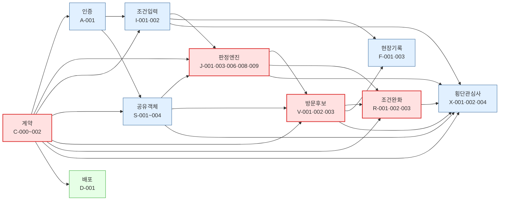
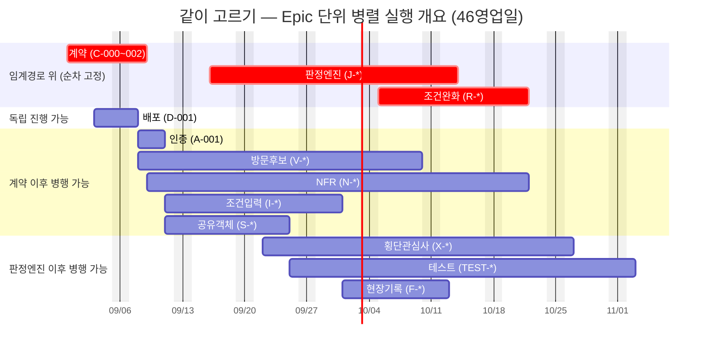

# [간트] 병렬 실행 개요 — 같이 고르기

**목적:** `tasks/v2/TASK-마스터-리스트.md`의 Epic 수준 간소화된 의존성 구조를 기준으로, 어떤 작업 묶음을 동시에·독립적으로 진행할 수 있는지 한 화면에서 바로 읽을 수 있게 정리했다. 52개 Task 단위 상세 스케줄과 리스크·게이트는 `tasks/v2/[총괄] 개발 실행 계획.md`를 참조 — 이 문서는 그 축약판이다.

---

## 1. 간소화된 Epic 의존성 다이어그램

**초록 노드(배포)만 안전하게 "완전 독립"이라 말할 수 있다** — 계약 이후로는 어떤 화살표도 들어오거나 나가지 않는다. 그 외 나머지는 화살표 하나로는 단순해 보여도, 각 Epic 안의 세부 Task 시점이 서로 얽혀 있어(예: 조건입력의 일부 Task는 판정엔진보다 먼저, 일부는 나중에 필요) 실제 동시 진행 가능 여부는 아래 §2의 Gantt(52개 Task 실측 스케줄 집계)로 판단해야 한다 — 이 다이어그램은 "무엇이 무엇을 대략 요구하는지"를 보여주는 간소화판이지, 정밀한 병렬 판단 근거가 아니다.

---

## 2. Epic 단위 Gantt (한눈에 보는 병렬 구간)

3-레인 실행 시나리오(`tasks/v2/[총괄] 개발 실행 계획.md` §3.2, 권장안) 기준 실측 스케줄을 Epic으로 묶었다. 착수일은 2026-08-31(월) 가정.

**막대가 겹치는 구간 = 동시 진행 구간이다.** 가장 붐비는 두 창은:

- **09/22~10/01** — 방문후보·NFR·조건입력·공유객체(~09/25)·판정엔진·횡단관심사까지 최대 6개 Epic이 동시에 열려 있다.
- **10/05~10/13** — 방문후보·NFR·횡단관심사·테스트·현장기록·조건완화까지 역시 6개 Epic이 겹친다.

빨간 막대(계약→판정엔진→조건완화)는 **순서를 바꿀 수 없는 임계경로**다 — 여기에 인력을 추가로 배치해도 전체 일정은 줄지 않는다(§총괄 계획 §3.2). 인력·에이전트를 늘려서 실제로 이득을 보는 곳은 파란/초록 구간(계약 이후, 판정엔진 이후 병행 가능 그룹)이다.

---

## 3. 지금 바로 병렬 착수 가능한 조합

| 지금 착수 가능 | 조건 |
| --- | --- |
| 계약(C-000~002) | 즉시 착수 (선행 없음) |
| 배포(D-001) | 계약(C-000)만 끝나면 나머지 전부와 무관하게 계속 진행 |
| 인증(A-001) | 계약(C-001) 완료 후 |
| 판정엔진(J-*) — 임계경로 | 계약 + 조건입력(I-001) 완료 후, 최우선 배정 |
| 방문후보 중 V-002(UI) | 계약(C-001)만 끝나면 판정엔진과 무관하게 병행 착수 가능 |

계약(Phase 0)이 끝나는 즉시 **배포·인증·판정엔진 준비(조건입력 I-001 포함)를 동시에 시작**하는 것이 이 프로젝트에서 가장 빠르게 열리는 병렬 구간이다.

---

**관련 문서:** `tasks/v2/TASK-마스터-리스트.md`(원본 의존관계) · `tasks/v2/[총괄] 개발 실행 계획.md`(52-Task 상세 스케줄·리스크·게이트) · `tasks/v2/tools/gen_exec_plan.py`(재계산 스크립트)
