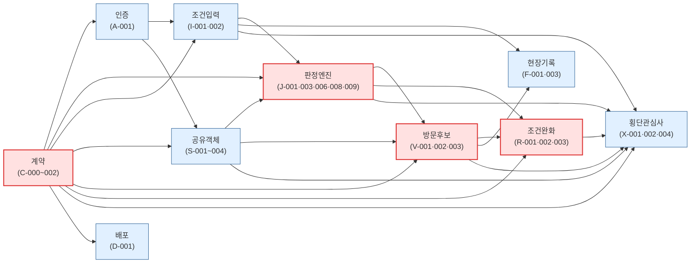
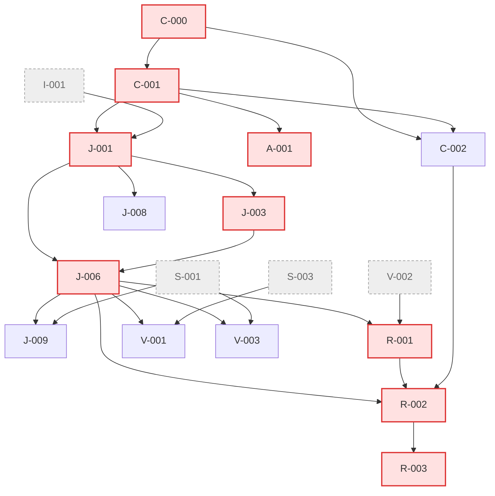
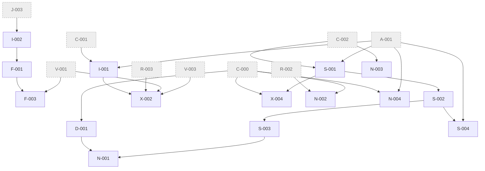
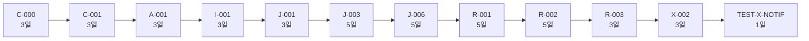
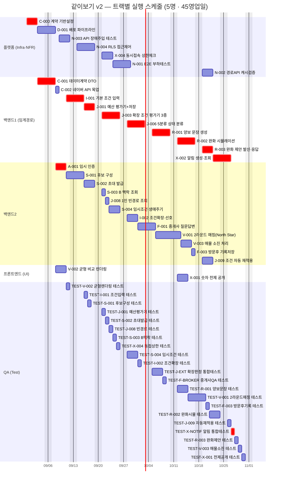
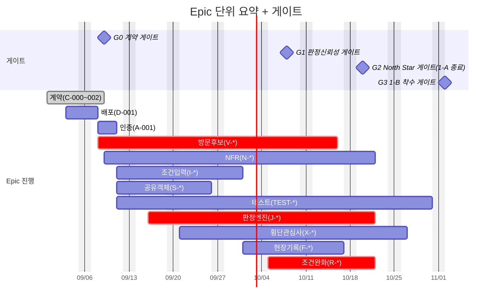

# [총괄] 개발 실행 계획 — 같이보기

**문서 ID:** EXEC-JOINTHOME-MASTERPLAN-001

**날짜:** 2026-08-26

**근거 문서:** `SRS_project/tasks/v2/TASK-마스터-리스트.md`(52개 Task 의존관계 원본) · `SRS_project/tasks/v2/README.md`(Phase별 상세 인덱스) · `SRS_project/tasks/TASK-재추출-전략-v2-계획서.md`(3원칙) · `SRS_project/SRS_V0_9.md` §11(릴리스 1-A/1-B)

**구성 참조:** `wild-mental/ai-place-mate-prd-to-srs`의 `docs/[총괄] 개발 실행 계획.md` — 섹션 구조(§0 문서 위치 ~ §5 진척 추적)와 DAG/임계경로/Gantt 산출 방식을 그대로 따르되, 팀 규모·트랙 구성·게이트는 이 프로젝트의 실제 산출물(SRS_V0_9, TASK-마스터-리스트)에 맞춰 새로 계산했다.

**이 문서는 생성물이다.** `TASK-마스터-리스트.md`의 52개 Task와 "선행 Task" 열을 그대로 옮겨 적은 스크립트(`tools/gen_exec_plan.py`, 이 문서와 함께 커밋)로 DAG 레벨·임계경로·병목·자원제약 스케줄을 계산했다. 마스터 리스트의 의존관계가 바뀌면 스크립트를 다시 돌려 이 문서의 §2·§3을 갱신해야 한다 — 손으로 표를 고치지 않는다.

---

## 0. 이 문서의 위치

```
PRD → SRS → 기술 설계 → SRS_V0_9(Next.js 구현판)
        │  TASK-재추출-전략-v2-계획서 (계약 우선 · Read/Write 분리 · AC→테스트)
        ▼
TASK-마스터-리스트.md — 52개 Task 색인 (Task ID·Epic·선행 Task·복잡도)
        │  이 문서가 마스터 리스트의 의존관계를 계산해 "언제·어떤 순서·얼마나 병렬로"를 도출
        ▼
[총괄] 개발 실행 계획.md (이 문서) — 실행 전략 · DAG · 임계경로 · Gantt · 리스크 · 진척 추적
        │
        ▼
개별 Task 문서(`{Task ID}-*.md`) — 실제 작업 단위, Task Breakdown/AC/DoD
```

이 문서는 마스터 리스트의 **색인**을 **일정**으로 바꾼 것이지, 개별 Task 문서의 내용을 대체하지 않는다. "무엇을 만들지"는 각 Task 문서에, "언제·어떤 순서로"는 이 문서에 있다.

---

## 1. 실행 전략

### 1.1 원칙

1. **계약이 모든 것보다 먼저다.** `C-000~002`(Phase 0)가 끝나기 전에는 어떤 기능 Task도 착수하지 않는다. Mock 네이버 API(`C-002`)가 있어야 판정엔진 이하 전 구간을 백엔드 우선으로 개발할 수 있다 — 실제 스크래핑/API 연동을 기다리지 않는다.
2. **판정 신뢰성이 사용자 흐름보다 먼저다.** 5분류 판정(`J-006`)이 이 제품의 정체성이다. 아래 §2.4에서 보듯 임계경로 42영업일 중 26일(62%)이 판정 체인(`J-001→J-003→J-006`)과 그 직계 후행(`R-001→R-002→R-003`)이 차지한다 — 이 순서를 흔들지 않는다.
3. **Read/Write(Query/Command)를 같은 Task에 섞지 않는다.** `V-002`(균형 비교 렌더링)와 `X-001`(숫자 전제 공개)은 Query/UI 전용 Task로, 판정·완화 Command 로직과 별도 Closed Context를 유지한다(`TASK-재추출-전략-v2-계획서` 원칙 ②). §1.2의 그룹 C가 이 경계를 그대로 반영한다.
4. **AC 없는 완료는 없다.** 확정 48개 Task 각각에 딸린 TEST-* 컴패니언(21개)이 통과해야 그 Task가 후행 Task의 선행 조건을 충족한 것으로 본다. "완료" = 기능 구현 + 컴패니언 테스트 통과.

### 1.2 트랙 구성

역할은 **유형(Type)을 기준으로 나눈다** — Epic이 아니라 유형이 담당자를 정한다(`[태스크 리스트] 같이보기.md` §0.3). 이 프로젝트는 원본 참조 구조(`wild-mental/ai-place-mate-prd-to-srs`)와 달리 **`Design` 유형이 없다** — `SRS_V0_9.md` §1.5 C-TEC-004(shadcn/ui 그대로 사용, 컴포넌트 재구현 금지)가 이미 별도 디자인 토큰·화면 정의 단계를 없앴기 때문이다. `V-002`·`X-001`(유형 `UI`)이 화면 정의와 구현을 겸한다.

| 트랙 | 담당 유형 | 레인 수 | Task 수 | 공수(person-day) |
| --- | --- | --- | --- | --- |
| **플랫폼** | `Infra` · `NFR` | 1 | 7건 | 23 |
| **백엔드** | `Contract` · `Data` · `Read` · `Write` | 2 | 22건 | 68 |
| **프론트엔드** | `UI` | 1 | 2건 | 6 |
| **QA** | `Test` | 1 | 21건 | 31 |
| | | **5** | **52건** | **128** |

**최소 인원 근거** — 총 공수 128 person-day를 임계경로 42영업일 안에 소화하려면 이론상 3.0명이 필요하다. 역할별 부하가 불균형(백엔드 68일 — 전체의 53%)해서 백엔드만 2레인으로 두고 총 5명으로 구성했다 — 전수 계산 결과 이 편성이 **45영업일**(임계경로 대비 +3일)로 가장 효율적이었다(§3.2). QA까지 2레인으로 늘리면 6명으로 42일(임계경로 하한) 정확히 도달하지만, 이는 압축안이다 — 표준 5명 편성과의 비교는 `[총괄] 압축 수행 일정.md`에 정리했다.

### 1.3 착수 전에 풀어야 할 것 (C-000 착수 전 외부 의존성)

| 항목 | 필요 이유 | 없을 때 막히는 Task |
| --- | --- | --- |
| Supabase 프로젝트 생성 + 로컬 Supabase CLI(Docker) 기동 확인 | `C-000`이 Prisma 스키마·로컬 DB 연결을 전제로 함 | C-000 자체 |
| Vercel 계정 연결 + 빈 Next.js 앱 최초 배포 | `D-001`(배포 파이프라인)의 착수 조건 | D-001, N-001(배포 이후 부하 테스트) |
| 네이버 부동산 API 정책 재확인 | 공식 API 부재 확정 → `C-002`가 Mock 우선임을 재확인(`SRS_V0_9.md` §2.2/§3.3) | C-002, 그 이후 전체 체인 |
| 매직 링크 발신용 이메일 서비스 계정(예: Resend 무료 티어) | `A-001`(임시 인증)의 실제 발신 경로 | A-001 |
| (선택) Gemini API 키 | LLM 오케스트레이션은 여전히 선택적 확장 — 없어도 C-000 착수는 막히지 않음 | 없음(선택 확장 Task만) |

### 1.4 게이트와 릴리스

`SRS_V0_9.md` §11의 1-A(핵심 가설 검증)/1-B(단계2 확장) 분할을 DAG 레벨에 그대로 매핑했다.

| 게이트 | 통과 조건 | 의미 |
| --- | --- | --- |
| **G0 — 계약 게이트** | `C-000~002` 전부 완료 | 이후 모든 기능 Task 착수 가능. 이 전에는 어떤 백엔드 Task도 시작하지 않는다 |
| **G1 — 판정 신뢰성 게이트** | `J-006` + `TEST-J-EXT` 통과 | 방문후보(`V-001`)·조건완화(`R-*`)가 전부 `J-006`에 직접 의존 — 여기가 뚫려야 제품의 핵심 흐름이 열린다 |
| **G2 — North Star 게이트 (1-A 종료)** | `V-001` + `TEST-V-001` 통과 | `SRS_V0_9.md` §11의 1-A(핵심 가설 검증) 완료 시점. 이 지점부터 실사용자 초대 여부를 판단 |
| **G3 — 1-B 착수 게이트** | `R-*`, `X-*`, `F-*` 전부 통과 | 현장 기록(단계2, `F-001`/`F-003`) 착수 — `SRS_V0_9.md` §11의 1-B 시작 조건 |

### 1.5 운영 규칙

- 커밋 단위 = Task 1개(가능하면 해당 TEST 컴패니언과 함께) — 커밋 메시지 접두어로 Task ID를 쓴다.
- TEST 컴패니언 없이 기능 Task를 "완료"로 표기하지 않는다.
- 각 DAG 레벨(§2.1) 완료 시 `v2/README.md`와 `TASK-마스터-리스트.md`의 상태 칸을 갱신한다.
- 이 총괄 문서는 마스터 리스트의 의존관계가 바뀔 때만 재계산한다 — 개별 Task 상세(Task Breakdown/AC 문구)가 바뀌는 것은 이 문서에 영향을 주지 않는다.

---

## 2. 의존성 구조

### 2.1 DAG 레벨

레벨 = "이 레벨의 모든 선행 Task가 끝나야 착수 가능"이 되는 최장 경로 기준 단계. 자원 제약 없이 이론상 동시 착수 가능한 묶음이다.

| 레벨 | Task 수 | Task ID | 최대 소요(해당 레벨 중 가장 긴 Task) |
| --- | --- | --- | --- |
| L0 | 1 | C-000 | 3일 |
| L1 | 2 | C-001, D-001 | 3일 |
| L2 | 3 | C-002, A-001, V-002 | 3일 |
| L3 | 5 | I-001, S-001, TEST-V-002, N-003, N-004 | 5일 |
| L4 | 5 | J-001, S-002, X-004, TEST-I-001, TEST-S-001 | 3일 |
| L5 | 7 | J-003, J-008, S-003, S-004, TEST-J-001, TEST-S-002, TEST-X-004 | 5일 |
| L6 | 6 | J-006, I-002, TEST-J-008, TEST-S-003, TEST-S-004, N-001 | 5일 |
| L7 | 7 | J-009, V-001, V-003, R-001, F-001, TEST-J-EXT, TEST-I-002 | 5일 |
| L8 | 8 | R-002, X-001, F-003, TEST-J-009, TEST-V-001, TEST-V-003, TEST-R-001, TEST-F-BROKER | 5일 |
| L9 | 5 | R-003, TEST-R-002, TEST-X-001, TEST-F-003, N-002 | 3일 |
| L10 | 2 | X-002, TEST-R-003 | 3일 |
| L11 | 1 | TEST-X-NOTIF | 1일 |

**L8(8개)이 가장 넓은 레벨** — 완화 시뮬레이션(`R-002`), UI 노출(`X-001`), 현장기록 마감(`F-003`), 그리고 4개의 TEST 컴패니언이 동시에 착수 가능한 지점이다. §2.6에서 이 구간을 병렬화 우선순위로 다시 짚는다.

### 2.2 Epic 수준 의존 구조



빨간 노드(계약·판정엔진·방문후보·조건완화)가 §1.2 그룹 A와 정확히 겹친다 — 임계경로가 이 4개 Epic 안에서 대부분 형성된다는 뜻이다. NFR·테스트 Epic은 거의 모든 Epic에서 화살표를 받는 위성 구조라 위 다이어그램에서는 생략하고 §2.3에서 별도로 다룬다.

### 2.3 그룹별 상세 DAG

#### 그룹 A — 판정 신뢰성 체인 (임계경로 포함)



점선 회색 노드(`I-001`, `S-001`, `S-003`, `V-002`)는 그룹 B/C 소속이며 이 그룹으로 들어오는 입력이다. 빨간 노드가 §2.4의 임계경로 위 Task다.

#### 그룹 B — 사용자 흐름 & 인프라



그룹 B 내부에는 자체 완결 체인(`S-001→S-002→S-003/S-004`)이 있고, 나머지는 그룹 A의 산출물(`C-*`, `A-001`, `J-003`, `R-*`, `V-*`)을 입력받아 흐른다.

#### 그룹 C — UI/Query & 품질 보증

이 그룹은 21개 TEST-* 컴패니언이 각각 정확히 1~2개의 기능 Task를 검증하는 **1:N 위성 구조**라 화살표가 대부분 다른 그룹에서 들어오는 EXT 엣지다 — 다이어그램보다 표가 더 정확하다.

| Task | 검증 대상 | 소속 |
| --- | --- | --- |
| V-002 | (신규, 균형 비교 렌더링) | 그룹 C 자체 |
| X-001 | (신규, 숫자 전제 공개 — `J-006`, `R-001` 의존) | 그룹 C 자체 |
| TEST-V-002 | V-002 | 그룹 C 자체 참조 |
| TEST-X-001 | X-001 | 그룹 C 자체 참조 |
| TEST-J-001, TEST-J-EXT, TEST-J-008, TEST-J-009 | J-001, (J-003+J-006), J-008, J-009 | 그룹 A 검증 |
| TEST-I-001, TEST-I-002 | I-001, I-002 | 그룹 B 검증 |
| TEST-S-001~004 | S-001, S-002, S-003, S-004 | 그룹 B 검증 |
| TEST-V-001, TEST-V-003 | V-001, V-003 | 그룹 A 검증 |
| TEST-R-001~003 | R-001, R-002, R-003 | 그룹 A 검증 |
| TEST-X-NOTIF, TEST-X-004 | X-002, X-004 | 그룹 B 검증 |
| TEST-F-BROKER, TEST-F-003 | F-001, F-003 | 그룹 B 검증 |

### 2.4 임계경로

가장 긴 의존 사슬. 이 사슬의 총합(42영업일)이 자원이 무한해도 줄일 수 없는 이론적 최소 일정이다.



| 순서 | Task | 소요 | 누적(영업일) | 누적 캘린더 날짜(2026-08-31 월요일 착수 가정) |
| --- | --- | --- | --- | --- |
| 1 | C-000 | 3 | 3 | 2026-09-03 |
| 2 | C-001 | 3 | 6 | 2026-09-08 |
| 3 | A-001 | 3 | 9 | 2026-09-11 |
| 4 | I-001 | 3 | 12 | 2026-09-16 |
| 5 | J-001 | 3 | 15 | 2026-09-21 |
| 6 | J-003 | 5 | 20 | 2026-09-28 |
| 7 | J-006 | 5 | 25 | 2026-10-05 |
| 8 | R-001 | 5 | 30 | 2026-10-12 |
| 9 | R-002 | 5 | 35 | 2026-10-19 |
| 10 | R-003 | 3 | 38 | 2026-10-22 |
| 11 | X-002 | 3 | 41 | 2026-10-27 |
| 12 | TEST-X-NOTIF | 1 | **42** | **2026-10-28** |

42영업일 중 26일(62%)이 판정 체인(`J-001→J-003→J-006`, 13일)과 조건완화 체인(`R-001→R-002→R-003`, 13일)에서 나온다 — §1.1 원칙 ②가 숫자로도 확인된다.

### 2.5 병목 TOP 10 (직접 후행 Task 수 기준)

| 순위 | Task | 직접 후행 수 | 소요 | 임계경로 포함 |
| --- | --- | --- | --- | --- |
| 1 | J-006 | 7 | 5일 | ✅ |
| 2 | C-000 | 6 | 3일 | ✅ |
| 3 | C-001 | 5 | 3일 | ✅ |
| 3 | S-001 | 5 | 3일 | |
| 5 | A-001 | 4 | 3일 | ✅ |
| 5 | J-001 | 4 | 3일 | ✅ |
| 7 | C-002 | 3 | 1일 | |
| 7 | J-003 | 3 | 5일 | ✅ |
| 7 | I-001 | 3 | 3일 | ✅ |
| 7 | S-002 | 3 | 3일 | |

`J-006`이 유일하게 7개 후행 Task를 직접 막고 있는 최대 병목이자 임계경로 위에 있다 — 이 Task가 지연되면 프로젝트 전체가 그만큼 밀리는 **단일 실패점(SPOF)**이다. 착수 전 설계 리뷰(5분류 판정 로직의 사전 검토)를 다른 어떤 Task보다 먼저 끝내둘 가치가 있다.

### 2.6 병렬 가능 구간

- **L8(8개 동시 착수 가능)**이 가장 넓다 — `R-002`(완화 시뮬레이션), `X-001`(전제 공개 UI), `F-003`(현장기록 저장) 세 기능 Task와 4개 TEST 컴패니언이 동시에 열린다. 이 구간에 인력/에이전트를 집중 투입하면 전체 일정 단축 효과가 가장 크다.
- **L5·L7도 7개**로 넓다 — L5는 판정 확장 평가기(`J-003`)와 공유객체 생애주기(`S-003`, `S-004`)가 겹치는 구간, L7은 방문후보(`V-001`, `V-003`)·조건완화 시작(`R-001`)·현장기록 시작(`F-001`)이 동시에 열리는 구간이다.
- 반대로 **L0~L2는 폭이 1~3**으로 좁다 — 초반은 어차피 순차적일 수밖에 없으므로, 이 구간에서 여러 인력/에이전트를 투입해도 병목만 늘어난다(§1.3 외부 의존성부터 먼저 해결해두는 편이 낫다).

---

## 3. 일정

### 3.1 산정 기준

- 복잡도 → 소요: **H(High) = 5영업일, M(Medium) = 3영업일, L(Low) = 1영업일** — `TASK-마스터-리스트.md`의 복잡도 판단 기준(제품 정체성 직결·조용한 실패 위험)을 그대로 시간으로 환산.
- 표준 근무일 8시간, 버퍼 미포함(순수 작업량) — 총 **128 person-day**.
- 착수일은 **2026-08-31(월)**로 가정(임의 기준일 — 실제 착수일이 정해지면 전체 날짜를 그만큼 평행 이동).
- 주말 제외(영업일 기준), 공휴일은 반영하지 않음.

### 3.2 트랙별 Gantt

§1.2의 5명 편성(플랫폼1·백엔드2·프론트엔드1·QA1)을 **트랙에 고정 배정**해 계산한 스케줄이다 — 아무 레인에나 배정하는 공용 풀 방식이 아니라, 각 Task가 자신의 유형에 해당하는 트랙의 레인에서만 실행된다. 우선순위는 임계경로 위 Task 우선 → 후행 Task 많은(병목) Task 우선. **45영업일**(임계경로 42일 대비 +3일)이다.



**임계경로는 백엔드1 트랙 안에서 지연 없이 진행된다** — `C-000→C-001→A-001→I-001→J-001→J-003→J-006→R-001→R-002→R-003→X-002→TEST-X-NOTIF` 사슬(플랫폼의 `C-000`과 QA의 `TEST-X-NOTIF`를 빼면 전부 백엔드1)이 §2.4의 이론적 최소 일정과 동일한 날짜로 배치됐다. 전체 프로젝트 종료가 45영업일(2026-11-02)로 이론치보다 3일 더 걸리는 이유는 QA 트랙(1레인)이 21건의 테스트를 순차로 처리하며 뒤로 밀리는 꼬리 구간 때문이다 — **QA를 2레인으로 늘리면 정확히 42일(임계경로 하한)에 도달한다**(`[총괄] 압축 수행 일정.md` 참조 대상, 6명 편성).

### 3.3 Phase·게이트 일정

Epic 단위로 묶어 §1.4의 게이트를 표시한 요약 뷰. §3.2(트랙별 5명 편성) 기준으로 재계산했다.



게이트 기준일은 §3.2 트랙별 Gantt(5명 편성) 상 해당 조건 Task와 그 TEST 컴패니언이 **모두** 완료되는 시점(늦게 끝나는 쪽)이다 — 이론적 최소 일정(§2.4)이 아니라 실제 5명 편성 스케줄 기준이므로, 특히 G1(`J-006`은 10-05에 끝나지만 `TEST-J-EXT`는 QA 트랙 순번 때문에 10-08에야 끝남)처럼 기능 완료와 게이트 통과 사이에 실질적인 간격이 생긴다.

**G3가 프로젝트 종료일(2026-11-02)과 정확히 겹친다는 점을 주의해야 한다.** 트랙별 스케줄은 임계경로·병목 우선순위로만 배치했을 뿐 "1-A를 먼저 끝내고 1-B를 시작한다"는 릴리스 순서를 강제하지 않는다 — 실제로 현장기록(`F-001`/`F-003`, 1-B 소속)이 G2(North Star, 1-A 종료)보다 먼저 끝나도록 배치되어 있다. `SRS_V0_9.md` §11이 요구하는 "1-A 완전 검증 후 1-B 착수"를 그대로 지키려면, 실행 시 `F-001`/`F-003`과 그 테스트를 의도적으로 뒤로 미루는 정책을 추가로 적용해야 한다 — 이는 DAG 제약이 아니라 운영 판단이다.

### 3.4 웨이브별 착수표 (주차별, 이론적 최대 병렬 기준)

§2.4의 무제약 최이른시작(earliest start)을 5영업일(1주) 단위로 묶었다 — "자원이 얼마든 있다면 이 주차에 착수 가능"이라는 상한선이다. 실제로는 §3.2에서 정한 트랙별 레인 수(플랫폼1·백엔드2·프론트엔드1·QA1)만큼만 동시에 열 수 있다.

| 주차 | 착수 가능 Task(무제약 최이른시작 기준) |
| --- | --- |
| 1주 (D+0~4) | C-000 |
| 2주 (D+5~9) | C-001, D-001, A-001, C-002, V-002, N-003, I-001, N-004, S-001, TEST-V-002 |
| 3주 (D+10~14) | J-001, S-002, TEST-I-001, TEST-S-001, X-004 |
| 4주 (D+15~19) | J-003, J-008, S-003, S-004, TEST-J-001, TEST-S-002, TEST-X-004, N-001, TEST-J-008, TEST-S-003, TEST-S-004 |
| 5주 (D+20~24) | I-002, J-006, F-001, TEST-I-002 |
| 6주 (D+25~29) | J-009, R-001, TEST-J-EXT, V-001, V-003, TEST-F-BROKER, TEST-J-009, TEST-V-003 |
| 7주 (D+30~34) | F-003, R-002, TEST-R-001, TEST-V-001, X-001, TEST-F-003, TEST-X-001 |
| 8주 (D+35~39) | N-002, R-003, TEST-R-002, TEST-R-003, X-002 |
| 9주 (D+40~44) | TEST-X-NOTIF (임계경로 종료) |

4주(11개)와 2주(10개)가 가장 붐빈다 — 이 두 구간에서 레인이 부족하면 실제 스케줄(§3.2)이 이 상한선보다 크게 뒤로 밀린다. 트랙별 5명 편성은 이 두 구간의 폭을 대부분 감당하지만, 4주 구간처럼 여러 유형(Write·Test·NFR)이 동시에 붐빌 때는 각 트랙이 1레인뿐이라 일부 대기가 생긴다 — QA를 2레인으로 늘리면 이 대기가 없어져 임계경로 하한(42일)에 도달한다(`[총괄] 압축 수행 일정.md`).

---

## 4. 리스크와 대응

| 리스크 | 근거 | 대응 |
| --- | --- | --- |
| **J-006 지연이 전체 일정을 그대로 지연시킨다** | §2.5 병목 1위(후행 7개) + 임계경로 포함 | 착수 전 5분류 판정 로직을 설계 문서(SRS_V0_9 §7 판정 규칙) 기준으로 사전 리뷰. J-006 자체에 버퍼 1~2일을 별도로 확보 |
| **완전 무료 인프라 제약이 N-004(RLS)·N-002(캐시)를 과소평가하게 만들 위험** | `SRS_V0_9-AI-작업지시서.md` TASK-B1~B6(SLO/SLA 모순 해소)가 아직 SRS 반영 전 단계 | N-004(H, RLS)는 이미 최고 복잡도로 반영됨. 다만 작업지시서의 동시접속 상한(REQ-NF-011)이 SRS에 반영되면 X-004의 AC가 바뀔 수 있음 — 반영 시 이 문서 재계산 필요 |
| **백엔드 트랙(임계경로 전부 포함)에 인력이 집중되지 않으면 어떤 편성을 써도 일정이 무너진다** | §1.2 — 백엔드가 전체 공수의 53%(68 person-day)를 차지하고 임계경로 12단계 중 10단계가 백엔드 소속이다 | 백엔드를 우선순위 최상단 고정 배정(2레인 우선 확보), 플랫폼·프론트엔드·QA는 여유 인력·에이전트로 유동 배정 |
| **네이버 API Mock(C-002) 이후 실제 연동 시점의 재작업 위험** | `SRS_V0_9.md` §2.2 Mock/Live 스위치(`NAVER_API_MODE`) | Mock 계약(DTO)이 실제 API 응답과 어긋나지 않도록 C-001/C-002 완료 시점에 계약 문서를 한 번 더 검증 |
| **솔로 개발 시나리오(128일 ≈ 6개월)가 실제 가용 시간과 맞지 않을 위험** | §1.2 | 착수 전 실제 가용 인력·시간을 확정하고, 1인이라면 백엔드(임계경로) Task부터 우선 완주 후 플랫폼·프론트엔드·QA를 순차 진행하는 것을 권장(전체 병렬화보다 임계경로 완주가 우선) |

---

## 5. 진척 추적

- **1차 지표:** DAG 레벨(§2.1) 완료율 — 레벨 단위로 "이 레벨 전체 완료" 여부를 `v2/README.md` Phase 표에 반영.
- **2차 지표:** 게이트(§1.4) 통과 여부 — G0~G3 4개 게이트의 실제 통과일을 이 문서 §3.3 Gantt의 milestone과 대조.
- **재계산 트리거:** `TASK-마스터-리스트.md`의 "선행 Task" 열이 바뀌거나 Task가 추가/삭제되면 `tools/gen_exec_plan.py`를 다시 실행해 §2·§3을 갱신한다. Task 상세 내용(Task Breakdown/AC 문구)만 바뀌는 것은 재계산 대상이 아니다.
- **알려진 한계:** §3.2의 자원제약 스케줄은 그리디 리스트 스케줄링(임계경로 우선 → 병목 우선) 결과이며, 이론적으로 더 빠른 배치가 존재할 수 있다(45일은 42일 이론치 대비 +3일, 약 7% 오버헤드로 실무적으로는 양호한 수준). 실제 진행 중 특정 Task가 예상보다 오래 걸리면 이 문서를 그대로 신뢰하지 말고 재계산할 것.

---

**EXEC-JOINTHOME-MASTERPLAN-001 · v1.0 · 2026-08-26**

관련 문서: `SRS_project/tasks/v2/TASK-마스터-리스트.md` · `SRS_project/tasks/v2/README.md` · `SRS_project/tasks/v2/[총괄] 압축 수행 일정.md`(압축안 · 6명 · 42일 · 주차별 투입 곡선) · `SRS_project/tasks/v2/tools/gen_exec_plan.py`(계산 스크립트)
