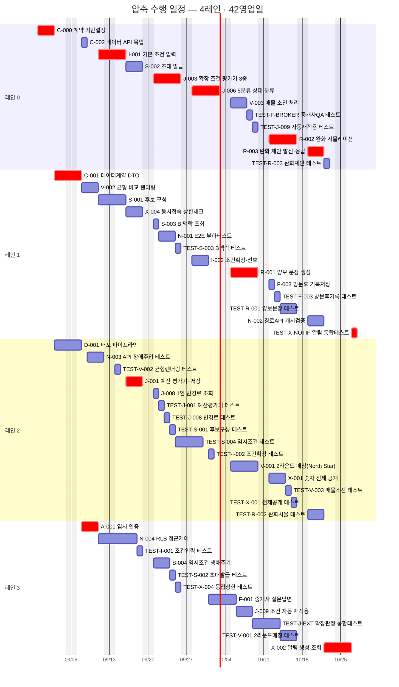

```mermaid
flowchart LR
  C000["C-000<br/>3일"]:::ctr --> C001["C-001<br/>3일"]:::ctr --> A001["A-001<br/>3일"]:::auth --> I001["I-001<br/>3일"]:::flow --> J001["J-001<br/>3일"]:::core --> J003["J-003<br/>5일"]:::core --> J006["J-006<br/>5일"]:::core --> R001["R-001<br/>5일"]:::core --> R002["R-002<br/>5일"]:::core --> R003["R-003<br/>3일"]:::core --> X002["X-002<br/>3일"]:::flow --> TXN["TEST-X-NOTIF<br/>1일"]:::tst

  classDef ctr fill:#fff3cd,stroke:#e0a800
  classDef auth fill:#e2e3e5,stroke:#6c757d
  classDef flow fill:#e1f0ff,stroke:#369
  classDef core fill:#f8d7da,stroke:#dc3545
  classDef tst fill:#ede7f6,stroke:#7e57c2
```

# [총괄] 압축 수행 일정 — 같이 고르기

**문서 ID:** PLAN-JOINTHOME-FAST-001

**개정 버전:** 1.0

**날짜:** 2026-08-26

**기본 계획:** EXEC-JOINTHOME-MASTERPLAN-001 (`[총괄] 개발 실행 계획.md` · 2레인 · 66영업일)

**근거 문서:** `TASK-마스터-리스트.md`(52개 Task) · `[간트] 병렬 실행 개요.md`(Epic 수준 간소화 다이어그램)

> ⚙️ **이 문서는 생성물이다.** `python tools/gen_exec_plan.py`로 재생성한다(1~8레인 시나리오 스캔 포함). **기본 계획을 대체하지 않는다** — 일정 압축이 필요할 때 검토하는 대안이다.

---

## 0. 이 문서를 언제 쓰는가

기본 계획(2레인 · 66일)이 **표준**이다. 아래 상황에서만 이 압축안을 검토한다.

- 출시일이 고정되어 있고 **24일을 줄여야** 할 때
- North Star 게이트(1-A 종료) 통과 시점을 앞당겨 **가설 검증 결과를 빨리** 받아야 할 때
- 개발자 또는 AI 코딩 에이전트를 일시적으로 더 투입할 수 있을 때

압축의 효과는 **24영업일 단축**(66일→42일)이며, 그 대가는 동시 실행 레인 2개→4개와 §5의 리스크다.

---

## 1. 세 가지 편성안 비교

| 안 | 레인 수 | 완료 | 총 공수 | 평균 가동률 | 성격 |
| --- | --- | --- | --- | --- | --- |
| **기본안** (마스터플랜) | 2레인 | 66일 | 128pd | 97% | 자원 효율 우선 |
| **압축안** (본 문서) | **4레인** | **42일** | 128pd | 76% | **임계경로 하한 정확히 도달** |
| 최대 병렬 | 8레인 | 42일 | 128pd | 38% | 참고 — 더 넣어도 안 빨라짐 |

### 왜 42일 밑으로 못 가는가

**임계경로가 정확히 42영업일**이기 때문이다(`[총괄] 개발 실행 계획.md` §2.4와 동일). 이 사슬은 전부 선후 관계로 묶여 있어 동시에 할 수 없다. 레인을 8개로 늘려도 결과는 같다 — 5~8레인 시나리오를 모두 계산해봤지만 전부 42일에서 멈춘다.

**12단계·42일.** 압축안은 이 하한에 정확히 도달했으므로 **더 줄일 방법은 레인이 아니라 임계경로 자체를 바꾸는 것**뿐이다(§6).

### 최소 레인 수 도출

레인을 한 개씩 늘려 가며 완료일이 얼마나 줄어드는지 전부 계산했다.

| 단계 | 레인 수 | 완료 | 단축 |
| --- | --- | --- | --- |
| 솔로 | 1레인 | 128일 | — |
| 기본안 | 2레인 | 66일 | −62일 |
| 중간안 | 3레인 | 46일 | −20일 |
| **압축안** | **4레인** | **42일** | **−4일 (임계경로 하한 도달)** |
| (참고) | 5~8레인 | 42일 | 0일 |

1레인→2레인이 압도적으로 큰 폭(−62일)을 주고, 2레인→3레인→4레인으로 갈수록 단축 폭이 급격히 줄다가(−20일→−4일) 4레인에서 완전히 멈춘다. **레인을 늘려서 실제로 이득을 보는 구간은 딱 여기까지다.**

---

## 2. 압축 수행 Gantt

**이 그림이 말하는 것:** 4개 레인이 동시에 도는 모습이다. 빨간 것이 임계경로이며, 이 사슬만은 어떤 레인 수로도 더 짧게 만들 수 없다. 시작 2026-08-31 · 완료 **2026-10-28**(정확히 임계경로 종료일과 일치, 약 8.4주).

**임계경로는 4레인 스케줄에서도 지연 없이 진행된다** — 레인 0/1/3에 걸쳐 있는 빨간 막대(`C-000→C-001→A-001→I-001→J-001→J-003→J-006→R-001→R-002→R-003→X-002→TEST-X-NOTIF`)가 §1의 이론적 최소 일정과 **완전히 동일한 날짜**로 배치됐다. 마스터 플랜의 3레인 스케줄에서 있었던 4일의 꼬리 지연(46일)이 4레인에서는 완전히 사라진다.

---

## 3. 동시 작업 프로파일

압축의 효과가 **어느 주차에 몰려 있는지** 보여 준다. 레인 투입 계획의 근거다.

| 주차 | 기간 | 동시 작업(피크/평균, 최대 4) | 착수 Task |
| --- | --- | --- | --- |
| **W1** | 2026-08-31~ | **2** / 1.4 | `C-000` `C-001` `D-001` |
| **W2** | 2026-09-07~ | **4** / 3.0 | `A-001` `C-002` `I-001` `N-003` `N-004` `S-001` `V-002` |
| **W3** | 2026-09-14~ | **4** / 3.8 | `J-001` `S-002` `TEST-I-001` `TEST-V-002` `X-004` |
| **W4** | 2026-09-21~ | **4** / 4.0 | `J-003` `J-008` `N-001` `S-003` `S-004` `TEST-*` 7건 |
| **W5** | 2026-09-28~ | **3** / 2.6 | `F-001` `I-002` `J-006` `TEST-I-002` |
| **W6** | 2026-10-05~ | **4** / 4.0 | `J-009` `R-001` `V-001` `V-003` `TEST-*` 3건 |
| **W7** | 2026-10-12~ | **4** / 4.0 | `F-003` `R-002` `X-001` `TEST-*` 5건 |
| **W8** | 2026-10-19~ | **3** / 2.4 | `N-002` `R-003` `TEST-R-002` `TEST-R-003` `X-002` |
| **W9** | 2026-10-26~ | **1** / 1.0 | `TEST-X-NOTIF` |

### 압축이 통하는 구간과 통하지 않는 구간

- **W2~W4, W6~W7 — 압축이 통한다.** 동시 작업이 4레인 전부를 채운다(피크=4). 여기서 레인을 줄이면 즉시 일정이 밀린다.
- **W1, W5, W8, W9 — 압축이 통하지 않는다.** 동시 작업이 1~3건으로 떨어진다. 레인을 4개 그대로 유지해도 남는 레인은 그냥 논다.

**그래서 레인을 상시 4개로 유지할 필요가 없다.** 아래 §4의 투입 곡선을 따른다.

---

## 4. 레인 투입 곡선

주차별로 **실제 필요한 레인 수**다. 압축안의 명목 레인 수는 4개지만 전 기간 유지할 필요는 없다.

| 주차 | 필요 레인 | 비고 |
| --- | --- | --- |
| W1 | 2 | 계약(Phase 0)이 순차 진행이라 초반은 병렬성이 낮다 |
| W2~W4 | 4 | 계약 완료 후 조건입력·공유객체·판정엔진·NFR이 동시에 열린다 |
| W5 | 3 | `J-006`(5분류 판정) 단일 병목 구간 — 레인 하나는 대기 |
| W6~W7 | 4 | 방문후보·완화·테스트가 다시 동시에 전개 |
| W8 | 3 | 완화 마무리 구간 |
| W9 | 1 | `TEST-X-NOTIF` 하나만 남는다 |

**레인을 피크에 맞춰 조정하면 168 person-day 확보(상시 4레인) 대신 약 142 person-day면 된다** — 40 person-day 유휴가 26 person-day 유휴로 줄어 가동률이 76%→90%로 오른다. §1.2("레인 = 고정 담당자가 아니라 슬롯")를 그대로 적용한 결과다.

### 투입·철수 권고

| 시점 | 조치 | 근거 |
| --- | --- | --- |
| W1 | 2레인으로 시작 | `C-000`이 3일간 유일한 착수 Task라 나머지 레인은 대기만 한다 |
| W2 진입 | **레인 2개 추가 투입(총 4)** | 계약 완료 즉시 조건입력·공유객체·NFR·판정엔진이 동시에 열린다 |
| W5 | **레인 1개 철수(3으로)** | `J-006` 단독 구간 — 되돌려도 병목 자체는 줄지 않는다 |
| W6 재투입 | 레인 4로 복귀 | 방문후보·완화·테스트가 다시 넓게 열린다 |
| W8 이후 | **레인 3→1로 순차 축소** | 남은 것이 완화 마무리와 테스트 꼬리뿐이라 늘려도 소용없다 |

---

## 5. 압축의 대가

일정 24일을 줄이는 대신 아래를 감수한다. **이 표가 압축 여부 판단의 실질 근거다.**

| 항목 | 기본안 | 압축안 | 영향 |
| --- | --- | --- | --- |
| 레인 | 2 | 4 | +2 |
| 완료 | 66일 | 42일 | **−24일** |
| 평균 가동률 | 97% | 76%(투입곡선 적용 시 90%) | 유휴 증가 |
| 확보 공수 | 132pd | 168pd(투입곡선 적용 시 ~142pd) | — |

### 정량 외 리스크

| 리스크 | 왜 압축에서 커지는가 | 완화 |
| --- | --- | --- |
| **리뷰 병목** | W2~W4·W6~W7에 4개 레인이 동시에 PR을 낸다. 리뷰어(사람)는 늘지 않는다 | 임계경로 위 PR(빨간 Task)을 최우선 리뷰. 나머지는 24시간 내 |
| **통합 충돌** | 계약(`C-001` 데이터 계약)을 여러 레인이 동시에 소비하며 구현한다 | 계약을 먼저 머지·고정하고 구현은 뒤로. 계약이 바뀌면 4개 레인 전체가 흔들린다 |
| **온보딩 비용** | 레인을 사람으로 채운다면 그 인력이 SRS_V0_9·5분류 판정 규칙을 익혀야 한다 | 레인을 AI 코딩 에이전트로 채우면 이 리스크는 크게 줄어든다 — 이 세션에서 v2 Task 세트 자체를 이미 에이전트로 생성·검증해 온 것과 같은 모델 |
| **컨텍스트 분산** | 4레인이 서로 다른 Epic(판정/입력/UI/NFR)을 동시 진행 | Epic 단위로 레인을 최대한 고정(마스터 플랜 §1.2 트랙 A/B/C)해 담당 도메인을 유지 |
| **유휴 레인** | W1·W5·W8·W9에 레인이 논다 | §4 투입 곡선대로 철수. 4레인을 상시 유지하면 압축 이득의 상당 부분이 사라진다 |

> ⚠️ **레인 4개 = 사람 4명이 아니다.** 위 −24일은 4개의 실행 슬롯이 **즉시 생산성을 낸다는 가정**이다. 사람으로 채운다면 온보딩 시간을, AI 에이전트로 채운다면 프롬프트·컨텍스트 준비 시간을 별도로 감안해야 순 이득이 유지된다.

---

## 6. 42일보다 더 줄이려면

레인으로는 불가능하다(5~8레인 검증 결과 42일 그대로). **임계경로 자체를 짧게 만드는 것**만 남는다.

| 방법 | 대상 | 예상 단축 | 대가 |
| --- | --- | --- | --- |
| **범위 축소** — 알림(`X-002`)과 그 테스트를 1-A 이후로 연기 | 임계경로 마지막 4일 | 최대 4일(42→38) | North Star 게이트(1-A)는 `V-001`만 있으면 통과 가능 — 알림 없이 1-A를 출시하고 1-B에서 붙이는 방식. `SRS_V0_9.md` §11 범위 재정의 필요 |
| **태스크 재분해** — `J-003`/`J-006`(각 5일)을 하위 평가기 단위로 재분할 | 판정 체인 상류 | 불확실 | `TASK-개수-축약-분석.md`가 이미 "같은 파일이라 병합"한 것을 되돌리는 셈 — 재통합 오버헤드가 단축분을 상쇄할 수 있다 |
| **선행 완화** — `R-001`을 `V-002`(UI) 대신 데이터 계약에만 의존하도록 변경 | 해당 없음 | **0일** | 이 프로젝트에는 적용되지 않는다 — `V-002`는 9일차에 끝나는데 `R-001`을 실제로 막는 것은 25일차에 끝나는 `J-006`이다. UI 의존을 없애도 병목이 바뀌지 않는다 |
| **외부 의존 선점** — Supabase/Vercel/이메일 발신 계정을 Day 0 이전에 확보 | 착수 지연 방지 | 0일(이미 반영) | `[총괄] 개발 실행 계획.md` §1.3에 이미 포함 — 미확정 시 오히려 늘어난다 |

**가장 확실한 단축은 범위 축소(알림 연기)뿐이다.** 나머지 세 방법은 이 프로젝트 규모에서는 효과가 없거나(선행 완화) 위험이 이득보다 크다(태스크 재분해).

---

## 7. 권고

1. **기본안(2레인 · 66일)을 표준으로 유지한다.** 가동률 97%로 이미 거의 낭비가 없다.
2. 출시일 압박이 실재할 때만 압축안(4레인 · 42일)을 채택한다 — **정확히 임계경로 하한**이므로 그 이상 레인을 투입하는 것은 순수 낭비다(§1, 8레인 검증 결과 동일).
3. 압축안을 택하면 **레인을 상시 유지하지 말고 §4 투입 곡선대로 W1·W5·W8·W9에 줄인다** — 유휴 40pd를 26pd로 줄여 가동률을 76%→90%로 올릴 수 있다.
4. "레인"은 사람 수가 아니라 동시 실행 슬롯이다. 개발자 1~2인 + AI 코딩 에이전트 조합으로 4레인을 구성하면 §5의 온보딩 리스크를 크게 줄일 수 있다(마스터 플랜 §3.2와 동일한 전제).
5. 42일보다 더 줄여야 한다면 레인이 아니라 **범위를 줄인다**(§6) — 알림(`X-002`) 연기가 유일하게 확실한 방법이다.

---

**PLAN-JOINTHOME-FAST-001 · v1.0 · 2026-08-26 · 4레인 · 42영업일 · 임계경로 하한 도달**

관련 문서: `TASK-마스터-리스트.md` · `[총괄] 개발 실행 계획.md`(기본안 · 2레인 · 66일) · `../[간트] 병렬 실행 개요.md`(Epic 수준 간소화 다이어그램) · `tools/gen_exec_plan.py`(계산 스크립트)
