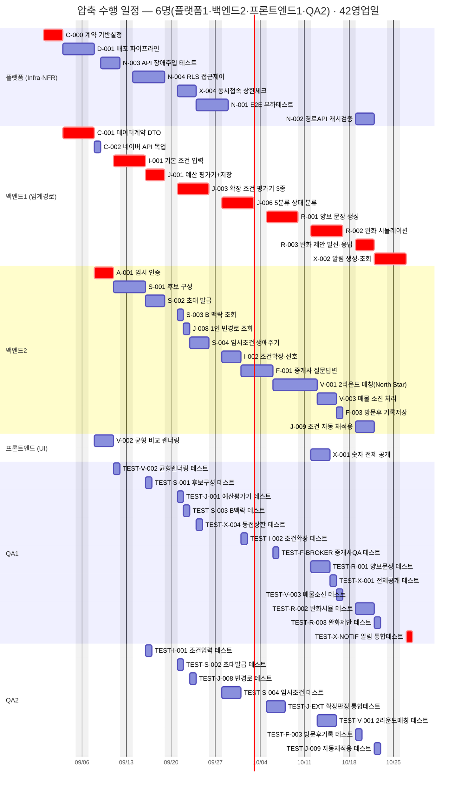

# [총괄] 압축 수행 일정 — 같이보기

**문서 ID:** PLAN-JOINTHOME-FAST-001

**개정 버전:** 2.0 — 트랙 고정 배정 모델로 전면 재계산(공용 풀 레인 모델 폐기)

**날짜:** 2026-08-26

**기본 계획:** EXEC-JOINTHOME-MASTERPLAN-001 (`[총괄] 개발 실행 계획.md` · 트랙 고정 배정 · 5명 · 45영업일)

**근거 문서:** `TASK-마스터-리스트.md`(52개 Task) · `[총괄] 개발 실행 계획.md` §1.2/§3.2(트랙 구성·트랙별 Gantt)

**이 문서는 생성물이다.** `[총괄] 개발 실행 계획.md`와 동일한 `tools/gen_exec_plan.py` 데이터(Task·의존관계·소요)에 트랙 고정 배정 스케줄러(`run_track_schedule`)를 적용해 트랙별 레인 수를 늘려가며 완료일을 계산했다. 마스터 리스트의 의존관계나 트랙 구성이 바뀌면 이 문서도 다시 계산해야 한다.

---

## 0. 이 문서를 언제 쓰는가

기본 계획(트랙 고정 배정 · 5명 · 45일)이 **표준**이다. 아래 상황에서만 이 압축안을 검토한다.

- 출시일이 고정되어 있고 **3영업일을 더 줄여야** 할 때 — 45일은 이미 임계경로(42일) 대비 +3일(7%)로 거의 효율적이라, 압축의 절대적 이득 자체가 크지 않다.
- North Star 게이트(1-A 종료, G2) 통과 시점을 **임계경로 하한까지 정확히** 앞당겨야 할 때.
- QA 인력(또는 QA 역할을 겸하는 AI 코딩 에이전트)을 1명 더 투입할 여력이 있을 때 — 압축의 정체가 QA 트랙 단독 병목이기 때문에, 필요한 추가 투입은 딱 이 한 곳뿐이다.

압축의 효과는 **3영업일 단축**(45일→42일, 임계경로 하한 정확히 도달)이며, 그 대가는 **QA 트랙에 레인 1개 추가(총 5명→6명)**뿐이다 — 다른 트랙(플랫폼·백엔드·프론트엔드)은 표준안 그대로 둔다.

---

## 1. 편성안 비교

| 안 | 편성(플랫폼·백엔드·프론트엔드·QA) | 인원 | 완료 | 총 공수 | 확보 슬롯(person-day) | 가동률 | 성격 |
| --- | --- | --- | --- | --- | --- | --- | --- |
| **표준안** (마스터플랜) | 1·2·1·1 | 5명 | 45일 | 128pd | 225pd | 56.9% | 자원 효율 우선 |
| **압축안** (본 문서) | 1·2·1·**2** | **6명** | **42일** | 128pd | 252pd | 50.8% | **임계경로 하한 정확히 도달** |
| (참고) 7명 아무 트랙 +1 | 예: 1·2·1·3, 1·3·1·2, 2·2·1·2 | 7명 | 42일 | 128pd | — | — | 6명보다 더 넣어도 안 빨라짐 |
| (참고) 최대 병렬 | 2·4·2·4 | 12명 | 42일 | 128pd | — | — | 참고 — 트랙을 전부 2배로 늘려도 그대로 |

### 왜 42일 밑으로 못 가는가

**임계경로가 정확히 42영업일**이기 때문이다(`[총괄] 개발 실행 계획.md` §2.4와 동일). 이 사슬(`C-000→C-001→A-001→I-001→J-001→J-003→J-006→R-001→R-002→R-003→X-002→TEST-X-NOTIF`)은 전부 선후 관계로 묶여 있고 전 구간이 백엔드1·플랫폼·QA1 트랙에 걸쳐 있어 동시에 할 수 없다. 트랙을 아무리 늘려도(12명까지 검증) 이 사슬의 길이 자체는 줄지 않는다.

```mermaid
flowchart LR
  C000["C-000<br/>3일"]:::ctr --> C001["C-001<br/>3일"]:::ctr --> A001["A-001<br/>3일"]:::auth --> I001["I-001<br/>3일"]:::flow --> J001["J-001<br/>3일"]:::core --> J003["J-003<br/>5일"]:::core --> J006["J-006<br/>5일"]:::core --> R001["R-001<br/>5일"]:::core --> R002["R-002<br/>5일"]:::core --> R003["R-003<br/>3일"]:::core --> X002["X-002<br/>3일"]:::flow --> TXN["TEST-X-NOTIF<br/>1일"]:::tst

  classDef ctr fill:#fff3cd,stroke:#e0a800
  classDef auth fill:#e2e3e5,stroke:#6c757d
  classDef flow fill:#e1f0ff,stroke:#369
  classDef core fill:#f8d7da,stroke:#dc3545
  classDef tst fill:#ede7f6,stroke:#7e57c2
```

**12단계·42일.** 압축안은 이 하한에 정확히 도달했으므로 **더 줄일 방법은 트랙이 아니라 임계경로 자체를 바꾸는 것**뿐이다(§6).

### 최소 인원 도출

표준안(5명, 45일)에서 시작해 **4개 트랙에 각각 +1을 시도**하고 완료일이 얼마나 줄어드는지 전부 계산했다.

| 시도 | 편성 | 완료 | 단축 | 채택 여부 |
| --- | --- | --- | --- | --- |
| 기준(표준안) | 1·2·1·1 | 45일 | — | — |
| +1 플랫폼 | 2·2·1·1 | 45일 | 0일 | ✕ 효과 없음 |
| +1 백엔드 | 1·3·1·1 | 44일 | −1일 | ✕ 효과 미미 |
| +1 프론트엔드 | 1·2·2·1 | 45일 | 0일 | ✕ 효과 없음 |
| **+1 QA** | **1·2·1·2** | **42일** | **−3일** | **✅ 채택 — 임계경로 하한 도달** |

**왜 QA만 효과가 있는가** — QA 트랙은 21건(31pd)을 1레인으로 순차 처리한다(`[총괄] 개발 실행 계획.md` §3.2). 표준안의 45일 중 여분 3일은 전부 이 QA 순차 처리 꼬리에서 나온다. QA를 2레인으로 늘리면 이 꼬리가 사라지고 임계경로(백엔드1 트랙)와 정확히 같은 날짜에 프로젝트가 끝난다. 반면 백엔드(+1일→44일)는 이미 임계경로 대부분을 차지하고 있어 레인을 늘려도 crit 체인 자체(순차 진행)는 그대로다 — non-crit 작업(백엔드2)만 조금 빨라질 뿐이다. 플랫폼·프론트엔드는 원래도 병목이 아니라 레인을 늘려도 변화가 없다.

**QA를 3레인으로, 또는 다른 트랙을 추가로 늘려도(7명·12명 검증) 42일 밑으로는 내려가지 않는다** — 42일이 순수 의존관계로 정해지는 이론적 하한이기 때문이다.

---

## 2. 압축 수행 Gantt

**이 그림이 말하는 것:** 표준안과 동일한 5개 트랙에 **QA 트랙만 2레인**으로 운영한 모습이다. 빨간 것이 임계경로이며, 이 사슬만은 어떤 레인 수로도 더 짧게 만들 수 없다. 시작 2026-08-31 · 완료 **2026-10-28**(임계경로 종료일과 정확히 일치, 약 8.4주).

**임계경로는 압축안에서도 지연 없이 진행된다** — `C-000→C-001→A-001→I-001→J-001→J-003→J-006→R-001→R-002→R-003→X-002→TEST-X-NOTIF` 사슬(플랫폼·백엔드1·QA1에 걸쳐 있음)이 §1의 이론적 최소 일정과 **완전히 동일한 날짜**로 배치됐다. 표준안(5명)에 있던 QA 트랙의 3일 꼬리 지연(45일)이 QA 2레인에서는 완전히 사라진다. 표준안과 비교했을 때 **플랫폼·백엔드1·백엔드2·프론트엔드 트랙의 스케줄은 단 하루도 바뀌지 않는다** — 바뀌는 것은 QA 트랙뿐이다.

---

## 3. 동시 작업 프로파일

압축의 효과가 **어느 주차에 몰려 있는지** 보여 준다. 6개 레인이 있지만 실제로 동시에 6개가 다 차는 주차는 없다 — 관측된 최대 동시 작업은 5건이다.

| 주차 | 기간 | 동시 작업(피크/평균, 이론 최대 6) | 착수 Task |
| --- | --- | --- | --- |
| **W1** | 2026-08-31~ | **2** / 1.4 | `C-000` `C-001` `D-001` |
| **W2** | 2026-09-07~ | **4** / 3.0 | `A-001` `C-002` `I-001` `N-003` `S-001` `TEST-V-002` `V-002` |
| **W3** | 2026-09-14~ | **5** / 3.4 | `J-001` `N-004` `S-002` `TEST-I-001` `TEST-S-001` |
| **W4** | 2026-09-21~ | **5** / 4.0 | `J-003` `J-008` `N-001` `S-003` `S-004` `X-004` `TEST-*` 5건 |
| **W5** | 2026-09-28~ | **4** / 3.0 | `F-001` `I-002` `J-006` `TEST-I-002` `TEST-S-004` |
| **W6** | 2026-10-05~ | **4** / 2.8 | `R-001` `V-001` `TEST-F-BROKER` `TEST-J-EXT` |
| **W7** | 2026-10-12~ | **5** / 4.2 | `F-003` `R-002` `V-003` `X-001` `TEST-*` 4건 |
| **W8** | 2026-10-19~ | **5** / 3.4 | `J-009` `N-002` `R-003` `X-002` `TEST-*` 4건 |
| **W9** | 2026-10-26~ | **1** / 1.0 | `TEST-X-NOTIF` |

### 압축이 통하는 구간과 통하지 않는 구간

- **W3~W4, W7~W8 — 압축이 통한다.** 동시 작업이 5건까지 올라간다(QA 2레인이 모두 찬다). 여기서 QA 레인을 하나 빼면 즉시 일정이 밀린다.
- **W1, W5~W6, W9 — 압축이 통하지 않는다.** 동시 작업이 1~4건으로 떨어진다. 특히 W1·W9는 QA가 아예 필요 없는 구간이다.

**그래서 QA 2레인을 상시 유지할 필요가 없다.** 아래 §4의 트랙별 투입 곡선을 따른다.

---

## 4. 트랙별 투입 곡선

주차별로 **트랙마다 실제 필요한 레인 수**다. 표준안 대비 바뀐 것은 QA뿐이므로, 이 표는 QA 투입 시점을 판단하는 용도로만 쓴다.

| 주차 | 플랫폼 | 백엔드 | 프론트엔드 | QA | 비고 |
| --- | --- | --- | --- | --- | --- |
| W1 | 1 | 1 | 0 | 0 | 계약(Phase 0) 순차 진행 — QA는 아직 검증할 것이 없다 |
| W2 | 1 | 2 | 1 | 1 | QA 1레인만으로 충분 |
| W3 | 1 | 2 | 0 | **2** | 판정엔진·NFR·공유객체 테스트가 겹치며 QA 2레인이 처음 필요해진다 |
| W4 | 1 | 2 | 0 | **2** | 마스터플랜 §2.1 L5(레벨 폭 7)와 겹치는 구간 — QA 2레인 계속 필요 |
| W5 | 1 | 2 | 0 | 1 | `J-006` 단일 병목 구간 — QA 1레인은 대기 |
| W6 | 0 | 2 | 0 | **2** | 플랫폼은 이미 종료, QA는 완화·방문후보 테스트로 다시 2레인 필요 |
| W7 | 0 | 2 | 1 | **2** | 완화·전제공개·현장기록이 동시에 열리는 구간 |
| W8 | 1 | 2 | 0 | **2** | 완화 마무리 + 마지막 테스트 몰림 |
| W9 | 0 | 1 | 0 | 1 | `TEST-X-NOTIF` 하나만 남는다 |

**QA를 피크에 맞춰 조정하면 252 person-day(상시 6레인) 대신 약 179 person-day면 된다** — 유휴가 124pd에서 51pd로 줄어 가동률이 50.8%→71.5%로 오른다. 마스터플랜 §1.2("레인 = 고정 담당자가 아니라 슬롯")를 그대로 적용한 결과다.

### QA 투입·철수 권고

| 시점 | 조치 | 근거 |
| --- | --- | --- |
| W1~W2 | QA 1레인(표준안과 동일) | 검증 대상 자체가 아직 적다 |
| W3 진입 | **QA 2번째 레인 투입** | 판정엔진·NFR·공유객체 테스트가 동시에 몰리기 시작 |
| W5 | **QA 1레인으로 일시 철수** | `J-006` 단독 구간 — 되돌려도 병목 자체(백엔드1)는 줄지 않는다 |
| W6 재투입 | QA 2레인 복귀 | 완화·방문후보 테스트가 다시 넓게 열린다 |
| W9 | QA 1레인으로 축소 | 남은 것이 `TEST-X-NOTIF` 하나뿐 |

플랫폼·백엔드·프론트엔드는 표준안(5명)의 투입 시점을 그대로 유지한다 — 압축안이 바꾸는 것은 QA 트랙의 레인 수뿐이다.

---

## 5. 압축의 대가

일정 3일을 줄이는 대신 아래를 감수한다. **이 표가 압축 여부 판단의 실질 근거다.**

| 항목 | 표준안 | 압축안 | 영향 |
| --- | --- | --- | --- |
| 편성 | 1·2·1·1(5명) | 1·2·1·**2**(6명) | QA만 +1 |
| 완료 | 45일 | **42일** | **−3일** |
| 확보 슬롯 | 225pd | 252pd(투입곡선 적용 시 ~179pd) | +27pd(투입곡선 적용 시 −46pd) |
| 가동률 | 56.9% | 50.8%(투입곡선 적용 시 71.5%) | 상시 유지 시 유휴 증가, 투입곡선 적용 시 오히려 개선 |

**옛 4레인 압축안(v1.0, 66일→42일)과 비교해 이번 압축은 훨씬 저렴하다** — 그때는 레인 2개→4개(전체 2배)를 요구했지만, 마스터플랜이 이미 트랙 고정 배정으로 재설계된 지금은 QA 트랙에 레인 1개만 추가하면 같은 임계경로 하한(42일)에 도달한다. 표준안 자체가 이미 임계경로 대비 +3일(7%)로 효율적이었기 때문에, 압축의 절대 이득(3일)도 대가(+1명)도 함께 작아졌다.

### 정량 외 리스크

| 리스크 | 왜 압축에서 커지는가 | 완화 |
| --- | --- | --- |
| **QA 리뷰 병목** | W3~W4·W6~W8에 QA 2레인이 동시에 PR을 검증한다. 리뷰어(사람)는 늘지 않는다 | 임계경로 위 테스트(`TEST-X-NOTIF` 등 crit)를 최우선 리뷰. 나머지는 24시간 내 |
| **QA 온보딩 비용** | 추가 QA 인력이 SRS_V0_9·5분류 판정 규칙과 AC 문서를 익혀야 한다 | QA 2번째 레인을 AI 코딩 에이전트로 채우면 이 리스크는 크게 줄어든다 |
| **QA 유휴 레인** | W1·W2·W5·W9에 2번째 QA 레인이 논다 | §4 투입 곡선대로 W3·W6~W8에만 투입. 상시 유지하면 압축 이득의 상당 부분이 사라진다 |
| ~~통합 충돌~~ | 해당 없음 — 백엔드 트랙 레인 수(2)가 표준안과 동일해 계약 소비 충돌 위험이 새로 생기지 않는다 | — |
| ~~컨텍스트 분산~~ | 해당 없음 — QA는 원래도 전 Epic을 가로지르는 위성 구조(마스터플랜 §2.3 그룹 C)라 레인을 늘려도 담당 도메인이 흩어지지 않는다 | — |

> ⚠️ **QA 레인 2개 = QA 인력 2명이 아니다.** 위 −3일은 2번째 QA 슬롯이 **즉시 검증 생산성을 낸다는 가정**이다. 사람으로 채운다면 온보딩 시간을, AI 에이전트로 채운다면 프롬프트·컨텍스트 준비 시간을 별도로 감안해야 순 이득이 유지된다.

---

## 6. 42일보다 더 줄이려면

레인(트랙 인원)으로는 불가능하다(7명·12명 검증 결과 모두 42일 그대로). **임계경로 자체를 짧게 만드는 것**만 남는다 — 이 결론은 트랙 모델로 재계산해도 바뀌지 않는다.

| 방법 | 대상 | 예상 단축 | 대가 |
| --- | --- | --- | --- |
| **범위 축소** — 알림(`X-002`, 백엔드1 트랙)과 그 테스트(`TEST-X-NOTIF`, QA 트랙)를 1-A 이후로 연기 | 임계경로 마지막 4일 | 최대 4일(42→38) | North Star 게이트(1-A)는 `V-001`만 있으면 통과 가능 — 알림 없이 1-A를 출시하고 1-B에서 붙이는 방식. `SRS_V0_9.md` §11 범위 재정의 필요 |
| **태스크 재분해** — `J-003`/`J-006`(각 5일, 둘 다 백엔드1 트랙)을 하위 평가기 단위로 재분할 | 판정 체인 상류 | 불확실 | `TASK-개수-축약-분석.md`가 이미 "같은 파일이라 병합"한 것을 되돌리는 셈 — 재통합 오버헤드가 단축분을 상쇄할 수 있다 |
| **선행 완화** — `R-001`(백엔드1)을 `V-002`(프론트엔드) 대신 데이터 계약에만 의존하도록 변경 | 해당 없음 | **0일** | 이 프로젝트에는 적용되지 않는다 — `V-002`는 프론트엔드 트랙에서 9일차에 끝나는데, `R-001`을 실제로 막는 것은 백엔드1 트랙 안에서 25일차에 끝나는 `J-006`이다. UI 의존을 없애도 병목이 바뀌지 않는다 |
| **외부 의존 선점** — Supabase/Vercel/이메일 발신 계정을 Day 0 이전에 확보 | 착수 지연 방지 | 0일(이미 반영) | `[총괄] 개발 실행 계획.md` §1.3에 이미 포함 — 미확정 시 오히려 늘어난다 |

**가장 확실한 단축은 범위 축소(알림 연기)뿐이다.** 나머지 세 방법은 이 프로젝트 규모에서는 효과가 없거나(선행 완화) 위험이 이득보다 크다(태스크 재분해).

---

## 7. 권고

1. **표준안(5명, 1·2·1·1 · 45일)을 기본으로 유지한다.** 임계경로(42일) 대비 +3일(7%)로 이미 효율적이다.
2. 출시일 압박이 실재하고 **정확히 3일을 더 당겨야 할 때만** 압축안(6명, 1·2·1·**2** · 42일)을 채택한다 — QA 트랙에 레인 1개만 추가하면 된다. 다른 트랙(플랫폼·백엔드·프론트엔드)은 손대지 않는다.
3. QA 3레인 이상이나 다른 트랙 증원은 순수 낭비다(§1, 7명·12명 검증 결과 모두 42일 동일).
4. 압축안을 택하면 **QA 2레인을 상시 유지하지 말고 §4 투입 곡선대로 W3·W6~W8에만 투입**한다 — 유휴를 124pd에서 51pd로 줄여 가동률을 50.8%→71.5%로 올릴 수 있다.
5. 2번째 QA 레인은 사람보다 **AI 코딩 에이전트로 채우는 편이 §5의 온보딩 리스크를 줄인다** — 마스터플랜 §1.2와 동일한 전제.
6. 42일보다 더 줄여야 한다면 QA를 늘리는 게 아니라 **범위를 줄인다**(§6) — 알림(`X-002`) 연기가 유일하게 확실한 방법이다.

---

**PLAN-JOINTHOME-FAST-001 · v2.0 · 2026-08-26 · 6명(플랫폼1·백엔드2·프론트엔드1·QA2) · 42영업일 · 임계경로 하한 도달**

관련 문서: `TASK-마스터-리스트.md` · `[총괄] 개발 실행 계획.md`(표준안 · 5명 · 45일) · `tools/gen_exec_plan.py`(계산 스크립트)
