# [태스크 리스트] 같이보기

**문서 ID:** TASK-JOINTHOME-MVP-001

**개정 버전:** 1.0 (v2 세트 · 66건 병합 축약 → 52건)

**날짜:** 2026-08-26

**근거 문서:** `SRS_project/SRS_V0_9.md`(기술스택 반영판) · `SRS_project/tasks/TASK-재추출-전략-v2-계획서.md`(추출 3원칙)

**참조 문서:** `SRS_project/같이보기-srs-v1_0.md`(기술 중립판) · `SRS_project/tasks/TASK-개수-축약-분석.md`(66→52 병합 근거) · `SRS_project/tasks/v2/TASK-마스터-리스트.md`(같은 데이터의 단일 표 버전)

> ⚙️ **이 문서는 `TASK-마스터-리스트.md`와 개별 Task `.md` 파일을 근거로 재구성한 생성물이다.** 원본을 고치지 않고는 이 표를 손으로 편집하지 말 것 — `후행 태스크(Blocks)` 열은 전체 52개 Task의 `선행 태스크` 열을 역산해 계산했으므로, 선행 관계가 바뀌면 이 문서 전체를 다시 만들어야 한다.

---

## 0. 이 문서를 읽는 법

### 0.1 근거와 범위

본 태스크 리스트는 **`SRS_V0_9.md`**(Next.js/Prisma/Supabase 기술스택 반영판)를 기준으로 작성했다. 기술 중립판(`같이보기-srs-v1_0.md`)이 아니라 반영판을 택한 이유는, 반영판만이 구현 단위(Server Action·Route Handler·RSC)를 확정하고 있어 **실행 가능한 태스크로 분해할 수 있기 때문**이다.

- SRS에 **명시되지 않은 기능은 추가하지 않았다.** 모든 태스크는 `관련 SRS 참조` 열로 원문을 지목한다.
- 요구사항 ID(`REQ-FUNC-*`, `REQ-NF-*`)는 기술 중립판과 반영판이 공유하므로 양쪽에서 동일하게 성립한다.
- `X-004`의 `REQ-NF-011`은 예외다 — `SRS_V0_9-AI-작업지시서.md`가 제안했으나 **아직 `SRS_V0_9.md`에 반영되지 않은 신규 항목**이다. 원 SRS의 공식 요구사항 집합(§5)에는 포함하지 않는다.

### 0.2 관점 분리

이 프로젝트는 참조 삼은 외부 사례(`wild-mental/ai-place-mate-prd-to-srs`)와 달리 **Part A(백엔드·인프라)와 Part B(UI/UX 디자인)를 분리하지 않는다.** `SRS_V0_9.md` §1.5 C-TEC-004가 "shadcn/ui에 존재하는 컴포넌트는 자체 구현하지 않는다"를 이미 확정했으므로, 이 프로젝트에는 별도의 디자인 토큰·화면 정의 단계가 없다 — `V-002`(균형 비교 렌더링)와 `X-001`(숫자 전제 공개)이 UI 화면 정의와 구현을 함께 수행하는 **Query/UI 태스크**로 그 역할을 겸한다. 그래서 이 문서는 Part 구분 없이 Epic 단위로만 태스크를 묶는다.

Part A 안에서도 **UX 구현(`V-002`·`X-001`, 유형 `UI`)과 백엔드 로직(Query/Write)을 여전히 분리**한다. 담당자와 리뷰 관점이 다르고, UX 구현 진척을 독립적으로 추적해야 하기 때문이다(`TASK-개수-축약-분석.md` §2 "UX/백엔드 분리 원칙" — 병합 시에도 이 둘을 섞지 않았다).

### 0.3 유형(Type) 분류

`유형` 열은 태스크가 추출 방법론(`TASK-재추출-전략-v2-계획서.md`)의 어느 단계에 속하는지를 나타낸다. Read/Write 구분은 `v2/README.md`의 기존 태깅을 그대로 따르고, **화면·클라이언트 코드를 직접 만드는 태스크는 `UI`로 분리**한다.

> **Epic과 유형은 서로 다른 축이다.** Epic은 *어느 도메인인가*, 유형은 *어떤 성격의 작업인가*를 뜻한다. `X-004`(횡단 관심사 / 유형 `NFR`)처럼 Epic상 위치와 유형이 어긋나 보이는 조합이 정상이다 — `X-004`는 흐름상 조회(Query)에 가깝지만, `REQ-NF-011`(동시접속 상한)에서 파생된 신뢰성 제약이라 `NFR`로 분류했다(`N-001~004`와 같은 취급).

| 유형 | 의미 | 건수 |
| --- | --- | --- |
| `Contract` | DTO·스키마 등 공유 계약 | 1 |
| `Data` | Mock 데이터·픽스처 | 1 |
| `Read` | 조회·판정 계산 (상태 변경 없음) | 7 |
| `Write` | 상태 변경·Server Action | 13 |
| `UI` | 프론트엔드 화면·클라이언트 구현 | 2 |
| `Test` | AC를 실행 가능한 테스트로 변환 | 21 |
| `Infra` | 프로젝트 기반·배포 배선 | 2 |
| `NFR` | 성능·안정성·보안·동시접속 | 5 |
| | **합계** | **52** |

### 0.4 Epic 목록

| Epic | 도메인 | 태스크 수 |
| --- | --- | --- |
| 계약(Contract/SSOT) | 데이터 계약 · 프로젝트 기반 | 3 |
| 인증(Auth) | 임시 인증 | 1 |
| 판정 엔진(Judgment Engine) | 5분류 판정 로직 | 5 |
| 조건 입력(Condition Input) | 예산·통근·선호 입력 | 2 |
| 공유 객체·초대(Shared Space) | 후보 구성·초대·임시조건 | 4 |
| 방문 후보 결정(Visit Selection) | 2라운드 매칭·비교 렌더링 | 3 |
| 조건 완화(Compromise & Relaxation) | 양보 문장·재탐색 필터 | 3 |
| 횡단 관심사(Cross-cutting) | 전제 공개·알림·동시접속 | 3 |
| 현장 기록(Field Record, 단계2) | 중개사 QA·방문 후 기록 | 2 |
| 배포·운영(Deployment) | 배포 파이프라인 | 1 |
| 테스트(Test) | AC 자동화 테스트 | 21 |
| NFR | 성능·안정성·보안(Macro) | 4 |
| | **합계 52** |

### 0.5 복잡도 판정 기준

| 등급 | 기준 | 예 |
| --- | --- | --- |
| **H** | 제품 정체성(5분류 판정·총점 금지·North Star 게이트)에 직결되거나, 실패 시 사용자 경험이 완전히 막히거나, 조용히 실패하기 쉬운 인프라 | `J-003`·`J-006`(판정 재현성) · `V-001`(North Star) · `R-001`·`R-002`(완화 핵심) · `N-004`(RLS) |
| **M** | 기존 패턴의 조합. 설계는 정해져 있고 구현량이 있음 | Server Action 작성 · 표준 CRUD |
| **L** | 설정·선언 수준이거나 단순 저장/조회 | 값 저장 · 단건 조회 |

분포: **H 6 · M 34 · L 12**(`TASK-마스터-리스트.md` §요약통계와 동일)

---

## 태스크 목록 (Epic 단위)

### 계약(Contract/SSOT) — 3건

| Task ID | Epic | Feature | 유형 | 관련 SRS 참조 | 선행 태스크 | 후행 태스크(Blocks) | 복잡도 |
|---|---|---|---|---|---|---|---|
| **C-000** | 계약 | 프로젝트 기반 설정(Next.js·Prisma·Supabase CLI) | `Infra` | §2, §6.2 | None | C-001 · C-002 · D-001 · N-002 · N-004 · X-004 | M |
| **C-001** | 계약 | 데이터 계약(DTO) 정의 | `Contract` | §3.1 | C-000 | A-001 · C-002 · I-001 · J-001 · V-002 | M |
| **C-002** | 계약 | 네이버 API 목업 데이터 | `Data` | §2.2, §3.3 | C-000 · C-001 | N-003 · R-002 · S-001 | L |

### 인증(Auth) — 1건

| Task ID | Epic | Feature | 유형 | 관련 SRS 참조 | 선행 태스크 | 후행 태스크(Blocks) | 복잡도 |
|---|---|---|---|---|---|---|---|
| **A-001** | 인증 | 임시 인증(매직 링크·초대코드) | `Write` | §3.1 | C-001 | I-001 · N-004 · S-001 · S-004 | M |

### 판정 엔진(Judgment Engine) — 5건

| Task ID | Epic | Feature | 유형 | 관련 SRS 참조 | 선행 태스크 | 후행 태스크(Blocks) | 복잡도 |
|---|---|---|---|---|---|---|---|
| **J-001** | 판정 엔진 | 예산 평가기 + 판정 결과 저장(병합) | `Write` | REQ-FUNC-010A · §9.3 AC-10a-01·02 | C-001 · I-001 | J-003 · J-006 · J-008 · TEST-J-001 | M |
| **J-003** | 판정 엔진 | 확장 조건 평가기 3종(하한·유무·일치, 병합) | `Read` | REQ-FUNC-010B · §9.3 AC-10b-01~03 | J-001 | I-002 · J-006 · TEST-J-EXT | H |
| **J-006** | 판정 엔진 | 5분류 상태 분류 및 후보 그룹화(병합) | `Read` | REQ-FUNC-011·020 · §9.3 AC-11-01·02, AC-20-01~03 | J-001 · J-003 | J-009 · R-001 · R-002 · TEST-J-EXT · V-001 · V-003 · X-001 | H |
| **J-008** | 판정 엔진 | 1인 빈 경로 조회 | `Read` | REQ-FUNC-009 · §9.2 AC-09-01·02 | J-001 | TEST-J-008 | L |
| **J-009** | 판정 엔진 | 조건 자동 재적용 | `Read` | REQ-FUNC-018 · §9.5 AC-18-01·02 | J-006 · S-001 | TEST-J-009 | M |

### 조건 입력(Condition Input) — 2건

| Task ID | Epic | Feature | 유형 | 관련 SRS 참조 | 선행 태스크 | 후행 태스크(Blocks) | 복잡도 |
|---|---|---|---|---|---|---|---|
| **I-001** | 조건 입력 | 기본 조건 입력(예산·출퇴근) | `Write` | REQ-FUNC-002 · §9.1 AC-02-01~03 | A-001 · C-001 | J-001 · TEST-I-001 · X-002 | M |
| **I-002** | 조건 입력 | 조건 확장·선호·확인항목 | `Write` | REQ-FUNC-003·004 · §9.1 AC-03-01·02, AC-04-01·02 | J-003 | F-001 · TEST-I-002 | M |

### 공유 객체·초대(Shared Space) — 4건

| Task ID | Epic | Feature | 유형 | 관련 SRS 참조 | 선행 태스크 | 후행 태스크(Blocks) | 복잡도 |
|---|---|---|---|---|---|---|---|
| **S-001** | 공유 객체·초대 | 후보 구성 | `Write` | REQ-FUNC-001 · §9.1 AC-01-01·02 | C-002 · A-001 | J-009 · S-002 · TEST-S-001 · V-003 · X-004 | M |
| **S-002** | 공유 객체·초대 | 초대 발급 | `Write` | REQ-FUNC-005 · §9.2 AC-05-01·02 | S-001 | S-003 · S-004 · TEST-S-002 | M |
| **S-003** | 공유 객체·초대 | B 맥락 조회 | `Read` | REQ-FUNC-006 · §9.2 AC-06-01·02 | S-002 | N-001 · TEST-S-003 · V-001 | L |
| **S-004** | 공유 객체·초대 | 임시조건 생애주기(저장·이관·만료, 병합) | `Write` | REQ-FUNC-007·008 · §9.2 AC-07-01~03, AC-08-01·02 | A-001 · S-002 | TEST-S-004 | M |

### 방문 후보 결정(Visit Selection) — 3건

| Task ID | Epic | Feature | 유형 | 관련 SRS 참조 | 선행 태스크 | 후행 태스크(Blocks) | 복잡도 |
|---|---|---|---|---|---|---|---|
| **V-001** | 방문 후보 결정 | **2라운드 매칭 — North Star, 1-A 종료 게이트** | `Write` | REQ-FUNC-017·025 · §9.5 AC-17-01~03 | J-006 · S-003 | F-003 · TEST-V-001 · X-002 | H |
| **V-002** | 방문 후보 결정 | 균형 비교 렌더링(UI) | `UI` | REQ-FUNC-025 · §9.6 AC-25-01~03 | C-001 | R-001 · TEST-V-002 | M |
| **V-003** | 방문 후보 결정 | 매물 소진 처리 | `Write` | REQ-FUNC-019 · §9.5 AC-19-01·02 | J-006 · S-001 | TEST-V-003 · X-002 | M |

### 조건 완화(Compromise & Relaxation) — 3건

| Task ID | Epic | Feature | 유형 | 관련 SRS 참조 | 선행 태스크 | 후행 태스크(Blocks) | 복잡도 |
|---|---|---|---|---|---|---|---|
| **R-001** | 조건 완화 | 양보 문장 생성 | `Read` | REQ-FUNC-012 · §9.4 AC-12-01~03 | J-006 · V-002 | R-002 · TEST-R-001 · X-001 | H |
| **R-002** | 조건 완화 | 완화 시뮬레이션+재탐색 필터(병합) | `Read` | REQ-FUNC-013·015·016 · §9.4 AC-13-01~03, AC-15-01·02, AC-16-01·02 | J-006 · R-001 · C-002 | N-002 · R-003 · TEST-R-002 | H |
| **R-003** | 조건 완화 | 완화 제안 발신·응답 | `Write` | REQ-FUNC-014 · §9.4 AC-14-01·02 | R-002 | TEST-R-003 · X-002 | M |

### 횡단 관심사(Cross-cutting) — 3건

| Task ID | Epic | Feature | 유형 | 관련 SRS 참조 | 선행 태스크 | 후행 태스크(Blocks) | 복잡도 |
|---|---|---|---|---|---|---|---|
| **X-001** | 횡단 관심사 | 숫자 전제 공개(+N-005 린트 규칙 흡수) | `UI` | REQ-FUNC-021·REQ-NF-006 · §9.6 AC-21-01·02 | J-006 · R-001 | TEST-X-001 | M |
| **X-002** | 횡단 관심사 | 알림 생성·조회(병합) | `Write` | REQ-FUNC-024 · §9.6 AC-24-01·02 | I-001 · R-003 · V-001 · V-003 | TEST-X-NOTIF | M |
| **X-004** | 횡단 관심사 | 동시접속 상한 체크 | `NFR` | REQ-NF-011(신규, 원 SRS 미반영) | C-000 · S-001 | TEST-X-004 | M |

### 현장 기록(Field Record, 단계2) — 2건

| Task ID | Epic | Feature | 유형 | 관련 SRS 참조 | 선행 태스크 | 후행 태스크(Blocks) | 복잡도 |
|---|---|---|---|---|---|---|---|
| **F-001** | 현장 기록 | 중개사 질문·답변(병합) | `Write` | REQ-FUNC-022 · §9.7 AC-22-01~03 | I-002 | F-003 · TEST-F-BROKER | M |
| **F-003** | 현장 기록 | 방문 후 기록 저장 | `Write` | REQ-FUNC-023 · §9.7 AC-23-01·02 | V-001 · F-001 | TEST-F-003 | L |

### 배포·운영(Deployment) — 1건

| Task ID | Epic | Feature | 유형 | 관련 SRS 참조 | 선행 태스크 | 후행 태스크(Blocks) | 복잡도 |
|---|---|---|---|---|---|---|---|
| **D-001** | 배포·운영 | 배포 파이프라인·모니터링 | `Infra` | §8 | C-000 | N-001 | M |

### NFR — 4건 (Macro 산출, 상세 미작성)

> ⚠️ 아래 4건은 `v2/README.md` Phase 10의 **Macro 단계 산출물**이다 — 목록만 확정했고 개별 `.md` 상세는 아직 없다.

| Task ID | Epic | Feature | 유형 | 관련 SRS 참조 | 선행 태스크 | 후행 태스크(Blocks) | 복잡도 |
|---|---|---|---|---|---|---|---|
| **N-001** | 성능 | E2E 응답시간 P95≤30초 부하 테스트 | `NFR` | REQ-NF-001 | D-001 · S-003 | None | M |
| **N-002** | 성능/확장성 | 경로 API 캐시 성능·확장성 검증 | `NFR` | REQ-NF-002·003 | R-002 · C-000 | None | M |
| **N-003** | 안정성 | 네이버 API 장애 주입 테스트 | `NFR` | REQ-NF-004 | C-002 | None | M |
| **N-004** | 보안 | Supabase RLS 접근 제어 정책 | `NFR` | REQ-NF-005 | C-000 · A-001 | None | H |

### 테스트(Test companion) — 21건

| Task ID | Epic | Feature | 유형 | 관련 SRS 참조 | 선행 태스크 | 후행 태스크(Blocks) | 복잡도 |
|---|---|---|---|---|---|---|---|
| **TEST-J-001** | 테스트(판정) | 예산 평가기+저장 테스트 | `Test` | AC-10a-01·02 | J-001 | None | L |
| **TEST-J-EXT** | 테스트(판정) | 확장 판정 통합 테스트(+N-006 흡수) | `Test` | AC-10b-01~03, AC-20-01~03, AC-11-01·02 | J-003 · J-006 | None | M |
| **TEST-J-008** | 테스트(판정) | 1인 빈 경로 테스트 | `Test` | AC-09-01·02 | J-008 | None | L |
| **TEST-J-009** | 테스트(판정) | 조건 자동 재적용 테스트 | `Test` | AC-18-01·02 | J-009 | None | L |
| **TEST-I-001** | 테스트(입력) | 기본 조건 입력 테스트 | `Test` | AC-02-01~03 | I-001 | None | L |
| **TEST-I-002** | 테스트(입력) | 조건 확장·선호·확인항목 테스트 | `Test` | AC-03-01·02, AC-04-01·02 | I-002 | None | L |
| **TEST-S-001** | 테스트(공유) | 후보 구성 테스트 | `Test` | AC-01-01·02 | S-001 | None | L |
| **TEST-S-002** | 테스트(공유) | 초대 발급 테스트 | `Test` | AC-05-01·02 | S-002 | None | L |
| **TEST-S-003** | 테스트(공유) | B 맥락 조회 테스트 | `Test` | AC-06-01·02 | S-003 | None | L |
| **TEST-S-004** | 테스트(공유) | 임시조건 생애주기 테스트(3단계 통합) | `Test` | AC-07-01~03, AC-08-01·02 | S-004 | None | M |
| **TEST-V-001** | 테스트(방문) | 2라운드 매칭 테스트 | `Test` | AC-17-01~03 | V-001 | None | M |
| **TEST-V-002** | 테스트(방문) | 균형 비교 렌더링 테스트 | `Test` | AC-25-01~03 | V-002 | None | L |
| **TEST-V-003** | 테스트(방문) | 매물 소진 처리 테스트 | `Test` | AC-19-01·02 | V-003 | None | L |
| **TEST-R-001** | 테스트(완화) | 양보 문장 생성 테스트 | `Test` | AC-12-01~03 | R-001 | None | M |
| **TEST-R-002** | 테스트(완화) | 완화 시뮬레이션+재탐색 필터 테스트(3단계 통합) | `Test` | AC-13-01~03, AC-15-01·02, AC-16-01·02 | R-002 | None | M |
| **TEST-R-003** | 테스트(완화) | 완화 제안 발신·응답 테스트 | `Test` | AC-14-01·02 | R-003 | None | L |
| **TEST-X-001** | 테스트(횡단) | 숫자 전제 공개 테스트 | `Test` | AC-21-01·02 | X-001 | None | L |
| **TEST-X-NOTIF** | 테스트(횡단) | 알림 생성·조회 통합 테스트 | `Test` | AC-24-01·02 | X-002 | None | L |
| **TEST-X-004** | 테스트(횡단) | 동시접속 상한 테스트(프로젝트 자체 정의) | `Test` | 원 SRS AC 아님 | X-004 | None | L |
| **TEST-F-BROKER** | 테스트(현장) | 중개사 질문·답변 통합 테스트 | `Test` | AC-22-01~03 | F-001 | None | L |
| **TEST-F-003** | 테스트(현장) | 방문 후 기록 테스트 | `Test` | AC-23-01·02 | F-003 | None | L |

---

## 부록 A. 임계 경로(Critical Path)

**이 그림이 말하는 것:** 선행 관계를 따라갈 때 **가장 긴 사슬**이다. 이 12단계가 전체 일정의 하한(42영업일)을 정한다 — 레인을 늘려도 이보다 빨라지지 않는다(`[총괄] 압축 수행 일정.md` §1 확인).

> 간선은 전부 `선행 태스크` 열에 실재하는 의존성이며, 최장 경로 계산으로 뽑았다. 노드의 `후행 N건`은 직접 후행 수(Blocks)다.

```mermaid
flowchart LR
    C000["C-000<br/>프로젝트 기반 설정<br/>후행 6건"]:::ctr
    C001["C-001<br/>데이터 계약 정의<br/>후행 5건"]:::ctr
    A001["A-001<br/>임시 인증<br/>후행 4건"]:::auth
    I001["I-001<br/>기본 조건 입력<br/>후행 3건"]:::wr
    J001["J-001<br/>예산 평가기+저장<br/>후행 4건"]:::core
    J003["J-003<br/>확장 조건 평가기 3종<br/>후행 3건"]:::core
    J006["J-006<br/>5분류 상태 분류<br/>후행 7건"]:::core
    R001["R-001<br/>양보 문장 생성<br/>후행 3건"]:::core
    R002["R-002<br/>완화 시뮬레이션<br/>후행 3건"]:::core
    R003["R-003<br/>완화 제안 발신·응답<br/>후행 2건"]:::wr
    X002["X-002<br/>알림 생성·조회<br/>후행 1건"]:::wr
    TXN["TEST-X-NOTIF<br/>알림 통합 테스트<br/>후행 0건"]:::tst
    C000 --> C001
    C001 --> A001
    A001 --> I001
    I001 --> J001
    J001 --> J003
    J003 --> J006
    J006 --> R001
    R001 --> R002
    R002 --> R003
    R003 --> X002
    X002 --> TXN
    classDef ctr fill:#fff3cd,stroke:#e0a800,font-weight:bold
    classDef auth fill:#e2e3e5,stroke:#6c757d
    classDef core fill:#f8d7da,stroke:#dc3545,font-weight:bold
    classDef wr fill:#d1e7dd,stroke:#198754
    classDef tst fill:#ede7f6,stroke:#7e57c2
```

### 후행 태스크가 많은 상위 10건

| 태스크 | Feature | 유형 | 직접 후행 수 | 후행 태스크 |
| --- | --- | --- | --- | --- |
| [`J-006`](#J-006) | 5분류 상태 분류 및 후보 그룹화 | `Read` | **7** | J-009 · R-001 · R-002 · TEST-J-EXT · V-001 · V-003 · X-001 |
| [`C-000`](#C-000) | 프로젝트 기반 설정 | `Infra` | **6** | C-001 · C-002 · D-001 · N-002 · N-004 · X-004 |
| [`C-001`](#C-001) | 데이터 계약(DTO) 정의 | `Contract` | **5** | A-001 · C-002 · I-001 · J-001 · V-002 |
| [`S-001`](#S-001) | 후보 구성 | `Write` | **5** | J-009 · S-002 · TEST-S-001 · V-003 · X-004 |
| [`A-001`](#A-001) | 임시 인증 | `Write` | **4** | I-001 · N-004 · S-001 · S-004 |
| [`J-001`](#J-001) | 예산 평가기+저장 | `Write` | **4** | J-003 · J-006 · J-008 · TEST-J-001 |
| [`C-002`](#C-002) | 네이버 API 목업 데이터 | `Data` | **3** | N-003 · R-002 · S-001 |
| [`J-003`](#J-003) | 확장 조건 평가기 3종 | `Read` | **3** | I-002 · J-006 · TEST-J-EXT |
| [`I-001`](#I-001) | 기본 조건 입력 | `Write` | **3** | J-001 · TEST-I-001 · X-002 |
| [`S-002`](#S-002) | 초대 발급 | `Write` | **3** | S-003 · S-004 · TEST-S-002 |

`J-006`이 유일하게 7개 후행을 직접 막는 최대 병목이자 임계경로 위에 있다 — 착수 전 5분류 판정 로직을 가장 먼저 설계 리뷰할 가치가 있다(`[총괄] 개발 실행 계획.md` §2.5와 동일 결론).

---

## 부록 B. Phase 배치

`v2/README.md`의 실행 순서 인덱스를 그대로 옮긴 것이다. **선행 태스크가 뒤 Phase에 놓이는 역전은 없다** — 위 §0~1의 `선행 태스크` 열과 교차 검증됨.

| Phase | 기능 Task | 테스트 Task |
| --- | --- | --- |
| **0(계약)** | C-000 · C-001 · C-002 | — |
| **1(인증)** | A-001 | — |
| **2(판정엔진)** | J-001 · J-003 · J-006 · J-008 · J-009 | TEST-J-001 · TEST-J-EXT · TEST-J-008 · TEST-J-009 |
| **3(입력)** | I-001 · I-002 | TEST-I-001 · TEST-I-002 |
| **4(공유객체)** | S-001 · S-002 · S-003 · S-004 | TEST-S-001 · TEST-S-002 · TEST-S-003 · TEST-S-004 |
| **5(방문후보)** | V-001 · V-002 · V-003 | TEST-V-001 · TEST-V-002 · TEST-V-003 |
| **6(완화)** | R-001 · R-002 · R-003 | TEST-R-001 · TEST-R-002 · TEST-R-003 |
| **7(횡단)** | X-001 · X-002 · X-004 | TEST-X-001 · TEST-X-NOTIF · TEST-X-004 |
| **8(현장기록, 단계2)** | F-001 · F-003 | TEST-F-BROKER · TEST-F-003 |
| **9(배포)** | D-001 | — |
| **10(NFR, Macro)** | N-001 · N-002 · N-003 · N-004 | — |

**Phase 경계** — Phase 0~5(`V-001` North Star 통과까지)가 `SRS_V0_9.md` §11의 **1-A(핵심 가설 검증)**, Phase 6~8이 **1-B(단계2 확장)**다. Phase 9(배포)·10(NFR)은 특정 단계에 속하지 않고 전 기간에 걸쳐 진행한다(`[총괄] 개발 실행 계획.md` §1.4 게이트 G0~G3과 정합).

**참고 — 인증(A-001)에는 전용 TEST 컴패니언이 없다.** 66→52건 병합 과정에서 삭제되지 않았고 처음부터 배정되지 않았다 — 인증 경로 검증은 `TEST-I-001`(기본 조건 입력 테스트)이 A-001을 선행 조건으로 소비하며 간접적으로 커버한다. 전용 인증 테스트가 필요하면 이 문서가 아니라 `TASK-마스터-리스트.md`에 새 Task를 추가해야 한다.

---

## 부록 C. 요구사항 커버리지

`SRS_V0_9.md` §4(REQ-FUNC-001~025)·§5.1(REQ-NF-001~006)·§5.2(REQ-NF-008~010) 기준. 각 Task의 `관련 SRS 참조` 열에서 요구사항 ID를 뽑아 정리했다.

| 요구사항 | 담당 태스크 | 비고 |
| --- | --- | --- |
| `REQ-FUNC-001` | S-001 | |
| `REQ-FUNC-002` | I-001 | |
| `REQ-FUNC-003` | I-002 | |
| `REQ-FUNC-004` | I-002 | |
| `REQ-FUNC-005` | S-002 | |
| `REQ-FUNC-006` | S-003 | |
| `REQ-FUNC-007` | S-004 | |
| `REQ-FUNC-008` | S-004 | |
| `REQ-FUNC-009` | J-008 | |
| `REQ-FUNC-010` | J-001(A) · J-003(B) | 마스터 리스트가 AC 단위로 010A/010B 분할 |
| `REQ-FUNC-011` | J-006 | |
| `REQ-FUNC-012` | R-001 | |
| `REQ-FUNC-013` | R-002 | |
| `REQ-FUNC-014` | R-003 | |
| `REQ-FUNC-015` | R-002 | |
| `REQ-FUNC-016` | R-002 | |
| `REQ-FUNC-017` | V-001 | |
| `REQ-FUNC-018` | J-009 | |
| `REQ-FUNC-019` | V-003 | |
| `REQ-FUNC-020` | J-006 | |
| `REQ-FUNC-021` | X-001 | |
| `REQ-FUNC-022` | F-001 | |
| `REQ-FUNC-023` | F-003 | |
| `REQ-FUNC-024` | X-002 | |
| `REQ-FUNC-025` | V-001 · V-002 | |
| `REQ-NF-001` | N-001 | |
| `REQ-NF-002` | N-002 | |
| `REQ-NF-003` | N-002 | |
| `REQ-NF-004` | N-003 | |
| `REQ-NF-005` | N-004 | |
| `REQ-NF-006` | X-001 | |
| `REQ-NF-007` | J-003 · TEST-J-EXT | **암묵적 커버리지** — 개별 Task 행에는 명시적 태그가 없다. `ConditionType` 확장 패턴은 J-003의 구현 방식(레지스트리 패턴)이 만족하고, 확장성 검증은 `TASK-개수-축약-분석.md`가 기록한 N-006→TEST-J-EXT 흡수분이 담당한다 |
| `REQ-NF-008` | D-001 | **암묵적 커버리지** — "Vercel Git 연동 자동배포만 사용"은 D-001의 구현 방식이 만족하나 명시적 태그는 없다 |
| `REQ-NF-009` | **없음** | 의도적 제외 — 부록 D 참조 |
| `REQ-NF-010` | C-000 | **암묵적 커버리지** — "Prisma Migrate로만 스키마 동기화"는 C-000이 확립하는 운영 원칙이나 명시적 태그는 없다 |

**SRS_V0_9.md가 정의한 요구사항 35종(FUNC 25 + NF 10) 중 34종이 담당 태스크를 가진다.** 나머지 1종(`REQ-NF-009`)은 의도적 범위 제외다(부록 D). 3종(`REQ-NF-007·008·010`)은 커버리지는 있으나 마스터 리스트의 개별 태그가 누락돼 있다 — 정밀 추적이 필요하면 해당 3개 Task의 SRS 참조 열에 태그를 보강하는 것을 권장한다.

---

## 부록 D. 태스크로 만들지 않은 것

SRS에 언급되지만 **의도적으로 태스크에서 제외**한 항목이다.

| 항목 | 근거 | 사유 |
| --- | --- | --- |
| Gemini 폴백 경로(`REQ-NF-009`) | `SRS_V0_9.md` §5.2, §7.1 | AI/LLM 오케스트레이션 전체가 **선택적 확장**으로 유지된다(`같이보기-srs-nextjs-기술스택변경-plan-v1_0.md` 결정) — 이번 v2 52건에는 LLM 관련 Task가 하나도 없다. LLM 확장을 실제로 붙일 때 별도 Task로 추가해야 한다 |

> 이 부록은 위 부록 C 작업 중 발견된 것만 담았다 — `SRS_V0_9.md` §11(1-A/1-B 릴리스 분할)의 1-B 항목(현장 기록 등)은 "제외"가 아니라 "후순위"이므로 여기 포함하지 않았다(부록 B Phase 경계 참조). SRS·PRD 전체를 대상으로 한 별도의 범위 배제 감사는 수행하지 않았다 — 그런 감사가 필요하면 별도로 요청할 것.

---

**TASK-JOINTHOME-MVP-001 · v1.0 · 2026-08-26 · 태스크 52건(확정 48 + Macro 4)**

관련 문서: `TASK-마스터-리스트.md`(같은 데이터의 단일 표) · `[총괄] 개발 실행 계획.md`(실행 전략·DAG·Gantt) · `[총괄] 압축 수행 일정.md`(레인 압축안) · `../[간트] 병렬 실행 개요.md`(Epic 수준 요약)
