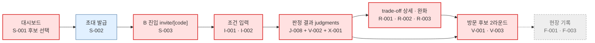
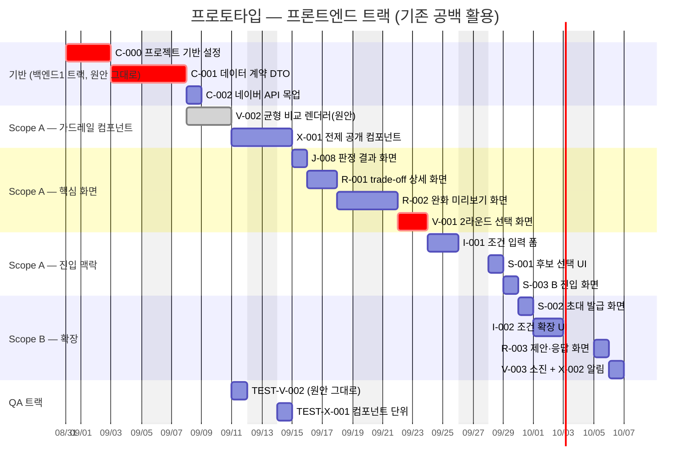

# [프로토타입] UI/UX 선행 구현 — 태스크 선별안

**문서 ID:** PROTO-JOINTHOME-UISLICE-001

**날짜:** 2026-08-26

**근거 문서:** `SRS_project/tasks/v2/[총괄] 개발 실행 계획.md`(트랙별 Gantt·임계경로) · `SRS_project/tasks/v2/TASK-마스터-리스트.md`(52건 의존관계) · `SRS_project/tasks/v2/[태스크 리스트] 같이보기.md` §0.3(유형 분류) · `SRS_project/SRS_V0_9.md` §2.2(라우트 트리)·§11(1-A/1-B) · 각 `{Task ID}-*.md`의 Task Breakdown

> ⚠️ **이 문서는 생성물이 아니다.** `tools/gen_exec_plan.py`의 재계산 대상이 아니며, 마스터 리스트의 의존관계를 **바꾸지 않는다.** 52건의 Task·선행관계·복잡도는 그대로 두고, "그중 어느 부분을 먼저 화면으로 꺼내 볼 것인가"만 고른 **선별안**이다. 여기서 고른 티켓은 이 작업이 끝나도 **완료로 표기하지 않는다**(§9.3).

---

## 0. 결론 요약

| 항목 | 결과 |
| --- | --- |
| **선별** | **Scope A(핵심) 14건 + Scope B(확장) 6건 = 20건** |
| **제외** | 32건 |
| **선취 방식** | 티켓 전량이 아니라 **UI 슬라이스**(화면·컴포넌트 표면)만 — 나머지 AC/DoD는 원래 순번에 남긴다 |
| **공수** | Scope A 24.5 person-day(기반 7 + UI 17.5) · Scope B +5 |
| **임계경로 영향** | **0일** — 프론트엔드 트랙에 이미 존재하는 공백(2026-09-11 ~ 10-09, 21영업일)에 18일이 들어간다(§7) |
| **신규 산출물** | **1건뿐** — 판정 결과 픽스처(§6.2). 그 외 이 문서는 없는 기능을 만들지 않는다 |
| **가장 큰 효과** | North Star 화면(`V-001` 2라운드 매칭)을 원래 일정(10-13) 대비 **약 3주 앞당겨 눈으로 확인**한다 |

---

## 1. 선별 기준

### 1.1 문제 — 유형 `UI`는 2건인데 화면은 7개다

`[태스크 리스트] 같이보기.md` §0.3의 유형 분포에서 `UI`는 **`V-002`·`X-001` 단 2건**이다. 실행 계획 §1.2도 "프론트엔드 트랙 = 2건 / 6 person-day"로 잡았다. 이유는 `SRS_V0_9.md` §1.5 C-TEC-004(shadcn/ui 그대로 사용, 컴포넌트 재구현 금지)가 별도 디자인 단계를 없앴기 때문이다.

그런데 `SRS_V0_9.md` §2.2의 라우트 트리에는 **화면이 7개** 있다.

```text
app/invite/[code]/page.tsx                          # B 진입
app/spaces/[spaceId]/page.tsx                       # 공유 객체 대시보드
app/spaces/[spaceId]/conditions/page.tsx            # 조건 입력
app/spaces/[spaceId]/judgments/page.tsx             # 판정 결과 목록
app/spaces/[spaceId]/listings/[listingId]/page.tsx  # trade-off 상세 · 완화
app/spaces/[spaceId]/visit-selection/page.tsx       # 방문 후보 선택
app/spaces/[spaceId]/field-records/page.tsx         # 방문 전후 기록(단계2)
```

이 7개 화면은 `UI` 유형 2건 어디에도 들어 있지 않다. 실제로는 **Command/Query 티켓들의 Task Breakdown 안에 흩어져 있다.**

| 티켓 | 유형 | Task Breakdown에 실재하는 화면 항목 |
| --- | --- | --- |
| `I-001` | `Write` | "예산 입력 폼(shadcn/ui)", "출퇴근 여부 토글 → 점진적 공개" |
| `S-001` | `Write` | "후보 선택 UI(shadcn/ui 체크박스 리스트) — 5개 초과 시 UI 레벨에서 즉시 차단" |
| `S-003` | `Read` | "`app/invite/[code]/page.tsx`(Server Component)에서 후보 5개 + A 선호 카드 렌더링" |
| `J-008` | `Read` | "`app/spaces/[spaceId]/judgments/page.tsx`에서 A 조건만 반영된 결과를 렌더링" |
| `R-002` | `Read` | "'이 필터로 찾아보기' 클릭 시에만 이동하는 UI(자동 이동 금지)" |
| `F-003` | `Write` | "체크리스트 6항목 고정 렌더링", "유지·보류·제외 선택 UI" |
| `X-002` | `Write+Read` | "인앱 알림 표시 UI만 우선 구현" |

**그러므로 `V-002`·`X-001` 2건만 골라서는 프로토타입이 성립하지 않는다.** 두 건은 컴포넌트일 뿐 화면이 아니다.

### 1.2 그래서 "티켓 단위"가 아니라 "UI 슬라이스 단위"로 고른다

선별 단위를 티켓 전체가 아니라 **티켓 안의 화면 표면**으로 잡는다.

```
티켓 R-002 (H, 5일)
├── domain/compromise/relaxation-simulator.ts        ← 원래 순번(6주차)에 남긴다
├── domain/compromise/all-unmet-fallback-handler.ts  ← 원래 순번에 남긴다
├── domain/compromise/search-filter-translator.ts    ← 원래 순번에 남긴다
└── 완화 미리보기 화면 · A안/B안 · 전부불충족 분기 · 필터 CTA  ← ★ 이번에 선취(2일)
```

계산 로직은 그대로 두고 화면만 먼저 만든다. 화면은 픽스처를 props로 받고, 원래 순번에서 그 props의 출처만 실제 Query로 갈아 끼운다.

### 1.3 4개 필터

티켓 52건에 아래 4개를 순서대로 적용해 20건을 남겼다.

| # | 필터 | 탈락 예 |
| --- | --- | --- |
| **F1** | Task Breakdown에 **실재하는** 화면 항목(`page.tsx`·`components/`·"폼"·"렌더링"·"UI")이 있는가 | `J-001`·`J-003`(순수 평가기 — 화면 항목 0개) |
| **F2** | 그 화면이 **픽스처만으로** 렌더 가능한가(DB 쓰기·외부 실연동·메일 발신 없이) | `A-001`(매직 링크 발신 — 이메일 서비스 계정 필요), `S-004`(Cron 만료 배치) |
| **F3** | 선취해도 원래 순번의 AC/DoD를 **침해하지 않는가** | `X-001`의 ESLint 규칙(§3에서 분리), `X-001`의 "J-006·R-001 숫자 노출 지점 전수 교체"(통합 항목) |
| **F4** | **이 제품의 가설**(5분류 판정 · 총점 금지 · 균형 제시 · 양보 · 2라운드 분할)을 시각적으로 검증하는가 | `X-004`(동시접속 상한), `N-001~004`(성능·보안), `F-001`/`F-003`(1-B 단계2) |

### 1.4 선취가 규칙 위반이 아닌 이유

`CLAUDE.md`와 스킬 `400-task-execution-workflow`는 **"선행이 안 끝났으면 시작하지 않는다"**를 명시한다. 이 선별안은 그 규칙을 우회하지 않는다.

1. **의존성의 성격을 구분한다.** `X-001`의 `Depends on: J-006, R-001`은 티켓 문서 자신이 *"판정·양보 문장 화면(J-006, R-001)이 있어야 붙일 대상이 생기는 횡단 기능"*이라고 적고 있다 — 이는 **통합 의존**이지 **제작 의존**이 아니다. `disclosed-value.tsx`를 만드는 데 `J-006`은 필요 없다. 반대로 "모든 숫자 노출 지점을 교체"하는 DoD는 통합 의존이 맞으므로 **선취하지 않는다**(§3).
2. **완료를 선언하지 않는다.** 선취 대상 티켓의 AC·DoD·TEST 컴패니언은 그대로 살아 있다. GitHub Issue를 닫지 않고, 게이트 G0~G3(실행 계획 §1.4)에 어떤 영향도 주지 않는다.
3. **계약을 먼저 세운다.** 실행 계획 §1.1 원칙 ①("계약이 모든 것보다 먼저다")을 지켜 `C-000`·`C-001`·`C-002`를 **전량** 먼저 끝낸다. 화면은 자체 타입을 만들지 않고 `lib/types/contracts.ts`만 소비한다 — `C-001` 문서의 "로컬 재정의 금지" 규칙을 프로토타입에도 그대로 적용한다.
4. **Read/Write 분리를 흐리지 않는다.** 선취하는 것은 프레젠테이션 계층뿐이다. Server Action 본문은 한 줄도 쓰지 않는다(§9.3의 금지 목록).

---

## 2. 선별 결과

### 2.1 Scope A — 핵심 14건 (권장 · 이것만으로 흐름이 완결된다)

| # | Task ID | 유형 | 원 복잡도/공수 | 선취 공수 | 선취하는 화면 표면 |
| --- | --- | --- | --- | --- | --- |
| 1 | **C-000** | `Infra` | M / 3일 | **3일(전량)** | Next.js·Tailwind·shadcn/ui 스캐폴드 + `schema.prisma` + 디렉터리 구조 |
| 2 | **C-001** | `Contract` | M / 3일 | **3일(전량)** | `lib/types/contracts.ts` — 화면이 소비할 유일한 타입 원천 |
| 3 | **C-002** | `Data` | L / 1일 | **1일(전량)** | 픽스처 3종 — 화면의 더미 데이터 원천 |
| 4 | **V-002** | `UI` | M / 3일 | **3일(전량)** | `balanced-comparison.tsx` — A/B 균형 렌더러. **총점 방어선** |
| 5 | **X-001** | `UI` | M / 3일 | 2일(슬라이스) | `disclosed-value.tsx` + 툴팁/각주 + 상태 배지 대체 |
| 6 | **TEST-V-002** | `Test` | L / 1일 | **1일(전량)** | 총점·추천배지 prop 부재를 실제로 강제하는 유일한 자동 검증 |
| 7 | **TEST-X-001** | `Test` | L / 1일 | 0.5일(슬라이스) | `DisclosedValue` 컴포넌트 단위 테스트만 |
| 8 | **J-008** | `Read` | L / 1일 | 1일(슬라이스) | `judgments/page.tsx` — 판정 결과 목록 화면 |
| 9 | **R-001** | `Read` | H / 5일 | 2일(슬라이스) | `listings/[listingId]/page.tsx` — 양보 문장 카드 |
| 10 | **R-002** | `Read` | H / 5일 | 2일(슬라이스) | 완화 미리보기 A안/B안 · 전부불충족 분기 · 재탐색 필터 CTA |
| 11 | **V-001** | `Write` | H / 5일 | 2일(슬라이스) | `visit-selection/page.tsx` — 2라운드 화면(0/1/2개 일치 3분기) |
| 12 | **I-001** | `Write` | M / 3일 | 2일(슬라이스) | `conditions/page.tsx` — 예산 폼 + 출퇴근 점진적 공개 |
| 13 | **S-001** | `Write` | M / 3일 | 1일(슬라이스) | 후보 선택 체크박스 리스트 + 5개 상한 차단 |
| 14 | **S-003** | `Read` | L / 1일 | 1일(슬라이스) | `invite/[code]/page.tsx` — B 맥락 진입 + 만료 오류 상태 |
| | | | | **24.5일** | 기반 7일 + UI 17.5일 (이 중 TEST 2건 1.5일은 QA 트랙) |

**왜 이 14건인가** — 4~7번이 제품 정체성 가드레일(총점 금지·전제 공개)을 화면 레벨에서 **먼저 못 박고**, 8~11번이 제품의 핵심 가설(5분류 판정 → 양보 → 완화 → 2라운드 분할)을 **눈에 보이게** 만들며, 12~14번이 거기에 도달하는 **최소 진입 맥락**을 만든다. 1~3번은 이 전부의 전제다.

> `J-008` 티켓 문서는 자신을 *"시드 데이터로 판정 엔진을 화면까지 가장 빨리 검증하는 종단 경로"*라고 규정한다 — 프로토타입 목적과 정확히 일치하는 유일한 티켓이라 Scope A의 판정 화면 담당으로 골랐다.

### 2.2 Scope B — 확장 6건 (여유가 있으면)

| # | Task ID | 유형 | 선취 공수 | 선취하는 화면 표면 | 넣는 이유 |
| --- | --- | --- | --- | --- | --- |
| 15 | **S-002** | `Write` | 1일 | 초대 링크·코드 발급 화면 | A→B 연결 흐름의 시각적 연결고리 |
| 16 | **I-002** | `Write` | 2일 | 추가 조건 0~4 상한 UI · 선호 0~3 · 확인 항목 | 조건 입력 화면의 나머지 절반 |
| 17 | **R-003** | `Write` | 1일 | 완화 제안 발신 · 수락/거절 화면 | "직접 변경이 아니라 제안-수락"이라는 구조를 시각화 |
| 18 | **V-003** | `Write` | 0.5일 | 소진 배지 + 남은 한 자리 재선택 복귀 상태 | 방문 후보 화면의 예외 상태 |
| 19 | **X-002** | `Write+Read` | 0.5일 | 인앱 알림 표시 UI | 2인 비동기 흐름의 체감 요소 |
| 20 | **D-001** | `Infra` | (0일) | — | **선취 아님.** 이미 09-03 착수로 배정돼 있으므로, 완료 즉시 Vercel Preview URL로 프로토타입을 팀에 공유한다 |
| | | | **5일** | | |

### 2.3 제외 32건과 근거

| 그룹 | Task ID | 건수 | 제외 근거 |
| --- | --- | --- | --- |
| **인증·생애주기** | `A-001` · `S-004` | 2 | **F2 탈락.** `A-001`은 이메일 서비스 계정(실행 계획 §1.3)이 있어야 실동작하고 화면 표면이 거의 없다 — 프로토타입은 세션 스텁으로 우회한다. `S-004`는 Cron 만료 배치라 눈으로 확인할 것이 없다 |
| **판정 계산 로직** | `J-001` · `J-003` · `J-006` · `J-009` | 4 | **F1 탈락.** 순수 평가기·분류기로 Task Breakdown에 화면 항목이 0개다. 다만 `J-006`의 **출력 형태**(5분류 + 3분류 + 확인필요 별도 배지)는 화면 계약이므로 픽스처로 고정한다(§6.2) |
| **NFR** | `X-004` · `N-001` · `N-002` · `N-003` · `N-004` | 5 | **F4 탈락.** 성능·보안·동시접속은 시각 확인 대상이 아니다 |
| **단계 2(1-B)** | `F-001` · `F-003` | 2 | **F4 탈락.** `SRS_V0_9.md` §11이 "1-A 완전 검증 후 1-B 착수"를 요구한다. 실행 계획 §3.3도 이 둘을 의도적으로 뒤로 미루라고 경고한다 — 프로토타입에서 앞당기면 그 경고를 정면으로 어긴다 |
| **TEST 컴패니언** | `TEST-V-002`·`TEST-X-001`을 제외한 19건 | 19 | **F3 탈락.** 검증 대상 로직이 아직 없다. 두 건만 예외로 포함한 이유는 §9.1 |
| | | **32** | |

---

## 3. 티켓별 선취 범위 — 이번에 하는 것 / 원래 순번에 남기는 것

**이 표가 이 문서의 핵심이다.** 각 티켓의 Task Breakdown 항목을 그대로 두 칸으로 갈랐다.

| Task ID | ✅ 이번에 한다 (UI 슬라이스) | ⏸ 원래 순번에 남긴다 |
| --- | --- | --- |
| `C-000` | 전량 | — |
| `C-001` | 전량 | — |
| `C-002` | 전량 | 실연동 클라이언트(`naver-listing.ts`)와 `try/catch` — 원래도 소비 티켓 담당 |
| `V-002` | 전량 — 총점·추천배지 prop이 **API에 존재하지 않는** 설계 포함 | — |
| `X-001` | `disclosed-value.tsx` · 기준시점/가정/한계 툴팁 · 계산불가·확인필요 시 상태 배지 대체 | ① `J-006`·`R-001` 숫자 노출 지점 **전수 교체**(통합 의존) ② N-005 흡수분 **ESLint 커스텀 규칙**(§10 R3) |
| `TEST-V-002` | 전량 — AC-25-01~03 | — |
| `TEST-X-001` | 컴포넌트 단위(포맷·툴팁·배지 대체) | AC-21-01·02 전수 화면 검사 |
| `J-008` | `judgments/page.tsx` 렌더링 · NOT_APPLICABLE(출근 안 함) 시 통근·교통비 행 제외 · "1인 입력만 반영" 정적 문구 | Prisma 시드 스크립트 · `getSoloJudgment()` 쿼리 함수 |
| `R-001` | 양보 문장 카드 화면 · 조건 표시 **순서 고정**(예산→통근→추가①~④→확인필요) · 미충족 3개 이상 시 상위 2개만 문장·나머지 목록 | `domain/compromise/sentence-generator.ts` **순수 함수 전체** |
| `R-002` | 미리보기 화면(A안·B안 동시 표시) · 2조건 동시 완화 **입력 자체가 불가능한** UI · 전부불충족 분기 화면 · "이 필터로 찾아보기" CTA(자동 이동 금지) | 시뮬레이터 3종 모듈 전체 · 경로 API 재호출 0회 검증(REQ-NF-002) |
| `V-001` | 2라운드 선택 화면 · 0/1/2개 일치 **3분기 화면 상태** · 라운드 상한 2회 표시 | `two-round-selector.ts` 결정 트리 · `submitVisitSelection` Server Action · `VisitSelection` 저장 |
| `I-001` | 예산 폼 · 미입력 시 저장 차단(클라이언트) · 출퇴근 토글 → 출근지·이동수단 **점진적 공개** | `saveBudgetAndCommute` Server Action · 서버 측 검증 · `commutes=false` 시 null 저장 |
| `S-001` | 후보 체크박스 리스트 · 6개째 **UI 레벨 즉시 차단** | `createSharedSpaceDraft` Server Action · 서버 측 6개째 검증 · `SharedSpace`/`ListingRef` 생성 |
| `S-003` | `invite/[code]/page.tsx` — 조건 입력보다 **먼저** 후보 5개 + A 선호 카드 · 만료/존재하지 않음 오류 상태 | `getContextForB()` 쿼리 함수 · P95≤30초 측정 |
| `S-002` | 초대 링크·코드 발급 화면 | `inviteParticipant` Server Action · 코드 엔트로피(REQ-NF-005) |
| `I-002` | 추가 조건 0~4 상한 UI · 선호 0~3 입력 · 확인 항목 입력 | Server Action 3종 · `ConditionTypeRegistry` 재사용 |
| `R-003` | 제안 발신 · 수락/거절 화면 · 제안자가 상대 조건을 **직접 못 바꾸는** 화면 구조 | Server Action 2종 · 재판정 트리거 |
| `V-003` | 소진 배지 · 남은 한 자리 재선택 복귀 화면 상태 | `listing-exhaustion-handler.ts` · Cron 폴링 |
| `X-002` | 인앱 알림 표시 UI | `condition-change-notifier.ts` · 4개 트리거 삽입 · `getUnreadNotifications()` |

---

## 4. 화면 ↔ 티켓 대응

### 4.1 라우트별 담당

| 라우트 | 화면 | UI 표면을 소유한 티켓 | Scope |
| --- | --- | --- | --- |
| `app/spaces/[spaceId]/page.tsx` | 공유 객체 대시보드 | `S-001`(후보 선택) · `S-002`(초대) · `X-002`(알림) | A / B / B |
| `app/invite/[code]/page.tsx` | B 진입 | `S-003` | **A** |
| `app/spaces/[spaceId]/conditions/page.tsx` | 조건 입력 | `I-001` · `I-002` | A / B |
| `app/spaces/[spaceId]/judgments/page.tsx` | 판정 결과 목록 | `J-008` + `V-002`·`X-001` 컴포넌트 소비 | **A** |
| `app/spaces/[spaceId]/listings/[listingId]/page.tsx` | trade-off 상세 · 완화 | `R-001` · `R-002` · `R-003` | A / A / B |
| `app/spaces/[spaceId]/visit-selection/page.tsx` | 방문 후보 선택 | `V-001` · `V-003` | A / B |
| `app/spaces/[spaceId]/field-records/page.tsx` | 방문 전후 기록 | `F-001` · `F-003` | **제외(1-B)** |

### 4.2 프로토타입 클릭 동선



빨간 노드가 Scope A, 파란 노드가 Scope B, 점선 회색이 제외(1-B)다.

---

## 5. 무엇을 눈으로 확인하는가

프로토타입의 목적은 "화면이 있다"가 아니라 **"이 화면들이 제품 정체성을 지키는가"**를 확인하는 것이다.

### 5.1 화면 상태 매트릭스 — 전부 렌더링되어야 한다

| 화면 | 반드시 볼 수 있어야 하는 상태 | 근거 AC |
| --- | --- | --- |
| 판정 결과 | ① 둘 다 충족 ② 한쪽만 충족 ③ 둘 다 불충족 ④ **확인 필요 배지(3분류와 섞이지 않음)** ⑤ 계산 불가 ⑥ 해당 없음(출근 안 함 → 통근·교통비 행 자체가 없음) | AC-11-01·02 · AC-20-01~03 · AC-09-02 |
| trade-off 상세 | ① 미충족 1~2개(문장화) ② 미충족 3개 이상(상위 2개만 문장, 나머지 목록) | AC-12-01·02 |
| 완화 | ① A안·B안 동시 표시 ② 전부 불충족 분기 진입 ③ 회복 불가 → 재탐색 필터 제안 ④ 제안 대기/수락/거절 | AC-13-01~03 · AC-15-01·02 · AC-16-01 |
| 방문 후보 | ① 2개 일치 ② 1개 일치 → 2라운드 ③ 0개 일치 → 2라운드 ④ 라운드 상한 도달 ⑤ 소진 → 한 자리 재선택 | AC-17-01~03 · AC-19-01·02 |
| B 진입 | ① 정상(후보 5개 + A 선호가 조건 입력보다 **먼저**) ② 초대 만료·존재하지 않음 | AC-06-01·02 |
| 후보 구성 | ① 1~5개 선택 ② 6개째 즉시 차단 | AC-01-01·02 |
| 조건 입력 | ① 예산 미입력 시 저장 불가 ② 출퇴근 off → 출근지·이동수단 필드 미노출 ③ 추가 조건 4개 상한 | AC-02-01~03 · AC-03-02 |

### 5.2 검수 질문 — 화면을 보고 팀이 답한다

> 이 8개가 프로토타입의 진짜 인수 기준이다. 하나라도 "아니오"면 화면을 고친다.

1. **총점·순위·추천 배지·"종합 적합도"가 화면 어디에도 없는가?** (`decisions/0001` · 스킬 `304-judgment-domain-rules`)
2. **"확인 필요"가 3분류 중 하나로 흡수되지 않고 별도 배지로 보이는가?** (AC-11-02)
3. **모든 숫자가 기준 시점·가정·한계와 함께 보이는가?** 맨숫자가 하나라도 보이면 실패다 (REQ-FUNC-021 · REQ-NF-006)
4. **A와 B가 같은 시각 비중인가?** 색은 충족/미충족/확인 상태에만 쓰이고, A/B 구분은 위치·라벨로만 되어 있는가 (AC-25-01~03)
5. **양보 문장이 "누가·무엇을·얼마나 감수하고, 대신 무엇이 낫다"만 말하고 결론을 말하지 않는가?** (AC-12-03)
6. **완화 미리보기에서 두 조건을 동시에 완화하는 조작이 애초에 불가능한가?** (AC-13-03)
7. **재탐색 필터가 자동 이동하지 않고 클릭해야만 이동하는가?** (AC-16-01)
8. **전부 불충족일 때 사용자가 막다른 길에 갇히지 않는가?** — 순차 완화 시뮬레이션 → 재탐색 필터로 이어지는 출구가 화면에 있는가 (AC-15-01·02)

---

## 6. 데이터 — 픽스처 계약

### 6.1 `C-002`가 이미 정의하는 3종 (신규 아님)

| 파일 | 내용 |
| --- | --- |
| `lib/external/fixtures/listings.json` | `ListingRef` 형태 고정 매물 5~10건 |
| `lib/external/fixtures/routes.json` | `RouteCache` 형태 고정 경로 결과 |
| `lib/external/fixtures/search-counts.json` | 재탐색 필터별 고정 검색 결과 수 |

### 6.2 신규 제안 1건 — 판정 결과 픽스처

> ⚠️ **이 문서가 제안하는 유일한 신규 산출물이다.** `CLAUDE.md`의 "없는 기능을 만들지 않는다"에 걸리지 않도록 명시적으로 표시한다 — 이것은 기능이 아니라 **의도적으로 폐기 예정인 프로토타입 스캐폴딩**이다.

- **파일:** `lib/external/fixtures/judgments.fixture.ts`
- **필요한 이유:** 판정 화면은 `JudgmentResultSet`을 소비하는데 `C-002`의 픽스처 3종에는 **판정 결과가 없다.** `J-001`·`J-003`·`J-006`이 끝나야 생기기 때문이다. 이것이 없으면 각 화면이 제각기 더미를 하드코딩하게 되고, 그 더미 전부가 나중에 폐기물이 된다.
- **형태 제약:** `C-001`의 `JudgmentResultSet` 타입을 그대로 만족해야 한다. 5분류 전 상태와 3분류 전 상태가 **모두 등장하는** 시나리오를 담는다(§5.1 매트릭스와 1:1 대응).
- **교체 시점:** `J-006` 완료 시 화면의 데이터 주입 지점을 실제 Query로 갈아 끼우고 이 파일을 삭제한다. 파일 상단에 이 교체 조건을 주석으로 못 박는다(스킬 `201-code-commenting` — WHY를 남긴다).
- **절대 금지:** 이 픽스처에 `totalScore`·`rank`·`recommendation` 같은 필드를 **넣지 않는다.** 픽스처에 한 번 들어가면 화면이 그것을 소비하게 되고, 그 순간 정체성이 무너진다.

### 6.3 데이터 주입 규칙

각 화면은 픽스처를 **한 곳에서만** 받는다. Server Component 최상단에서 픽스처를 읽어 props로 내려보내고, 하위 컴포넌트는 픽스처의 존재를 모른다. 원래 순번에서 이 한 줄만 실제 Query 호출로 바뀐다.

```tsx
// app/spaces/[spaceId]/judgments/page.tsx
const results = JUDGMENT_FIXTURE                    // 프로토타입
// const results = await getSoloJudgment(personId)  // J-008 완료 후 교체
```

---

## 7. 일정 — 임계경로 영향 0

### 7.1 근거: 프론트엔드 트랙에 이미 한 달짜리 공백이 있다

실행 계획 §3.2의 트랙별 Gantt에서 프론트엔드(UI) 트랙은 **2건 / 6일**뿐이다.

```
프론트엔드 트랙 (원안)
V-002  2026-09-08 ~ 09-10  (3일)
       ├─────────── 공백 21영업일 ───────────┤
X-001  2026-10-12 ~ 10-14  (3일)
```

**2026-09-11(금) ~ 10-09(금), 21영업일이 비어 있다.** 그 사이 백엔드1 트랙은 임계경로(`A-001`→`I-001`→`J-001`→`J-003`→`J-006`)를 계속 달린다.

프론트엔드 레인이 실제로 지는 부하는 Scope A 16일 + Scope B 5일이고, 그중 `V-002` 3일은 원래 배정분이다 — **공백에 새로 들어가는 것은 18영업일**(TEST 2건 1.5일은 QA 트랙이 흡수). 21일 공백 안에 그대로 들어가므로 **임계경로에 단 하루도 얹히지 않는다.**

### 7.2 프론트엔드 트랙 프로토타입 스케줄



- **Scope A 종료 2026-09-29(화)** — 전 흐름을 클릭으로 확인 가능
- **Scope B 종료 2026-10-06(화)** — 공백 마감(10-09)까지 **3영업일 여유**
- **`X-001` 원래 슬롯(10-12~10-14)은 그대로 둔다** — 남은 통합 작업(숫자 노출 지점 전수 교체 + ESLint 규칙)이 거기서 실행되며, 컴포넌트가 이미 있으므로 3일 → 1~1.5일로 줄어 여유가 생긴다

### 7.3 무엇이 얼마나 앞당겨지는가

| 화면 | 원안에서 눈에 보이는 시점 | 프로토타입 | 단축 |
| --- | --- | --- | --- |
| 판정 결과(5분류·3분류) | `J-006` 10-05 이후 | **09-15** | 약 3주 |
| trade-off · 양보 문장 | `R-001` 10-09 | **09-17** | 약 3주 |
| 완화 미리보기 | `R-002` 10-16 | **09-21** | 약 3.5주 |
| **방문 후보 2라운드(North Star)** | `V-001` **10-13** | **09-23** | **약 3주** |

### 7.4 착수 전 필요한 외부 의존성 — 4개 중 1개뿐

실행 계획 §1.3의 외부 의존성 4개 중 프로토타입에 **필요한 것은 Supabase 프로젝트 + 로컬 CLI 하나**다(`C-000` 때문).

| 항목 | 프로토타입에 필요한가 |
| --- | --- |
| Supabase 프로젝트 + 로컬 CLI(Docker) | ✅ 필요 (`C-000`) |
| Vercel 계정 연결 | 선택 — `D-001`로 공유할 때만 |
| 네이버 부동산 API 정책 재확인 | ❌ 불필요 — `NAVER_API_MODE=mock`이 기본값 |
| 매직 링크 발신용 이메일 서비스 | ❌ 불필요 — `A-001` 제외 |

**즉 프로토타입은 나머지 외부 의존성 3개를 기다리지 않고 지금 착수할 수 있다.**

---

## 8. 기존 HTML 시안 활용

저장소 루트에 이미 화면 시안이 여러 종 있다. 프로토타입은 이것을 **시각 원본**으로 삼되, 마크업을 그대로 옮기지 않는다 — `SRS_V0_9.md` §1.5 C-TEC-004(shadcn/ui에 있는 컴포넌트는 자체 구현 금지)에 따라 shadcn/ui 컴포넌트로 재구성한다.

| 기존 시안 | 대응 화면 / 티켓 |
| --- | --- |
| `20260820_수정본_프로토타입.html` | **전 구간** — 후보 담기(`S-001`) · 조건(`I-001`) · 판정 결과(`J-008`) · trade-off(`R-001`) · 완화(`R-002`) · 방문 후보(`V-001`) |
| `joint-decision-ui (1).html` | 후보 구성(`S-001`) · 조건 입력(`I-001`·`I-002`) · 판정 결과(`J-008`) |
| `모두불총족일때.html` · `naver_realestate_no_match_recovery.html` | **전부 불충족 분기**(`R-002` ②·③) — §5.2 검수질문 8번의 원본 |
| `20260820_디자인수정_와이어프레임.html` | 화면 골격 · 검토 항목 체크리스트 |
| `naver_realestate_web_joint_decision_prototype.html` · `prototype-together-web.html` | 네이버 부동산 진입 맥락 |
| `landing-page.html` | 랜딩 — **프로토타입 범위 밖**(52건 어느 티켓에도 없다) |

> 옮기는 과정에서 시안에 총점·순위·추천 표현이 남아 있는지 §5.2의 8개 질문으로 전수 검사한다. 시안은 SRS 확정 이전 산출물이므로 현재 규칙과 어긋나는 표현이 남아 있을 수 있다.

---

## 9. 완료 판정과 이후 연결

### 9.1 프로토타입의 DoD

개별 티켓의 DoD가 아니라 **프로토타입 자체의 완료 기준**이다.

- [ ] §4.2의 클릭 동선을 처음부터 끝까지 막힘 없이 이동할 수 있다
- [ ] §5.1 상태 매트릭스의 **모든 상태**가 실제로 렌더링된다(픽스처 전환으로 확인 가능)
- [ ] §5.2 검수 질문 8개가 **전부 "예"**다
- [ ] `TEST-V-002`가 통과한다 — 총점·추천배지 prop이 컴포넌트 API에 **존재하지 않음**을 자동 검증
- [ ] `TEST-X-001`(컴포넌트 단위)이 통과한다
- [ ] 화면 코드가 `lib/types/contracts.ts` 외의 타입을 스스로 정의하지 않는다
- [ ] 픽스처 주입 지점이 화면당 정확히 1곳이다(§6.3)
- [ ] 타입 검사·린트 통과

> **테스트 2건을 넣은 이유** — 프로토타입이라도 `TEST-V-002`·`TEST-X-001`은 뺄 수 없다. 이 둘이 "총점 금지"와 "전제 없는 숫자 금지"를 사람의 주의력이 아니라 **코드로** 강제하는 유일한 장치이기 때문이다. 프로토타입 단계에서 깔아두면 이후 모든 화면이 처음부터 그 위에서 만들어진다.

### 9.2 각 티켓이 원래 순번에서 이어받는 것

| 원래 순번 | 이어받는 작업 |
| --- | --- |
| `J-001`·`J-003`·`J-006` 완료 시 | 판정 화면의 픽스처 주입 지점 → 실제 Query 교체, `judgments.fixture.ts` 삭제 |
| `R-001` 순번 | `sentence-generator.ts` 순수 함수 구현 → 화면의 하드코딩 문장 교체 |
| `R-002` 순번 | 시뮬레이터 3종 구현 → 화면의 픽스처 미리보기 교체 |
| `V-001` 순번 | `two-round-selector.ts` + Server Action → 화면의 상태 전환을 실제 저장에 연결 |
| `I-001`·`S-001`·`S-002` 순번 | Server Action + 서버 측 검증 추가(클라이언트 우회 방지) |
| `X-001` 순번 | 숫자 노출 지점 전수 교체 + ESLint 커스텀 규칙 |

### 9.3 하지 말아야 할 것

| 금지 | 이유 |
| --- | --- |
| 선취한 티켓의 GitHub Issue를 **닫지 않는다** | AC·DoD·TEST 컴패니언이 아직 안 끝났다. 게이트 G0~G3 판정이 오염된다 |
| `TASK-마스터-리스트.md`·`[총괄]` 문서를 **손으로 고치지 않는다** | 생성물이다. 의존관계가 실제로 바뀔 때만 `tools/gen_exec_plan.py` 재실행 |
| 화면 안에 **Server Action 본문을 쓰지 않는다** | Read/Write 분리(추출 원칙 ②) — 프로토타입은 프레젠테이션 계층만 |
| 화면이 **자체 타입을 선언하지 않는다** | `C-001`의 SSOT 규칙. 로컬 재정의는 코드 리뷰 차단 대상 |
| 픽스처에 **총점·순위 필드를 넣지 않는다** | §6.2 — 픽스처에 들어가면 화면이 소비하고, 소비하면 정체성이 무너진다 |
| `F-001`·`F-003` 화면을 **만들지 않는다** | 1-B다. 실행 계획 §3.3이 명시적으로 뒤로 미루라고 경고한다 |

---

## 10. 리스크

| # | 리스크 | 근거 | 대응 |
| --- | --- | --- | --- |
| **R1** | 화면을 실제 로직에 붙일 때 재작업이 발생한다 | 프로토타입 일반 | 화면은 처음부터 `C-001` 타입만 소비하고, 데이터 주입을 화면당 1곳으로 고정(§6.3) — 교체가 한 줄이다 |
| **R2** | 선취를 "완료"로 오인해 게이트 판정이 오염된다 | 게이트 G0~G3가 Task 완료 기준(실행 계획 §1.4) | §9.3 금지 목록. 이슈를 닫지 않고, 커밋 메시지에 `[proto]` 접두어를 붙여 정식 Task 커밋과 구분 |
| **R3** | `X-001`의 ESLint 규칙을 프로토타입 단계에 켜면 진행이 막힌다 | 프로토타입 화면에는 픽스처 숫자가 많다 | 규칙은 원래 순번에 남긴다. 프로토타입 단계에서는 §5.2 질문 3번으로 사람이 검사 |
| **R4** | AI 코드 생성이 편의상 "종합 점수"를 화면에 넣는다 | `R-001` 티켓 문서: *"AI 코드생성이 편의상 '종합 점수'를 추가하는 경향이 가장 강하게 나타나는 지점"* | `V-002`를 **가장 먼저** 만들어 총점 prop이 없는 API를 물리적 방어선으로 세운다. 판정·완화 화면은 전부 이 컴포넌트를 재사용 |
| **R5** | 프로토타입 범위가 1-B(현장 기록)까지 번진다 | 화면 골격이 있으면 채우고 싶어진다 | §2.3 제외 근거를 명시. `F-*`는 G2(North Star) 통과 후 |
| **R6** | 프로토타입이 공백을 넘겨 `X-001` 원래 슬롯을 침범한다 | Scope A+B가 공백 21일 중 18일 사용 — 여유 3일뿐 | Scope B는 **선택**이다. 지연되면 `X-002`·`V-003`부터 잘라낸다(가장 부가적) |

---

**PROTO-JOINTHOME-UISLICE-001 · v1.0 · 2026-08-26**

관련 문서: `SRS_project/tasks/v2/[총괄] 개발 실행 계획.md` · `SRS_project/tasks/v2/TASK-마스터-리스트.md` · `SRS_project/tasks/v2/[태스크 리스트] 같이보기.md` · `SRS_project/SRS_V0_9.md` §2.2·§11 · 스킬 `304-judgment-domain-rules`(총점 금지) · `400-task-execution-workflow`(완료 판정)
