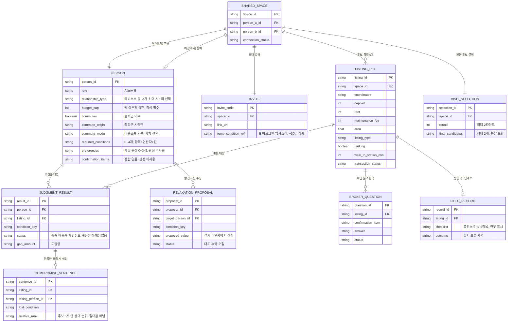

# 네이버 부동산 공동 주거 의사결정 기능 PRD (같이보기)

> **v1.0 — `같이보기-prd-v1_0.md`**  
> 이전 파일명 `prd_v0.2_20260824.md`를 이 파일명으로 변경하며 버전을 v1.0으로 올렸다. 내용은 v0.2의 두 라운드 보강(KPI 수치화 프로토콜 §24.4, MoSCoW·스프린트 구현 가능성 §16.2, 비기능요구 §20, 엔터티 관계도 §21.9, Given-When-Then-SLO 형식의 AC 61개, FR-10a/FR-10b 분할)을 그대로 담고 있으며 이번 리네임에서 내용을 추가로 바꾸지 않았다. 상세 변경 로그는 문서 끝 "PRD 완성도 재검토 (v0.2)" 참고.

## 1. Document Overview

| 항목 | 내용 |
|---|---|
| 문서명 | 네이버 부동산 공동 주거 의사결정 기능 PRD (같이보기) |
| 버전 | `v1.0` (`prd_v0.2_20260824.md`를 리네임, 내용은 v0.2 보강 2라운드 결과를 그대로 유지) |
| 기준 handoff | `real-estate-joint-decision_CHATGPT_HANDOFF_20260820_1333.zip` (폴더 내 실물은 `..._1007.zip` — 정합성 원칙에 따라 파일명 시각 차이는 §1.2에 준해 처리) |
| 기준 commit | `10b64551ed10a88616791b3a9798f53b50b01ed9` |
| 작성 기준일 | 2026-08-20 (v0.2 개정 2026-08-24, v1.0 리네임 2026-08-24) |
| 문서 목적 | 최신 handoff에서 확정된 Problem, Target, Value Proposition, 기능·화면·데이터·검증 범위를 제품 요구사항으로 정리한다. |
| 확정 범위 | 네이버 부동산 관심매물 저장 이후, 두 사람의 조건 입력·비교·충돌/양보 설명·방문 후보 2개 결정과 단계 2의 방문 전후 기록 |
| 문서 상태 | 구현 전 `v1.0`. 미결정 사항과 외부 의존성은 `[검증 가설]`·`[TBD]`로 유지한다. |

### 1.1 상태 표기

| 상태 | 의미 |
|---|---|
| `[확정]` | `docs/11-decision-status.md` 또는 채택된 decision에서 현재 결정으로 명시 |
| `[근거 있음]` | Evidence Log에서 사실·확인된 근거가 있으나 적용 범위와 한계가 존재 |
| `[검증 가설]` | 참·거짓 또는 효과가 아직 측정되지 않음 |
| `[TBD]` | 팀 결정, 정책 확인, 내부 데이터 또는 리서치가 더 필요 |
| `[Out of Scope]` | 현재 제품 또는 MVP 범위에서 명시적으로 제외 |

### 1.2 정합성 적용 원칙

이 PRD는 `현재 지시 → docs/11-decision-status.md → 최신 decisions → 최신 docs → 그 외 참고자료` 순으로 판단했다.

- `[확정]` 예산은 모든 사용자의 공통 필수 조건이다.
- `[확정]` 첫 단계에서 정기적 출퇴근 여부를 확인하고, 출퇴근하는 사람에게만 출근지와 이동수단을 받는다.
- `[확정]` `출근 안 함`은 정상 경로다. 통근·교통비를 판정하지 않으며 비교표에서 해당 행을 제거한다.
- `docs/01-team-brief.md`, `docs/02-hypotheses.md`, `docs/08-screen-design.md`에 남은 “출근지·예산 2개 필수” 및 일부 2개 입력 기준 문구는 최신 `decision-status`와 충돌하므로 사용하지 않는다.
- `docs/07-cjm.md`라는 파일은 handoff에 없으며, 실제 포함 파일인 `docs/07-cjm-opportunity-score.md`를 사용했다.

---


## 2. Product Summary

네이버 부동산의 기존 매물 탐색과 관심매물 저장 흐름 위에 추가되는 **2인 공동 주거 의사결정 기능**이다. 함께 살 집을 구하는 두 사람이 각자의 조건을 한 번씩 입력하면, 관심매물별로 누구의 어떤 조건이 충족되고 어긋나는지와 양보 지점을 나란히 보여준다. 서비스는 정답 매물을 추천하거나 총점을 만들지 않고, 두 사람이 스스로 **이번에 보러 갈 집 2개**를 정할 수 있도록 비교 근거를 구조화한다.

---

## 3. Background / Context

### 3.1 현재 집찾기 구조

현재 프로젝트가 관찰·정리한 AS-IS는 다음과 같다.

```text
네이버에서 매물 탐색·관심매물 저장
→ 카카오톡 등으로 링크 공유
→ 각자 매물 열람
→ 지도에서 통근 확인
→ 계산기·메모 등으로 비용과 장단점 비교
→ 의견 교환
→ 의견이 모이지 않으면 다시 탐색
```

- `[근거 있음]` 집 탐색에는 반복 비교가 존재한다. 당근부동산 조사에서 전세 계약자는 평균 2.5개월 동안 4.1곳, 30대는 2.7개월 동안 4.1곳을 방문했다. 단, 당근 이용자 표본이며 2인 탐색만을 측정한 자료는 아니다.
- `[근거 있음]` 파트너와 집을 선택할 때 크기·스타일, 필수 조건, 위치, 예산 등의 충돌이 발생한다는 해외 조사 근거가 있다. 단, 미국·2020년·매매 기준이며 국내 전·월세에 그대로 일반화하지 않는다.
- `[추론]` 관심매물 저장 이후 비교·통근·비용 계산·의견 조율의 결과가 네이버 부동산 안에 하나의 공동 결정 구조로 남지 않는다.
- `[일화/검증 가설]` 링크와 판단 근거가 여러 채널에 분산되고 상대의 기준이 말로만 존재하면, 매물별로 누가 무엇을 양보하는지 확인하기 어렵다는 것이 현재 팀의 문제 정의다.

### 3.2 기회 구간

```text
매물 확보 → 검색·지도 → 상세 → 관심매물 저장 → [공유·비교·공동 결정] → 문의·방문
                                                   ↑ 현재 제품 범위
```

`[확정]` 이 제품은 매물 탐색을 새로 만들지 않는다. 네이버 부동산의 관심매물 데이터를 활용해 **저장 이후 공동 결정 구간**만 담당한다.

### 3.3 확인된 것과 아직 모르는 것

| 구분 | 현재 상태 |
|---|---|
| 여러 매물을 반복 비교하는 행동 | `[근거 있음]` |
| 두 사람이 집을 고를 때 조건 충돌이 존재함 | `[근거 있음]` |
| 그 충돌이 실제 의사결정을 지연시킴 | `[검증 가설]` 직접 근거 없음 |
| 본 기능이 결정 시간을 단축함 | `[검증 가설]` 효과 미측정 |
| 본 기능이 갈등·탐색 기간·방문 횟수를 줄임 | `[검증 가설]` 효과 미측정 |

---

## 4. Target User

### 4.1 Primary User — 제품 정의

- `[확정]` **함께 살 집을 구하는 두 사람**
- `[확정]` 제품 정의상 주거 형태는 제한하지 않는다.
- `[확정]` 두 사람이 각자 조건을 내고 대칭적으로 선택하는 `완전공동형` 관계를 전제로 한다.
- `[확정]` 1인 사용은 독립 제품 모드가 아니라 상대가 아직 참여하지 않은 **빈 경로**다.

### 4.2 Initial Validation Segment — 검증 집단

| 구분 | 집단 | 목적 |
|---|---|---|
| 1차 검증 집단 | `[확정]` 예비부부·신혼부부 | H1 초대 참여의 상한을 확인할 집단 |
| 2차 검증 집단 | `[확정]` 친구·룸메이트 | H1 초대 참여의 하한을 비교할 대조군 |

예비부부·신혼부부를 제품 전체의 유일한 Primary User로 재정의하지 않는다. 친구·룸메이트 역시 확장 타깃이 아니라 현재 검증 설계의 비교 집단이다.

### 4.3 주거 형태 구분

- 제품 정의 범위: `[확정]` 주거 형태 무관
- 초기 시장·검증 범위: `[확정]` 전·월세 공동 주거 탐색자 2인 중심

### 4.4 현재 제외 사용자

- `[Out of Scope]` 3인 이상 공동 탐색
- `[Out of Scope]` 부모–자녀 관계
- `[Out of Scope]` 한 사람이 고르고 다른 사람이 승인만 하는 주도–승인형 관계

---

## 5. User Job / JTBD

### 5.1 Core Job

> 함께 살 집을 고를 때, 두 사람 각자의 조건을 관심매물에 함께 대입해 누가 무엇을 감수하는지 이해하고, **서로 납득 가능한 상태에서 이번에 보러 갈 집 2개를 정하고 싶다.**

### 5.2 Job 구조

| Job | 사용자가 이루려는 결과 |
|---|---|
| Functional Job | 저장한 관심매물 중 이번에 실제로 방문할 두 곳을 정한다. |
| Decision Job | 후보별 조건 충족·미충족·미달량과 양보 관계를 확인한 뒤 선택한다. |
| Relational Job | 어느 한쪽의 기준이나 시스템의 추천에 끌려가지 않고 각자의 기준을 같은 비중으로 드러낸다. |
| Continuity Job | 매물이 바뀌어도 사람의 조건은 유지해 다음 후보에 다시 적용한다. |
| B의 보조 Job | `[검증 가설]` 매물마다 장황하게 이유를 설명하지 않고 자신의 조건을 한 번 입력해 판단 근거를 전달한다. |

### 5.3 `납득`의 정의

`[확정]` 납득은 모든 조건을 만족하거나 추천 결과를 그대로 수용하는 상태가 아니다.

> **이 집을 고르면 내가 무엇을 감수하는지 알고, 그 사실을 알고도 방문 후보로 동의할 수 있는 상태**

따라서 `한쪽만 충족`인 매물도 최종 방문 후보가 될 수 있다.

---

## 6. Problem Definition

### 6.1 확인된 문제

| 문제 | 상태 | 한계 |
|---|---|---|
| 주거 탐색에서 여러 매물을 반복 비교한다 | `[근거 있음]` | 2인만을 분리한 조사 아님 |
| 2인 주거 선택에서 서로 다른 조건·선호로 충돌이 발생한다 | `[근거 있음]` | 미국·매매 기준 조사 |
| 공동 저장·단방향 공유·개인 점수 도구는 존재하지만, 상대가 자기 조건을 입력하는 국내 주요 부동산 기능은 확인되지 않았다 | `[근거 있음]` | 조사 범위 내 확인이며 수요의 증거는 아님 |
| 선택에는 조건 간 trade-off와 양보가 발생한다 | `[근거 있음]` | 발생 사실과 제품 효과는 별개 |

### 6.2 검증 중인 문제

- `[검증 가설]` 서로의 조건이 말과 여러 채널에 흩어져 있어 매물별 충돌과 양보 지점을 한 구조에서 보기 어렵다.
- `[검증 가설]` 단순 공동 찜이나 링크 공유만으로는 상대가 왜 선호하거나 거부하는지 이해하기 어렵다.
- `[검증 가설]` 이 조건 충돌이 실제 선택·방문·계약 결정의 지연을 만든다.
- `[검증 가설]` 조건 충돌이 일정 조율이나 비용 분담보다 더 큰 지연 원인이다.

### 6.3 Problem Statement

> `[검증 가설]` 함께 살 집을 구하는 두 사람은 관심매물마다 각자의 조건과 판단을 수동으로 맞춰야 하며, 특정 후보를 선택할 때 **누구의 어떤 조건이 어긋나고 무엇을 양보해야 하는지** 명확히 보기 어려워 방문 후보를 공동으로 정하는 과정의 부담이 커진다.

이 문장은 현재 제품 방향을 정하는 문제 정의이며, `결정 지연`의 인과와 크기는 H2-b-2에서 별도로 검증한다.

---

## 7. Value Proposition

### 7.1 Primary Value Proposition

> **함께 살 집을 구하는 두 사람이 관심매물별 조건 충돌과 양보 지점을 한눈에 확인하고, 서로 납득할 수 있는 방문 후보를 함께 결정하도록 돕는다.**

### 7.2 Short Value Proposition

> **각자의 조건과 양보 지점을 보고, 함께 보러 갈 집을 정합니다.**

### 7.3 핵심 사용자 가치

1. 상대의 조건과 선호를 사람 단위로 이해한다.
2. 매물별로 `누구에게 무엇이 맞고 어긋나는지` 확인한다.
3. 조건의 실제 미달량과 양보 주체를 확인한다.
4. 조건을 완화하면 후보 상태가 어떻게 달라지는지 양쪽 안을 비교한다.
5. 자동 판정할 수 없는 항목을 중개사 질문과 현장 확인으로 분리한다.
6. AI나 총점의 정답이 아니라 두 사람이 판단할 근거를 얻는다.
7. 이번에 보러 갈 두 곳을 직접 정한다.

### 7.4 기존 탐색·공유 기능과의 차이

| 일반적 기능 | 본 제품 |
|---|---|
| 매물을 탐색·추천 | 기존 관심매물에 두 사람의 조건을 적용 |
| 관심매물 공동 저장·링크 공유 | 두 사람 모두 자기 조건을 입력하고 양방향으로 비교 |
| 개인별 별점·가중치·총점 | 조건별 충족·미충족·미달량을 합산 없이 제시 |
| AI가 최적 매물 추천 | AI가 충돌·양보 관계를 설명하고 결정은 두 사람이 수행 |
| 가장 좋은 집 찾기 | 두 사람이 무엇을 감수하는지 알고 방문 후보를 정하기 |

---

## 8. Product Goal

### 8.1 MVP 사용자 결과

> `[확정]` 두 사람이 각자의 조건을 기준으로 관심매물 최대 5개를 비교하고, 매물별 조건 충돌과 양보 지점을 이해한 뒤 **이번에 보러 갈 집 2개를 직접 정할 수 있게 한다.**

### 8.2 제품 종료점

- 단계 1: `[확정]` 방문 후보 2개 결정
- 단계 2: `[확정]` 방문 전 확인 질문 정리 → 방문 후 현장 기록 → 유지·보류·제외
- `[검증 가설]` 위 결과가 결정 시간, 갈등, 방문 횟수 또는 계약 전환에 미치는 영향은 별도 검증 대상이다.

---

## 9. Non-goals

| Non-goal | 상태/설명 |
|---|---|
| AI가 최종 집 또는 방문 후보를 자동 선택 | `[Out of Scope]` |
| 정답 매물·최적 매물 추천 또는 강제적 타협안 제시 | `[Out of Scope]` |
| 두 사람의 조건을 합산한 종합점수·공동 적합도·자동 랭킹 | `[Out of Scope]` |
| 신규 매물 DB, 별도 매물 검색, 탐색 보드, 아이소크론 중심 지도 기능 구축 | `[Out of Scope]` |
| 계약 실행, 전자계약, 등기, 보증보험, 전세사기 확정 진단 | `[Out of Scope]` |
| 대출 상품 추천, 대출 실행, 확정 대출 한도·금리 제시 | `[Out of Scope]` |
| 법률·금융 판단 대행 | `[Out of Scope]` |
| 3인 이상 의사결정, 비용 분담 비율, 방 배정 | `[Out of Scope]` |

---

## 10. Core User Scenario

### 대표 시나리오: A와 B가 전·월세 집을 함께 구하는 경우

1. A는 네이버 부동산에서 관심매물을 저장한 뒤 `같이 고르기`에 진입한다.
2. A는 관심매물 중 최대 5개를 이번 비교 후보로 선택한다.
3. A는 자신의 예산 상한을 입력한다. 시스템은 정기적 출퇴근 여부를 묻고, A가 출퇴근한다고 답한 경우에만 출근지와 이동수단을 받는다.
4. A는 필요하면 판정 가능한 필수 조건을 최대 4개 추가하고, 자유 문장 선호 0~3개와 확인 필요 항목을 입력한다.
5. A는 관계 유형을 선택하고 초대 링크를 B에게 보낸다. 링크가 기본이며 코드는 보조 수단이다.
6. B는 모바일에서 링크를 열어 A가 고른 후보와 A의 선호 맥락을 먼저 본다.
7. B도 예산을 입력하고 출퇴근 여부에 따라 출근지를 입력하거나 `출근 안 함`을 선택한다. 필요하면 필수 조건·선호·확인 항목을 추가한다.
8. 시스템은 각 사람의 조건을 관심매물에 적용해 `둘 다 충족 / 한쪽만 충족 / 둘 다 불충족 / 확인 필요`를 보여준다.
9. 한쪽만 충족하는 매물에서는 누가 어떤 조건을 얼마나 감수하는지와, 같은 후보 5개 안에서 상대적으로 나은 점을 설명한다.
10. 두 사람은 필요한 경우 양쪽 조건 완화안을 동시에 살펴본다. 각자는 자기 조건만 바꿀 수 있고 상대 조건에는 제안만 보낼 수 있다.
11. 자동 판정할 수 없는 항목은 방문 전 중개사 질문으로 분리한다.
12. 두 사람은 각자 방문하고 싶은 후보 2개를 고른다. 겹치면 확정하고, 일부만 겹치면 남은 한 자리를 한 번 더 비교한다. 끝까지 겹치지 않으면 각자 한 곳씩 선택한다.
13. 단계 2에서는 방문 후 공통 체크리스트를 기록하고 각 후보를 유지·보류·제외한다.

`[검증 가설]` 이 흐름이 실제 갈등 또는 의사결정 시간을 줄이는지는 본 시나리오의 확정 결과가 아니다.

---

## 11. End-to-End User Flow

| 단계 | 사용자 행동 | 시스템 반응 | 다음 단계 진입 조건 | 상태 |
|---|---|---|---|---|
| 1. 진입 | A가 네이버 부동산에서 `같이 고르기` 선택 | A의 관심매물 목록 조회 | A 로그인 및 관심매물 접근 가능 | `[확정]` |
| 2. 후보 선택 | 관심매물 중 1~5개 선택 | 후보 선택 상태와 5개 상한 표시 | 1개 이상 선택 | `[확정]` |
| 3. A 기본 입력 | 예산 입력, 출퇴근 여부 응답 | 예산 저장. 출퇴근 여부에 따라 출근지 경로 분기 | 예산 입력 완료 | `[확정]` |
| 4. A 통근 입력 | 출퇴근 시 출근지와 이동수단 선택 | 후보별 실제 통근시간·교통비 계산 준비. 출근 안 함이면 통근 축 제거 | 해당자만 출근지 입력 | `[확정]` |
| 5. A 확장 입력 | 필수 조건 0~4개, 선호 0~3개, 확인 필요 항목 선택 | 판정 조건·사람 카드·질문 항목 분리 저장 | 사용자가 확장 입력 종료 | `[확정]` |
| 6. 초대 | A가 관계 유형 선택 후 링크 공유 | 매물 ID 최대 5개와 연결 상태를 가진 공유 객체 생성, 링크·보조 코드 발급 | 초대 발송 | `[확정]` |
| 7. B 진입 | B가 링크 또는 코드로 참여 | 조건 입력 전 후보와 A의 선호 맥락 표시 | 링크 유효 또는 코드 확인 | `[확정]` |
| 8. B 기본 입력 | 예산 입력, 출퇴근 여부 응답 | A와 동일한 분기. 비로그인 입력은 초대 코드에 임시 저장 | 예산 입력 완료 | `[확정]` |
| 9. B 통근·확장 입력 | 해당자만 출근지·이동수단 입력, 조건 추가 | 양쪽 입력분으로 판정 갱신 | B가 현재 입력을 마침 | `[확정]` |
| 10. 첫 결과 | A/B가 후보별 실제값과 판정 확인 | 조건별 결과, 미달량, 확인 필요 상태 표시 | 계산 성공 또는 일부 계산 가능 | `[확정]` |
| 11. 상세 비교 | 후보 선택 | A/B 조건을 같은 비중으로 나란히 표시하고 양보 문장 생성 | 상세 진입 | `[확정]` |
| 12. 조건 완화 | 자기 조건 슬라이더 조정 또는 상대에게 변경 제안 | 실제 미달량 기준으로 후보 등급 변화를 실시간 미리보기 | 적용·제안·취소 중 선택 | `[확정]` |
| 13. 0건 분기 | 살아남는 후보가 없는 상태 확인 | 한 조건 완화로 살아나면 완화, 아니면 네이버 재탐색 필터 제안 | 사용자 선택 | `[확정]` 행동 / `[TBD]` A-13b-2 상세 화면 |
| 14. 방문 후보 선택 | 각자 후보 2개 선택 | 일치 수에 따라 확정·한 자리 재비교·분할 처리 | 최대 2라운드 | `[확정]` |
| 15. 방문 전 | 확인 필요 질문 검토 | 중개사 질문 카드 제공, 답변 기록 시 판정 갱신 | 단계 2 진입 | `[확정]` 단계 2 |
| 16. 방문 후 | 공통 체크리스트 작성, 유지·보류·제외 | 사용자 생성 기록 보존, 전부 제외 시 재탐색 경로 | 기록 완료 또는 재탐색 | `[확정]` 단계 2 |
| 17. 반복 세션 | 새 관심매물 추가·교체 | 기존 사람 조건을 새 매물에 자동 적용 | 새 매물 등록 | `[확정]` |

### 11.1 로그인 원칙

- A의 관심매물 조회는 개인 데이터이므로 로그인 전제다.
- B는 A의 개인 관심매물 목록이 아니라 A가 만든 공유 객체를 본다.
- `[확정 방향]` B의 로그인은 첫 결과를 본 뒤 저장·재방문 시점으로 미룬다.
- `[TBD — 네이버 정책]` 공유 객체를 실제로 비로그인 열람할 수 있는지 확인이 필요하다. 불가능하면 B 로그인 시점이 변경된다.

---

## 12. Condition Model

### 12.1 기본 원칙

`[확정]` 조건은 매물이 아니라 **사람**에게 귀속된다.

```text
사람 A의 조건 ─┐
               ├─ 관심매물 1~5에 각각 적용 → 조건별 결과
사람 B의 조건 ─┘
```

매물이 삭제되거나 교체되어도 사람의 조건은 남는다. 새 매물이 들어오면 별도 재입력 없이 자동 적용한다.

### 12.2 사람별 조건 구조

| 데이터 | 입력 규칙 | 판정 사용 | 귀속 | 상태 |
|---|---|---|---|---|
| 예산 | **항상 필수**. 월 실부담 상한 | 예 | 사람 | `[확정]` |
| 출퇴근 여부 | 첫 단계에서 명시적으로 질문 | 통근 축 적용 여부 결정 | 사람 | `[확정]` |
| 출근지 | 출퇴근하는 경우에만 입력 | 통근시간·교통비 계산 기준점 | 사람 | `[확정]` |
| 이동수단 | 출근지가 있을 때만 입력. 대중교통 기본, 자차 선택 가능 | 경로·교통비 계산 | 사람 | `[확정]` |
| 추가 필수 조건 | 0~4개, 사용자가 선택 | 예 | 사람 | `[확정]` |
| 선호 | 자유 문장 0~3개 | 아니오 | 사람 | `[확정]` |
| 확인 필요 | 현재 정의된 항목 중 선택, 상한 없음 | 자동 판정하지 않음 | 사람의 확인 요구 | `[확정]` |

### 12.3 판정 가능한 여섯 항목

| 조건 | 타입 | 사용자 기준 | 미달 표현 | 적용 조건 |
|---|---|---|---|---|
| 예산 | 상한형 | 월 실부담 O만원 이하 | `+월 15만` | 모든 사용자 |
| 통근시간 | 상한형 | O분 이내 | `+7분` | 출근지가 있고 통근 조건을 설정한 사용자 |
| 역 도보 | 상한형 | O분 이내 | `+3분` | 추가 조건 선택 시 |
| 전용면적 | 하한형 | O㎡ 이상 | `−7㎡` | 추가 조건 선택 시 |
| 주차 | 유무형 | 있음 | `없음` | 추가 조건 선택 시 |
| 매물 유형 | 일치형 | `= 아파트` 등 | 실제 매물값 `빌라` | 추가 조건 선택 시 |

예산을 제외한 판정 축 중 사용자가 원하는 항목을 최대 4개까지 추가한다. 방 개수·건물 연식·엘리베이터·층수·방향 등은 현재 자동 판정 항목이 아니며 선호 카드 또는 네이버 재탐색 필터 맥락으로 분리한다.

### 12.4 선호·확인·현장 항목 분리

| 층 | 항목 | 처리 |
|---|---|---|
| 선호 카드 | 층수, 방향, 편의시설, 방 개수, 학군·육아환경, 옵션 등 | 상대가 읽는 자유 문장. 매물별 ✓/✗ 금지 |
| 방문 전 확인 필요 | 반려동물, 즉시 입주, 전입신고, 근저당·융자 | 중개사 질문 카드. 자동 판정 보류 |
| 방문 후 공통 체크리스트 | 층간소음, 실제 채광, 곰팡이, 주차 난이도, 주변 소음, 내부 상태 | 두 사람이 현장에서 기록. 항목을 고르는 것이 아니라 전부 표시 |

### 12.5 입력이 없거나 적용되지 않는 경우

| 상태 | 의미 | 시스템 처리 |
|---|---|---|
| 미충족 | 실제값을 계산했고 기준에 못 미침 | 미달량과 함께 표시 |
| 계산 불가 | 계산을 시도했지만 경로·데이터 문제로 실패 | `계산 불가`, 미충족 처리 금지 |
| 확인 필요 | 데이터가 없어 자동 판정할 수 없음 | 질문 카드 또는 확인 상태로 분리 |
| 해당 없음 | 출근지가 없는 등 측정 대상 자체가 없음 | 비교표에서 해당 행 제거 |
| 추가 조건 0개 | 예산 이외 필수 조건을 선택하지 않음 | 예산 중심 결과 유지. 출근지가 있으면 실제 통근값을 보조 정보로 표시 |

### 12.6 1단계와 확장 단계

- 1단계: 예산 + 출퇴근 여부 분기, 해당자만 출근지·이동수단
- 첫 결과: 보유한 실제값을 우선 표시하며, 사용자가 임계값을 설정한 조건만 판정한다.
- 확장 단계: 사용자가 원할 때 추가 필수 조건·선호·확인 항목 입력

---

## 13. Listing Comparison Model

### 13.1 비교 질문

```text
금지: 어떤 매물이 우리에게 최고인가?
사용: 이 매물을 선택하면 A와 B에게 각각 무엇이 맞고 무엇이 어긋나는가?
```

### 13.2 후보와 결과 구조

- `[확정]` 한 비교 세션의 관심매물은 최대 5개다.
- `[확정]` 후보는 네이버 부동산의 기존 관심매물에서 선택한다.
- `[확정]` 후보별 결과는 `둘 다 충족 / 한쪽만 충족 / 둘 다 불충족`으로 그룹화하고 `확인 필요`를 별도 상태로 표시한다.
- `[확정]` 매물에 종합점수·공동 적합도·복합 순위를 부여하지 않는다.
- `[확정]` 조건별 실제값·임계값·미달량을 한 줄 텍스트로 보여준다. 예: `13분 > 10분 ✗ +3분`.
- `[확정]` 조건 표시 순서는 `예산 → 통근 → 추가 필수①~④ → 확인 필요`로 고정한다.
- `[확정]` 미충족 조건만 위로 올려 A/B 행 순서를 다르게 만들지 않는다.
- `[확정]` 선호는 매물 비교표에 넣지 않고 사람 단위 카드로 한 번만 보여준다.

### 13.3 정렬과 시각화

- 복합 점수 정렬은 금지한다.
- 단일 조건 값 또는 `한쪽만 충족` 그룹 안의 실제 미달량 기준 정렬은 가능하며, 정렬 기준을 화면에 밝힌다.
- 후보 위치 지도는 판정 결과를 부가적으로 매핑하는 용도다. 판정은 리스트가 담당한다.
- 레이더, 종합 게이지, 후보 순위 리스트, 별점, 누적막대, 이중축은 사용하지 않는다.
- A/B는 위치와 라벨로 구분하고, 색은 충족·미충족·확인 상태에 사용한다. 지도 경로선만 A/B 구분을 위해 동일 굵기·투명도의 색을 사용할 수 있다.

### 13.4 예산과 실부담

실부담은 가구 총액이므로 한 매물의 계산 결과는 A와 B에게 동일하다. 다만 A와 B가 허용하는 예산 상한이 다를 수 있어 한쪽만 충족 상태가 발생할 수 있다.

---

## 14. Trade-off / Compromise Model

### 14.1 기본 출력 구조

한쪽만 충족하는 매물을 설명 대상으로 승격한다.

```text
[누가] [무엇을] [얼마나] 감수하고,
[대신] [같은 후보 5개 안에서] [어떤 조건이 얼마나 상대적으로 낫다]
```

| 구성요소 | 데이터 원천 | 규칙 |
|---|---|---|
| A에게 충족되는 조건 | A 조건 × 매물 실제값 | 조건별로 표시, 합산 금지 |
| A가 감수하는 조건 | A의 미충족 조건과 실제 미달량 | 사람·조건·미달량 명시 |
| B에게 충족되는 조건 | B 조건 × 매물 실제값 | A와 동일 구조 |
| B가 감수하는 조건 | B의 미충족 조건과 실제 미달량 | A와 동일 구조 |
| 얻는 점 | 후보 5개 안에서의 조건별 상대 위치 | 절대적으로 좋다고 단정 금지 |
| 확인 필요 | 자동 판정 불가 항목 | 손실로 계산하지 않고 질문으로 분리 |

### 14.2 문장 생성 규칙

- A와 B 양쪽 문장에서 손실·이득 순서와 시각 비중을 동일하게 유지한다.
- 얻는 점이 없으면 `대신` 절을 제거한다. 장점을 만들어내지 않는다.
- 미충족 조건이 3개 이상이면 고정된 조건 순서상 앞 2개만 문장에 넣고 나머지는 목록으로 보여준다.
- `이 집이 더 좋다`, `이 타협이 공정하다`처럼 선택을 유도하는 결론을 붙이지 않는다.

### 14.3 조건 완화

- 완화폭은 임의 제안값이 아니라 현재 후보의 **실제 미달량**에서 가져온다.
- A안과 B안을 항상 동시에 보여준다.
- 슬라이더 조작 중 후보의 등급 이동을 실시간 미리보기한다.
- 사용자는 자기 조건만 직접 변경할 수 있다.
- 상대 조건은 변경 제안만 가능하며 적용은 상대가 수락한다.
- 후보 전부 불충족 시 한 조건만 완화해 살아나는 후보가 있으면 완화 경로를 제시한다.
- 두 조건을 동시에 낮추는 제안은 하지 않는다.

### 14.4 최종 두 후보 비교

방문 후보 결정 단계에서는 행을 조건, 열을 후보로 둔 Option Grid 형식의 비교표를 사용한다. 총점 행과 추천 배지는 두지 않는다. 양보 관계를 설명한 뒤 선택은 각 사용자가 직접 수행한다.

---

## 15. AI Role

### 15.1 AI가 하는 것

- 두 사람의 구조화된 조건을 매물 실제값과 대조한다.
- 어떤 조건이 충족·미충족·확인 필요인지 설명한다.
- 미충족 조건의 실제 미달량을 계산 가능한 형태로 보여준다.
- 특정 매물을 선택할 때 누가 무엇을 감수하는지 설명한다.
- 후보 5개 안에서 조건별 상대 위치를 설명한다.
- 실제 미달량만큼 조건을 완화했을 때 후보 상태가 어떻게 바뀌는지 설명한다.
- 자동 판정이 불가능한 항목을 중개사 질문과 현장 확인 항목으로 구조화한다.

### 15.2 AI가 하지 않는 것

- 최종 집 또는 방문 후보를 대신 선택하지 않는다.
- 정답·최적·추천 매물을 만들지 않는다.
- 두 사람의 조건을 하나의 총점·적합도·일치율로 합산하지 않는다.
- 한쪽 사용자에게만 양보를 요구하지 않는다.
- 강제적인 타협안이나 조건 완화를 제시하지 않는다.
- 상대방의 조건을 대신 변경하지 않는다.
- 계약·대출·법률 판단을 내리지 않는다.
- 실제로 존재하지 않는 장점, 비용, 데이터 또는 근거를 생성하지 않는다.

---

## 16. Functional Requirements

우선순위는 새로운 P0/P1 점수를 만들지 않고 handoff의 `MVP 단계 1 / 단계 2 / 후순위`를 그대로 사용한다.

| ID | 기능·목적 | Trigger / User Action | System Behavior / Output | 우선순위 | 상태 |
|---|---|---|---|---|---|
| FR-01 | 관심매물에서 비교 후보 구성 | A가 `같이 고르기` 진입 후 1~5개 선택 | 관심매물 ID로 공유 객체 초안 구성, 최대 5개 제한 | 단계 1 | `[확정]` |
| FR-02 | A 기본 조건 입력 | A가 예산 입력 및 출퇴근 여부 응답 | 예산 저장, 출퇴근 시에만 출근지·이동수단 요청 | 단계 1 | `[확정]` |
| FR-03 | 점진적 조건 확장 | A/B가 결과 후 `더 좁히기` 선택 | 추가 필수 0~4개를 한 번에 하나씩 저장·재판정 | 단계 1 | `[확정]` |
| FR-04 | 선호·확인 항목 분리 | 사용자가 선택 입력 | 선호는 사람 카드, 확인 항목은 질문 목록으로 저장 | 단계 1 | `[확정]` |
| FR-05 | 2인 초대 | A가 관계 유형 선택 후 공유 | 링크 기본·코드 보조로 초대 발급, 대기 상태 표시 | 단계 1 | `[확정]` |
| FR-06 | B의 맥락 있는 진입 | B가 링크/코드로 참여 | 조건 입력 전에 후보 최대 5개와 A의 선호 카드 표시 | 단계 1 | `[확정]` |
| FR-07 | B 조건 입력 및 임시 보관 | B가 비로그인 상태로 예산·조건 입력 | 초대 코드에 조건 임시 저장, 마지막 접근 +30일 삭제, 로그인 시 이관 | 단계 1 | `[확정]` |
| FR-08 | 결과 후 로그인 | B가 결과 저장·재방문 시도 | 첫 결과 이후 로그인 요청 | 단계 1 | `[확정 방향]` / 비로그인 열람 정책 `[TBD]` |
| FR-09 | 1인 빈 경로 | B 미참여 또는 입력 전 | A 조건만으로 실부담·통근·판정 표시, 1인분 전제 명시 | 단계 1 | `[확정]` |
| FR-10a | 매물별 자동 판정 — 예산(상한형) | 조건 또는 후보가 추가·수정됨 | 예산 상한 대비 실부담을 비교해 충족·미충족·미달량 산출 | 단계 1 | `[확정]` |
| FR-10b | 매물별 자동 판정 — 확장 조건(통근·역도보·면적·주차·매물유형) | 추가 필수 조건 설정 후 조건 또는 후보가 추가·수정됨 | 상한형·하한형·유무형·일치형 4개 조건 유형에 대해 충족·미충족·확인 필요 산출. FR-10a 완료 후 착수(§16.2) | 단계 1 | `[확정]` |
| FR-11 | 후보 목록 그룹화 | 양쪽 조건이 현재 상태까지 입력됨 | 둘 다/한쪽만/둘 다 불충족 그룹과 최소 확인 배지 표시 | 단계 1 | `[확정]` |
| FR-12 | 매물 상세 trade-off 설명 | 사용자가 후보 상세 진입 | A/B 조건 대조, 양보 문장, 조건별 실제값 표시 | 단계 1 | `[확정]` |
| FR-13 | 조건 완화 미리보기 | 사용자가 완화 화면 진입·슬라이더 조작 | 실제 미달량 기준 등급 변화, A/B안 동시 표시 | 단계 1 | `[확정]` |
| FR-14 | 상대 조건 완화 제안 | 사용자가 상대 조건 변경을 원함 | 직접 변경 대신 제안 발송, 상대 수락 전 미적용 | 단계 1 | `[확정]` |
| FR-15 | 전부 불충족 분기 | 둘 다 충족·한쪽 충족 후보가 0개 | 한 조건 완화로 회복되면 완화, 아니면 재탐색 필터 제안 | 단계 1 | `[확정]` 동작 / 화면 상세 `[TBD]` |
| FR-16 | 재탐색 필터 전달 | 완화로 후보 회복 불가, 사용자가 필터 적용 선택 | 적용 가능한 공동 조건을 네이버 필터로 제안하고 사용자가 누르면 이동 | 단계 1 | `[확정]` / 네이버 파라미터·count `[TBD]` |
| FR-17 | 방문 후보 2개 결정 | 각자 후보 2개 선택 | 일치 2개 확정, 일치 1개 한 자리 재비교, 0개 또는 2라운드 불일치 시 분할 | 단계 1 | `[확정]` |
| FR-18 | 조건 지속·자동 재판정 | 새 매물 추가 또는 기존 매물 교체 | 사람 조건을 유지해 새 매물에 자동 적용 | 단계 1 | `[확정]` |
| FR-19 | 매물 소진 처리 | 거래완료·삭제 감지 | 즉시 후보 제거·알림, 확정 후보면 남은 한 자리 선택으로 복귀 | 단계 1 | `[확정]` |
| FR-20 | 상태·계산 오류 분리 | 데이터 누락·경로 실패·출근 안 함 | 미충족/계산 불가/확인 필요/해당 없음을 서로 다르게 처리 | 단계 1 | `[확정]` |
| FR-21 | 숫자 전제 공개 | 실부담·교통비·금리 기반 수치 표시 | 모든 숫자 옆에 기준 시점·가정·한계를 표시 | 단계 1 | `[확정]` |
| FR-22 | 중개사 질문 카드 | 확인 필요 항목이 있고 단계 2 진입 | 질문 목록 표시, 답변 기록 시 보류 상태 갱신 | 단계 2 | `[확정]` |
| FR-23 | 방문 후 기록 | 방문 완료 | 공통 체크리스트와 유지·보류·제외 상태 저장 | 단계 2 | `[확정]` |
| FR-24 | 선택·조건 변경 알림 | 상대 조건 입력·변경, 완화 제안, 후보 변경·소진 | 상대에게 해당 상태 변화 알림 | 단계 1 | `[확정]` 화면/흐름 |
| FR-25 | 균형 제시 가드레일 | 판정·trade-off·최종 비교 화면 렌더링 | A/B 동일 비중, 총점·추천 배지·복합 순위 금지 | 전 단계 | `[확정]` |

### 16.1 Acceptance Criteria

AC는 기능이 정상 동작했는지를 판정하는 최소 조건이다. 사용자 만족, 갈등 감소, 결정 시간 단축, 계약 전환과 같은 미검증 효과는 포함하지 않는다. 아래 `Requirement`는 기존 FR 표의 문구를 그대로 옮겼다.

모든 AC는 **Given(사전조건) · When(행동) · Then(기대 결과) · SLO(검증 가능한 수치)** 4단으로 서술한다. SLO는 응답시간 같은 성능 수치가 있으면 그것을 쓰고, 없으면 해당 요구사항 자체가 정한 경계값(개수 상한, 삭제 주기, 라운드 상한, 오분류 허용 건수 등)을 수치로 못박는다. 각 AC 뒤의 괄호는 케이스 유형(정상/실패/예외/경계)을 표시하며, 모든 FR은 최소 1개의 정상 케이스와 1개 이상의 실패·예외·경계 케이스를 포함한다.

#### FR-01. 관심매물에서 비교 후보 구성

**Requirement**

> **기능·목적:** 관심매물에서 비교 후보 구성  
> **Trigger / User Action:** A가 `같이 고르기` 진입 후 1~5개 선택  
> **System Behavior / Output:** 관심매물 ID로 공유 객체 초안 구성, 최대 5개 제한  
> **우선순위:** 단계 1  
> **상태:** `[확정]`

**Acceptance Criteria**

- **AC-01-01 (정상):** **Given** A가 `같이 고르기`에 진입한 상태 · **When** 관심매물 중 1~5개를 선택함 · **Then** 시스템은 선택한 매물 ID만 포함한 공유 객체 초안을 구성한다 · **SLO** 후보 상한 5개
- **AC-01-02 (경계):** **Given** 이미 5개가 선택된 상태 · **When** A가 6개째 매물을 추가하려 함 · **Then** 시스템은 해당 매물을 초안에 추가하지 않고 최대 5개 제한을 표시한다 · **SLO** 6개째 추가 성공 0건

#### FR-02. A 기본 조건 입력

**Requirement**

> **기능·목적:** A 기본 조건 입력  
> **Trigger / User Action:** A가 예산 입력 및 출퇴근 여부 응답  
> **System Behavior / Output:** 예산 저장, 출퇴근 시에만 출근지·이동수단 요청  
> **우선순위:** 단계 1  
> **상태:** `[확정]`

**Acceptance Criteria**

- **AC-02-01 (실패/경계):** **Given** 예산이 입력되지 않은 상태 · **When** A가 기본 입력을 완료하려 함 · **Then** 시스템은 기본 입력 완료를 막는다 · **SLO** 예산 없이 완료 처리 0건
- **AC-02-02 (정상):** **Given** A가 예산을 입력한 상태 · **When** 시스템이 출퇴근 여부를 질문하고 A가 `출근함`을 선택함 · **Then** 시스템은 출근지와 이동수단 입력을 요청한다 · **SLO** 필수 입력 순서(예산→출퇴근여부) 위반 0건
- **AC-02-03 (예외):** **Given** A가 예산을 입력한 상태 · **When** A가 `출근 안 함`을 선택함 · **Then** 시스템은 출근지·이동수단을 요구하지 않고 통근시간·교통비를 판정 대상에서 제외한다 · **SLO** 출근지 강제 요구 0건

#### FR-03. 점진적 조건 확장

**Requirement**

> **기능·목적:** 점진적 조건 확장  
> **Trigger / User Action:** A/B가 결과 후 `더 좁히기` 선택  
> **System Behavior / Output:** 추가 필수 0~4개를 한 번에 하나씩 저장·재판정  
> **우선순위:** 단계 1  
> **상태:** `[확정]`

**Acceptance Criteria**

- **AC-03-01 (정상):** **Given** A 또는 B가 첫 결과를 확인한 상태 · **When** `더 좁히기`를 선택해 조건을 하나씩 추가함(추가하지 않고 종료도 가능) · **Then** 시스템은 추가한 조건을 즉시 현재 후보에 재적용한다 · **SLO** 조건 1개 추가당 재판정 1회
- **AC-03-02 (경계):** **Given** 사용자가 이미 4개의 추가 필수 조건을 등록한 상태 · **When** 5번째 조건을 추가하려 함 · **Then** 시스템은 사용자당 4개를 초과하는 추가를 거부한다 · **SLO** 사용자당 상한 4개

#### FR-04. 선호·확인 항목 분리

**Requirement**

> **기능·목적:** 선호·확인 항목 분리  
> **Trigger / User Action:** 사용자가 선택 입력  
> **System Behavior / Output:** 선호는 사람 카드, 확인 항목은 질문 목록으로 저장  
> **우선순위:** 단계 1  
> **상태:** `[확정]`

**Acceptance Criteria**

- **AC-04-01 (정상):** **Given** 사용자가 선호를 입력하는 상태 · **When** 자유 문장 0~3개를 등록함 · **Then** 시스템은 해당 사람의 카드에 저장하고 매물별 충족·미충족 판정에는 사용하지 않는다 · **SLO** 선호 상한 3개, 판정 반영 0건
- **AC-04-02 (예외):** **Given** 사용자가 `확인 필요` 항목을 입력하는 상태 · **When** 항목을 등록함 · **Then** 시스템은 이를 방문 전 중개사 질문 목록으로 저장하며 방문 후 공통 체크리스트와 동일 상태로 처리하지 않는다 · **SLO** 두 목록 간 항목 혼입 0건

#### FR-05. 2인 초대

**Requirement**

> **기능·목적:** 2인 초대  
> **Trigger / User Action:** A가 관계 유형 선택 후 공유  
> **System Behavior / Output:** 링크 기본·코드 보조로 초대 발급, 대기 상태 표시  
> **우선순위:** 단계 1  
> **상태:** `[확정]`

**Acceptance Criteria**

- **AC-05-01 (정상):** **Given** A가 관계 유형을 선택한 상태 · **When** 공유를 실행함 · **Then** 시스템은 초대 링크와 보조 코드를 발급하고 B 참여 전까지 대기 상태를 표시한다 · **SLO** 초대 수단 2종(링크 기본·코드 보조) 발급률 100%
- **AC-05-02 (경계):** **Given** A가 이미 관계 유형을 선택해 초대를 생성한 상태 · **When** B가 참여함 · **Then** 시스템은 B에게 같은 관계 유형을 다시 입력하도록 요구하지 않는다 · **SLO** B 대상 관계 유형 재질문 0건

#### FR-06. B의 맥락 있는 진입

**Requirement**

> **기능·목적:** B의 맥락 있는 진입  
> **Trigger / User Action:** B가 링크/코드로 참여  
> **System Behavior / Output:** 조건 입력 전에 후보 최대 5개와 A의 선호 카드 표시  
> **우선순위:** 단계 1  
> **상태:** `[확정]`

**Acceptance Criteria**

- **AC-06-01 (정상):** **Given** B가 유효한 링크 또는 코드를 받은 상태 · **When** 참여를 시도함 · **Then** 시스템은 B의 조건 입력 화면보다 먼저 공유된 후보 최대 5개와 A의 선호 카드를 표시한다 · **SLO** 초대 클릭 → B 첫 화면(B-02) 응답 30초 이내(§20.1 REQ-NF-001), P95 기준
- **AC-06-02 (실패):** **Given** 초대 링크·코드가 만료되었거나 존재하지 않는 상태 · **When** B가 그 링크·코드로 참여를 시도함 · **Then** 시스템은 후보·선호 카드를 노출하지 않고 만료·오류 상태(B-01 예외)를 표시한다 · **SLO** 무효 초대로 후보 노출 0건

#### FR-07. B 조건 입력 및 임시 보관

**Requirement**

> **기능·목적:** B 조건 입력 및 임시 보관  
> **Trigger / User Action:** B가 비로그인 상태로 예산·조건 입력  
> **System Behavior / Output:** 초대 코드에 조건 임시 저장, 마지막 접근 +30일 삭제, 로그인 시 이관  
> **우선순위:** 단계 1  
> **상태:** `[확정]`

**Acceptance Criteria**

- **AC-07-01 (정상):** **Given** B가 비로그인 상태인 상태 · **When** 예산과 조건을 입력함 · **Then** 시스템은 입력값을 해당 초대 코드에 연결해 임시 저장하고 다른 초대의 조건과 섞지 않는다 · **SLO** 초대 코드 간 조건 혼입 0건
- **AC-07-02 (정상):** **Given** B의 조건이 초대 코드에 임시 저장된 상태 · **When** B가 로그인함 · **Then** 시스템은 임시 조건을 B 계정으로 이관하고 이후 계정 기준으로 사용한다 · **SLO** 이관 성공률 100%
- **AC-07-03 (예외):** **Given** 임시 조건이 로그인으로 이관되지 않은 상태 · **When** 마지막 접근일로부터 30일이 지남 · **Then** 시스템은 해당 임시 조건을 삭제한다 · **SLO** 보관 기간 30일

`[TBD — 네이버 공유 객체의 비로그인 열람 정책이 확정되어야 B가 이 입력 단계까지 비로그인으로 진입 가능한지 최종 판정할 수 있다.]`

#### FR-08. 결과 후 로그인

**Requirement**

> **기능·목적:** 결과 후 로그인  
> **Trigger / User Action:** B가 결과 저장·재방문 시도  
> **System Behavior / Output:** 첫 결과 이후 로그인 요청  
> **우선순위:** 단계 1  
> **상태:** `[확정 방향]` / 비로그인 열람 정책 `[TBD]`

**Acceptance Criteria**

- **AC-08-01 (정상, 비로그인 열람 허용 시):** **Given** 공유 객체 비로그인 열람이 허용된 상태 · **When** B가 첫 결과를 확인한 뒤 저장 또는 재방문을 시도함 · **Then** 시스템은 그 시점에만 로그인을 요청한다 · **SLO** 첫 결과 확인 전 로그인 요구 0건
- **AC-08-02 (보류/예외):** **Given** 공유 객체 비로그인 열람이 허용되지 않는 것으로 확정되는 경우 · **When** B가 조건 입력 단계에 진입함 · **Then** 시스템은 조건 입력 이전에 로그인을 요구해야 하며, 이 분기의 세부 화면은 §21.6 네이버 정책 확인 이후 확정한다 · **SLO** `[TBD]` — 정책 확정 전까지는 수치화하지 않음

#### FR-09. 1인 빈 경로

**Requirement**

> **기능·목적:** 1인 빈 경로  
> **Trigger / User Action:** B 미참여 또는 입력 전  
> **System Behavior / Output:** A 조건만으로 실부담·통근·판정 표시, 1인분 전제 명시  
> **우선순위:** 단계 1  
> **상태:** `[확정]`

**Acceptance Criteria**

- **AC-09-01 (정상):** **Given** B가 참여하지 않았거나 조건을 입력하지 않은 상태 · **When** A가 후보 목록에 접근함 · **Then** 시스템은 A의 조건만 적용된 실부담·판정(해당 시 통근 포함)을 표시하며 진입을 막지 않는다 · **SLO** B 미참여로 인한 A 접근 차단 0건
- **AC-09-02 (예외):** **Given** 1인 빈 경로에서 A가 `출근 안 함`을 선택한 상태 · **When** 후보별 결과가 표시됨 · **Then** 시스템은 계산이 A 1인 입력만 반영한 결과임을 명시하고 통근·교통비 행을 표시하지 않는다 · **SLO** 1인분 전제 미표시 0건

#### FR-10a. 매물별 자동 판정 — 예산(상한형)

**Requirement**

> **기능·목적:** 예산(상한형) 조건 자동 판정  
> **Trigger / User Action:** 조건 또는 후보가 추가·수정됨  
> **System Behavior / Output:** 예산 상한 대비 실부담을 비교해 충족·미충족·미달량 산출  
> **우선순위:** 단계 1 (Must, 1스프린트 내 구현 대상 — §16.2)  
> **상태:** `[확정]`

**Acceptance Criteria**

- **AC-10a-01 (정상):** **Given** 사람의 예산 조건과 후보의 실부담이 계산 가능한 상태 · **When** 조건 또는 후보가 추가·수정됨 · **Then** 시스템은 예산 상한과 실부담을 비교해 충족 또는 미충족(미달량 포함)을 산출한다 · **SLO** 조건·후보 변경 후 다음 화면 전환 전 재판정 반영
- **AC-10a-02 (실패):** **Given** 실부담 계산에 필요한 데이터(보증금·월세·관리비 등)가 누락된 상태 · **When** 예산 판정을 시도함 · **Then** 시스템은 `미충족`이 아니라 `계산 불가`로 표시한다 · **SLO** 미충족/계산불가 오분류 0건

#### FR-10b. 매물별 자동 판정 — 확장 조건(통근·역도보·면적·주차·매물유형)

**Requirement**

> **기능·목적:** 확장 판정 항목(하한형·유무형·일치형 포함) 자동 판정  
> **Trigger / User Action:** 추가 필수 조건 설정 후 조건 또는 후보가 추가·수정됨  
> **System Behavior / Output:** 통근시간·역 도보(상한형), 전용면적(하한형), 주차(유무형), 매물 유형(일치형)에 대해 충족·미충족·확인 필요 산출  
> **우선순위:** 단계 1 (Must, FR-10a 완료 후 착수 — §16.2)  
> **상태:** `[확정]`

**Acceptance Criteria**

- **AC-10b-01 (정상):** **Given** FR-10a 판정이 선행 완료된 상태 · **When** 사용자가 추가 필수 조건(0~4개)을 설정함 · **Then** 시스템은 해당 조건의 유형(상한형/하한형/유무형/일치형)에 맞는 연산으로 충족·미충족·미달량을 산출한다 · **SLO** 4개 조건 유형 전체 지원
- **AC-10b-02 (실패):** **Given** 매물 데이터에 판정에 필요한 필드(예: 반려동물 등 §12.4 항목)가 없는 상태 · **When** 해당 조건을 판정하려 함 · **Then** 시스템은 `확인 필요`로 분리하고 `미충족`으로 처리하지 않는다 · **SLO** 데이터 부재 항목의 미충족 오분류 0건
- **AC-10b-03 (경계):** **Given** 사람 조건이나 후보가 추가·수정된 상태 · **When** 예산을 포함한 6개 판정 항목 전체가 재계산됨 · **Then** 시스템은 어떤 조건 조합에서도 하나의 공동 총점을 생성하지 않는다 · **SLO** 총점 생성 0건

#### FR-11. 후보 목록 그룹화

**Requirement**

> **기능·목적:** 후보 목록 그룹화  
> **Trigger / User Action:** 양쪽 조건이 현재 상태까지 입력됨  
> **System Behavior / Output:** 둘 다/한쪽만/둘 다 불충족 그룹과 최소 확인 배지 표시  
> **우선순위:** 단계 1 (의존: FR-10a, FR-10b)  
> **상태:** `[확정]`

**Acceptance Criteria**

- **AC-11-01 (정상):** **Given** A와 B의 현재 입력이 판정에 반영된 상태 · **When** 후보 목록을 조회함 · **Then** 시스템은 각 후보를 `둘 다 충족`·`한쪽만 충족`·`둘 다 불충족` 중 하나의 그룹에 표시한다 · **SLO** 그룹 분류 3종, 미분류 후보 0건
- **AC-11-02 (예외):** **Given** 확인이 필요한 후보가 존재하는 상태 · **When** 목록이 렌더링됨 · **Then** 시스템은 최소 수준의 `확인 필요` 배지를 별도로 표시하고 이를 충족·미충족을 대체하는 종합 점수로 쓰지 않는다 · **SLO** 확인 필요를 종합 판정으로 대체한 사례 0건

#### FR-12. 매물 상세 trade-off 설명

**Requirement**

> **기능·목적:** 매물 상세 trade-off 설명  
> **Trigger / User Action:** 사용자가 후보 상세 진입  
> **System Behavior / Output:** A/B 조건 대조, 양보 문장, 조건별 실제값 표시  
> **우선순위:** 단계 1 (의존: FR-10a, FR-10b)  
> **상태:** `[확정]`

**Acceptance Criteria**

- **AC-12-01 (정상):** **Given** 사용자가 후보 상세에 진입한 상태 · **When** 조건별 실제값·기준값·미달량이 표시됨 · **Then** 시스템은 `예산 → 통근 → 추가 필수①~④ → 확인 필요` 순서를 유지해 A/B를 나란히 표시한다 · **SLO** 조건 표시 순서 위반 0건
- **AC-12-02 (경계):** **Given** 한쪽만 충족하는 후보의 미충족 조건이 3개 이상인 상태 · **When** 양보 문장을 생성함 · **Then** 시스템은 고정 순서상 앞 2개만 문장에 넣고 나머지는 목록으로 표시하며, 이점이 없으면 `대신` 절을 만들지 않는다 · **SLO** 문장 내 조건 수 상한 2개
- **AC-12-03 (예외):** **Given** trade-off 상세 화면이 렌더링되는 상태 · **When** 사용자가 화면을 확인함 · **Then** 시스템은 특정 후보가 더 좋거나 공정하다는 결론, 추천 배지, 공동 적합도 총점을 표시하지 않는다 · **SLO** 결론·배지·총점 노출 0건

#### FR-13. 조건 완화 미리보기

**Requirement**

> **기능·목적:** 조건 완화 미리보기  
> **Trigger / User Action:** 사용자가 완화 화면 진입·슬라이더 조작  
> **System Behavior / Output:** 실제 미달량 기준 등급 변화, A/B안 동시 표시  
> **우선순위:** 단계 1  
> **상태:** `[확정]`

**Acceptance Criteria**

- **AC-13-01 (정상):** **Given** 사용자가 조건 완화 화면에 진입한 상태 · **When** 화면이 렌더링됨 · **Then** 시스템은 A안과 B안을 동시에 표시하며 각 완화폭은 현재 후보의 실제 미달량을 기준으로 한다 · **SLO** 완화폭과 실제 미달량 불일치 0건
- **AC-13-02 (정상):** **Given** 완화 화면이 열린 상태 · **When** 사용자가 슬라이더를 조작함 · **Then** 시스템은 조건 변경을 확정하기 전에 판정 등급 변화를 즉시 미리보기로 표시한다 · **SLO** 미리보기 시 경로 API 재호출 0회(§20.1 REQ-NF-002)
- **AC-13-03 (실패/경계):** **Given** 사용자가 완화 조작을 하는 상태 · **When** 두 조건을 동시에 완화하려 시도하거나 미달량과 무관한 값을 입력함 · **Then** 시스템은 이를 제시하거나 적용하지 않는다 · **SLO** 2조건 동시 완화 제안 0건

#### FR-14. 상대 조건 완화 제안

**Requirement**

> **기능·목적:** 상대 조건 완화 제안  
> **Trigger / User Action:** 사용자가 상대 조건 변경을 원함  
> **System Behavior / Output:** 직접 변경 대신 제안 발송, 상대 수락 전 미적용  
> **우선순위:** 단계 1  
> **상태:** `[확정]`

**Acceptance Criteria**

- **AC-14-01 (정상):** **Given** 사용자가 상대의 조건을 바꾸고 싶은 상태 · **When** 완화를 요청함 · **Then** 시스템은 해당 조건을 직접 변경하지 않고 상대에게 변경 제안을 발송한다 · **SLO** 제안자에 의한 상대 조건 직접 변경 0건
- **AC-14-02 (예외):** **Given** 제안이 상대에게 도착한 상태 · **When** 상대가 수락 또는 거절함 · **Then** 수락 시에만 시스템은 해당 사람의 조건을 갱신하고 후보를 재판정하며, 수락 전까지는 판정에 적용하지 않는다 · **SLO** 미수락 제안의 판정 반영 0건

#### FR-15. 전부 불충족 분기

**Requirement**

> **기능·목적:** 전부 불충족 분기  
> **Trigger / User Action:** 둘 다 충족·한쪽 충족 후보가 0개  
> **System Behavior / Output:** 한 조건 완화로 회복되면 완화, 아니면 재탐색 필터 제안  
> **우선순위:** 단계 1  
> **상태:** `[확정]` 동작 / 화면 상세 `[TBD]`

**Acceptance Criteria**

- **AC-15-01 (정상):** **Given** `둘 다 충족`과 `한쪽만 충족` 후보가 모두 0개인 상태 · **When** 시스템이 완화 시뮬레이션을 실행함 · **Then** 한 번에 한 조건만 완화해 후보가 살아나면 해당 조건의 완화 경로를 표시한다 · **SLO** 동시 완화 시도 조건 수 1개
- **AC-15-02 (실패):** **Given** 조건을 하나씩 완화해도 후보가 살아나지 않는 상태 · **When** 시뮬레이션이 종료됨 · **Then** 시스템은 조건 완화 대신 재탐색 필터 제안 경로를 표시하며 두 조건 동시 완화안은 제시하지 않는다 · **SLO** 2조건 동시 완화 제안 0건

`[TBD — A-13b-2 재탐색 필터 제안 화면의 상세 구성은 확정 후 별도 AC를 작성한다.]`

#### FR-16. 재탐색 필터 전달

**Requirement**

> **기능·목적:** 재탐색 필터 전달  
> **Trigger / User Action:** 완화로 후보 회복 불가, 사용자가 필터 적용 선택  
> **System Behavior / Output:** 적용 가능한 공동 조건을 네이버 필터로 제안하고 사용자가 누르면 이동  
> **우선순위:** 단계 1  
> **상태:** `[확정]` / 네이버 파라미터·count `[TBD]`

**Acceptance Criteria**

- **AC-16-01 (정상):** **Given** 완화로 후보 회복이 불가능한 상태 · **When** 시스템이 재탐색 필터를 제안함 · **Then** 사용자가 `이 필터로 찾아보기`를 선택했을 때만 네이버 검색으로 이동시킨다 · **SLO** 자동 적용 0건
- **AC-16-02 (경계):** **Given** 필터 제안이 생성되는 상태 · **When** 조건을 변환함 · **Then** 예산은 더 낮은 상한, 전용면적은 더 높은 하한, 역 도보는 더 짧은 기준, 주차는 한 명이라도 필요하면 필요로 변환하고, 매물 유형은 하나의 필터로 표현 가능한 경우에만, 통근시간은 전달하지 않는다 · **SLO** 통근시간 필터 전달 0건

`[TBD — 검색 결과 count 조회 가능 여부·부하, 정확/근사 표기, 실제 URL 파라미터 규격이 확정된 뒤 연동 AC를 작성한다.]`

#### FR-17. 방문 후보 2개 결정

**Requirement**

> **기능·목적:** 방문 후보 2개 결정  
> **Trigger / User Action:** 각자 후보 2개 선택  
> **System Behavior / Output:** 일치 2개 확정, 일치 1개 한 자리 재비교, 0개 또는 2라운드 불일치 시 분할  
> **우선순위:** 단계 1  
> **상태:** `[확정]`

**Acceptance Criteria**

- **AC-17-01 (정상):** **Given** 선택 가능한 후보가 2개 이상인 상태 · **When** A와 B가 각각 후보 2개를 선택하고 두 선택이 일치함 · **Then** 시스템은 그 2개를 방문 후보로 확정한다 · **SLO** 일치 2개 시 확정까지 0라운드 추가
- **AC-17-02 (예외):** **Given** 일치 후보가 1개인 상태 · **When** 남은 한 자리의 조건 차이가 표시됨 · **Then** 시스템은 일치한 후보를 유지하고 한 번 더 선택하게 한다 · **SLO** 추가 라운드 1회 이내
- **AC-17-03 (실패/경계):** **Given** 일치 후보가 0개이거나 최대 2라운드 후에도 일치하지 않는 상태 · **When** 라운드가 종료됨 · **Then** 시스템은 각자가 선택한 한 곳씩을 방문 후보로 구성하며 투표·순위·자동 선택으로 대체하지 않는다 · **SLO** 라운드 상한 2회, 무한 대기 0건

#### FR-18. 조건 지속·자동 재판정

**Requirement**

> **기능·목적:** 조건 지속·자동 재판정  
> **Trigger / User Action:** 새 매물 추가 또는 기존 매물 교체  
> **System Behavior / Output:** 사람 조건을 유지해 새 매물에 자동 적용  
> **우선순위:** 단계 1  
> **상태:** `[확정]`

**Acceptance Criteria**

- **AC-18-01 (정상):** **Given** A/B의 조건이 사람에 저장된 상태 · **When** 새 매물을 추가하거나 기존 매물을 교체함 · **Then** 시스템은 예산·통근·추가 필수·선호·확인 항목을 다시 입력하도록 요구하지 않는다 · **SLO** 매물 변경으로 인한 재입력 요구 0건
- **AC-18-02 (정상):** **Given** 매물이 새로 추가된 상태 · **When** 판정이 실행됨 · **Then** 시스템은 유지된 사람 조건을 새 매물에 자동 적용해 판정·미달량·확인 필요 상태를 산출한다 · **SLO** 신규 매물 자동 판정률 100%

#### FR-19. 매물 소진 처리

**Requirement**

> **기능·목적:** 매물 소진 처리  
> **Trigger / User Action:** 거래완료·삭제 감지  
> **System Behavior / Output:** 즉시 후보 제거·알림, 확정 후보면 남은 한 자리 선택으로 복귀  
> **우선순위:** 단계 1  
> **상태:** `[확정]`

**Acceptance Criteria**

- **AC-19-01 (예외):** **Given** 후보 매물의 거래완료 또는 삭제가 감지된 상태 · **When** 소진 감지가 처리됨 · **Then** 시스템은 해당 매물을 현재 후보에서 제거하고 두 사용자에게 알리되 사람 조건과 나머지 후보 판정은 유지한다 · **SLO** 감지 후 즉시 제거(다음 판정 갱신 전 반영)
- **AC-19-02 (실패/경계):** **Given** 소진된 매물이 이미 확정된 방문 후보였던 상태 · **When** 소진이 처리됨 · **Then** 시스템은 남아 있는 방문 후보를 유지하고 비어 있는 한 자리 선택 단계로 되돌린다 · **SLO** 확정 후보 소진 시 전체 재선택 요구 0건

#### FR-20. 상태·계산 오류 분리

**Requirement**

> **기능·목적:** 상태·계산 오류 분리  
> **Trigger / User Action:** 데이터 누락·경로 실패·출근 안 함  
> **System Behavior / Output:** 미충족/계산 불가/확인 필요/해당 없음을 서로 다르게 처리  
> **우선순위:** 단계 1  
> **상태:** `[확정]`

**Acceptance Criteria**

- **AC-20-01 (정상):** **Given** 실제값이 계산된 상태 · **When** 값이 사용자 기준에 못 미침 · **Then** 시스템은 `미충족`으로 표시하고 실제 미달량을 함께 보여준다 · **SLO** 미달량 표시율 100%
- **AC-20-02 (실패):** **Given** 경로 또는 데이터 계산을 시도한 상태 · **When** 계산이 실패하거나 데이터가 없어 확인이 필요함 · **Then** 시스템은 각각 `계산 불가` 또는 `확인 필요`로 표시하고 `미충족`으로 분류하지 않는다 · **SLO** 4개 상태 간 오분류 0건
- **AC-20-03 (예외):** **Given** 사용자가 `출근 안 함`을 선택한 상태 · **When** 비교표가 렌더링됨 · **Then** 시스템은 통근을 `해당 없음`으로 처리해 통근 행 자체를 표시하지 않고 `계산 불가`로 표시하지 않는다 · **SLO** 해당 없음/계산불가 오분류 0건

#### FR-21. 숫자 전제 공개

**Requirement**

> **기능·목적:** 숫자 전제 공개  
> **Trigger / User Action:** 실부담·교통비·금리 기반 수치 표시  
> **System Behavior / Output:** 모든 숫자 옆에 기준 시점·가정·한계를 표시  
> **우선순위:** 단계 1  
> **상태:** `[확정]`

**Acceptance Criteria**

- **AC-21-01 (정상):** **Given** 실부담·교통비·금리 기반 수치를 표시하는 상태 · **When** 화면이 렌더링됨 · **Then** 시스템은 각 수치와 함께 계산 기준 시점·가정·적용 한계를 표시한다 · **SLO** 전제 없는 숫자 노출 0건
- **AC-21-02 (실패/경계):** **Given** 계산에 필요한 값이나 기준이 없는 상태 · **When** 수치를 산출하려 함 · **Then** 시스템은 확정값 대신 `계산 불가` 또는 `확인 필요`로 구분해 표시한다 · **SLO** 미확정 수치의 확정값 표시 0건

#### FR-22. 중개사 질문 카드

**Requirement**

> **기능·목적:** 중개사 질문 카드  
> **Trigger / User Action:** 확인 필요 항목이 있고 단계 2 진입  
> **System Behavior / Output:** 질문 목록 표시, 답변 기록 시 보류 상태 갱신  
> **우선순위:** 단계 2  
> **상태:** `[확정]`

**Acceptance Criteria**

- **AC-22-01 (정상):** **Given** 단계 2 진입 시 `확인 필요` 항목이 있는 상태 · **When** 화면이 열림 · **Then** 시스템은 해당 항목을 방문 전 중개사 질문 목록으로 표시한다 · **SLO** 확인 필요 항목의 질문화율 100%
- **AC-22-02 (정상):** **Given** 중개사 질문 목록이 표시된 상태 · **When** 사용자가 답변을 기록함 · **Then** 시스템은 답변을 매물·질문에 연결해 저장하고 보류 상태를 갱신하며, 답변 없는 항목은 `확인 필요`로 유지한다 · **SLO** 미답변 항목의 상태 임의 변경 0건
- **AC-22-03 (경계):** **Given** 중개사 질문 카드가 렌더링되는 상태 · **When** 화면을 구성함 · **Then** 시스템은 방문 후 공통 체크리스트를 섞어 표시하지 않는다 · **SLO** 두 목록 혼합 표시 0건

#### FR-23. 방문 후 기록

**Requirement**

> **기능·목적:** 방문 후 기록  
> **Trigger / User Action:** 방문 완료  
> **System Behavior / Output:** 공통 체크리스트와 유지·보류·제외 상태 저장  
> **우선순위:** 단계 2  
> **상태:** `[확정]`

**Acceptance Criteria**

- **AC-23-01 (정상):** **Given** 방문이 완료된 상태 · **When** 기록 화면이 열림 · **Then** 시스템은 층간소음·실제 채광·곰팡이·주차 난이도·주변 소음·내부 상태 6항목을 모두 표시하며 항목 자체의 선택·삭제를 요구하지 않는다 · **SLO** 체크리스트 항목 6개 전부 표시
- **AC-23-02 (예외):** **Given** 사용자가 체크리스트와 상태를 입력하는 상태 · **When** `유지·보류·제외` 중 하나를 선택함 · **Then** 시스템은 이를 매물의 방문 후 사용자 생성 기록으로 저장하고 방문 전 `확인 필요` 기록과 분리한다 · **SLO** 방문 전/후 기록 혼입 0건

`[TBD — 단계 2 스냅샷과 방문 기록의 보관 기간은 정책 확정 후 별도 AC를 작성한다.]`

#### FR-24. 선택·조건 변경 알림

**Requirement**

> **기능·목적:** 선택·조건 변경 알림  
> **Trigger / User Action:** 상대 조건 입력·변경, 완화 제안, 후보 변경·소진  
> **System Behavior / Output:** 상대에게 해당 상태 변화 알림  
> **우선순위:** 단계 1  
> **상태:** `[확정]` 화면/흐름

**Acceptance Criteria**

- **AC-24-01 (정상):** **Given** 한 사용자가 조건을 입력·변경하거나 완화를 제안한 상태 · **When** 해당 이벤트가 발생함 · **Then** 시스템은 다른 사용자에게 상태 변화를 알린다 · **SLO** 트리거 발생 대비 알림 발송률 100%
- **AC-24-02 (예외):** **Given** 후보가 추가·교체·소진되거나 방문 후보 선택 상태가 바뀐 상태 · **When** 해당 이벤트가 발생함 · **Then** 시스템은 상대에게 무엇이 변경되었는지 알린다 · **SLO** 알림 누락 0건

#### FR-25. 균형 제시 가드레일

**Requirement**

> **기능·목적:** 균형 제시 가드레일  
> **Trigger / User Action:** 판정·trade-off·최종 비교 화면 렌더링  
> **System Behavior / Output:** A/B 동일 비중, 총점·추천 배지·복합 순위 금지  
> **우선순위:** 전 단계  
> **상태:** `[확정]`

**Acceptance Criteria**

- **AC-25-01 (정상):** **Given** 판정·trade-off·최종 비교 화면이 렌더링되는 상태 · **When** 화면이 구성됨 · **Then** 시스템은 A와 B의 조건을 동일한 순서·시각적 비중으로 표시하며 한쪽을 우선 배치하지 않는다 · **SLO** A/B 비대칭 배치 0건
- **AC-25-02 (실패/경계):** **Given** 위 화면들이 렌더링되는 상태 · **When** 두 사람의 조건을 표시함 · **Then** 시스템은 공동 적합도·총점·일치율로 합산하지 않고 추천 배지·복합 순위·AI의 최종 선택을 표시하지 않는다 · **SLO** 총점·추천배지·복합순위 노출 0건
- **AC-25-03 (경계):** **Given** A/B 구분이 필요한 화면인 상태 · **When** 구분 방식을 적용함 · **Then** 시스템은 위치와 라벨로 구분하고 색은 충족·미충족·확인 상태에만 사용하며, 겹치는 지도 경로선에만 예외적으로 구분색을 허용한다 · **SLO** identity 목적의 색 사용 0건(지도 경로선 예외 제외)

### 16.2 MoSCoW 및 스프린트 구현 가능성 매핑

FR 표의 우선순위(`단계 1 / 단계 2 / 후순위`)는 `decision-status`가 이미 채택한 체계이므로 새 우선순위 체계로 대체하지 않는다. 아래는 그 위에 MoSCoW를 얹어 스프린트 계획에 쓰기 위한 매핑이며, 2주 스프린트·기능 개발자 2~3인을 가정해 "1스프린트 내 구현 가능성"을 함께 표시한다. 근거는 §5(JTBD)·§15(AI Role)·`decisions/0001~0004`에서 이미 확정된 이유를 그대로 인용했다.

| FR | MoSCoW | 근거 | 의존성 | 1스프린트 내 구현 가능? |
|---|---|---|---|---|
| FR-01 | Must | 후보 없이는 어떤 판정도 시작되지 않는다 | — | 가능 |
| FR-02 | Must | 예산은 유일한 공통 필수 조건(§12.2) | FR-01 | 가능 |
| FR-03 | Should | 점진적 확장은 H3 완화 설계의 핵심이나, FR-02만으로도 첫 판정은 성립한다. 추가 조건 자체의 판정은 FR-10b가 담당 | FR-10b | 가능 |
| FR-04 | Should | 선호·확인 분리는 Hero Feature 품질에 기여하나 판정 자체를 막지 않는다. 선호·확인 항목은 판정에 쓰이지 않아(§12.2) 판정 엔진 의존이 없다 | — | 가능 |
| FR-05 | Must | 2인 전제(`decisions/0002`)의 진입점 | FR-01 | 가능 |
| FR-06 | Must | B가 조건 입력 전에 맥락을 보는 것이 H1 마찰을 줄이는 핵심 장치 | FR-05 | 가능 |
| FR-07 | Should | 비로그인 임시 저장은 H1 마찰을 낮추나, 네이버 비로그인 열람 정책이 `[TBD]`라 착수 시점이 유동적이다 | FR-06, 네이버 정책 확인 | 조건부 — 정책 확정 후에만 가능 |
| FR-08 | Should | 로그인 시점 자체가 방향만 확정이고 나머지는 정책 `[TBD]` | FR-07 | 조건부 — FR-07과 동일 사유 |
| FR-09 | Must | H1이 실패해도 제품이 서는 최소 경로(`decisions/0002` 유지 조항) | FR-02 | 가능 |
| FR-10a | **Must** | 판정 엔진의 최소 단위 — 예산 판정 없이는 후보 그룹화(FR-11)조차 성립하지 않는다 | FR-01, FR-02 | 가능 (1스프린트) |
| FR-10b | **Must** | 확장 판정이 없으면 Hero Feature(FR-12 양보 문장)가 예산 외 조건에서 실질적으로 비어 있게 된다 | FR-10a | 가능 (FR-10a 완료 후 1스프린트) — FR-10을 FR-10a/FR-10b로 분할해 각각 1스프린트 크기로 확정함 |
| FR-11 | Must | 3분류 그룹이 없으면 사용자가 어디부터 봐야 할지 알 수 없다 | FR-10a, FR-10b 완료 | 가능 |
| FR-12 | **Must** | 양보 문장이 이 제품의 존재 이유다(`decisions/0001`) | FR-10a, FR-10b 완료 | 가능 — FR-10 분할로 선행 의존성이 명확해져 조건부 판정을 해소함 |
| FR-13 | Should | 완화 미리보기는 H2-b 검증에 필요하나 판정 자체보다 후행 기능이다 | FR-10a | 가능 |
| FR-14 | Should | 상대 조건 제안은 균형 가드레일(FR-25)의 연장이다 | FR-13, FR-24 | 가능 |
| FR-15 | Could | 0건 분기는 실제 발생 빈도가 낮은 예외 경로다 | FR-13 | 가능 |
| FR-16 | Could | 재탐색 필터 전달은 네이버 파라미터·count 조회 가능 여부가 `[TBD]`라 구현 범위가 정책에 좌우된다 | 네이버 내부 확인 | 조건부 — 내부 확인 완료 전에는 착수 불가 |
| FR-17 | Must | North Star("7일 내 방문 후보 2개 확정")를 직접 달성하는 화면이다(`decisions/0004`) | FR-11 | 가능 |
| FR-18 | Should | 조건 지속은 2~3회 반복 세션(H5)에서만 체감되는 가치다 | FR-10a, FR-10b | 가능 |
| FR-19 | Should | 매물 소진은 실제 발생 전까지는 상대적으로 저빈도인 예외다 | FR-17 | 가능 |
| FR-20 | Must | 상태 오분류(미충족/계산 불가/확인 필요/해당 없음) 방지가 곧 판정 신뢰도다 | FR-10a, FR-10b | 가능 — FR-10a·FR-10b와 함께 구현 |
| FR-21 | Must | 숫자 전제 공개는 H4 검증과 신뢰 리스크 대응의 최소 조건이다 | FR-10a | 가능 |
| FR-22 | Could | 단계 2 항목 — 단계 1 검증(H1·H2-b-2·H3)의 성립 여부와 무관하다 | FR-04 | 가능 |
| FR-23 | Could | 단계 2 항목, 보관 기간 정책이 `[TBD]`이나 기록 자체 구현은 정책과 독립적이다 | FR-17 | 가능 |
| FR-24 | Should | 알림이 없으면 상대의 turn을 놓쳐 H1 퍼널이 끊긴다 | FR-05, FR-14 | 가능 |
| FR-25 | Must | 총점·추천 배지 금지 가드레일 — 위반하면 `decisions/0001`이 화면 단위로 무효화된다 | 전 화면 | 가능 — 다만 1회성 구현이 아니라 신규 화면마다 지속 검증이 필요하다 |

**Won't(이번 릴리즈)** = §23 Out of Scope 전체(매물 DB, 종합점수, AI 최종 선택, 계약·대출 등). 이 매핑에서 새로 추가한 Won't 항목은 없다.

---

## 17. Screen Requirements

`docs/08-screen-design.md`는 정상 화면과 하위 상태·예외를 합쳐 100개 상태를 관리한다. 이 PRD에서는 새 화면을 만들지 않고, 하위 상태를 해당 상위 화면의 `주요 예외`에 묶어 요구사항으로 정리한다.

핵심 와이어프레임 8장은 `B-01`, `B-02`, `B-05`, `A-14b`, `A-15a`, `A-13b`, `A-13b-2`, `A-16e`다.

### 17.1 기기 전제

- `[확정]` A는 PC 웹 우선: 후보 선택, 목록, 상세 판정, 완화처럼 정보 밀도가 높은 화면 중심
- `[확정]` B는 모바일 우선: 카카오톡 링크로 초대 진입할 가능성이 높은 경로
- `[확정]` 제품 형태는 별도 앱이 아니라 네이버 앱/서비스 안의 기능이다.

### 17.2 A · 초대자 및 공통 화면

| 화면 | 목적 | 주요 정보·행동 | 진입 조건 | 다음 화면 | 주요 예외 |
|---|---|---|---|---|---|
| A-01 | 기능 진입 | 기존 필터 영역의 `같이 고르기` | 관심매물 탐색 중 | A-02 | — |
| A-02 | 후보 선택 | 관심매물 중 최대 5개 선택 | A-01 | A-03/A-04 | 0개 A-02a, 1~2개 A-02b, 6개째 A-02c |
| A-03 | 출퇴근 분기 | 출퇴근 여부, 해당자만 출근지·이동수단 | 후보 선택 후 기본 입력 | A-04/A-05 | 검색 실패 A-03a, 출근 안 함 A-03d |
| A-04 | 예산 입력 | 보증금·월세·실부담 상한과 전제 | 기본 입력 | A-05 | 전제 패널 A-04a |
| A-05 | 첫 결과 미리보기 | 현재 확보한 실제값과 가능한 판정 | 예산 입력 완료 | A-06 또는 초대 | 출근지 없는 경우 통근 행 없음 |
| A-06~07 | 필수 조건 추가 | 판정 조건 0~4개 점진 입력 | 첫 결과 확인 후 | A-08/A-09/초대 | 4개 상한 |
| A-08 | 선호 카드 | 자유 문장 0~3개, 상대에게 전달 | 선택 입력 | A-09/초대 | 매물별 판정 금지 |
| A-09 | 확인 항목 | 방문 전 질문 항목과 자동 판정 불가 설명 | 선택 입력 | A-10 | A-09a 설명 상태 |
| A-10 | 초대 생성 | 관계 유형, 링크·코드·공유 시트 | A 입력 종료 | A-11/B-01 | 링크 공유 실패는 오류 처리 |
| A-11 | 초대 대기 | 대기 상태, 재초대·링크 복사 | 초대 발송 | A-12/A-13 | 취소 A-11b 후순위 |
| **A-12** | B 대기 중 후보 목록 | A 단독 판정, 1인분 비용 전제 | B 미참여 | A-14e 또는 대기 | H1 핵심 빈 경로 |
| **A-13** | 양쪽 완료 후보 목록 | 3분류 그룹, 조건 요약, 선호 카드, 인라인 미달 요약 | 양쪽 현재 입력 완료 | A-14/A-15/A-16 | A-13a~i 전체 상태 |
| **A-13b** ★ | 전부 불충족 막다른 길 | 한 조건 완화 가능 여부, 재탐색 분기 | 살아남는 후보 0개 | A-15 또는 A-13b-2 | 2조건 동시 완화 제안 금지 |
| **A-13b-2** ★ | 재탐색 필터 제안 | 현재/제안 필터, 결과 수, 적용/그냥 찾기 | 한 조건 완화로도 회복 불가 | 네이버 탐색 → A-20 | `[TBD]` 상세 미설계, API 의존 |
| A-13c | 후보 집합 내 조건 충돌 설명 | 각 조건의 가장 가까운 후보와 미달량 | 현재 5개 중 동시 만족 없음 | A-15/재탐색 | 전체 지역에 그런 집이 없다고 단정 금지 |
| **A-14** ★★ | 매물 상세 판정 | 조건별 실제값·임계값·미달량, A/B 대조 | 후보 선택 | A-15/A-16 | a 둘 다, b 한쪽, c 둘 다 불충족, d 보류, e 상대 미입력 |
| **A-14b** ★★ | Hero trade-off | 양보 문장과 상대적 이점 | 한쪽만 충족 | A-15/A-16 | 얻는 점 없으면 `대신` 제거 |
| **A-15** ★ | 조건 완화 | A/B 슬라이더와 등급 이동 | 상세·0건 화면 | 결과 목록/제안 대기 | 변화 없음, 취소, 상대 제안·거절 |
| **A-16** ★ | 이번에 보러 갈 집 정하기 | 각자 2개 선택, 일치 상태, 최대 2라운드 | 비교 완료 | A-17 또는 확정 | 선택 수 초과, 불일치, 매물 소진 |
| **A-16e** ★★ | 남은 한 자리 비교 | 두 후보의 대가를 Option Grid로 대조 | 일치 1개 | 2라운드 또는 분할 | 2라운드 불일치 시 분할 |
| A-17 | 중개사 질문 카드 | 확인 필요 목록, 답변 기록 | 방문 전 단계 2 | A-18/판정 갱신 | 질문 없음 A-17a |
| A-18 | 방문 후 기록 | 공통 체크리스트, 유지·보류·제외 | 방문 후 | 종료/재탐색 | 한 명만 방문, 둘 다 제외, 계약 후순위 |
| A-19 | 내 조건 수정 | 변경 영향 미리보기, 상대 알림 | 재진입·결과·방문 후 | 전체 재판정 | 변경 취소·알림 |
| A-20 | 매물 추가·교체 | 기존 조건 자동 적용 | 재탐색·소진 후 | A-13 | 매물 나감 A-20a, 자동 판정 A-20b |

### 17.3 B · 수신자 화면

| 화면 | 목적 | 주요 정보·행동 | 진입 조건 | 다음 화면 | 주요 예외 |
|---|---|---|---|---|---|
| **B-01** ★ | 초대 진입 | 링크 열기, 보조 코드 입력 | A 초대 | B-02 | 만료·오류, 앱 미설치 모바일 웹, 재진입 |
| **B-02** ★ | 조건 입력 전 맥락 제공 | 후보 최대 5개와 A의 선호 카드 미리보기 | 유효 초대 | B-03/B-04 | 초대 거절 후순위 |
| B-03/B-04 | B 기본 입력 | 예산 필수, 출퇴근 여부와 해당자 출근지·이동수단 | B-02 | B-05 | 출근 안 함 정상 경로 |
| **B-05** ★ | B의 첫 결과 | 현재 입력으로 계산된 실제값·판정 | 기본 입력 완료 | B-06/B-07~10 | 부분 입력·계산 실패 |
| B-06 | 결과 후 로그인 | 저장·재방문을 위한 로그인 | 첫 결과 확인 후 | 공통 결과 | 비로그인 정책 `[TBD]`, 임시 저장 B-06a |
| B-07~10 | 조건 확장 | 필수·선호·확인 항목 추가 | 첫 결과 후 | A-13 공통 결과 | 입력 중 이탈 시 부분 판정 |

### 17.4 시스템·공통 상태

| 화면 | 요구사항 |
|---|---|
| S-01 | 경로·판정 계산 중 로딩 상태 표시 |
| S-02 | 네트워크·계산 실패를 `미충족`이 아닌 `계산 불가`로 표시 |
| S-03 | 실제 통근 경로 없음은 후순위 예외이며 계산 불가 처리 |
| S-04 | 상대 조건 입력 완료 알림 |
| S-05 | 상대 조건 변경 알림 |
| S-06 | 조건 완화 제안 도착 알림 |
| S-07 | 세션 만료·재로그인 후순위 처리 |
| S-08 | 상대 이탈·관계 종료 상태. 데이터 처리 정책은 출시 전 `[TBD]` |

---

## 18. Empty / Error / Edge Cases

### 18.1 MVP 필수 예외

| 상황 | 처리 | 상태 |
|---|---|---|
| B가 초대에 들어오지 않음 | A에게 자기 조건 판정·실부담·해당 시 통근을 보여주는 1인 빈 경로 유지 | `[확정]` |
| B가 조건 입력 중 이탈 | 입력된 항목까지만 부분 판정하고 비어 있는 조건 표시 | `[확정]` |
| 매물 거래완료·삭제 | 후보에서 즉시 제거, 사람 조건 유지, 나머지 후보 판정 유지 | `[확정]` |
| 5개 전부 불충족 | 한 조건 완화로 회복 가능하면 완화, 아니면 재탐색 필터 제안 | `[확정]` |
| 현재 후보 5개에서 조건 동시 충족 불가 | 각 조건에 가장 가까운 후보와 미달량을 텍스트로 설명 | `[확정]` |
| 출근지가 없음 | 정상 경로. 통근·교통비 계산 및 행 자체 제거 | `[확정]` |

### 18.2 빈 상태·후순위 예외

| 상황 | 처리 방향 | 상태 |
|---|---|---|
| 관심매물 0개 | 먼저 관심매물을 저장하도록 네이버 탐색으로 안내 | `[확정]` 화면 |
| 후보 1~2개 | 진행은 허용하되 비교 후보가 적다는 안내 | `[확정]` 화면 |
| 6개째 후보 선택 | 5개 상한 안내와 교체 유도 | 후순위 |
| 5개 전부 둘 다 충족 | 논의할 충돌이 없음을 알리고 방문 후보 선택으로 이동 | 후순위 |
| 후보가 소진돼 1개만 남음 | 비교 대상 부족 상태 표시, 추가·교체 경로 | `[확정]` 화면 상태 |
| 조건 변경 | 전체 재판정, 변경 영향 미리보기와 상대 알림 | `[확정]` |
| 통근 경로를 계산할 수 없음 | `계산 불가`; 미충족·출근 안 함과 구분 | 후순위 원칙 확정 |
| 관리비·주차 등 데이터 누락 | `확인 필요` 또는 계산 한계 표시 | `[확정]` 원칙 |
| 상대가 나가거나 관계 종료 | 조건·공유 객체·현장 기록 처리 정책 필요 | `[TBD]` 출시 전 필수 |
| 계약 완료 | 현재 제품 종료점 밖. 데이터 보관 정책 필요 | `[Out of Scope]` / `[TBD]` 보관 |

### 18.3 공통 오류 판정 원칙

```text
재봤고 기준에 못 미침  → 미충족
재려 했지만 실패       → 계산 불가
데이터가 없어 확인 필요 → 확인 필요
잴 대상 자체가 없음     → 해당 없음, 행 제거
```

---


## 19. Cost / Assumption Handling

### 19.1 실부담 구성

`[확정]` 월 실질 주거비는 다음 여섯 항목을 동일한 전제 아래 추정한다.

```text
월 실질 주거비
= 자기자금 보증금의 기회비용
+ 대출 이자
+ 월세
+ 관리비
+ 출퇴근하는 사람의 교통비
+ 초기비용의 월 분할액
```

거주 기간을 `T`개월이라고 할 때:

| 항목 | 계산 원칙 |
|---|---|
| 보증금 기회비용 | `자기자금 보증금 × 연 기회비용률 ÷ 12` |
| 대출 이자 | `대출 원금 × 연 대출금리 ÷ 12` |
| 월세 | 매물 월세 그대로 |
| 관리비 | 표시 관리비 + 별도 항목 추정. 세부 추정 범위는 `[TBD]` |
| 대중교통비 | `Σ(1인당 왕복 요금 × 월 근무일수)` |
| 자차 통근비 | `Σ(편도거리 × 2 × 근무일수 ÷ 실연비 × 유가 + 통행료)` |
| 초기비용 월분할 | `(중개보수 + 이사비 + 입주청소 + 부대비용) ÷ T` |

보증금은 자기자금과 대출금으로 분리한다. 대출 부분에는 이미 이자가 적용되므로 자기자금 기회비용을 중복 적용하지 않는다.

### 19.2 통근 여부에 따른 교통비 처리

| 사용자 상태 | 교통비 처리 |
|---|---|
| 둘 다 출퇴근 | A 교통비 + B 교통비 |
| 한 명만 출퇴근 | 해당 사용자 교통비만 포함 |
| 둘 다 출퇴근하지 않음 | 교통비 항목 자체를 표시하지 않음 |

출퇴근하지 않는 사람의 통근비는 `0원`으로 계산하지 않는다. 통근 목적의 측정 대상이 없는 `해당 없음` 상태다.

### 19.3 현재 전제값

| 전제 | 현재값 | 성격·표시 원칙 |
|---|---|---|
| 기회비용률 | 연 3.08% | `[근거 있음]` 2026-06 예금은행 저축성수신금리. 기준 시점 표시, 사용자 변경 가능 |
| 전세대출 금리 | 연 4.00%, 범위 3.8~4.2% | `[근거 있음]` 2026-07 공사 보증서 담보 상품 평균. 실제 심사 결과와 다름 |
| 거주 기간 `T` | 24개월 | 표준 임대차 기간 전제 |
| 월 근무일수 | 20일 | 계산 전제 |
| 휘발유 가격 | 전국 1,864원/L, 서울 1,910원/L | `[근거 있음]` 2026-08 2주차. 주간 변동, 시점 표시 |
| 자차 실연비 | 10km/L | `[가정]` 신뢰도 낮음. 사용자 조정 가능 |
| 자차 통행료 | 0원 기본 | `[가정]` 사용자 입력 시 반영. 입력 위치 `[TBD]` |
| 중개보수 | 서울시·국토부 구간별 법정 상한 | 확정 비용이 아니라 `상한 기준 최대`로 표현 |
| 이사비 | 원룸 40~60만, 투룸 50~110만, 34평 100~150만 | `[근거 있음/신뢰도 중간]` 범위만 제시 |
| 입주청소 | 평당 1.2~1.5만, 신축 1.8만까지 | `[근거 있음/신뢰도 중간]` 범위만 제시 |

금리·유가 등 시점 의존 값은 상수로 고정하지 않는다. 갱신 주기와 연동 방식은 `[TBD]`다.

### 19.4 자차 비용 포함·제외

| 항목 | 포함 여부 | 이유 |
|---|---|---|
| 유류비 | 포함 | 매물 위치에 따라 달라짐 |
| 통행료 | 포함 | 경로에 따라 달라짐 |
| 보험·감가·정비 | 제외 | 현재 모델에서는 집 위치와 무관한 고정·2차 비용으로 봄 |
| 직장 주차비 | 제외 | 집 위치와 무관 |
| 집 주차비 | 관리비에 포함된 경우 관리비에서 반영 | 중복 계산 방지 |

### 19.5 숫자 표현 원칙

모든 숫자 옆에 기준 시점·가정·한계를 예외 없이 표시한다.

| 금지 표현 | 허용 표현 |
|---|---|
| `월 실질 주거비는 92만원입니다` | `월 약 92만원으로 추정됩니다 · 전제 보기` |
| `A가 더 저렴합니다` | `이 전제에서는 A가 월 12만원 낮습니다` |
| `대출 가능액은 1억 2천입니다` | 확정 한도를 제시하지 않으며 심사 전 추정임을 명시 |

본 계산은 금융 조언이나 대출 가능성 판단이 아니다. H4에서 전제 공개 후 신뢰도가 어떻게 변하는지 검증한다.

---

## 20. Non-Functional Requirements

이 섹션의 수치는 새로 만들지 않고 `docs/10-data-integration.md`, `docs/01-team-brief.md`, `docs/04-benchmarks.md`의 실측·설계 근거에서 가져왔다. 근거가 없는 항목은 `[제안 — 팀 확정 필요]`로 표시하고 확정 수치로 쓰지 않는다.

### 20.1 성능 (Performance)

| 항목 | 임계치 | 근거 | 모니터링 |
|---|---|---|---|
| 초대 링크 클릭 → B 첫 화면(B-02) 응답 | `[제안]` 30초 이내 | 진짜 대체재인 카카오톡의 초대→첫 반응 시간이 3초이며 "30초 넘기면 진다"는 것이 팀의 경쟁 기준(`01-team-brief.md` "0·진짜 대체재", `04-benchmarks.md`) | 서버 응답시간 P95, 30초 초과 비율 |
| 조건 완화 슬라이더 조작 → 등급 재계산 | 경로 API 재호출 0회, 클라이언트에서 즉시 반영 | 통근시간은 `(출근지, 매물좌표, 이동수단)`의 함수라 임계값만 바뀌는 완화 조작은 경로가 그대로다(`10-data-integration.md` §4 "조건 완화가 0회") | 완화 조작 1건당 경로 API 호출 수(0 유지 여부) |
| 재탐색 필터 결과 수 조회 | 정확한 수보다 응답 속도 우선, 필요 시 디바운스 + 근사치 | `10-data-integration.md` §2③ "부하가 크면 디바운스 + 근사치" | 조회 응답 지연·타임아웃 비율 |
| 매물 자동 판정(FR-10a·FR-10b) 재계산 | `[제안]` 조건·후보 변경 후 다음 사용자 조작 전에 결과 반영 | FR-10a AC-10a-01 | 판정 실패·타임아웃 건수 |

### 20.2 가용성 (Availability) & 의존성

- 관심매물 조회·경로 계산·검색 결과 수 조회·검색 필터 전달 네 가지 모두 네이버 내부 API에 전면 의존하며, 자체 매물 DB나 크롤링으로 대체하지 않는다(`decisions` G5, `10-data-integration.md` §1·§4-1). 외부에는 네이버 부동산 공식 오픈 API가 없다는 것이 2026-08-19 확인됐다(F20) — 즉 이 의존은 선택이 아니라 전제다.
- 위 API가 실패하면 해당 결과는 `미충족`이 아니라 `계산 불가`로 표시한다(§18.3 원칙 재확인). 관심매물 조회 자체가 실패하면 기능 진입을 막고 재시도를 안내한다.
- 공유 객체 비로그인 열람 가능 여부(`[TBD]`)에 따라 B 온보딩 경로 전체의 가용성이 달라진다 — 이 정책이 확정되기 전에는 FR-07·FR-08의 실제 동작 시점을 최종 확정할 수 없다(16.1 FR-07/FR-08 AC의 TBD 메모와 동일).

### 20.3 보안·개인정보 (Security & Privacy)

- 사람 조건(예산, 출근지, 필수 조건, 선호, 확인 필요 항목)은 해당 공유 객체에 연결된 두 사람만 열람할 수 있다. 제3자·미초대 사용자는 접근할 수 없다.
- 초대 코드는 추측으로 타인이 공유 객체에 들어올 수 없을 만큼의 무작위성을 가져야 한다. 구체적인 자릿수·생성 방식은 `[제안 — 팀 확정 필요]`다.
- B가 비로그인으로 입력한 조건은 해당 초대 코드 단위로 격리 저장하고 다른 초대의 조건과 섞지 않으며(FR-07 AC-07-01), 로그인 이관 후 원본은 삭제하고 이관되지 않은 조건은 마지막 접근일로부터 30일이 지나면 삭제한다(FR-07 AC-07-03).
- 예산·직장 위치 등 민감 정보의 노출 범위는 초대된 상대 1인으로 한정한다. 관계 종료 후 이 데이터의 처리 정책은 아직 `[TBD]`이며 출시 전 필수 결정 항목이다(§26 리스크 "관계 종료 시 데이터 소유 불명확").

### 20.4 비용·용량 (Cost & Capacity)

| 항목 | 값·정책 | 근거 |
|---|---|---|
| 경로 API 호출량(1쌍 기준) | 회차 3회·출근지 변경 1회·매물 추가 2개 가정 시 약 39회/쌍 | `10-data-integration.md` §4 여정 전체 추정 |
| 캐시 없을 때 월간 규모 | SOM 3.4만~10.1만 쌍 대입 시 월 52만~157만 호출 | 동일 문서 "규모 감" |
| 캐시 요건 | `(출근지, 매물좌표, 이동수단)` 키로 결과를 캐시해 재진입·조건 완화 시 호출 0회를 유지한다 | 동일 문서 "효율화 1번 — 확실" |
| 프로토타입 한도 | ODsay LAB Basic 일 1,000회 무료 = 하루 25쌍 분량 | 동일 문서 §4-2 |
| 실서비스 규모 | 네이버 내부 대중교통 엔진을 쓰므로 쿼터 협의 대상이 아님(외부 API 제약이 아니다) | 동일 문서 §4-2 |

모니터링 항목: 쌍당 평균 경로 호출 수, 캐시 히트율, 좌표 그리드 반올림 절감율(실측 필요 — `decision-status` §3), 검색 결과 수 조회 실패율·지연.

### 20.5 정확성 (Accuracy)

- 실질 주거비·통근·미달량 수치는 예외 없이 기준 시점·가정·한계를 함께 표시한다(FR-21, §19.5 금지 표현 재확인). 전제 없는 숫자를 화면에 노출하지 않는다.
- 계산에 필요한 값이 없어 확정적으로 산출할 수 없는 경우 `계산 불가` 또는 `확인 필요`로 구분하고, 추정치를 확정값처럼 표시하지 않는다.

---

## 21. Data Requirements

### 21.1 사용자 입력 데이터

| 데이터 | 주체 | 저장/사용 |
|---|---|---|
| 예산 상한 | A/B 각각 | 사람 조건, 예산 판정 |
| 출퇴근 여부 | A/B 각각 | 통근 축 적용 여부 |
| 출근지·이동수단 | 출퇴근하는 사용자 | 통근시간·교통비 계산 |
| 추가 필수 조건 0~4개 | A/B 각각 | 매물별 판정 |
| 선호 자유 문장 0~3개 | A/B 각각 | 상대에게 사람 카드로 표시 |
| 확인 필요 항목 | A/B 각각 | 중개사 질문 카드 |
| 관계 유형 | A | 예비부부/동거/친구·룸메이트 검증 구분. B에게 다시 묻지 않음 |
| 후보·방문 선택 | A/B 각각 | 방문 후보 결정 로직 |
| 현장 기록·유지/보류/제외 | 단계 2 사용자 | 매물에 귀속되는 사용자 생성 기록 |
| 보증금 조달 구성 | 비용 비교가 필요한 사용자 | 자기자금 보증금과 대출 원금을 분리해 기회비용·대출이자 계산. 입력 시점 `[TBD]` |
| 기회비용률 조정값 | 변경하려는 사용자 | 기본 3.08% 대신 사용자 전제를 적용. 입력 위치 `[TBD]` |
| 자차 실연비·통행료 | 자차 통근 사용자 | 유류비·통행료 계산. 입력 위치와 통행료 수집 여부 `[TBD]` |

닉네임·표시 이름, 입주 목표일, 실연비 입력 위치, 통행료 입력 방식은 `[TBD]`다.

### 21.2 네이버 매물 데이터

| 데이터 | 사용 목적 | 상태 |
|---|---|---|
| 매물 ID, 관심 저장 시각 | 후보 선택·공유 객체 구성 | 필요 |
| 주소·좌표 | 식별·통근 경로 | 필요 |
| 보증금·월세·관리비 | 실부담 계산 | 필요 |
| 전용면적 | 하한형 판정 | 필요 |
| 매물 유형 | 일치형 판정 | 필요 |
| 주차 유무 | 유무형 판정 | 필요 |
| 세대당 주차대수 | 참고 정보 병기, 판정에는 미사용 | 가능한 경우 |
| 역 도보 시간·최근접역 | 상한형 판정 | 필요 |
| 방 개수·준공연도·층수·방향·엘리베이터 | 선호 입력 보조 또는 재탐색 필터 맥락 | 판정에는 미사용 |
| 거래 상태 | 매물 소진 감지 | 필요 |

`[확정]` 판정에 쓰지 않는 사진·설명·중개사 정보는 데이터 요구 범위에 포함하지 않는다. 사진은 판정 화면에서 평가적 조건화 위험이 있어 노출 범위가 별도 `[TBD]`다.

### 21.3 계산·파생 데이터

- 후보별 A/B 통근시간과 교통비
- 월 실질 주거비 추정값과 전제
- 조건별 충족·미충족·확인 필요·계산 불가 상태
- 조건별 미달량
- 양보 문장
- 조건 완화 전후 후보 등급 이동
- 후보 5개 안에서의 조건별 상대 위치
- 방문 후보 선택의 일치 수·라운드 상태
- 재탐색 제안용 필터와 검색 결과 수

복합 총점, 공동 적합도, 자동 추천 순위는 생성하지 않는다.

### 21.4 외부·기준 데이터

- 금리·기회비용률 기준값
- 중개보수 상한요율
- 이사비·입주청소 범위
- 유가
- 대중교통·자차 경로 결과

프로토타입 대중교통 경로는 ODsay LAB Basic을 사용할 수 있다는 근거가 있으나, 실서비스는 네이버 내부 지도 엔진을 전제로 한다. 새로운 API·크롤링 구현안은 본 PRD에서 설계하지 않는다.

### 21.5 저장 원칙

| 데이터 | 저장 원칙 |
|---|---|
| 사람 조건·선호·확인 항목 | 사람에 저장 |
| 공유 객체 | 매물 ID 최대 5개와 두 사람 연결 상태를 별도 프로젝트 데이터로 저장 |
| B 로그인 전 조건 | 초대 코드에 임시 저장, 마지막 접근일 +30일 삭제, 로그인 시 계정으로 이관 |
| 판정·미달량·양보 문장 | 계산 결과. 필요 시 캐시 가능 |
| 네이버 매물 원본 | 별도 DB로 저장하지 않음. 필요한 필드 읽기 중심 |
| 현장 기록·유지/보류/제외 | 단계 2에서 사용자 생성 기록으로 보존 |

단계 1에서는 매물 스냅샷을 만들지 않는다. 단계 2에서는 현장 기록을 이해하기 위한 최소 식별 정보와 시점·거래 상태 보존이 필요하며 보관 기간은 `[TBD]`다.

### 21.6 네이버 내부 의존성

| 의존성 | 상태 |
|---|---|
| 관심매물 조회 API 존재·권한 | `[TBD — 제품 전제]` |
| 공유 객체 비로그인 열람 정책 | `[TBD]` |
| 검색 결과 수 조회 가능 여부·부하 | `[TBD]` |
| 검색 필터 URL 파라미터 규격 | `[TBD]` |
| 경로 API 비용·쿼터 | `[TBD]` |

외부에는 공식 네이버 부동산 오픈 API가 없으므로 별도 앱에서 링크 파싱·크롤링하는 방식은 사용하지 않는다.

### 21.7 재탐색 필터 변환 규칙

`[확정]` 필터도 의사결정이므로 시스템이 자동 적용하지 않고, 사용자가 `이 필터로 찾아보기`를 눌렀을 때만 네이버 검색으로 전달한다.

| 조건 | 전달 | 변환 규칙 |
|---|---|---|
| 예산 | 예 | 두 사람 중 더 낮은 상한 |
| 전용면적 | 예 | 두 사람 중 더 높은 하한 |
| 역 도보 | 예 | 더 짧은 기준 |
| 주차 | 예 | 한 명이라도 필요하면 필요 |
| 매물 유형 | 조건부 | 두 사람 요구가 다르면 하나의 필터로 표현하지 않음 |
| 통근시간 | 아니오 | 출근지가 서로 달라 단일 검색 필터로 표현 불가 |
| 거래유형·기존 매물유형 | 유지 | 우리 조건이 아니라 사용자가 기존 검색에서 건 필터 |

검색 결과 수가 0이면 해당 필터를 적용 제안하지 않고, 어느 조건이 결과를 0으로 만드는지 보여주는 방향을 따른다. 정확한 수와 근사치 중 무엇을 표시할지는 `[TBD]`다.

### 21.8 경로 계산·캐시 요구

- 통근 결과의 계산 키는 `(출근지, 매물 좌표, 이동수단)`이다.
- 동일 키는 재진입과 화면 이동에서 다시 호출하지 않고 결과를 재사용한다.
- 통근 임계값만 완화할 때 실제 경로는 변하지 않으므로 경로 API를 다시 호출하지 않는다.
- 출근지가 없는 사용자는 경로 호출 대상에서 제외한다.
- 경로 계산 실패는 `미충족`이 아니라 `계산 불가`다.
- 좌표 그리드 반올림과 전역 캐시는 절감폭 실측이 필요한 `[검증 가설]`이며 확정 구현 요구사항이 아니다.

### 21.9 Entity Relationship Model

21.1~21.8에서 정의한 데이터를 하나의 엔터티 관계로 합친 것이다. 엔터티 경계는 새로 설계하지 않고 `decisions/0003`(조건은 사람에 저장)·`decisions/0004`(방문 후보는 분할로 결정)·§20.5(저장 원칙)의 결정을 그대로 옮겼다.



**읽는 법**

| 엔터티 | 한글 용어 | 저장 위치·근거 |
|---|---|---|
| PERSON | 사람(A/B) | 조건은 매물이 아니라 사람에 귀속(`decisions/0003`) |
| SHARED_SPACE | 공유 객체(공동 공간) | A의 개인 관심매물이 아니라 별도 프로젝트 데이터(§21.5) — B 로그인을 뒤로 미루는 근거 |
| LISTING_REF | 매물 참조 | 네이버 매물 원본은 저장하지 않고 필요한 필드만 참조(§21.5, §21.6) — 단계 1은 스냅샷을 만들지 않는다 |
| JUDGMENT_RESULT | 판정 결과 | 계산 결과이며 캐시 가능, 저장이 필수는 아님(§21.5) |
| COMPROMISE_SENTENCE | 양보 문장 | 총점으로 합산하지 않고 문장으로만 존재(`decisions/0001`) |
| RELAXATION_PROPOSAL | 조건 완화 제안 | 상대 조건은 제안만 가능, 수락 전 미적용(FR-14) |
| VISIT_SELECTION | 방문 후보 선택 | 겹치면 확정, 안 겹치면 분할(`decisions/0004`) |
| BROKER_QUESTION | 중개사 질문 카드 | 자동 판정 불가 항목의 보류 상태(§12.4) |
| FIELD_RECORD | 현장 기록 | 매물에 귀속되는 사용자 생성 기록, 단계 2에서만 생성(§21.5) |

이 다이어그램에 없는 것 — 종합 점수·공동 적합도·자동 추천 순위 엔터티는 만들지 않는다(§21.3, `decisions/0001`).

---

## 22. MVP Scope

### 22.1 MVP 단계 1 — 검증 코어

| 기능 | 범위 |
|---|---|
| FT1 | 관심매물 후보 담기, 최대 5개 |
| FT2 | 예산 필수 + 출퇴근 여부 분기 + 해당자 출근지·이동수단 + 선택 조건 입력 |
| FT3 | 초대 링크 1회, 코드 보조 |
| FT4 | 자동 판정 + 실부담·통근 계산 |
| FT5 | 양보 지점 문장 |
| FT6 | 조건 완화와 0건 분기 |
| FT7 | 방문 후보 2개 결정 |

### 22.2 MVP 단계 1의 확정 수치·경계

| 항목 | 값 |
|---|---|
| 참여 인원 | 2인 전제. 1인은 B 미참여 빈 경로 |
| 관심매물 | 비교 세션당 최대 5개 |
| 추가 필수 조건 | 사람당 0~4개 |
| 선호 카드 | 사람당 0~3개 |
| 방문 후보 결과 | 2개 |
| 선택 라운드 | 최대 2라운드 |
| 정상 반복 | 전체 탐색 여정에서 2~3회 세션 반복 가능 |
| 기기 | A PC 웹 우선, B 모바일 우선 |
| 제품 위치 | 네이버 앱/부동산 안의 기능 |

### 22.3 단계 1 필수 예외

- B 미참여 1인 빈 경로
- B 입력 중 이탈과 부분 판정
- 매물 소진과 조건 유지
- 5개 전부 불충족
- 현재 후보 집합에서 조건 동시 충족 불가
- 출근지 없는 정상 경로

### 22.4 MVP 단계 2 — 종료점 완성

| 기능 | 범위 |
|---|---|
| FT8 | 방문 전 중개사 질문 카드, 답변 기록 시 판정 갱신 |
| FT9 | 방문 후 공통 체크리스트와 유지·보류·제외 |

단계 1은 H1·H2-b-2·H3을 측정하는 검증 코어이고, 단계 2는 방문 이후 종료점과 사용자 생성 기록을 완성한다.

---

## 23. Out of Scope

### 23.1 제품 범위 밖

- 매물 DB 신규 구축
- 독립 매물 검색·탐색·추천
- 아이소크론 기반 후보 생성
- 종합점수·공동 적합도·자동 랭킹
- AI 최종 선택·정답 추천·강제 타협
- 계약·대출 실행
- 등기·보증보험·전자계약
- 전세사기 확정 진단
- 법률·금융 판단
- 3인 이상 공동 의사결정
- 부모–자녀 및 주도–승인형 관계
- 비용 분담 비율·방 배정

### 23.2 MVP 단계 1 밖 또는 후순위

- 방문 일정 조율
- 별도 공동 메모 기능
- 중개사 문의 실행 자체
- 초대 취소의 상세 흐름
- 계약 완료 이후 관리
- 관계 종료 시 데이터 처리 구현 — 단, 출시 전 정책 결정은 필수
- 현장 기록 스냅샷과 장기 보관 — 단계 2에서 처리

### 23.3 범위 요약 — 해야 할 것 / 결정 필요 / 제외할 것

§9(Non-goals), §22(MVP Scope), §23.1~23.2, §27(Open Questions)에 흩어져 있는 범위 판단을 하나의 표로 정리한다. 새 결정을 내리지 않고 기존 내용을 재배열한 것이다.

| 구분 | 내용 |
|---|---|
| ✅ **해야 할 것 — 단계 1(검증 코어)** | FT1 관심매물 후보 담기(최대 5개) · FT2 예산 필수+출퇴근 분기+선택 조건 입력 · FT3 초대 링크 1회, 코드 보조 · FT4 자동 판정+실부담·통근 계산 · FT5 양보 지점 문장 · FT6 조건 완화와 0건 분기 · FT7 방문 후보 2개 결정(§22.1) |
| ✅ **해야 할 것 — 단계 2(종료점 완성)** | FT8 방문 전 중개사 질문 카드 · FT9 방문 후 공통 체크리스트, 유지·보류·제외(§22.4) |
| 🔶 **결정 필요 (TBD — 하되 아직 확정 안 됨)** | 네이버 정책 확인(관심매물 API 권한, 공유객체 비로그인 열람, 검색 count·필터 파라미터) · 개인정보 공개 범위·관계종료 데이터 처리 · 화면(A-13b-2 재탐색 필터 상세, 실연비·통행료 입력 위치) · 지표(North Star 7일 적정성, 입력완료 구간 정의) — 전체 목록은 §27 |
| ❌ **제외할 것 — 제품 범위 밖** | 매물 DB 신규 구축, 독립 검색·탐색·추천, 아이소크론 후보 생성 · 종합점수·공동적합도·자동랭킹 · AI 최종 선택·정답 추천·강제 타협 · 계약·대출 실행, 등기·보증보험·전자계약, 전세사기 확정진단, 법률·금융 판단 대행 · 3인 이상 의사결정, 부모–자녀·주도–승인형 관계, 비용분담비율·방배정(§23.1) |
| ❌ **제외할 것 — 단계 1 후순위** | 방문일정조율, 별도 공동메모, 중개사 문의 실행 자체, 초대취소 상세흐름, 계약완료 이후 관리(§23.2) |

---

## 24. KPI / Success Metrics

수치 목표는 1차 측정 전에 만들지 않는다.

### 24.1 North Star

> `[확정]` **초대 발송 건 중 7일 안에 `보러 갈 집 2개`가 정해진 비율**

7일이 적절한 기간인지는 1차 측정 후 조정한다.

### 24.2 검증 지표

| 지표 | 정의 | 측정 창구 | 목표값 | 가드레일 지표 | 상태 |
|---|---|---|---|---|---|
| H1 진입률(H1-a) | 초대 발송 중 B가 공유 객체에 진입한 비율 | 이벤트 로그(발송·열람) | 측정 필요 — §24.4 프로토콜로 baseline 확정 | — | `[확정]` |
| H1 조건 입력률(H1-b, 급소) | 진입한 B 중 현재 필수 입력을 완료한 비율 | 이벤트 로그(입력 시작·완료) | 측정 필요 — §24.4 프로토콜로 baseline 확정 | 조건 입력 중도이탈 지점 | `[확정]` |
| H1 로그인 전환(H1-c) | 첫 결과 확인 후 저장·재방문을 위해 로그인한 비율 | 로그인 이벤트 | 출시 후 측정 | — | `[확정]` |
| 조건 입력 완료율 | 입력 시작 대비 예산·해당자 출근지·추가 조건의 단계별 완료 | 이벤트 로그(단계별 입력) | 측정 필요 — 세부 구간 `[TBD]` | 조건 재입력·재설정 비율 | `[확정 방향]` 세부 구간 `[TBD]` |
| 조건 완화 실행률 | 완화 화면 진입 대비 실제 완화를 적용한 비율 | 이벤트 로그 | 측정 필요 | 충돌 화면 노출 후 이탈률 | `[TBD]` 팀 대시보드 후보 |
| 방문 후보 2개 결정률 / North Star | 초대 발송 후 7일 내 방문 후보 2개가 정해진 비율 | 이벤트 로그(발송~확정, 7일 창) | 측정 필요 — §24.4 프로토콜로 baseline 확정 | 방문 후 제외 비율(헛방문) | `[확정]` |

기존 문서의 `2개/3개/4개 입력 완료율`은 출근지를 공통 필수로 보던 시점의 표현이 남아 있다. 최신 조건 모델에 맞춘 정확한 구간 정의는 `[TBD]`이며, 근거 없는 수치 목표는 설정하지 않는다.

### 24.3 후보 지표와 후행 지표

| 지표 | 현재 취급 |
|---|---|
| 완화 실행률 | 팀 대시보드 후보. `[TBD]` 확정 지표 아님 |
| 중개사 연락 비율 | 단계 2 후행 지표. 방향만 `높아지면 좋음` |
| 방문 후 제외 비율 | 헛걸음 참고 지표. 방향만 `낮아지면 좋음` |
| 한 달 이상 방치된 관심매물 비율 | 네이버 내부 baseline 필요 |
| 전월세대출 비교 이동 비율 | 후행 지표. 방향만 `높아지면 좋음` |

`결정 시간 단축`, `갈등 감소`, `계약 전환율 상승`은 현재 성공 효과로 확정하지 않는다. 필요 시 별도 검증 가설로만 다룬다.

### 24.4 기준선·목표 수립 프로토콜과 가드레일 지표

"수치 목표는 1차 측정 전에 만들지 않는다"(24절 상단)는 원칙은 유지한다. 다만 "언제, 무엇을 기준선으로 확정하는가"를 아래처럼 명시해 이 원칙이 목표 수치 자체의 부재로 남지 않게 한다.

**기준선 확정 프로토콜** `[제안 — 팀 확정 필요]`

1. 초대 발송 세션이 누적 30건에 도달하거나 발송 시작 후 4주가 지나는 시점 중 먼저 오는 쪽을 1차 측정 시점으로 정한다.
2. 그 시점까지 관측된 각 지표의 실측값을 해당 지표의 baseline으로 확정하고 문서에 기록한다.
3. 목표값은 baseline 확정 이후에만 설정하며, 근거 없는 사전 수치는 채택하지 않는다 — "초대 수락률이 70%일 것"이라는 가정이 비교군 수치 비공개를 이유로 근거 없음으로 기각된 사례(`docs/03-evidence-log.md`)를 그대로 원칙으로 승계한다.
4. 예비부부·신혼부부(1차 검증 집단)와 친구·룸메이트(2차 검증 집단) 간 비교가 가능한 지표는 절대 기준선보다 집단 간 상대 차이를 우선 판정 기준으로 쓴다(`decision-status` 검증 설계 "반증 방식").

**가드레일 지표** — `Day4_KPI_설계_보강(가드레일_포함).md`의 분석을 그대로 가져왔다. North Star나 입력 지표를 올리려는 시도가 다른 지표를 망가뜨리는지 감시하는 용도이며, 24.2 표에도 같은 내용을 배치했다.

| 가드레일 지표 | 감시 대상 | 무엇을 막나 | 판정 규칙 |
|---|---|---|---|
| 방문 후 제외 비율(헛방문율) | North Star(방문 후보 2개 확정 비율) | 확정은 됐지만 실제로는 맞지 않는 가짜 완주 | North Star가 오르는데 헛방문율도 같이 나빠지면 개선이 아니라 "숫자만 맞춘 가짜 확정"이다 |
| 충돌 화면 노출 후 이탈률 | 조건 완화 실행률 | 충돌·양보 화면이 갈등을 키워 이탈을 유도하는 것 | 완화 실행률이 오르는데 이탈률도 같이 오르면 화면이 갈등을 키운 것이다 |
| 조건 재입력·재설정 비율 | 조건 입력 완료율(확장 3~4개) | 입력 마찰을 줄이려 너무 단순화한 부작용으로 나중에 조건을 자꾸 고쳐야 하는 것 | 완료율이 오르는데 재입력률도 같이 오르면 초기 조건이 실제와 안 맞는 것이다 |

---

## 25. Validation Plan / Open Hypotheses

### 25.1 가설 현황

| 가설 | 내용 | 현재 상태 | 검증/통과 기준 | 거짓일 때 |
|---|---|---|---|---|
| H1 | 초대받은 상대가 들어와 조건을 입력한다 | **미검증·최우선** | 3단 깔때기와 예비부부/룸메이트 집단 간 비교. 절대 목표 없음 | 2인 전제 재검토. 개선 실험 2회 실패 시 decision 0002 되돌림 검토 |
| H2-a | 집 구할 때 여러 매물을 반복 비교한다 | **확인됨** | 당근부동산 실측 | — |
| H2-b-1 | 2인이 집을 고를 때 조건 충돌이 존재한다 | **확인됨** | Zillow 2020 근거 | — |
| H2-b-2 | 조건 충돌이 실제 결정을 지연시킨다 | **미검증·급소** | 지연 경험 과반 + 지연 원인에서 조건 충돌이 일정 조율·비용 분담보다 많이 지목 | Problem Statement 재작성 |
| H3 | 사용자가 조건 입력을 감수한다 | **설계로 완화 가능, 측정 필요** | 최신 입력 단계별 완료율 | 추가 입력 범위 재검토 |
| H4 | 보유 데이터와 전제로 의미 있는 비용 비교가 가능하다 | **부분적으로 불가** | 전제 문구를 본 뒤 신뢰도가 오르는지 | 절대 추정 대신 상대 차액 중심으로 후퇴 |
| H5 | 매물 회전이 비교 주기보다 느리다 | **부분 확인** | 후보 등록→확정 중앙값 < 매물 평균 게시 기간 | 실측 결과에 따라 매물 수명과 조건 지속 구조 재검토 |

H3의 기존 문서명 `출근지·예산 입력 의향`은 최신 결정에서 출근지가 조건부가 되었으므로, PRD에서는 **예산 필수 및 해당자 통근·선택 조건 입력 의향**으로 해석한다. 가설의 상태를 임의로 상향하지 않는다.

### 25.2 실행 순서

1. H1 선행 측정: 조건 대조 로직 없이 목록 공유 + 최소 반응 형태
2. H2-b-2 사용자 인터뷰: 제품 없이 병행 가능
3. H1이 성립하면 단계 1 프로토타입
4. H3 입력 완료율 측정
5. H4 비용 신뢰도와 H5 매물 수명 병행 측정

### 25.3 H2-b-2 인터뷰 조건

- 최근 6개월 내 2인 이상이 함께 집을 구한 사용자
- 주도–승인형이 아닌 완전공동형
- 조건 충돌, 일정 조율, 승인 단계, 예산 합의를 지연 원인으로 구분
- `둘이 구하면 오래 걸린다`는 일화를 사실로 전제하지 않음

---

## 26. Risks

### 26.0 설계 결정 근거 요약 (ADR)

리스크 표 앞에 `decisions/0001~0004`를 요약해 배치한다. 각 결정이 어떤 리스크를 피하려고 나온 것인지, 그리고 무엇이 관찰되면 되돌리는지를 리스크 표와 나란히 두기 위함이다. 전체 근거·기각한 대안은 원문 파일에 있다.

| Decision | 핵심 결정 | 근거(왜) | 되돌릴 조건 |
|---|---|---|---|
| [0001](decisions/0001-no-total-score.md) 종합점수를 내지 않는다 | 매물에 총점·순위를 부여하지 않고, 한쪽만 충족인 매물만 양보 문장으로 서술한다 | 총점은 누가 무엇을 포기하는지를 가리고, 두 사람의 가중치는 하나로 합칠 수 없다. 채점형 서비스(집노트)와는 정면경쟁하지 않는다 | 사용성 테스트에서 사용자가 명시적으로 순위를 요구하고 문장 서술만으로는 결정에 도달하지 못하는 것이 반복 관찰될 때, 또는 총점형 해외 선행사례(TwoKeys)가 유의미하게 성장할 때 |
| [0002](decisions/0002-two-person-premise.md) 2인을 전제로 간다 | 1인 기본 모드로 전환하지 않고, 1인 사용은 "상대가 아직 안 들어온" 빈 경로로만 지원한다 | 1인 기본으로 가면 이미 20개 이상 존재하는 1인 임장 앱과 차별점이 소멸하고, 내부적으로 "메모 기능"으로 축소 압력을 받는다 | H1 실측에서 초대 수락률이 국내 비교군(결혼준비 앱) 대비 현저히 낮고, 개선 실험 2회가 모두 실패할 때 |
| [0003](decisions/0003-conditions-belong-to-people.md) 조건은 사람에 저장한다 | 조건을 매물이 아니라 사람에 저장해, 매물이 바뀌어도 조건이 유지된다 | 점수만 저장하면 "왜 4점?"에 답할 수 없다. 매물당 8항목 채점(최대 40회) 대신 사람당 4번 입력으로 상대의 부담을 10분의 1로 줄인다 | 사용자가 매물별 세세한 평가를 반복해서 요구하는 것이 관찰될 때 — 그 경우도 조건은 사람에 유지하고 매물별 메모만 추가한다 |
| [0004](decisions/0004-agreement-by-split.md) 합의는 분할로 끝낸다 | 방문 후보가 끝까지 안 겹치면 투표·순위·자동 선택 대신 각자 한 곳씩 나눠 갖는다(2라운드 상한) | 제안-수락 구조는 비대칭이라 "네가 골라, 난 따를게"로 귀결되며 이는 제품이 풀려는 문제 자체를 재현한다. 순위 매기기(Borda)는 집계 전략이라 0001을 위반한다 | 사용자 테스트에서 분할 결과에 대한 불만("내 것만 보고 상대 것은 형식적으로 따라갔다")이 반복 관찰될 때 — 그 경우 2라운드를 늘리는 대신 재선택 시 상대의 이유를 함께 보여주는 방향으로 간다 |

| Risk | 영향 | 현재 신호/검증 | 현재 대응 방향 | 상태 |
|---|---|---|---|---|
| B가 초대에 들어오지 않음 | 치명적 | H1 깔때기 | 1인 빈 경로, H1 선행 측정, 집단 비교 | `[검증 가설]` |
| 조건 충돌이 지연의 주원인이 아님 | 치명적 | H2-b-2 인터뷰 | 일정 조율·비용 분담 등 원인 분리 후 Problem 재검토 | `[검증 가설]` |
| 조건 입력 부담으로 이탈 | 큼 | 단계별 입력 완료율 | 예산만 필수, 출근지는 해당자만, 점진적 공개 | `[검증 가설]` |
| 비용 계산값이 실제와 다름 | 큼 | H4 신뢰도 질문 | 모든 숫자 옆 전제, 상대 차액으로 후퇴 가능 | `[검증 가설]` |
| 충돌 화면이 갈등을 키움 | 중간 | 화면 이후 이탈·사용성 반응 | A/B 동일 비중, 승패 표현 금지, 손실·이득 프레임 균형 | `[검증 가설]` |
| 매물이 빨리 소진됨 | 중간 | 거래완료 비중·H5 | 조건을 사람에 저장, 매물 제거·재판정·재선택 | `[근거 있음/부분 확인]` |
| 예산·직장 정보 노출 부담 | 중간 | 입력 이탈 | 공개 범위 정책 필요 | `[TBD]` |
| 관심매물 API 권한 부재 | 제품 전제 실패 | 네이버 내부 확인 | 내부 기능 전제, 외부 링크 파싱·크롤링 사용 안 함 | `[TBD]` |
| 공유 객체 비로그인 열람 불가 | H1 마찰 증가 | 네이버 정책 확인 | 로그인 위치 재조정 필요 | `[TBD]` |
| 검색 count·필터 파라미터 사용 불가 | 0건 재탐색 기능 축소 | 내부 API 확인 | 결과 수 미리보기 제거 또는 전달 방식 재검토 | `[TBD]` |
| 매물 누락 데이터·경로 실패 | 잘못된 후보 탈락 | 오류 로그 | 미충족과 계산 불가·확인 필요 구분 | `[확정 대응]` |
| 관계 종료 시 데이터 소유 불명확 | 개인정보·정책 리스크 | 출시 전 정책 검토 | 조건·공유 객체·현장 기록 처리 결정 | `[TBD]` |
| 분할 결과가 실제 공동 결정으로 느껴지지 않음 | 사용자 불만 | 사용성 테스트 | decision 0004 되돌림 조건에 따라 이유 제시 방식 재검토 | `[검증 가설]` |

---

## 27. Open Questions / TBD

### 27.1 팀이 결정할 수 있는 항목

| 영역 | TBD |
|---|---|
| 사용자 입력 | 실연비 입력 위치, 자차 통행료 입력 여부·위치, 입주 목표일 수집 여부, 닉네임·표시 이름 수집 여부 |
| 화면 | 재탐색 필터 제안 A-13b-2 상세 화면, 조건 완화 화면의 상세 내부/별도 위치, 매물 사진 노출 범위, 지도 핀 라벨 밀도, 점 플롯 축 처리, 검색 count의 정확/근사 표기 |
| 지표 | 팀 대시보드 지표 선정, North Star 7일 적정성, 입력 완료 구간의 최신 정의 |
| 데이터 정책 | 단계 2 스냅샷 보관 기간, 관계 종료 시 조건·공유 객체·현장 기록 처리, 계약 후 보관 정책 |
| 비용 | 관리비 별도 항목 추정 범위, 금리 갱신 주기·방법 |
| 개인정보 | 예산·출근지·조건의 상대 공개 범위와 가림 정책 |
| 실패 판단 | H1 개선 실험 2회 후 실패 판정 시점과 2인 전제 재검토 절차 |

### 27.2 네이버 내부 확인이 필요한 항목

- 관심매물 조회 API의 존재와 권한
- 공유 객체 비로그인 열람 가능 여부
- 검색 결과 수 조회 가능 여부와 부하
- 검색 필터 URL 파라미터 규격
- 경로 API 비용·쿼터
- 관심매물 장기 방치 baseline
- 네이버 부동산 매물 평균 게시 기간

### 27.3 실측·사용자 조사 필요

- H1 초대 참여와 조건 입력
- H2-b-2 조건 충돌과 지연의 인과
- 최신 조건 구조의 단계별 입력 완료율
- 전제 공개 후 비용 추정 신뢰도
- 후보 분포 대비 추가 필수 조건 통과율
- 좌표 그리드·전역 캐시 절감폭
- 양보 문장이 공정하고 이해 가능한지
- 분할 결정 결과가 실제 공동 선택으로 받아들여지는지

TBD는 본 PRD에서 임의로 해결하지 않는다.

---

## PRD 정합성 검수 결과

### 통과 항목

- 최신 handoff와 commit `10b64551ed10a88616791b3a9798f53b50b01ed9`를 기준으로 작성했다.
- 예산은 공통 필수, 출근지는 해당 사용자만 입력하며 `출근 안 함`은 정상 경로로 반영했다.
- 공동 주거 의사결정과 방문 후보 2개 결정이라는 종료점을 유지했다.
- 공동 찜·매물 추천·AI 최종 선택·총점 서비스로 확장하지 않았다.
- 조건별 충족·미충족·감수 조건과 양보 지점을 유지했다.
- `갈등 존재`와 `갈등으로 인한 지연`을 분리했다.
- 결정 시간 단축, 갈등 감소, 계약 전환 상승을 확정 효과로 쓰지 않았다.
- 단계 1과 단계 2, MVP와 Out of Scope를 구분했다.
- 기존 docs와 decisions는 수정하지 않았다.

### 발견된 문서 충돌과 적용 결과

| 충돌 | 적용 결과 |
|---|---|
| `team-brief`, `hypotheses`, `screen-design` 일부의 `출근지·예산 2개 필수` vs `decision-status`의 예산 1개 필수 | `decision-status` 우선. 예산 필수 + 출퇴근 여부 + 해당자만 출근지로 통일 |
| `hypotheses/evidence` H3의 이전 실패 대응 문구 | 현재 결정과 충돌하므로 사용하지 않고 H3 상태만 유지 |
| `07-cjm`의 `조건 4번 입력` | 과거 CJM 표현으로 보고 최신 점진적 입력 구조로 대체 |
| `10-data-integration`의 `공동 공간` 용어 vs team-brief의 용어 통일 | `공유 객체`로 통일 |
| `09-edge-cases`의 지역 전체 조건 모순처럼 읽히는 예시 vs `08-screen-design`의 후보 5개 한정 설명 | 화면 정본에 따라 `현재 후보 5개 중 동시 만족 없음`으로 한정 |
| privacy risk의 `항목별 공개 범위 선택` 방향은 있으나 최신 화면·decision에 확정 요구사항 없음 | Functional Requirement로 승격하지 않고 `[TBD]`로 유지 |

### 남은 확인 필요사항

- 네이버 관심매물·공유 객체·검색 count·필터 파라미터 등 내부 연동 가능성
- 최신 조건 입력 구조에 맞춘 H3 완료 구간 정의
- A-13b-2 재탐색 필터 제안 화면 상세
- 개인정보 공개 범위와 관계 종료 데이터 정책
- 비용 모델의 관리비 범위와 기준값 갱신 방식
- H1 및 H2-b-2 사용자 검증 결과

---

## 기준 문서

1. `_00_READ_FIRST.md`
2. `docs/11-decision-status.md`
3. `docs/01-team-brief.md`
4. `docs/02-hypotheses.md`
5. `docs/03-evidence-log.md`
6. `docs/05-tradeoff-patterns.md`
7. `docs/06-cost-model.md`
8. `docs/07-cjm-opportunity-score.md`
9. `docs/08-screen-design.md`
10. `docs/09-edge-cases.md`
11. `docs/10-data-integration.md`
12. `decisions/0001-no-total-score.md`
13. `decisions/0002-two-person-premise.md`
14. `decisions/0003-conditions-belong-to-people.md`
15. `decisions/0004-agreement-by-split.md`
16. `_03_RECENT_CHANGES.md`
17. `docs/04-benchmarks.md` (§20.1 성능 임계치 근거)
18. `Day4_KPI_설계_보강(가드레일_포함).md` (§24.4 가드레일 지표 근거)

---

## Acceptance Criteria 요약

AC 개수는 작성이 완료된 `AC-XX-YY` 항목만 계산하며, 별도 `[TBD]` 메모는 포함하지 않는다.

| Requirement ID | AC 개수 | 상태 | 비고 |
|---|---:|---|---|
| FR-01 | 2 | 확정 | 후보 1~5개·공유 객체 초안 |
| FR-02 | 3 | 확정 | 예산 → 출퇴근 여부 → 해당자 출근지·이동수단 |
| FR-03 | 2 | 확정 | 추가 필수 0~4개·사람 귀속·재판정 |
| FR-04 | 2 | 확정 | 선호 카드와 방문 전 확인 항목 분리 |
| FR-05 | 2 | 확정 | 링크 기본·코드 보조·대기 상태 |
| FR-06 | 2 | 확정 | 조건 입력 전 후보·A 선호 맥락 표시, 만료·오류 초대 예외 |
| FR-07 | 3 | 일부 TBD | 임시 저장 정책 확정, 비로그인 진입 가능 여부는 네이버 정책 TBD |
| FR-08 | 2 | 일부 TBD | 결과 후 로그인 방향만 확정, 비허용 시 분기는 정책 확정 후 수치화 |
| FR-09 | 2 | 확정 | B 미참여 시 A 1인 빈 경로 |
| FR-10a | 2 | 확정 | 예산(상한형) 판정·계산 불가 분리 |
| FR-10b | 3 | 확정 | 확장 4개 조건 유형 판정·확인 필요 분리·총점 금지 |
| FR-11 | 2 | 확정 | 3개 그룹·확인 필요 배지 분리 |
| FR-12 | 3 | 확정 | 조건 대조·양보 문장·비추천 원칙 |
| FR-13 | 3 | 확정 | 실제 미달량·A/B안 동시·2조건 완화 금지 |
| FR-14 | 2 | 확정 | 상대 조건은 제안·수락 후 적용 |
| FR-15 | 2 | 일부 TBD | 분기 로직 확정, A-13b-2 상세 화면 TBD |
| FR-16 | 2 | 일부 TBD | 적용 규칙 확정, 파라미터·count 연동 TBD |
| FR-17 | 3 | 확정 | 방문 후보 2개·최대 2라운드·분할 |
| FR-18 | 2 | 확정 | 사람 조건 유지·새 매물 자동 재판정 |
| FR-19 | 2 | 확정 | 소진 제거·알림·남은 한 자리 복귀 |
| FR-20 | 3 | 확정 | 미충족/계산 불가/확인 필요/해당 없음 분리 |
| FR-21 | 2 | 확정 | 숫자별 기준 시점·가정·한계 |
| FR-22 | 3 | 확정 | 방문 전 중개사 질문·답변 반영 |
| FR-23 | 2 | 일부 TBD | 방문 후 기록 동작 확정, 보관 기간 TBD |
| FR-24 | 2 | 확정 | 조건·제안·후보·선택 상태 알림 |
| FR-25 | 3 | 확정 | A/B 균형·총점/추천/AI 최종 선택 금지 |

**합계:** 작성 완료 AC 61개 · 확정 21개 FR(FR-10 분할로 총 26개) · 일부 TBD 5개 FR · 전체 TBD 0개 FR. 모든 AC는 Given-When-Then-SLO 4단으로 서술했다(§16.1).

---

## PRD 완성도 재검토 (v0.2)

2026-08-24 자체 검토에서 아래 6개 기준으로 v0.1(AC 확장본)을 평가했고, 이번 v0.2에서 미흡 판정을 받은 4개 항목을 보완했다. 새로 만든 수치는 없으며, 전부 이 폴더의 기존 파일에서 찾은 근거이거나 `[제안 — 팀 확정 필요]`로 표시했다.

| 항목 | v0.1 판정 | v0.2 보완 | 반영 위치 | 근거 출처 |
|---|---|---|---|---|
| 목표·지표(북극성·보조 KPI 수치화, 기준선·목표·측정 창구) | 미충족 — 목표값 전부 `측정 필요`, 측정 창구·기준선 확정 절차 없음 | 측정 창구를 24.2 표에 컬럼으로 명시하고, 기준선을 언제·어떻게 확정할지에 대한 프로토콜과 가드레일 지표 3종을 추가 | §24.2, §24.4 | `Day4_KPI_설계_보강(가드레일_포함).md`, `docs/11-decision-status.md`, `docs/03-evidence-log.md` |
| 스토리·AC(GWT, SLO, 실패 케이스 2개 이상) | 미충족 — GWT 형식·SLO 없음 | AC 56개를 61개로 재구성하며 전부 Given-When-Then-SLO 4단으로 재작성. SLO는 성능 수치가 있으면 §20 NFR 수치를 인용하고, 없으면 요구사항 자체의 경계값(개수·기간·라운드 상한 등)을 수치로 명시. FR-06·FR-08에 실패·보류 케이스를 추가해 모든 FR이 정상 1개 + 예외·실패·경계 1개 이상을 갖도록 함 | §16.1 (재작성) | §20 NFR 수치, 각 FR 자체의 경계값 |
| 기능 요구(MoSCoW·근거·의존성, 1스프린트 내 구현 가능성) | 부분 충족 — MoSCoW 미사용, 스프린트 단위 평가 없음 | FR-01~25 전체를 MoSCoW로 매핑. FR-10(Must)이 1스프린트를 넘는다는 판단에 따라 실제로 FR-10a(예산 판정)·FR-10b(확장 판정)로 분할해 각각 1스프린트 크기로 확정 — "분할을 제안"에서 "분할 완료"로 정리 | §16(FR표)·§16.1·§16.2 | §5, §15, `decisions/0001~0004` (기존 결정을 재인용) |
| 비기능(성능·보안·가용성·비용, 임계치·모니터링) | 미충족 — NFR 섹션 없음 | 성능·가용성·보안·비용·정확성 5개 축의 임계치와 모니터링 항목을 신설 | §20 (신설) | `docs/10-data-integration.md`, `docs/01-team-brief.md`, `docs/04-benchmarks.md` |
| 리스크·가정(ADR, 주요 리스크 3개 이상과 대응책) | 충족 — 리스크 12개, 대응책 명시. ADR은 파일명 참조뿐 | ADR 4건의 핵심 결정·근거·되돌릴 조건을 리스크 표 앞에 인라인으로 요약해 참조가 아니라 본문에서 바로 보이게 함 | §26.0 (신설) | `decisions/0001~0004` 원문 |
| 범위(In/Out 명확, PM 의사결정 충돌 없음) | 충족 | 변경 없음 | §22, §23, §9 (기존) | — |

**후속 보강 (2026-08-24, 같은 날 2차 라운드)** — 최초 v0.2 배포 시점에 "남은 과제"로 미뤄뒀던 두 가지를 이어서 마무리했다. ① §16.1의 AC 56개를 Given-When-Then-SLO 4단으로 전량 재작성하고 FR-06·FR-08에 실패·보류 케이스를 추가해 61개로 확장했다. ② §16.2에서 "1스프린트 내 구현 불가"로 판정됐던 FR-10을 실제로 FR-10a(예산 판정)·FR-10b(확장 판정)로 분할해 §16 FR 표·§16.1 AC·§16.2 매핑·§21.8·AC 요약표에 일관되게 반영했다. 남은 과제는 없으며, 여전히 `[TBD]`인 항목(FR-07/08/15/16/23)은 네이버 내부 정책·화면 설계가 확정되기 전까지 임의로 해소하지 않는다.

**엔터티 시각화** — §21.9에 Mermaid ER 다이어그램을 추가했다. 새 엔터티를 만들지 않고 §21.1~21.8에서 이미 정의된 데이터를 관계로 재구성했으며, `decisions/0001·0003·0004`가 정한 저장 위치·금지 항목(총점 엔터티 없음)을 그대로 반영했다.
