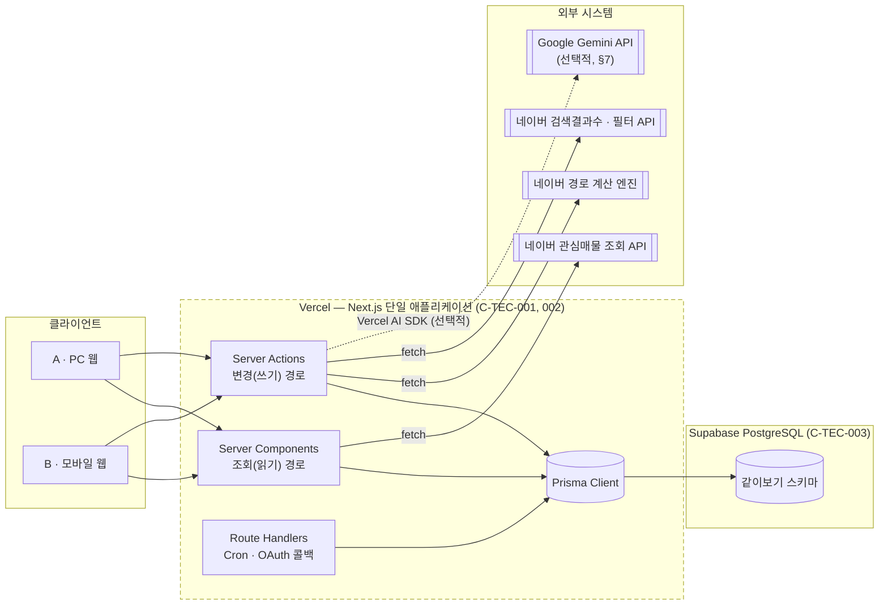
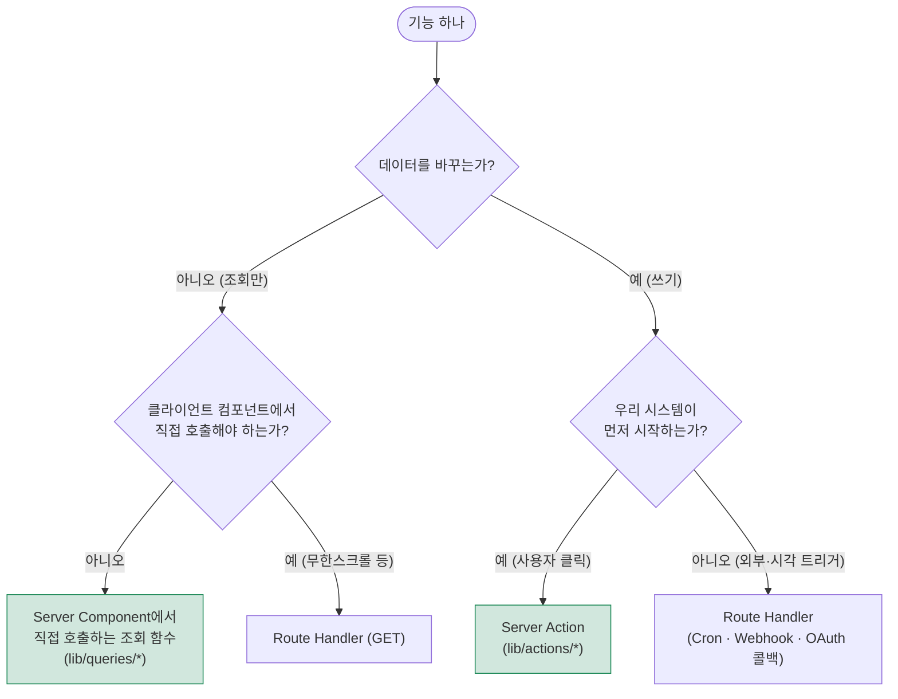
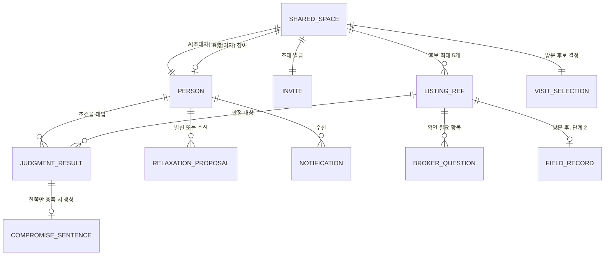
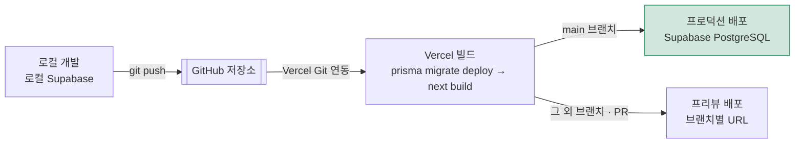

# [SRS 문서] 같이보기 — Next.js 기술스택 구현판 (한글)

# 소프트웨어 요구사항 명세서 (SRS)

**문서 ID:** SRS-JOINTHOME-NEXTJS-001

**개정 버전:** 1.0

**날짜:** 2026-08-24

**상위 문서:** 같이보기 PRD v1.0 (`같이보기-prd-v1_0.md`), 같이보기 SRS v1.0 (`같이보기-srs-v1_0.md`)

**이 문서의 성격:** 이 문서는 기존 최종본 `같이보기-srs-v1_0.md`(7개 마이크로서비스, 기술 중립적 서술)를 대체하지 않는다. **완전히 별개의 문서**로서, 아래 §1.5의 기술스택 제약(C-TEC-001~007)을 그대로 적용했을 때 **실제로 구현 가능한 형태**로 아키텍처·인터페이스·데이터 설계를 다시 쓴 것이다. **기능 요구사항(FR-01~25, REQ-FUNC-001~025 및 인수 기준)은 기존 SRS와 완전히 동일하며 이 문서에서 변경하지 않는다.** 달라지는 것은 오직 "그 기능을 어떤 기술로, 어떤 구조로 구현하는가"뿐이다.

---

## 문서 구성 안내

기존 SRS가 ISO/IEC/IEEE 29148:2018 양식(사내 표준 + 확장 8개 장)을 따랐다면, 이 문서는 **기술스택이 이미 확정된 구현 설계서**의 성격이 강해 아래처럼 재구성했다.

| 장 | 내용 | 기존 SRS와의 관계 |
| --- | --- | --- |
| 1. 서론 | 목적 · 배경 · 범위 · 정의 · **Assumptions & Constraints** | §1과 동일 범위, §1.5가 신규 |
| 2. 시스템 아키텍처 | Next.js 단일 모놀리스로의 재설계 | 기존 §3(마이크로서비스)을 대체하는 이 문서만의 아키텍처 |
| 3. 외부 인터페이스 요구사항 | Server Actions · Route Handlers 목록 | 기존 §6.1 API 목록을 기술스택에 맞게 재작성 |
| 4. 기능 요구사항 구현 매핑 | REQ-FUNC-001~025 → 구현 위치 | 요구사항 원문은 기존 SRS §4.1과 동일, 반복하지 않음 |
| 5. 비기능 요구사항 | Vercel/서버리스 제약을 반영한 재검토 + 기술스택발 신규 NFR | 기존 §4.2 확장 |
| 6. 데이터 설계 | ERD + Prisma 스키마 | 기존 §6.2 ERD와 동일 개체, Prisma 코드로 구체화 |
| 7. AI 통합 설계 | Vercel AI SDK + Gemini 연동 범위 | 기존 문서에 없던 신규 장(C-TEC-005·006 반영) |
| 8. 배포 및 운영 | Vercel 배포 파이프라인 | 신규 장(C-TEC-007 반영) |
| 9. 설계 제약 (ADR) | 기술스택 채택 결정 | 기존 §13(ADR)과 별도로, 기술스택 관련 결정만 기록 |
| 10. 요구사항 ↔ 문서 대응표 | 전체 추적성 | 기존 §5 추적성 매트릭스의 기술스택 버전 |

---

## 1. 서론

### 1.1 목적

본 문서는 네이버 부동산의 관심매물 저장 이후 구간에서 동작하는 2인 공동 주거 의사결정 기능(같이보기)을 **Next.js 단일 풀스택 애플리케이션**으로 구현하기 위한 소프트웨어 요구사항을 정의한다. 기존 SRS v1.0이 정의한 기능·비기능 요구사항의 "무엇을(What)"은 그대로 두고, 이 문서는 지정된 기술스택(§1.5) 아래에서 "어떻게(How)" 구현 가능한지를 정의한다.

### 1.2 배경

기존 SRS v1.0은 Shared Space Service · Condition Service · Judgment Engine · Compromise & Relaxation Service · Visit Selection Service · Field Record Service · Notification Service의 **7개 마이크로서비스**를 전제로 시스템 맥락을 서술했다. 이는 서비스 경계를 개념적으로 명확히 하기 위한 기술 중립적 표현이었다. 실제 구현 시에는 별도의 백엔드 서버군을 두지 않고, **Next.js 하나의 코드베이스와 하나의 Vercel 배포 단위**로 동일한 기능을 제공해야 한다는 기술적 요구가 있다(§1.5). 이 문서는 그 간극을 메운다.

### 1.3 범위

기능 범위는 기존 SRS v1.0 §1.2와 **완전히 동일**하다(단계 1 검증 코어 + 단계 2 종료점 완성, `[TBD]` 항목, 제외 항목 모두 동일). 아래는 이 문서가 추가로 다루는 범위만 명시한다.

**이 문서가 추가로 다루는 것**

- Next.js App Router 기준의 디렉터리 · 모듈 구조
- Server Actions / Route Handlers로의 API 재설계
- Prisma 스키마(코드 수준)
- Vercel 서버리스 제약을 반영한 비기능 요구사항 재검토
- Vercel AI SDK + Gemini 연동 설계(현재 MVP 범위에서 필수는 아님, §7 참조)
- Vercel 배포 파이프라인

**이 문서가 다루지 않는 것**

- 기능 요구사항의 신규 추가 · 변경 · 삭제 (기존 SRS §4.1, §4.2, §9 원문이 유일한 근거)
- 화면별 UI 인벤토리(PRD §17 원문 관리, 이 문서는 shadcn/ui 컴포넌트 매핑만 다룸)
- 네이버 내부 정책 확정 사항(§1.5, §5의 `[TBD]`는 기존 SRS의 `[TBD]`를 그대로 승계)

### 1.4 정의, 약어, 축약어

기존 SRS §1.3의 제품 용어(공유 객체, 사람귀속 조건, 판정, 미달량, 양보 문장 등)를 그대로 승계한다. 아래는 이 문서에서 추가로 쓰는 기술 용어만 정의한다.

| 용어 | 정의 |
| --- | --- |
| RSC (React Server Component) | 서버에서만 렌더링되는 React 컴포넌트. 이 문서에서 조회(읽기) 로직의 기본 구현 위치 |
| Server Action | `'use server'`로 선언된 서버 전용 함수. 클라이언트에서 직접 호출 가능하며 변경(쓰기) 로직의 기본 구현 위치 |
| Route Handler | `app/api/**/route.ts` 형태의 HTTP 핸들러. 외부 시스템이 우리를 호출하는 경우(웹훅 · Cron · OAuth 콜백)에만 사용 |
| ORM | Object-Relational Mapping. 이 문서에서는 Prisma를 지칭 |
| RLS (Row Level Security) | PostgreSQL/Supabase의 행 단위 접근 제어 기능 |
| Vercel Cron Job | `vercel.json`에 등록해 정해진 주기로 특정 Route Handler를 호출하는 Vercel 기능. 별도 배치 서버 없이 배치 작업을 대체 |
| Edge / Node 런타임 | Next.js가 각 라우트·액션에 지정할 수 있는 실행 환경. 이 문서는 DB 접근이 필요한 모든 경로에 Node 런타임을 지정한다 |

### 1.5 Assumptions & Constraints

본 절은 사용자가 확정한 기술스택 제약을 원문 그대로 반영한다. 이후 모든 장은 이 제약을 위반하지 않는 범위에서만 설계한다.

**(시스템 내부 — 단일 통합 프레임워크)**

| ID | 제약 |
| --- | --- |
| **C-TEC-001** | 모든 서비스는 Next.js (App Router) 기반의 단일 풀스택 프레임워크로 구현한다. (프론트엔드와 백엔드를 별도 분리하지 않는다.) |
| **C-TEC-002** | 서버 측 로직(DB 접근, API 호출 등)은 Next.js의 Server Actions 또는 Route Handlers를 사용하여 별도의 백엔드 서버 없이 구현한다. |
| **C-TEC-003** | 데이터베이스는 Prisma + 로컬 Supabase를 사용하여 로컬 개발환경을 구성하고 배포 시 Supabase(PostgreSQL)를 사용하여 인프라 설정 복잡도를 최소화한다. |
| **C-TEC-004** | UI 및 스타일링은 Tailwind CSS와 shadcn/ui를 사용하여 AI가 일관된 디자인 코드를 생성하도록 강제한다. |

**(시스템 외부 — 연결 및 AI 통합)**

| ID | 제약 |
| --- | --- |
| **C-TEC-005** | (AI 호출 기능이 포함된 경우) AI 기능은 별도 자체 서버 구축 없이 Vercel AI SDK를 사용하여 Next.js에서 외부 API를 호출하는 형태로 구현한다. |
| **C-TEC-006** | 외부 AI 서비스 API 호출은 Google Gemini API를 기본으로 사용하며, 환경 변수 설정만으로 모델 교체가 가능하도록 SDK의 표준 인터페이스를 준수한다. |
| **C-TEC-007** | 배포 및 인프라 관리는 Vercel 플랫폼으로 단일화하며, CI/CD 설정 없이 Git Push만으로 배포를 자동화한다. |

**파생 가정** — 이 제약들로부터, 이 문서 전체가 따르는 세 가지 설계 원칙이 도출된다.

1. **물리적으로 분리된 서비스는 없다.** 기존 SRS의 "7개 마이크로서비스"는 Next.js 앱 안의 **논리적 모듈(도메인 폴더)**로만 존재한다(§2.2).
2. **인프라를 늘리지 않는다.** 캐시 · 배치 · 큐가 필요한 곳에도 Redis · 메시지 브로커 같은 별도 인프라를 추가하지 않고, Prisma로 접근하는 Postgres 테이블과 Vercel Cron Job으로 해결한다(§5, §6).
3. **AI 호출은 선택적이다.** C-TEC-005의 "(AI 호출 기능이 포함된 경우)"라는 조건절을 그대로 존중해, 현재 기능 요구사항이 실제로 생성형 AI를 필요로 하는지부터 §7에서 판단한다.

---

## 2. 시스템 아키텍처

### 2.1 아키텍처 개관 — 단일 Next.js 모놀리스

**이 그림이 말하는 것:** 기존 SRS §3.1의 컨텍스트 다이어그램과 바깥 경계(외부 시스템)는 동일하다. 달라지는 것은 안쪽뿐이다 — 7개의 분리된 서비스 상자가 **하나의 Next.js 애플리케이션**으로 접힌다.



**핵심 판단** — 별도 백엔드 서버, 별도 API 게이트웨이, 별도 캐시 서버를 두지 않는다. Next.js 프로세스 하나가 렌더링과 데이터 접근을 모두 담당하며, Vercel이 이를 서버리스 함수로 자동 스케일링한다.

### 2.2 모듈 구조 — 7개 논리 도메인의 Next.js 매핑

기존 SRS §3의 7개 마이크로서비스는 물리적 서비스가 아니라 `lib/` 아래의 **논리 도메인 모듈**로 재배치된다. 서비스 이름과 책임(§1.3 서비스 책임과 경계, `같이보기-technical-design-v1_0.md` §1.3)은 그대로 유지되며, 서비스 간 화살표(§1.2 컴포넌트 다이어그램)는 모듈 간 함수 호출로 그대로 대응한다.

```text
app/
  invite/[code]/page.tsx              # B 진입점 — 링크 클릭 (UC-06, UC-07)
  spaces/[spaceId]/
    page.tsx                          # 공유 객체 대시보드
    conditions/page.tsx               # 조건 입력 (UC-02~04)
    judgments/page.tsx                # 판정 결과 목록 (UC-10)
    listings/[listingId]/page.tsx     # trade-off 상세 · 완화 (UC-11~15)
    visit-selection/page.tsx          # 방문 후보 선택 (UC-16)
    field-records/page.tsx            # 방문 전후 기록 — 단계 2 (UC-18, 19)
  api/
    auth/callback/route.ts            # Supabase Auth OAuth 콜백 (UC-08)
    cron/purge-expired-conditions/route.ts   # B 비로그인 조건 30일 삭제 (AC-07-03)
    cron/aggregate-metrics/route.ts   # §10.2 KPI 집계 배치

lib/
  actions/                            # Server Actions — 변경(쓰기) 전용
    shared-space.actions.ts           # ex-Shared Space Service
    condition.actions.ts              # ex-Condition Service
    compromise.actions.ts             # ex-Compromise & Relaxation Service
    visit-selection.actions.ts        # ex-Visit Selection Service
    field-record.actions.ts           # ex-Field Record Service
  queries/                            # Server Component에서 직접 호출하는 조회 함수
    shared-space.queries.ts
    judgment.queries.ts                # ex-Judgment Engine (조회 전용)
    notification.queries.ts           # ex-Notification Service (조회 전용)
  domain/                             # 순수 도메인 로직 (프레임워크 비의존)
    judgment/
      evaluators/                     # ConditionType별 평가기 (REQ-NF-007)
      status-classifier.ts
    compromise/
      sentence-generator.ts
      relaxation-simulator.ts
    visit-selection/
      two-round-selector.ts
  external/
    naver-listing.ts                  # 관심매물 조회 API 클라이언트
    naver-route.ts                    # 경로 계산 엔진 클라이언트 + route_cache 조회
    naver-search.ts                   # 검색결과수 · 필터 API 클라이언트
    gemini.ts                         # Vercel AI SDK 래퍼 (§7)
  db/
    prisma.ts                         # PrismaClient 싱글턴

prisma/
  schema.prisma                       # §6.2

components/
  ui/                                 # shadcn/ui 원본 컴포넌트 (C-TEC-004)
  domain/
    disclosed-value.tsx                # 전제 공개 포맷터 (REQ-NF-006)
    balanced-comparison.tsx            # A/B 균형 가드레일 렌더러 (REQ-FUNC-025)
```

**서비스 → 모듈 대응표**

| 기존 마이크로서비스(SRS §3) | Next.js 모듈 | 조회/변경 구현 위치 |
| --- | --- | --- |
| Shared Space Service | `actions/shared-space.actions.ts`, `queries/shared-space.queries.ts` | 초대·생성=Action, 맥락 조회=Query |
| Condition Service | `actions/condition.actions.ts` | 전량 Action(쓰기 위주) |
| Judgment Engine | `domain/judgment/*`, `queries/judgment.queries.ts` | 전량 Query(조회 전용, 판정은 조회 시 계산) |
| Compromise & Relaxation Service | `actions/compromise.actions.ts`, `domain/compromise/*` | 제안·수락=Action, 미리보기=Query 성격이나 완화 시뮬레이션 상태를 남기지 않으므로 Action으로 통일 |
| Visit Selection Service | `actions/visit-selection.actions.ts`, `domain/visit-selection/*` | 전량 Action |
| Field Record Service | `actions/field-record.actions.ts` | 전량 Action |
| Notification Service | `queries/notification.queries.ts` | 전량 Query(생성은 각 Action 내부에서 트리거) |

### 2.3 요청 처리 경로 선택 기준

**이 그림이 말하는 것:** 하나의 사용자 행동이 Server Component 직접 호출 / Server Action / Route Handler 중 무엇으로 구현되는지를 결정하는 흐름이다.



**판단 근거** — Next.js 공식 권장 패턴을 그대로 따른다. 조회는 왕복(round-trip) 없이 Server Component가 직접 데이터를 읽어 초기 HTML에 포함시키는 것이 가장 빠르고(REQ-NF-001), 쓰기는 Server Action의 낙관적 갱신(optimistic update)으로 사용자 체감 지연을 줄인다. Route Handler는 **우리 시스템이 요청을 시작하지 않는 경우**(Vercel Cron, OAuth 콜백)로만 한정해, 불필요한 REST API 계층을 만들지 않는다(C-TEC-002).

---

## 3. 외부 인터페이스 요구사항

### 3.1 Server Actions 목록

기존 SRS §6.1의 REST API 엔드포인트 표를 Server Action 함수 시그니처로 재작성한 것이다. 모든 함수는 파일 상단에 `'use server'`를 선언하고 Node 런타임에서 실행된다.

| 모듈 | Server Action | 대응 요구사항 |
| --- | --- | --- |
| `shared-space.actions.ts` | `createSharedSpaceDraft(listingIds: string[]): Promise<SharedSpace>` | REQ-FUNC-001 |
| `shared-space.actions.ts` | `inviteParticipant(spaceId: string, relationshipType: RelationshipType): Promise<InviteBundle>` | REQ-FUNC-005 |
| `condition.actions.ts` | `saveBudgetAndCommute(personId: string, input: ConditionInput): Promise<Condition>` | REQ-FUNC-002 |
| `condition.actions.ts` | `addRequiredCondition(personId: string, condition: ConditionInput): Promise<ConditionSet>` | REQ-FUNC-003 |
| `condition.actions.ts` | `addPreference(personId: string, text: string): Promise<void>` | REQ-FUNC-004 |
| `condition.actions.ts` | `addConfirmationItem(personId: string, item: string): Promise<void>` | REQ-FUNC-004 |
| `condition.actions.ts` | `saveTemporaryCondition(inviteCode: string, input: ConditionInput): Promise<void>` | REQ-FUNC-007 |
| `condition.actions.ts` | `migrateTemporaryCondition(inviteCode: string, personId: string): Promise<void>` | REQ-FUNC-007, 008 |
| `compromise.actions.ts` | `previewRelaxation(personId: string, conditionKey: string, delta: number): Promise<PreviewResult>` | REQ-FUNC-013 |
| `compromise.actions.ts` | `proposeRelaxation(proposerId: string, targetId: string, conditionKey: string): Promise<RelaxationProposal>` | REQ-FUNC-014 |
| `compromise.actions.ts` | `respondToRelaxationProposal(proposalId: string, decision: "ACCEPTED" \| "REJECTED"): Promise<void>` | REQ-FUNC-014 |
| `compromise.actions.ts` | `translateToSearchFilter(spaceId: string): Promise<FilterUiSpec>` | REQ-FUNC-016 |
| `visit-selection.actions.ts` | `submitVisitSelection(spaceId: string, personId: string, listingIds: string[]): Promise<SelectionRound>` | REQ-FUNC-017 |
| `field-record.actions.ts` | `recordBrokerAnswer(questionId: string, answer: string): Promise<void>` | REQ-FUNC-022 |
| `field-record.actions.ts` | `saveFieldRecord(listingId: string, checklist: Checklist, outcome: FieldRecordOutcome): Promise<void>` | REQ-FUNC-023 |

### 3.2 Route Handlers 목록

우리 시스템이 요청을 시작하지 않는 경우로만 한정한다(§2.3).

| 경로 | 메서드 | 트리거 | 대응 요구사항 |
| --- | --- | --- | --- |
| `/api/auth/callback` | GET | Supabase Auth OAuth 콜백 | REQ-FUNC-008 |
| `/api/cron/purge-expired-conditions` | GET(Vercel Cron) | 매일 1회 배치 | REQ-FUNC-007 AC-07-03, LIM-12 |
| `/api/cron/aggregate-metrics` | GET(Vercel Cron) | 매일 1회 배치 | SRS §10.2 KPI 집계 |
| `/api/webhooks/listing-status`(`[TBD]`) | POST | 네이버 매물 상태 변경 웹훅 — **네이버가 웹훅을 제공하는지 자체가 미확정**(LIM-05와 동일 사유) | REQ-FUNC-019 |

매물 소진 감지(REQ-FUNC-019)는 웹훅이 제공되지 않는 경우 `/api/cron/*`와 같은 폴링 방식 Vercel Cron Job으로 대체한다. 이 결정은 §9(ADR-TECH-06)에 근거를 남긴다.

### 3.3 외부 시스템 연동

| 외부 시스템 | 연동 방식 | 구현 위치 | 관련 제약 |
| --- | --- | --- | --- |
| 네이버 관심매물 조회 API | 서버 측 `fetch()`, 읽기 전용 | `lib/external/naver-listing.ts` | LIM-05, LIM-01 |
| 네이버 경로 계산 엔진 | `fetch()` + Postgres 캐시 테이블(`route_cache`) 우선 조회 | `lib/external/naver-route.ts` | REQ-NF-002, 003 |
| 네이버 검색결과수 · 필터 API | `fetch()`, 클릭 시에만 이동 링크 생성 | `lib/external/naver-search.ts` | LIM-07 |
| Google Gemini API | Vercel AI SDK(`ai` 패키지) `generateText()` / `streamText()`, 선택적 호출(§7) | `lib/external/gemini.ts` | C-TEC-005, 006 |

---

## 4. 기능 요구사항 구현 매핑

요구사항 원문(제목·우선순위·인수 기준)은 기존 SRS `같이보기-srs-v1_0.md` §4.1, §9와 완전히 동일하므로 반복하지 않는다. 아래는 각 요구사항이 이 기술스택에서 **어디에 구현되는지**만 매핑한다.

| 요구사항 | 구현 위치 | 처리 경로 | 관련 Prisma 모델 |
| --- | --- | --- | --- |
| REQ-FUNC-001 후보 구성 | `actions/shared-space.actions.ts` | Server Action | `SharedSpace`, `ListingRef` |
| REQ-FUNC-002 기본 조건 입력 | `actions/condition.actions.ts` | Server Action | `Person` |
| REQ-FUNC-003 조건 점진적 확장 | `actions/condition.actions.ts` | Server Action(변경 후 판정 재계산 트리거) | `Person` |
| REQ-FUNC-004 선호 · 확인 항목 분리 | `actions/condition.actions.ts` | Server Action | `Person` |
| REQ-FUNC-005 상대 초대 | `actions/shared-space.actions.ts` | Server Action | `Invite` |
| REQ-FUNC-006 B의 맥락 있는 진입 | `queries/shared-space.queries.ts` | Server Component 직접 호출 | `SharedSpace`, `ListingRef` |
| REQ-FUNC-007 B 조건 입력 및 임시 보관 | `actions/condition.actions.ts` + `/api/cron/purge-expired-conditions` | Server Action + Route Handler(Cron) | `Invite.tempCondition` |
| REQ-FUNC-008 결과 후 로그인 | Supabase Auth + `/api/auth/callback` | Route Handler | `Person` |
| REQ-FUNC-009 1인 빈 경로 | `queries/judgment.queries.ts` | Server Component 직접 호출 | `JudgmentResult` |
| REQ-FUNC-010A · 010B 자동 판정 | `domain/judgment/evaluators/*` | Query 내부 계산(요청 시 즉시 계산, 별도 배치 없음) | `JudgmentResult` |
| REQ-FUNC-011 후보 목록 그룹화 | `domain/judgment/status-classifier.ts` | Query 내부 계산 | `JudgmentResult` |
| REQ-FUNC-012 trade-off 설명 | `domain/compromise/sentence-generator.ts` | Query 내부 계산 | `CompromiseSentence` |
| REQ-FUNC-013 조건 완화 미리보기 | `actions/compromise.actions.ts` | Server Action(상태 저장 없이 즉시 반환) | — |
| REQ-FUNC-014 상대 조건 완화 제안 | `actions/compromise.actions.ts` | Server Action | `RelaxationProposal` |
| REQ-FUNC-015 전부 불충족 분기 | `domain/compromise/relaxation-simulator.ts` | Server Action 내부 계산 | — |
| REQ-FUNC-016 재탐색 필터 전달 | `actions/compromise.actions.ts` | Server Action(URL 생성만, 이동은 클라이언트) | — |
| REQ-FUNC-017 방문 후보 2개 결정 | `domain/visit-selection/two-round-selector.ts` | Server Action | `VisitSelection` |
| REQ-FUNC-018 조건 지속 · 자동 재판정 | `domain/judgment/*` | 매물 변경 시 Query가 재계산(캐시 무효화만 발생, 별도 재판정 Action 없음) | `JudgmentResult` |
| REQ-FUNC-019 매물 소진 처리 | `/api/cron/*` 폴링 또는 웹훅(§3.2) | Route Handler | `ListingRef`, `VisitSelection` |
| REQ-FUNC-020 상태 · 계산 오류 분리 | `domain/judgment/status-classifier.ts` | Query 내부 계산 | `JudgmentResult.status` |
| REQ-FUNC-021 숫자 전제 공개 | `components/domain/disclosed-value.tsx` | UI 컴포넌트(횡단) | — |
| REQ-FUNC-022 중개사 질문 카드 | `actions/field-record.actions.ts` | Server Action | `BrokerQuestion` |
| REQ-FUNC-023 방문 후 기록 | `actions/field-record.actions.ts` | Server Action | `FieldRecord` |
| REQ-FUNC-024 선택 · 조건 변경 알림 | 각 Action 내부에서 `Notification` 레코드 생성 + `queries/notification.queries.ts` | Action(쓰기) + Query(조회) | `Notification`(신규, §6.2) |
| REQ-FUNC-025 균형 제시 가드레일 | `components/domain/balanced-comparison.tsx` | UI 컴포넌트(횡단) | — |

---

## 5. 비기능 요구사항

기존 SRS §4.2의 REQ-NF-001~007을 Vercel/서버리스 관점에서 재검토하고, 이 기술스택을 선택함으로써 새로 생기는 요구사항(REQ-NF-008~010)을 추가한다. 신규 항목은 **기능을 추가하는 것이 아니라, 지정된 기술스택으로 기존 기능을 구현하기 위해 반드시 지켜야 하는 제약**이라는 점에서 §1.5의 직접적 파생물이다.

### 5.1 기존 비기능 요구사항 재검토

| ID | 원문 요구사항 | Vercel/Next.js 관점 재검토 |
| --- | --- | --- |
| REQ-NF-001 | E2E 응답 시간 ≤ 30초(P95, 초대→B 첫 화면) | Vercel 서버리스 함수 실행시간 한도(플랜별 상이, 무료 등급 기준 짧음) 내에서 여유가 크다. `같이보기-technical-design-v1_0.md` §8의 구간별 예산(합계 ≤22,000ms)을 그대로 따르되, 관심매물 API 응답이 느린 구간은 Suspense 스트리밍으로 첫 페인트를 먼저 보여줘 **체감** 지연을 줄인다 |
| REQ-NF-002 | 완화 재계산 시 경로 API 재호출 0회 | 통근 임계값 조정은 클라이언트 상태(React state)에서 즉시 재계산 — 서버 왕복 자체가 없다 |
| REQ-NF-003 | 경로 API 호출 캐시 확장성 | 별도 캐시 인프라(Redis 등) 없이 `route_cache` Postgres 테이블 + Prisma unique 제약으로 구현(ADR-TECH-04) |
| REQ-NF-004 | 외부 API 장애 시 폴백 | 모든 `lib/external/*` 클라이언트는 `try/catch`로 감싸 실패 시 `CALCULATION_FAILED` 상태를 반환, 요청을 막지 않는다 |
| REQ-NF-005 | 공유 객체 접근 제어 | Supabase RLS 정책으로 `person_id`가 `shared_space`의 A 또는 B가 아니면 행을 반환하지 않도록 DB 레벨에서 강제(애플리케이션 레벨 검증과 이중화) |
| REQ-NF-006 | 전제 없는 숫자 금지 | `<DisclosedValue>`(shadcn/ui 기반) 컴포넌트가 숫자를 감싸지 않으면 렌더링되지 않도록 컴포넌트 레벨에서 강제 |
| REQ-NF-007 | 판정 조건 타입 확장 패턴 | `domain/judgment/evaluators/` 폴더에 `ConditionType` enum별 평가기를 레지스트리 패턴으로 등록, 신규 타입 추가 시 이 폴더에 파일만 추가 |

### 5.2 기술스택이 새로 요구하는 비기능 요구사항

| ID | 요구사항 | 근거 |
| --- | --- | --- |
| **REQ-NF-008** | 배포는 Vercel Git 연동 자동배포로만 수행하며, 별도 CI/CD 파이프라인(GitHub Actions 등)을 구성하지 않는다 | C-TEC-007 |
| **REQ-NF-009** | Gemini API 호출이 실패하거나 지연되면 결정론적 템플릿 생성 경로(§7.1)로 즉시 폴백하며, 사용자 요청을 막지 않는다 | C-TEC-005, 006 · "빈 화면 없음"과 동일 원칙 |
| **REQ-NF-010** | 로컬 개발 환경(Prisma + 로컬 Supabase)과 배포 환경(Supabase PostgreSQL)의 스키마는 Prisma Migrate로만 동기화하며, 두 환경에 별도 수동 스키마 변경을 적용하지 않는다 | C-TEC-003 |

---

## 6. 데이터 설계

### 6.1 ERD

기존 SRS §6.2와 개체 구성이 동일하다(§7 의도가 없음을 확인하기 위해 재수록). 이 문서에서 추가되는 개체는 `NOTIFICATION`과 `ROUTE_CACHE`뿐이며, 둘 다 기존 SRS가 텍스트로만 서술했던 것(Notification Service의 알림, §10.2의 경로 API 캐시)을 이 기술스택에서 구체적인 테이블로 구현하는 것이다.



개체별 속성은 §6.2(Prisma 스키마)에서 코드 수준으로 정의하므로 표로 중복하지 않는다.

### 6.2 Prisma 스키마

```prisma
// prisma/schema.prisma
generator client {
  provider = "prisma-client-js"
}

datasource db {
  provider = "postgresql"
  url      = env("DATABASE_URL") // 로컬: 로컬 Supabase, 배포: Supabase PostgreSQL (C-TEC-003)
}

enum Role {
  A
  B
}

enum ConditionType {
  UPPER_BOUND   // 예산 · 통근시간 · 역 도보
  LOWER_BOUND   // 전용면적
  PRESENCE      // 주차
  EXACT_MATCH   // 매물 유형
}

enum JudgmentStatus {
  MET
  UNMET
  CONFIRMATION_NEEDED
  CALCULATION_FAILED
  NOT_APPLICABLE
}

enum RelaxationProposalStatus {
  PENDING
  ACCEPTED
  REJECTED
}

enum FieldRecordOutcome {
  KEEP
  HOLD
  EXCLUDE
}

enum NotificationType {
  CONDITION_CHANGED
  RELAXATION_PROPOSED
  LISTING_CHANGED
  VISIT_SELECTION_CHANGED
}

model Person {
  id                 String   @id @default(cuid())
  sharedSpace        SharedSpace? @relation("SpacePersons", fields: [sharedSpaceId], references: [id])
  sharedSpaceId      String?
  role               Role
  relationshipType   String?  // A가 초대 시 1회 선택
  budgetCap          Int      // 항상 필수
  commutes           Boolean  @default(false)
  commuteOrigin      String?
  commuteMode        String?  // 대중교통 기본, 자차 선택
  requiredConditions Json     @default("[]") // 0~4개, {key, operator, value}[]
  preferences        Json     @default("[]") // 자유 문장 0~3개, 판정 미사용
  confirmationItems  Json     @default("[]") // 상한 없음, 판정 미사용
  createdAt          DateTime @default(now())
  updatedAt          DateTime @updatedAt

  judgmentResults      JudgmentResult[]
  relaxationsProposed  RelaxationProposal[] @relation("Proposer")
  relaxationsTargeted  RelaxationProposal[] @relation("Target")
  notifications        Notification[]
}

model SharedSpace {
  id               String   @id @default(cuid())
  connectionStatus String   @default("AWAITING_B")
  persons          Person[] @relation("SpacePersons")
  listings         ListingRef[]
  invite           Invite?
  visitSelection   VisitSelection?
  createdAt        DateTime @default(now())
}

model Invite {
  code               String   @id @default(cuid())
  sharedSpace        SharedSpace @relation(fields: [sharedSpaceId], references: [id])
  sharedSpaceId      String   @unique
  linkUrl            String
  tempCondition      Json?    // B 비로그인 임시조건
  lastAccessedAt     DateTime @default(now())
  migratedAt         DateTime?
  createdAt          DateTime @default(now())

  @@index([lastAccessedAt]) // REQ-FUNC-007 AC-07-03 배치 삭제용
}

model ListingRef {
  id                 String   @id @default(cuid())
  sharedSpace        SharedSpace @relation(fields: [sharedSpaceId], references: [id])
  sharedSpaceId      String
  coordinates        String
  deposit            Int
  rent               Int
  maintenanceFee     Int
  area               Float
  listingType        String
  parking            Boolean
  walkToStationMin   Int
  transactionStatus  String   @default("ACTIVE")

  judgmentResults    JudgmentResult[]
  brokerQuestions    BrokerQuestion[]
  fieldRecord        FieldRecord?
}

model JudgmentResult {
  id            String         @id @default(cuid())
  person        Person         @relation(fields: [personId], references: [id])
  personId      String
  listing       ListingRef     @relation(fields: [listingId], references: [id])
  listingId     String
  conditionKey  String
  status        JudgmentStatus
  gapAmount     String?
  compromiseSentence CompromiseSentence?
  updatedAt     DateTime       @updatedAt

  @@unique([personId, listingId, conditionKey])
}

model CompromiseSentence {
  id               String   @id @default(cuid())
  judgmentResult   JudgmentResult @relation(fields: [judgmentResultId], references: [id])
  judgmentResultId String   @unique
  losingPersonId   String
  lostCondition    String
  relativeRank     Int      // 후보 5개 안 상대 순위, 절대값 아님
}

model RelaxationProposal {
  id             String                   @id @default(cuid())
  proposer       Person                   @relation("Proposer", fields: [proposerId], references: [id])
  proposerId     String
  target         Person                   @relation("Target", fields: [targetId], references: [id])
  targetId       String
  conditionKey   String
  proposedValue  String                   // 실제 미달량에서 산출
  status         RelaxationProposalStatus @default(PENDING)
  createdAt      DateTime                 @default(now())
}

model VisitSelection {
  id                String   @id @default(cuid())
  sharedSpace       SharedSpace @relation(fields: [sharedSpaceId], references: [id])
  sharedSpaceId     String   @unique
  round             Int      @default(1) // 최대 2라운드
  finalCandidates   Json?    // 최대 2개, 분할 포함
  updatedAt         DateTime @updatedAt
}

model BrokerQuestion {
  id                 String @id @default(cuid())
  listing            ListingRef @relation(fields: [listingId], references: [id])
  listingId          String
  confirmationItem   String
  answer             String?
  status             String @default("PENDING")
}

model FieldRecord {
  id         String              @id @default(cuid())
  listing    ListingRef          @relation(fields: [listingId], references: [id])
  listingId  String              @unique
  checklist  Json                // 층간소음 등 6항목, 전부 표시
  outcome    FieldRecordOutcome?
}

model Notification {
  id         String           @id @default(cuid())
  person     Person           @relation(fields: [personId], references: [id])
  personId   String
  type       NotificationType
  payload    Json
  readAt     DateTime?
  createdAt  DateTime         @default(now())

  @@index([personId, readAt])
}

// REQ-NF-002, 003 — 별도 캐시 인프라 없이 Postgres로 구현(ADR-TECH-04)
model RouteCache {
  id           String   @id @default(cuid())
  origin       String
  coordinates  String
  commuteMode  String
  durationMin  Int
  computedAt   DateTime @default(now())

  @@unique([origin, coordinates, commuteMode])
}
```

### 6.3 로컬-프로덕션 환경 전략

| 단계 | 환경 | 명령 |
| --- | --- | --- |
| 로컬 개발 | 로컬 Supabase(Docker) | `supabase start` → `prisma migrate dev` |
| 스키마 변경 | 로컬에서 마이그레이션 파일 생성 | `prisma migrate dev --name <변경명>` |
| 배포 | Supabase(PostgreSQL) | `prisma migrate deploy`(Vercel 빌드 스텝에 포함) |
| 시드 데이터 | 로컬 전용 | `prisma db seed` |

두 환경의 스키마가 갈리지 않도록, 수동 SQL 실행은 금지하고 모든 스키마 변경은 `prisma/migrations/`를 거친다(REQ-NF-010).

---

## 7. AI 통합 설계 (Vercel AI SDK + Gemini)

### 7.1 현재 MVP의 AI 사용 범위

먼저 짚어야 할 것 — **기존 기능 요구사항(REQ-FUNC-001~025)은 생성형 AI(LLM) 호출을 필수로 요구하지 않는다.** 양보 문장(REQ-FUNC-012)은 PRD §14.1이 정한 고정 구조("[누가][무엇을][얼마나] 감수하고, [대신]...")를 따르는 **결정론적 템플릿**이며, "AI"라는 제품명·PRD §15의 "AI 역할"은 조건 대조·설명 로직 자체를 가리키는 제품 프레이밍이지 LLM 호출을 의미하지 않는다. 총점·복합순위를 금지하는 `decisions/0001`과 판정의 재현 가능성 요구(REQ-FUNC-020)는 비결정적인 LLM 출력과 근본적으로 상충한다(ADR-TECH-05).

따라서 C-TEC-005("AI 호출 기능이 **포함된 경우**")의 조건절은 현재 MVP에서는 충족되지 않는다. `CompromiseSentenceGenerator`(§4의 `domain/compromise/sentence-generator.ts`)는 순수 템플릿 함수로 구현하며 외부 API를 호출하지 않는다.

### 7.2 확장 지점 설계

그럼에도 C-TEC-005·006을 완전히 반영하기 위해, **향후 생성형 AI가 실제로 필요해질 경우**를 대비한 확장 지점을 표준 인터페이스로 미리 설계해 둔다.

| 확장 후보 | 트리거 조건 | Gemini 사용 방식 |
| --- | --- | --- |
| 양보 문장의 표현 다양화 | 고정 템플릿이 반복적으로 어색하다는 사용성 피드백 발생 시 | 템플릿이 산출한 구조화 데이터(누가·무엇을·얼마나)를 Gemini에 전달해 문장만 다시 쓰게 하고, **숫자·조건·감수 관계는 템플릿이 검증한 값만 사용** — LLM이 사실을 새로 만들지 않는다 |
| 자연어 조건 질의(예: "역 5분 이내인데 방음 되는 집") | PRD가 자연어 입력을 범위에 포함할 경우 | 자연어 → 구조화 조건(§4.1 REQ-FUNC-002~004 스키마) 파싱에만 사용, 파싱 결과는 사용자에게 확인받은 뒤에만 저장 |

```typescript
// lib/external/gemini.ts — Vercel AI SDK 표준 인터페이스(C-TEC-006)
import { google } from "@ai-sdk/google";
import { generateText } from "ai";

const MODEL = process.env.AI_MODEL_ID ?? "gemini-1.5-flash"; // 환경 변수만으로 모델 교체

export async function rewriteCompromiseSentence(structuredFacts: CompromiseFacts) {
  try {
    const { text } = await generateText({
      model: google(MODEL),
      prompt: buildPromptFromFacts(structuredFacts), // 숫자·조건은 facts에서만 가져옴
    });
    return text;
  } catch {
    return renderTemplateSentence(structuredFacts); // REQ-NF-009 폴백
  }
}
```

`@ai-sdk/google`을 다른 `@ai-sdk/*` 프로바이더로 교체해도 `generateText()` 호출 코드는 바뀌지 않는다 — 이것이 C-TEC-006이 요구하는 "SDK 표준 인터페이스 준수"다.

---

## 8. 배포 및 운영

### 8.1 Vercel 배포 파이프라인



별도 CI/CD 설정(GitHub Actions 등)을 두지 않는다(REQ-NF-008, C-TEC-007). 빌드 스텝의 `prisma migrate deploy`가 배포 환경 스키마를 최신 마이그레이션으로 맞춘다(REQ-NF-010).

### 8.2 환경 변수 관리

| 변수 | 용도 | 환경 |
| --- | --- | --- |
| `DATABASE_URL` | Prisma 접속 문자열 | 로컬(로컬 Supabase) / 배포(Supabase) 각기 다른 값 |
| `NEXT_PUBLIC_SUPABASE_URL`, `SUPABASE_ANON_KEY` | Supabase Auth · 클라이언트 SDK | 공통 |
| `GOOGLE_GENERATIVE_AI_API_KEY` | Gemini API 키 | §7 확장 지점 활성화 시에만 필요 |
| `AI_MODEL_ID` | 모델 교체용(C-TEC-006) | 기본값 `gemini-1.5-flash` |
| `NAVER_LISTING_API_*`, `NAVER_ROUTE_API_*`, `NAVER_SEARCH_API_*` | 네이버 내부 API 인증 | `[TBD]` — LIM-05~08과 동일하게 정책 확정 대기 |

Vercel 프로젝트 설정의 Environment Variables 화면에서만 관리하며, `.env` 파일은 로컬 전용이고 저장소에 커밋하지 않는다.

### 8.3 모니터링

기존 SRS §10.3(관측 항목 및 알림)의 항목을 이 스택에서 관측하는 방법만 매핑한다. 지표 정의·임계치는 §10.3 원문과 동일하며 `[TBD]`도 승계한다.

| 관측 항목(SRS §10.3) | 이 스택에서의 구현 |
| --- | --- |
| E2E 응답 시간(REQ-NF-001) | Vercel Analytics + Server Action/Route Handler 실행 시간 로그 |
| 외부 API 오류율 · 지연 | `lib/external/*`의 try/catch 블록에서 `Notification`·별도 로그 테이블에 기록 |
| 경로 API 캐시 히트율 | `route_cache` 조회 시 히트/미스를 `/api/cron/aggregate-metrics`가 집계 |
| KPI 이벤트(SRS §10.2) | Server Action 내부에서 `Notification`과 별도로 이벤트를 남기는 대신, 이 문서 범위에서는 각 Action이 직접 관련 테이블(`JudgmentResult`, `VisitSelection` 등)의 타임스탬프를 이벤트 소스로 재사용 — 별도 이벤트 테이블 도입은 트래픽이 실측된 이후 재검토(`[TBD]`) |

---

## 9. 설계 제약 (ADR) — 기술스택 채택 결정

기존 SRS §13의 ADR(`decisions/0001~0004`)은 제품 결정이며 이 문서에서 다루지 않는다. 아래는 **이 기술스택 버전에서만 유효한** 기술 결정을 기록한다.

| ID | 결정 | 맥락 | 채택 근거 | 기각한 대안 | 되돌림 비용 |
| --- | --- | --- | --- | --- | --- |
| **ADR-TECH-01** | 7개 마이크로서비스를 물리적으로 분리하지 않고 Next.js 단일 모놀리스 안의 논리 모듈로 구현한다 | C-TEC-001, 002가 단일 프레임워크·서버 없음을 명시 | 소규모 팀·빠른 반복에는 배포 단위 하나가 유리하고, 서비스 간 네트워크 호출 오버헤드가 없다 | 서비스별 독립 배포(기존 SRS §3 그대로) — 트래픽이 실제로 서비스별로 불균형해질 때만 재검토 | 중간 — Judgment Engine처럼 계산량이 큰 모듈만 별도 함수/서비스로 분리 가능(모듈 경계를 이미 §2.2에서 나눠 둠) |
| **ADR-TECH-02** | 캐시·배치 전용 인프라(Redis, 메시지 브로커)를 추가하지 않고 Postgres 테이블 + Vercel Cron Job으로 대체한다 | C-TEC-003이 인프라 설정 복잡도 최소화를 요구 | `route_cache` 테이블 하나로 REQ-NF-002·003을 충족하며, 이미 있는 Prisma 연결을 재사용 | Redis 캐시 — 별도 프로비저닝·비용 발생 | 낮음 — 캐시 테이블을 Redis로 교체해도 호출부(`naver-route.ts`) 인터페이스는 유지 가능 |
| **ADR-TECH-03** | 조회(읽기)는 Server Component 직접 호출, 변경(쓰기)은 Server Action, 외부 기동 이벤트만 Route Handler로 구분한다 | Next.js App Router의 권장 패턴과 C-TEC-002가 일치 | 불필요한 REST 계층 제거, 왕복 감소로 REQ-NF-001에 유리 | 모든 것을 REST Route Handler로 통일 — 기존 SRS §6.1과 형태는 비슷하지만 Next.js에서는 왕복이 늘어남 | 낮음 — 필요 시 특정 Query를 Route Handler로 노출 가능 |
| **ADR-TECH-04** | 생성형 AI(Gemini)는 핵심 판정·양보 문장 로직에는 사용하지 않고, 표현 다양화 등 선택적 확장 지점에만 표준 인터페이스로 연결한다 | `decisions/0001`(총점 금지)·REQ-FUNC-020(재현 가능한 5분류 판정)이 요구하는 결정론성과 LLM의 비결정성이 상충 | 판정 결과가 매번 달라지면 §9(수용 기준)의 SLO(오분류 0건 등)를 보장할 수 없다 | 판정·양보 문장 생성 자체를 LLM에 위임 — 재현성·검증 가능성 상실 | 낮음 — §7.2 확장 지점이 이미 표준 인터페이스로 준비되어 있어 필요 시점에 연결만 하면 됨 |
| **ADR-TECH-05** | 매물 소진 감지(REQ-FUNC-019)는 네이버 웹훅 제공 여부가 불확실하므로 1차로 Vercel Cron Job 폴링으로 구현한다 | LIM-05와 동일하게 네이버 내부 API 사정이 우리가 결정할 수 없는 영역 | 웹훅 유무와 무관하게 항상 동작하는 폴백을 먼저 확보 | 웹훅 전제 설계만 하고 폴링을 준비하지 않음 — 웹훅 미제공 시 기능 자체가 동작 불가 | 낮음 — 웹훅이 확정되면 `/api/webhooks/listing-status`를 추가하고 폴링 주기만 늘리면 됨 |

---

## 10. 요구사항 ↔ 문서 대응표

| 요구사항/영역 | 이 문서 | 기존 SRS(`같이보기-srs-v1_0.md`) | 기존 TDD(`같이보기-technical-design-v1_0.md`) |
| --- | --- | --- | --- |
| 기능 요구사항 원문 | §4(매핑만) | §4.1, §9(원문) | §2.2(유스케이스 명세) |
| 비기능 요구사항 원문 | §5.1(재검토) | §4.2(원문) | §8(성능 예산) |
| 시스템 아키텍처 | §2(Next.js 모놀리스) | §3(마이크로서비스, 기술 중립적) | §1(컨텍스트 · 컴포넌트) |
| 데이터 모델 | §6(ERD + Prisma) | §6.2(ERD), §6.3(Java enum) | §3.1(ERD), §3.2(상태 다이어그램) |
| API/인터페이스 | §3(Server Actions/Route Handlers) | §6.1(REST 엔드포인트) | §4(클래스 다이어그램) |
| 검증 · KPI | §8.3(관측 매핑만) | §10(원문) | §7(계측 파이프라인) |
| 설계 결정 | §9(기술 ADR) | §13(제품 ADR, `decisions/0001~0004`) | — |

---

**SRS-JOINTHOME-NEXTJS-001 · v1.0 · 2026-08-24**

상위 문서: `같이보기-srs-v1_0.md` · `같이보기-prd-v1_0.md` · `같이보기-technical-design-v1_0.md`
