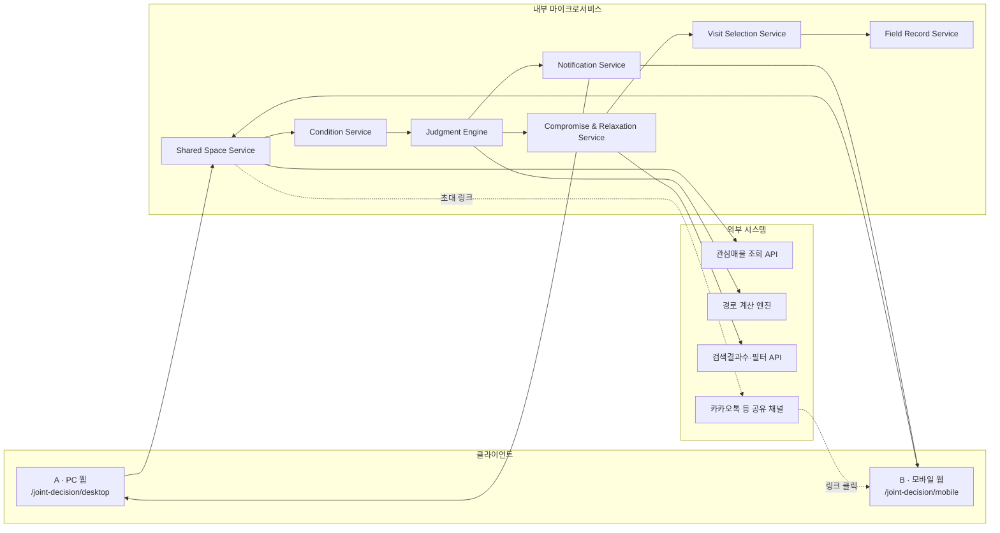
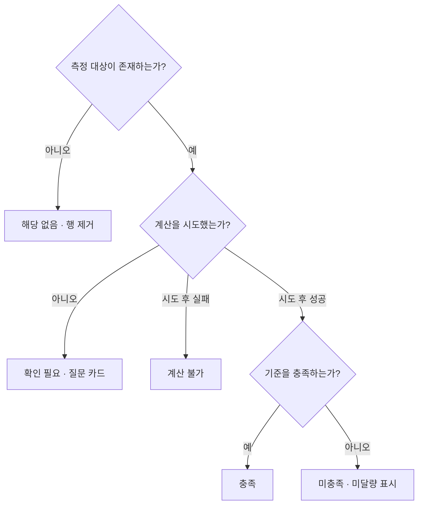
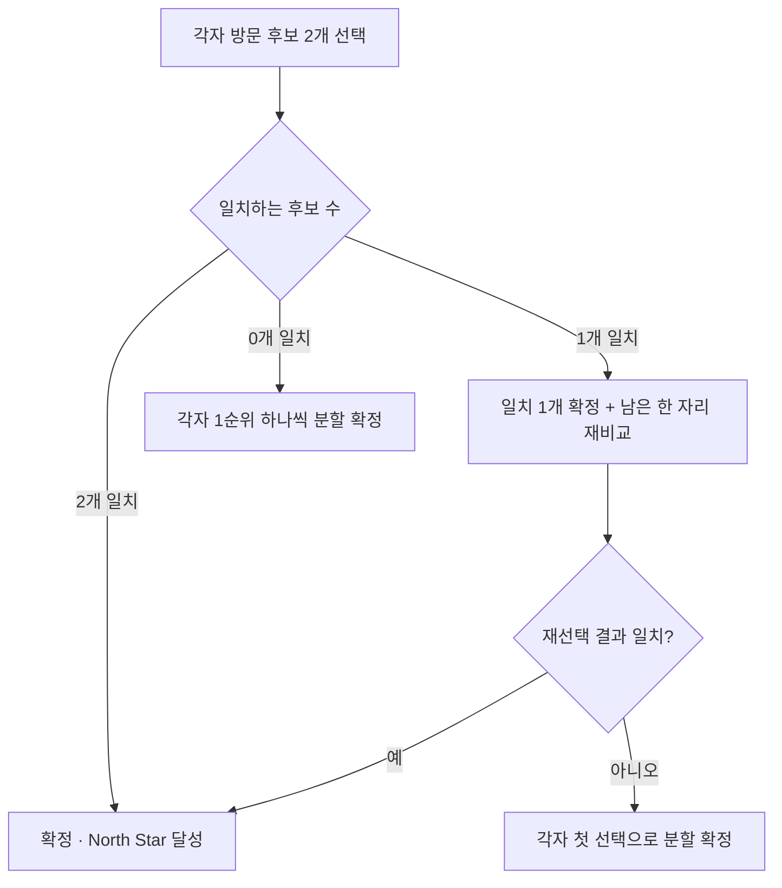
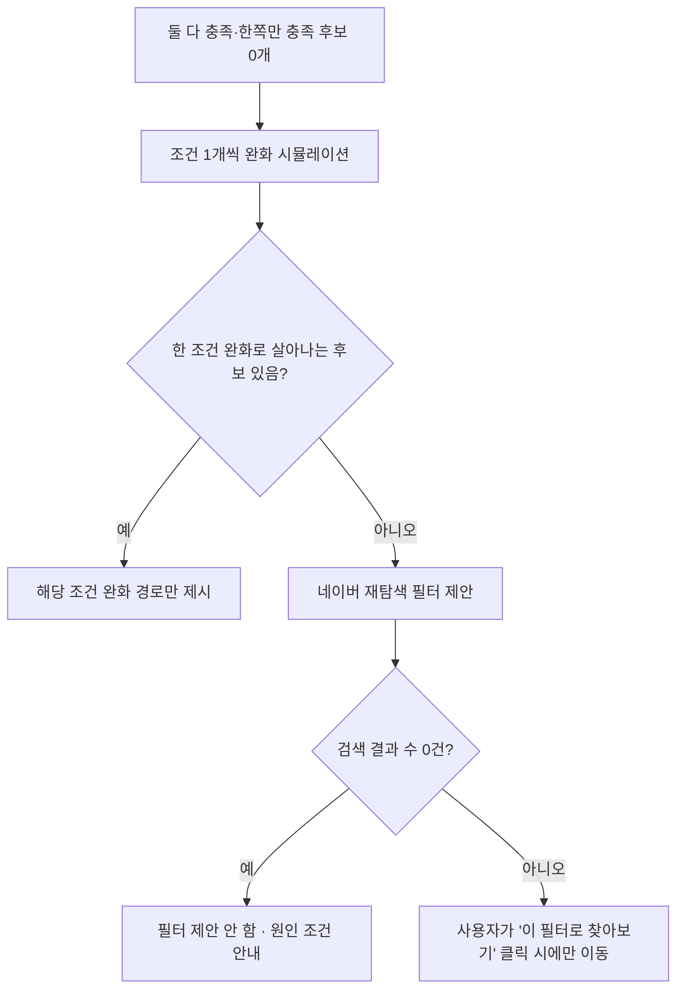
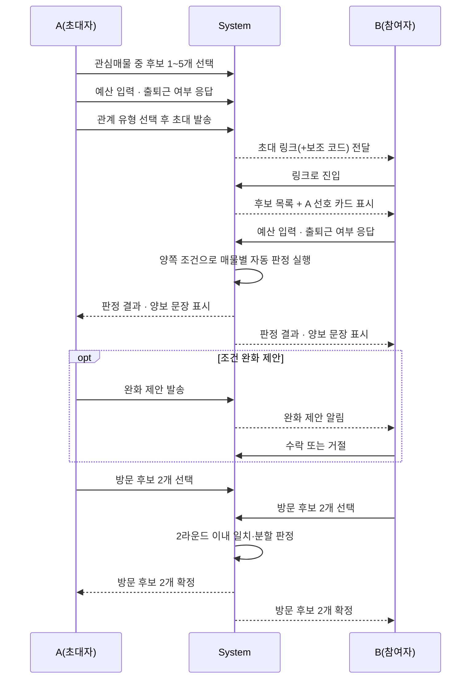
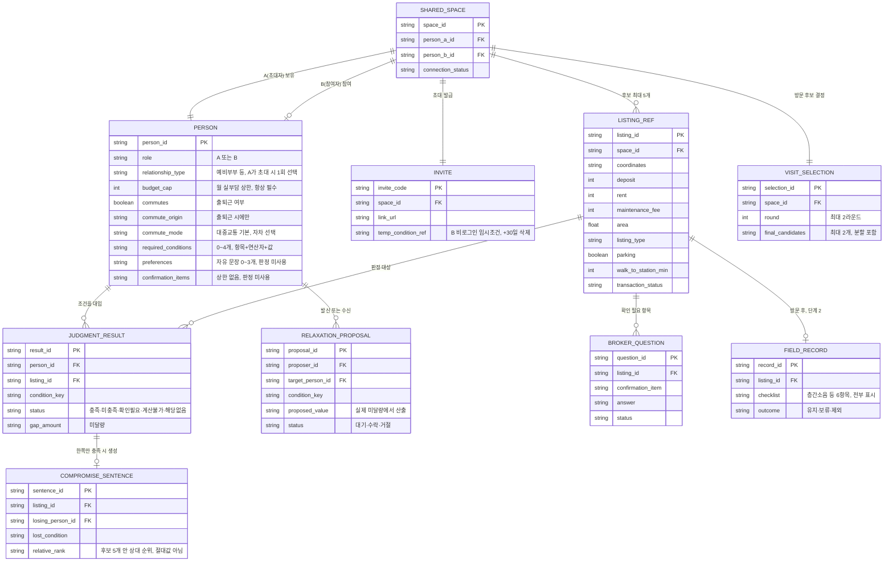
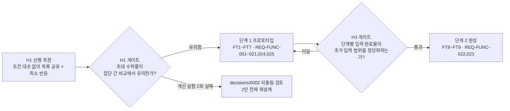

# [SRS 문서] 같이보기 (한글)

# 소프트웨어 요구사항 명세서 (SRS)

**문서 ID:** SRS-JOINTHOME-MVP-001

**개정 버전:** 1.0

**날짜:** 2026-08-24

**표준:** ISO/IEC/IEEE 29148:2018

**상위 문서:** 네이버 부동산 공동 주거 의사결정 PRD v1.0 (`같이보기-prd-v1_0.md`)

---

## 문서 구성 안내

본 문서의 **1–7장은 사내 SRS 양식**(AD-Core-Platform SRS)을 그대로 따른다. **8–14장은 PRD v1.0이 이미 확정한 내용 중 해당 양식에 대응 절이 없는 것**을 ISO/IEC/IEEE 29148:2018 §9.6에 근거해 확장한 장이다.

| 장 | 구분 | 근거 |
| --- | --- | --- |
| 1 ~ 7 | 사내 표준 양식 | AD-Core-Platform SRS 양식 |
| 8. 사용자 특성 | 확장 | 29148 §9.6.6 User characteristics |
| 9. 수용 기준 명세 | 확장 | 29148 §9.6.10 d) Specified requirements |
| 10. 검증 및 확인 계획 | 확장 | 29148 §9.6.19 Verification |
| 11. 제약 사항 | 확장 | 29148 §9.6.7 Limitations |
| 12. 가정 및 의존성 | 확장 | 29148 §9.6.8 Assumptions and dependencies |
| 13. 설계 제약 (ADR) | 확장 | 29148 §9.6.16 Design constraints |
| 14. 요구사항 배분 및 릴리스 계획 | 확장 | 29148 §9.6.9 Apportioning of requirements |

확장은 **PRD가 이미 정한 내용에 한정**한다. PRD에 없는 항목은 신설하지 않으며, 양식상 필요하나 PRD가 정하지 않은 값은 `[TBD]`로 표기한다. KPI/성공 지표는 §10.1에 측정 계획으로 편입했고, 화면별 인벤토리(PRD §17)는 SRS가 다루는 행동 수준보다 세부적인 UI 설계 자료라 계속 PRD 원문에서만 관리한다.

---

## 1. 서론

### 1.1 목적

본 문서는 ISO/IEC/IEEE 29148:2018 표준에 따라, **네이버 부동산의 관심매물 저장 이후 구간에서 동작하는 2인 공동 주거 의사결정 기능(같이 고르기)**의 소프트웨어 요구사항을 정의한다.

현재 경로는 네이버 부동산에서 매물을 저장한 뒤 카카오톡으로 링크를 공유하고, 각자 지도·계산기·메모로 통근과 비용을 따로 비교하다가 의견이 모이지 않으면 다시 탐색으로 돌아가는 구조다(PRD §3.1). 본 시스템은 매물 탐색 자체를 새로 만들지 않고 **저장 이후 공동 결정 구간**만 담당하며(PRD §3.2), 두 사람이 각자 조건을 한 번씩 입력하면 관심매물별 충돌·양보 지점을 나란히 보여주고, 총점이나 AI의 정답 추천 없이 **이번에 보러 갈 집 2개**를 두 사람이 직접 정하도록 돕는 것이 본 소프트웨어의 존재 이유다(PRD §7.1). 본 SRS는 PRD v1.0의 기능·비기능 요구사항, 데이터 모델, 검증 계획을 구현 가능한 요구사항 단위로 재정리한 것이며, PRD의 결정 사항(`decisions/0001~0004`)을 임의로 변경하지 않는다.

### 1.2 범위

**✅ 해야 할 것 — 단계 1 (검증 코어)**

- 조건은 매물이 아니라 **사람에 귀속**되는 조건 모델 (예산 필수 + 출퇴근 조건부 + 추가 필수 0~4개)
- 조건별 실제값·임계값·미달량을 산출하는 **매물별 자동 판정** (충족/미충족/확인 필요/계산 불가/해당 없음 5분류)
- 한쪽만 충족하는 매물에 대한 **양보 문장(Trade-off) 생성** — 총점·순위 없이 문장으로만 서술
- 실제 미달량 기준의 **조건 완화 시뮬레이션**과 상대 조건 완화 제안(제안-수락 구조)
- 전부 불충족 시 **완화 우선 → 네이버 재탐색 필터 제안**의 2단계 구제 로직
- 겹치면 확정, 안 겹치면 최대 2라운드 내 분할로 종료하는 **방문 후보 2개 결정 프로토콜**
- 네이버 관심매물 조회·경로 계산·검색 결과 수·필터 전달을 포함한 **네이버 내부 API 연동** (매물 데이터 쓰기 없음)
- A(PC 웹)·B(모바일 웹) 분리 접근과 **B 비로그인 임시 조건 보관(+30일)**

**✅ 해야 할 것 — 단계 2 (종료점 완성)**

- 방문 전 **중개사 질문 카드** (확인 필요 항목 답변 시 판정 갱신)
- 방문 후 **공통 체크리스트**와 유지·보류·제외 기록

**🔶 결정 필요 (TBD — 범위에는 있으나 아직 확정 안 됨)**

- 네이버 내부 정책 확인: 관심매물 API 권한, 공유 객체 비로그인 열람, 검색 count·필터 파라미터
- 개인정보 상대 공개 범위, 관계 종료 시 데이터 처리 정책
- 재탐색 필터 제안 화면(A-13b-2) 상세, North Star 측정 기간(7일) 적정성

**❌ 제외할 것**

- 매물 DB 신규 구축, 독립 매물 검색·탐색·추천, 아이소크론 기반 후보 생성
- 종합점수·공동 적합도·자동 랭킹, AI의 최종 선택·정답 추천·강제 타협
- 계약·대출 실행, 등기·보증보험·전자계약, 법률·금융 판단 대행
- 3인 이상 공동 의사결정, 부모–자녀·주도–승인형 관계, 비용 분담 비율·방 배정
- (전체 목록·근거는 PRD §9 Non-goals, §23 Out of Scope 참조)

### 1.3 정의, 약어, 축약어

| 용어 | 정의 |
| --- | --- |
| 공유 객체 (Shared Space) | 두 사람의 비교 후보(매물 ID 최대 5개)와 연결 상태를 담는 프로젝트 데이터. A의 개인 관심매물이 아니다 |
| 사람귀속 조건 (Person-owned Condition) | 조건은 매물이 아니라 사람에 저장된다는 설계 원칙(`decisions/0003`) |
| 판정 (Judgment) | 충족·미충족·확인 필요·계산 불가·해당 없음 5개 상태로 구성된 조건별 대조 결과 |
| 미달량 (Gap Amount) | 사용자 기준값과 매물 실제값의 차이 (예: `+월 15만`, `−7㎡`) |
| 양보 문장 (Compromise Sentence) | 한쪽만 충족 매물에서 누가 무엇을 얼마나 감수하는지 서술하는 문장. 총점으로 합산하지 않는다(`decisions/0001`) |
| 2라운드 분할 프로토콜 | 방문 후보 2개 결정 시 겹치면 확정, 안 겹치면 최대 2라운드 내 분할로 끝내는 규칙(`decisions/0004`) |
| North Star | 초대 발송 후 7일 내 방문 후보 2개가 확정된 비율 |
| MoSCoW | Must / Should / Could / Won't 우선순위 분류 |
| 가드레일 지표 | 주요 지표 개선이 부작용(헛방문, 이탈, 재입력)을 유발하는지 감시하는 보조 지표 |
| E2E 응답 시간 | 초대 링크 클릭부터 B의 첫 화면 응답까지 걸리는 시간 |
| 확인 필요 (Confirmation Needed) | 매물 데이터에 없어 자동 판정할 수 없는 항목의 상태. 미충족으로 처리하지 않는다 |
| 계산 불가 (Calculation Failed) | 경로·데이터 계산을 시도했지만 실패한 상태. 미충족과 구분한다 |
| SP | Sprint. 본 문서에서 1 SP = 2주 |
| 가설 (H1~H5) | PRD가 아직 검증하지 않은, 요구사항의 전제가 되는 명제. 반증되면 관련 요구사항이 바뀐다(§12.2) |

---

## 2. 이해관계자

| 역할 | 이름 / 부서 | 책임 |
| --- | --- | --- |
| 기획 매니저 (PM) | 기획팀 | 요구사항 수집 및 MoSCoW 우선순위 결정(PRD §16.2) |
| 기획 분석가 (IT) | 기획팀 | 상세 요구사항 문서화, PRD-SRS 정합성 관리 |
| 개발팀 리드 | 백엔드 팀 리드 | 판정 엔진·가드레일 설계 검토 및 승인 |
| 개발 엔지니어 | 백엔드 개발자 | 조건 모델·판정·완화·방문 후보 로직 구현 및 단위 테스트 |
| 시스템 운영자 | 운영팀 | 네이버 내부 API 연동(관심매물·경로·검색) 배포 및 모니터링 |
| 서비스 운영자 | 운영팀 | 단계 2(중개사 질문·방문 후 기록) 운영, 상대 이탈 예외 처리 |
| 사업관리 및 정책 담당자 | 사업팀 | 네이버 정책 확인(비로그인 열람, 검색 count), 개인정보 공개 범위 정책 |
| 데이터/그로스 매니저 | 그로스팀 | North Star·가드레일 지표 측정, H1·H2-b-2 검증 설계 |

---

## 3. 시스템 맥락 및 인터페이스

- **클라이언트 애플리케이션**
    1. A · PC 웹 `https://realestate.example.com/joint-decision/desktop`
    2. B · 모바일 웹 `https://realestate.example.com/joint-decision/mobile`
- **내부 마이크로서비스**
    - Shared Space Service : 공유 객체 생성, 초대 링크·코드 발급, 연결 상태 관리
    - Condition Service : 사람귀속 조건(예산·출퇴근·필수조건·선호·확인항목) 저장
    - Judgment Engine : 조건별 자동 판정 및 5분류 상태 산출
    - Compromise & Relaxation Service : 양보 문장 생성, 조건 완화 시뮬레이션, 완화 제안
    - Visit Selection Service : 방문 후보 2개 결정, 2라운드 분할 프로토콜
    - Field Record Service : 중개사 질문 카드(단계 2), 방문 후 체크리스트 기록
    - Notification Service : 상대 조건 입력·변경·제안·후보 변경 알림
- **외부 시스템**
    - 네이버 부동산 관심매물 조회 API (읽기 전용, 쓰기 없음)
    - 네이버 지도 경로 계산 엔진 (대중교통·자차)
    - 네이버 부동산 검색 결과 수·필터 전달 API
    - 카카오톡 등 초대 링크 전달 채널 (시스템 경계 밖, 통제 대상 아님)

### 3.1 시스템 맥락도



---

## 4. 구체적 요구사항

### 4.1 기능 요구사항

| ID | 제목 | 출처 | 우선순위 | 유형 | 검증 방식 | 인수 기준 | 상태 | 담당자 |
| --- | --- | --- | --- | --- | --- | --- | --- | --- |
| **REQ-FUNC-001** | 관심매물에서 비교 후보 구성 | PRD §13.2, FR-01 | Must Have | Functional | 1) 후보 1~5개 등록 테스트<br>2) 6개째 차단 검증<br>3) QA 검증 | A가 관심매물 중 1~5개를 선택하면 해당 매물 ID만 포함한 공유 객체 초안을 구성하고, 6개째는 추가되지 않아야 한다 | Proposed | 개발 엔지니어 |
| **REQ-FUNC-002** | A 기본 조건 입력 | PRD §12.2, §12.6, FR-02 | Must Have | Functional | 1) 예산 필수 검증<br>2) 출퇴근 분기 테스트<br>3) QA 검증 | 예산 입력 없이는 기본 입력을 완료할 수 없고, `출근함` 선택 시에만 출근지·이동수단을 요청해야 한다 | Proposed | 개발 엔지니어 |
| **REQ-FUNC-003** | 점진적 조건 확장 | PRD §12.3, §12.6, FR-03 | Should Have | Functional | 1) 0~4개 추가 조건 테스트<br>2) 사람귀속 재판정 검증<br>3) QA 검증 | 추가 필수 조건은 한 번에 하나씩 추가되고 즉시 재판정되며, 사용자당 4개를 초과할 수 없다 | Proposed | 개발 엔지니어 |
| **REQ-FUNC-004** | 선호·확인 항목 분리 | PRD §12.4, FR-04 | Should Have | Functional | 1) 선호 카드 저장 테스트<br>2) 확인 항목 분리 검증<br>3) QA 검증 | 선호(0~3개)는 판정에 사용하지 않는 사람 카드로, 확인 필요 항목은 중개사 질문 목록으로 분리 저장해야 한다 | Proposed | 개발 엔지니어 |
| **REQ-FUNC-005** | 2인 초대 | PRD §11 단계6, `decisions/0002`, FR-05 | Must Have | Functional | 1) 링크·코드 발급 테스트<br>2) 대기 상태 검증<br>3) QA 검증 | 관계 유형 선택 후 링크(기본)·코드(보조)를 발급하고, B 참여 전까지 대기 상태를 표시해야 한다 | Proposed | 개발 엔지니어 |
| **REQ-FUNC-006** | B의 맥락 있는 진입 | PRD §11 단계7, FR-06 | Must Have | Functional | 1) 진입 순서 테스트<br>2) 맥락 표시 검증<br>3) QA 검증 | B가 조건을 입력하기 전에 후보 최대 5개와 A의 선호 카드를 먼저 표시해야 한다 | Proposed | 개발 엔지니어 |
| **REQ-FUNC-007** | B 조건 입력 및 임시 보관 | PRD §21.1, FR-07 AC-07 | Should Have | Functional | 1) 초대 코드별 격리 테스트<br>2) 30일 삭제 검증<br>3) QA 검증 | 비로그인 B의 조건은 초대 코드 단위로 격리 저장하고, 로그인 시 이관하며, 마지막 접근 +30일에 삭제해야 한다 | Proposed | 개발 엔지니어 |
| **REQ-FUNC-008** | 결과 후 로그인 | PRD §11.1, FR-08 | Should Have | Functional | 1) 로그인 시점 테스트<br>2) 정책 연동 검증<br>3) QA 검증 | 비로그인 열람이 허용되는 한, B는 첫 결과 확인 후 저장·재방문 시점에만 로그인을 요청받아야 한다 | Proposed | 개발 엔지니어 |
| **REQ-FUNC-009** | 1인 빈 경로 | `decisions/0002`, FR-09 | Must Have | Functional | 1) B 미참여 시나리오 테스트<br>2) 1인분 표시 검증<br>3) QA 검증 | B 미참여 상태에서도 A는 자신의 조건만으로 실부담·판정(해당 시 통근)을 볼 수 있어야 한다 | Proposed | 개발 엔지니어 |
| **REQ-FUNC-010A** | 매물별 자동 판정 — 예산(상한형) | PRD §12.3, §18.3, FR-10a | Must Have | Functional | 1) 예산 판정 단위 테스트<br>2) 계산불가 분리 검증<br>3) QA 검증 | 예산 상한과 실부담을 대조해 충족·미충족(미달량 포함) 또는 계산 불가를 산출해야 한다. FR-11 이하 판정 소비 기능의 선행 조건이다 | Proposed | 개발팀 리드 |
| **REQ-FUNC-010B** | 매물별 자동 판정 — 확장 조건(통근·역도보·면적·주차·매물유형) | PRD §12.3, §18.3, FR-10b | Must Have | Functional | 1) 4개 조건 유형 단위 테스트<br>2) 확인 필요 분리 검증<br>3) QA 검증 | 통근·역도보(상한형)·전용면적(하한형)·주차(유무형)·매물유형(일치형)을 대조해 충족·미충족·확인 필요를 산출해야 한다. REQ-FUNC-010A 완료 후 착수한다(PRD §16.2) | Proposed | 개발팀 리드 |
| **REQ-FUNC-011** | 후보 목록 그룹화 | PRD §13.2, FR-11 | Must Have | Functional | 1) 3분류 그룹화 테스트<br>2) 확인 필요 배지 검증<br>3) QA 검증 | 후보를 둘 다 충족/한쪽만 충족/둘 다 불충족으로 그룹화하고, 확인 필요는 별도 배지로 표시해야 한다 | Proposed | 개발팀 리드 |
| **REQ-FUNC-012** | 매물 상세 trade-off 설명 | PRD §14.1, §14.2, FR-12 | Must Have | Functional | 1) 양보 문장 생성 테스트<br>2) 조건 순서 고정 검증<br>3) QA 검증 | 한쪽만 충족 매물에 대해 양보 주체·조건·미달량과 후보 5개 안 상대적 이점을 문장으로 표시하고, 총점·추천 결론을 붙이지 않아야 한다 | Proposed | 개발팀 리드 |
| **REQ-FUNC-013** | 조건 완화 미리보기 | PRD §14.3, FR-13 | Should Have | Functional | 1) A/B안 동시표시 테스트<br>2) 실시간 미리보기 검증<br>3) QA 검증 | 완화폭은 실제 미달량에서만 산출하고, A안·B안을 항상 동시에 보여주며 등급 변화를 즉시 미리보기해야 한다 | Proposed | 개발 엔지니어 |
| **REQ-FUNC-014** | 상대 조건 완화 제안 | PRD §14.3, FR-14 | Should Have | Functional | 1) 제안-수락 흐름 테스트<br>2) 미적용 상태 검증<br>3) QA 검증 | 상대 조건은 직접 변경할 수 없고 제안만 가능하며, 상대가 수락하기 전까지 판정에 적용되지 않아야 한다 | Proposed | 개발 엔지니어 |
| **REQ-FUNC-015** | 전부 불충족 분기 | PRD §14.3, FR-15 | Could Have | Functional | 1) 완화 시뮬레이션 테스트<br>2) 2조건 동시완화 금지 검증<br>3) QA 검증 | 둘 다 충족·한쪽만 충족 후보가 0개이면 조건 1개씩 완화를 시뮬레이션하고, 살아나는 후보가 있으면 그 경로만 제시해야 한다 | Proposed | 개발 엔지니어 |
| **REQ-FUNC-016** | 재탐색 필터 전달 | PRD §21.7, FR-16 | Could Have | Functional | 1) 필터 변환 규칙 테스트<br>2) 자동 적용 금지 검증<br>3) QA 검증 | 완화로 회복 불가할 때만 네이버 검색 필터를 제안하고, 사용자가 직접 클릭했을 때만 이동해야 한다 | Proposed | 개발 엔지니어 |
| **REQ-FUNC-017** | 방문 후보 2개 결정 | `decisions/0004`, FR-17 | Must Have | Functional | 1) 2라운드 분할 로직 테스트<br>2) 순환 방지 검증<br>3) QA 검증 | 각자 후보 2개 선택 결과가 겹치면 확정하고, 안 겹치면 최대 2라운드 내에 분할로 종료해야 한다(§4.1.2 다이어그램 참조) | Proposed | 개발 엔지니어 |
| **REQ-FUNC-018** | 조건 지속·자동 재판정 | PRD §12.1, FR-18 | Should Have | Functional | 1) 매물 교체 테스트<br>2) 사람 조건 유지 검증<br>3) QA 검증 | 매물이 추가·교체돼도 사람 조건은 유지되며 새 매물에 자동 재적용돼야 한다 | Proposed | 개발 엔지니어 |
| **REQ-FUNC-019** | 매물 소진 처리 | PRD §18.1, FR-19 | Should Have | Functional | 1) 거래완료 감지 테스트<br>2) 복귀 로직 검증<br>3) QA 검증 | 거래완료·삭제 매물은 즉시 후보에서 제거하고, 확정 후보였다면 남은 한 자리 선택으로 복귀해야 한다 | Proposed | 개발 엔지니어 |
| **REQ-FUNC-020** | 상태·계산 오류 분리 | PRD §18.3, FR-20 | Must Have | Functional | 1) 4상태 분류 테스트<br>2) 오분류 회귀 검증<br>3) QA 검증 | 미충족/계산 불가/확인 필요/해당 없음을 서로 대체하지 않고 §4.1.1 결정 트리에 따라 산출해야 한다 | Proposed | 개발팀 리드 |
| **REQ-FUNC-021** | 숫자 전제 공개 | PRD §19.5, FR-21 | Must Have | Functional | 1) 전제 표시 테스트<br>2) 금지 표현 검증<br>3) QA 검증 | 실부담·교통비·금리 기반 수치는 예외 없이 기준 시점·가정·한계를 함께 표시해야 한다 | Proposed | 개발 엔지니어 |
| **REQ-FUNC-022** | 중개사 질문 카드 | PRD §12.4, 단계 2, FR-22 | Could Have | Functional | 1) 질문 목록 생성 테스트<br>2) 답변 반영 검증<br>3) QA 검증 | 확인 필요 항목을 방문 전 질문 목록으로 표시하고, 답변 기록 시 보류 상태를 갱신해야 한다 | Proposed | 서비스 운영자 |
| **REQ-FUNC-023** | 방문 후 기록 | PRD §12.4, 단계 2, FR-23 | Could Have | Functional | 1) 체크리스트 저장 테스트<br>2) 유지·보류·제외 검증<br>3) QA 검증 | 공통 체크리스트 6항목을 전부 표시하고, 유지·보류·제외 상태를 매물에 귀속된 사용자 생성 기록으로 저장해야 한다 | Proposed | 서비스 운영자 |
| **REQ-FUNC-024** | 선택·조건 변경 알림 | PRD §17.4, FR-24 | Should Have | Functional | 1) 알림 트리거 테스트<br>2) 전달 지연 검증<br>3) QA 검증 | 조건 입력·변경, 완화 제안, 후보 변경·소진이 발생하면 상대에게 해당 상태 변화를 알려야 한다 | Proposed | 시스템 운영자 |
| **REQ-FUNC-025** | 균형 제시 가드레일 | PRD §13.3, `decisions/0001`, FR-25 | Must Have | Functional | 1) 시각적 비중 검증<br>2) 총점·추천배지 금지 회귀 테스트<br>3) QA 검증 | 판정·trade-off·최종 비교 화면은 A/B를 동일 비중으로 표시하고, 총점·추천 배지·복합 순위·AI 최종 선택을 표시하지 않아야 한다 | Proposed | 개발팀 리드 |

#### 4.1.1 판정 상태 결정 로직 (REQ-FUNC-010A, 010B, 020)



#### 4.1.2 방문 후보 2라운드 분할 로직 (REQ-FUNC-017)



#### 4.1.3 전부 불충족 시 완화·재탐색 분기 (REQ-FUNC-015, 016)



#### 4.1.4 핵심 시나리오 시퀀스



### 4.2 비기능 요구사항

| ID | 제목 | 출처 | 우선순위 | 유형 | 검증 방식 | 인수 기준 | 상태 | 담당자 |
| --- | --- | --- | --- | --- | --- | --- | --- | --- |
| **REQ-NF-001** | E2E 응답 시간 ≤ 30초 (초대→B 첫 화면) | PRD §20.1, `04-benchmarks.md` | Must Have | Performance | 초대~B 첫 화면 응답시간 부하 테스트 | 초대 클릭부터 B의 첫 화면(B-02) 응답까지 P95 기준 30초를 넘지 않아야 한다 | Proposed | 시스템 운영자 |
| **REQ-NF-002** | 조건 완화 재계산 시 경로 API 재호출 0회 | PRD §20.1, §21.8 | Must Have | Performance | 완화 조작 1건당 API 호출 카운트 테스트 | 통근 임계값만 조정하는 완화 조작은 경로 API를 재호출하지 않고 클라이언트에서 즉시 등급을 재계산해야 한다 | Proposed | 개발 엔지니어 |
| **REQ-NF-003** | 처리량·비용 확장성: 경로 API 호출 캐시 | PRD §20.4 | Should Have | Scalability | `(출근지, 매물좌표, 이동수단)` 키 캐시 히트율 부하 테스트 | 1쌍당 약 39회, 규모 확대 시 월 최대 157만 호출까지 캐시로 흡수해 재진입·완화 시 호출 0회를 유지해야 한다 | Proposed | 개발팀 리드 |
| **REQ-NF-004** | 가용성: 네이버 내부 API 의존 및 폴백 | PRD §20.2, §18.3 | Must Have | Reliability | 외부 API 장애 주입 테스트 | 관심매물·경로·검색 API 실패 시 해당 결과를 미충족이 아닌 계산 불가로 표시하고, 관심매물 조회 실패 시 기능 진입을 막고 재시도를 안내해야 한다 | Proposed | 시스템 운영자 |
| **REQ-NF-005** | 보안: 공유 객체 접근 제어 | PRD §20.3 | Must Have | Security | 접근 제어·초대 코드 무작위성 감사 | 사람 조건은 초대된 두 사람만 열람 가능해야 하며, B 비로그인 조건은 초대 코드 단위로 격리하고 마지막 접근 +30일에 삭제해야 한다 | Proposed | 개발팀 리드 |
| **REQ-NF-006** | 정확성: 전제 없는 숫자 금지 | PRD §20.5, §19.5 | Must Have | Accuracy | 숫자 표시 화면 전수 검사 | 추정 수치는 예외 없이 기준 시점·가정·한계를 동반해야 하며, 확정값처럼 표시하지 않아야 한다 | Proposed | 개발 엔지니어 |
| **REQ-NF-007** | 유지보수성: 판정 조건 타입 확장 패턴 | PRD §12.3 | Could Have | Maintainability | 신규 조건 추가 코드 리뷰 | 신규 판정 조건은 상한형·하한형·유무형·일치형 4개 `ConditionType` enum 패턴을 통해 코드 변경을 최소화해 추가할 수 있어야 한다 | Proposed | 개발 엔지니어 |

---

## 5. 추적성 매트릭스

| 요구사항 ID | 모듈 | 구현 클래스 | 테스트 케이스 ID |
| --- | --- | --- | --- |
| REQ-FUNC-001 | Shared Space Service | CandidateListingSelector | TC-FUNC-001 |
| REQ-FUNC-002 | Condition Service | BudgetConditionValidator | TC-FUNC-002 |
| REQ-FUNC-003 | Condition Service | RequiredConditionEditor | TC-FUNC-003 |
| REQ-FUNC-004 | Condition Service | PreferenceCardStore / ConfirmationItemStore | TC-FUNC-004 |
| REQ-FUNC-005 | Shared Space Service | InviteCodeIssuer | TC-FUNC-005 |
| REQ-FUNC-006 | Shared Space Service | SharedSpaceContextRenderer | TC-FUNC-006 |
| REQ-FUNC-007 | Condition Service | TemporaryConditionStore | TC-FUNC-007 |
| REQ-FUNC-008 | Notification Service | PostResultLoginPrompt | TC-FUNC-008 |
| REQ-FUNC-009 | Shared Space Service | SoloPathRenderer | TC-FUNC-009 |
| REQ-FUNC-010A | Judgment Engine | BudgetJudgmentEvaluator | TC-FUNC-010A |
| REQ-FUNC-010B | Judgment Engine | ExtendedConditionEvaluator | TC-FUNC-010B |
| REQ-FUNC-011 | Judgment Engine | CandidateGroupClassifier | TC-FUNC-011 |
| REQ-FUNC-012 | Compromise & Relaxation Service | CompromiseSentenceGenerator | TC-FUNC-012 |
| REQ-FUNC-013 | Compromise & Relaxation Service | RelaxationSimulator | TC-FUNC-013 |
| REQ-FUNC-014 | Compromise & Relaxation Service | RelaxationProposalCoordinator | TC-FUNC-014 |
| REQ-FUNC-015 | Compromise & Relaxation Service | AllUnmetFallbackHandler | TC-FUNC-015 |
| REQ-FUNC-016 | Compromise & Relaxation Service | SearchFilterTranslator | TC-FUNC-016 |
| REQ-FUNC-017 | Visit Selection Service | TwoRoundVisitSelector | TC-FUNC-017 |
| REQ-FUNC-018 | Judgment Engine | ConditionPersistenceReapplier | TC-FUNC-018 |
| REQ-FUNC-019 | Visit Selection Service | ListingExhaustionHandler | TC-FUNC-019 |
| REQ-FUNC-020 | Judgment Engine | StatusClassifier | TC-FUNC-020 |
| REQ-FUNC-021 | All Services | PremiseDisclosureFormatter | TC-FUNC-021 |
| REQ-FUNC-022 | Field Record Service | BrokerQuestionCardService | TC-FUNC-022 |
| REQ-FUNC-023 | Field Record Service | FieldRecordStore | TC-FUNC-023 |
| REQ-FUNC-024 | Notification Service | ConditionChangeNotifier | TC-FUNC-024 |
| REQ-FUNC-025 | All Services | BalanceGuardrailRenderer | TC-FUNC-025 |
| REQ-NF-001 | API Gateway | ResponseTimeMonitor | TC-NF-001 |
| REQ-NF-002 | Judgment Engine | RouteCacheClient | TC-NF-002 |
| REQ-NF-003 | Route Infra | RouteCacheClient / RouteQuotaMonitor | TC-NF-003 |
| REQ-NF-004 | API Gateway | ExternalApiFallbackHandler | TC-NF-004 |
| REQ-NF-005 | Shared Space Service | AccessControlGuard | TC-NF-005 |
| REQ-NF-006 | All Services | PremiseDisclosureFormatter | TC-NF-006 |
| REQ-NF-007 | Judgment Engine | ConditionType Registry | TC-NF-007 |

---

## 6. 부록

### 6.1 API 엔드포인트 목록

| 서비스 유형 | 메서드 | 엔드포인트 | 설명 |
| --- | --- | --- | --- |
| **Shared Space Service** | POST | `/api/v1/shared-spaces` | 관심매물 1~5개로 공유 객체 초안 생성 |
| **Shared Space Service** | POST | `/api/v1/shared-spaces/{spaceId}/invite` | 초대 링크(기본)·코드(보조) 발급 |
| **Shared Space Service** | GET | `/api/v1/shared-spaces/{spaceId}` | 공유 객체 조회 (B 진입 시 맥락 표시) |
| **Condition Service** | PUT | `/api/v1/shared-spaces/{spaceId}/persons/{role}/conditions` | 예산·출퇴근·필수 조건 저장 |
| **Condition Service** | POST | `/api/v1/shared-spaces/{spaceId}/persons/{role}/preferences` | 선호 카드 추가 |
| **Condition Service** | POST | `/api/v1/shared-spaces/{spaceId}/persons/{role}/confirmation-items` | 확인 필요 항목 추가 |
| **Judgment Engine** | GET | `/api/v1/shared-spaces/{spaceId}/judgments` | 후보별 조건 판정 결과 조회 |
| **Compromise & Relaxation Service** | GET | `/api/v1/shared-spaces/{spaceId}/listings/{listingId}/compromise` | 양보 문장 조회 |
| **Compromise & Relaxation Service** | POST | `/api/v1/shared-spaces/{spaceId}/relaxation-proposals` | 조건 완화 제안 발송 |
| **Compromise & Relaxation Service** | PATCH | `/api/v1/relaxation-proposals/{proposalId}` | 완화 제안 수락·거절 |
| **Visit Selection Service** | POST | `/api/v1/shared-spaces/{spaceId}/visit-selections` | 방문 후보 2개 선택(라운드별) |
| **Field Record Service** | GET | `/api/v1/shared-spaces/{spaceId}/broker-questions` | 중개사 질문 카드 조회 |
| **Field Record Service** | POST | `/api/v1/listings/{listingId}/field-records` | 방문 후 체크리스트·유지/보류/제외 기록 |
| **Notification Service** | GET | `/api/v1/persons/{personId}/notifications` | 상대 상태 변화 알림 조회 |

### 6.2 엔터티 관계도



### 6.3 데이터 모델 정의

```java
// 조건 판정 타입 (PRD §12.3)
public enum ConditionType {
    UPPER_BOUND("상한형", "예산 · 통근시간 · 역 도보"),
    LOWER_BOUND("하한형", "전용면적"),
    PRESENCE("유무형", "주차"),
    EXACT_MATCH("일치형", "매물 유형");
}

// 판정 상태 (PRD §18.3)
public enum JudgmentStatus {
    MET("충족"),
    UNMET("미충족"),
    CONFIRMATION_NEEDED("확인 필요"),
    CALCULATION_FAILED("계산 불가"),
    NOT_APPLICABLE("해당 없음");
}

// 후보 그룹 (PRD §13.2)
public enum CandidateGroup {
    BOTH_MET("둘 다 충족"),
    ONE_SIDE_MET("한쪽만 충족"),
    BOTH_UNMET("둘 다 불충족");
}

// 관계 유형 (PRD §4.2)
public enum RelationshipType {
    ENGAGED_OR_NEWLYWED("예비부부·신혼부부"),
    COHABITING("동거"),
    FRIEND_ROOMMATE("친구·룸메이트");
}

// 출퇴근 이동수단 (PRD §12.2)
public enum CommuteMode {
    PUBLIC_TRANSIT("대중교통", true),
    PRIVATE_CAR("자차", false);
}

// 조건 완화 제안 상태 (PRD §14.3, FR-14)
public enum RelaxationProposalStatus {
    PENDING("대기"),
    ACCEPTED("수락"),
    REJECTED("거절");
}

// 방문 후보 결정 라운드 (decisions/0004)
public enum VisitSelectionRound {
    ROUND_1(1, "각자 2개 선택"),
    ROUND_2(2, "일치 1개 시 남은 한 자리 재비교");

    private final int roundNumber;
    private final String description;
}

// 방문 후 현장 기록 결과 (PRD §12.4)
public enum FieldRecordOutcome {
    KEEP("유지"),
    HOLD("보류"),
    EXCLUDE("제외");
}
```

### 6.4 비즈니스 규칙 요약

1. **조건 귀속**: 조건은 매물이 아니라 사람에 저장한다. 매물이 바뀌어도 조건은 유지된다 (`decisions/0003`)
2. **총점 금지**: 매물에 종합점수·공동 적합도·복합 순위를 부여하지 않는다 (`decisions/0001`)
3. **5분류 판정 원칙**: 미충족·계산 불가·확인 필요·해당 없음·충족을 서로 대체하지 않고 §4.1.1 결정 트리를 따른다
4. **완화 원칙**: 완화폭은 실제 미달량에서만 산출하고, A/B안을 항상 동시에 제시하며, 두 조건을 동시에 완화하지 않는다
5. **방문 후보 결정**: 겹치면 확정, 안 겹치면 최대 2라운드 내 분할로 종료한다. 투표·순위·자동 선택으로 대체하지 않는다 (`decisions/0004`)
6. **상대 조건 변경**: 제안만 가능하며 상대가 수락하기 전까지 판정에 적용하지 않는다
7. **매물 데이터 쓰기 금지**: 매물 데이터는 필요한 필드만 읽고 쓰지 않으며, 별도 매물 DB를 구축하지 않는다
8. **균형 가드레일**: A/B는 동일한 조건 순서와 시각적 비중으로 표시하고, 총점·추천 배지·AI의 최종 선택을 표시하지 않는다

### 6.5 데이터베이스 스키마 개요

```sql
-- 핵심 테이블 요약
persons                    -- 사람귀속 조건: 예산, 출퇴근, 필수조건, 선호, 확인항목
shared_spaces               -- 공유 객체: 후보 매물 ID 최대 5개, A/B 연결 상태
invites                     -- 초대 링크·코드, B 비로그인 임시 조건 참조(+30일)
listing_refs                -- 네이버 매물 참조(필요 필드만, 원본 미저장)
judgment_results            -- 조건별 판정 결과·미달량 (계산 결과, 캐시 가능)
compromise_sentences        -- 양보 문장(한쪽만 충족 시에만 생성)
relaxation_proposals        -- 조건 완화 제안 및 수락·거절 상태
visit_selections             -- 방문 후보 선택 라운드·최종 확정 결과
broker_questions             -- 방문 전 중개사 질문 카드(단계 2)
field_records                -- 방문 후 체크리스트·유지/보류/제외(단계 2)
```

---

## 7. 향후 개선 사항

현재 MVP 설계는 2인 완전공동형 관계와 결정론적 판정(자동 추천 없음)에 초점을 두고 있다. 다음 개선 사항은 PRD의 `[TBD]`·후순위 항목을 근거로 향후 버전에서 계획된다.

### 7.1 관계 유형 확장 재검토

- 현재 3인 이상 공동 탐색과 부모–자녀·주도–승인형 관계는 Out of Scope다
- H1 실측에서 초대 수락률이 비교군 대비 현저히 낮고 개선 실험 2회가 모두 실패하면 `decisions/0002`(2인 전제)를 되돌리는 절차를 별도로 진행한다

### 7.2 개인정보·데이터 정책 고도화

- 예산·출근지 등 민감정보의 상대 공개 범위와 가림 정책 확정 (`[TBD]`)
- 관계 종료 시 조건·공유 객체·현장 기록의 처리 정책 확정 (출시 전 필수)
- 단계 2 스냅샷 및 방문 기록의 보관 기간 정책 확정

### 7.3 네이버 내부 API 연동 고도화

- 공유 객체 비로그인 열람 가능 여부 확정에 따른 B 로그인 시점 재조정
- 검색 결과 수 조회의 정확치·근사치 표기 방식 확정
- 좌표 그리드 반올림·전역 캐시의 실측 기반 캐시 고도화

### 7.4 스토리·AC 정식화 — 완료

- ~~현재 서술형으로 작성된 Acceptance Criteria를 정식 Given-When-Then 3단 표기로 재구조화~~ — PRD §16.1이 AC 61개 전체를 Given-When-Then-SLO 4단으로 재작성하며 완료됨. §9(수용 기준 명세)가 그 전체를 시나리오 단위로 재전개한다.
- 남은 항목은 여전히 `[TBD]`인 REQ-FUNC-007/008/015/016·FR-23(§4.1)로, 네이버 내부 정책·화면 설계가 확정되기 전까지는 임의로 해소하지 않는다.

이들 항목은 PRD v1.0의 "남은 과제"·"Open Questions"와 정합하며, 별도 결정 없이 SRS 단독으로 임의 확정하지 않는다.

---

**확장 장 (Extended Clauses)**

> 8장부터는 PRD v1.0이 이미 확정했으나 사내 SRS 양식에 대응 절이 없는 내용을, ISO/IEC/IEEE 29148:2018 §9.6에 근거해 확장한 장이다. 각 장 머리에 근거 조항을 밝힌다.

---

## 8. 사용자 특성

> **근거:** ISO/IEC/IEEE 29148:2018 §9.6.6 User characteristics — 의도된 사용자 집단의 일반적 특성을 기술하되, 구체적 요구사항을 서술하지 않고 **왜 그 요구사항이 뒤에서 명세되는지의 이유**를 기술한다. §2(이해관계자)는 이 시스템을 만드는 팀의 역할을 다루고, 이 장은 이 시스템을 쓰는 최종 사용자의 특성을 다룬다 — 서로 다른 대상이다.

### 8.1 대상 사용자 집단

| 구분 | 특성 | 이 특성이 낳은 요구사항 |
| --- | --- | --- |
| **Primary User — 함께 살 집을 구하는 두 사람** | 주거 형태 무관, 대칭적으로 조건을 내는 완전공동형 관계를 전제한다. 한쪽이 고르고 다른 쪽이 승인만 하는 관계는 대상이 아니다(PRD §4.1) | REQ-FUNC-025(균형 가드레일) — 승인형 관계라면 이 요구사항 자체가 불필요하다 |
| **A(초대자) — Functional/Decision Job** | 저장한 관심매물 중 방문할 두 곳을 정하고 싶고, 조건 충족·미달량·양보 관계를 알고 선택하려 한다(PRD §5.2) | REQ-FUNC-001, 010A/010B, 011, 012 |
| **A·B — Relational Job** | 어느 한쪽의 기준이나 시스템 추천에 끌려가지 않고 각자 기준을 같은 비중으로 드러내고 싶어 한다 | REQ-FUNC-025 |
| **A·B — Continuity Job** | 매물이 바뀌어도 조건은 유지되길 원한다 | REQ-FUNC-018 |
| **B — 보조 Job** `[검증 가설]` | 매물마다 장황하게 설명하지 않고 조건을 한 번 입력해 판단 근거를 전달하고 싶어 한다 | REQ-FUNC-006, 007 |
| **1차 검증 집단 — 예비부부·신혼부부** | H1(초대 참여)의 상한을 확인하는 집단(PRD §4.2) | REQ-FUNC-005~009 (초대 퍼널 전체) |
| **2차 검증 집단 — 친구·룸메이트** | H1 참여의 하한을 비교하는 대조군. 확장 타깃이 아니라 비교 대상이다 | REQ-FUNC-005~009 (동일 퍼널의 대조 조건) |

### 8.2 이 특성이 요구사항 표현 방식에 미치는 영향

- **판정에 대한 불신이 아니라 "감수의 가시성"을 원한다** — '납득'은 모든 조건 충족이 아니라 "무엇을 감수하는지 알고도 동의하는 상태"다(PRD §5.3). 이 정의가 REQ-FUNC-011·012·017의 판정 로직이 승패를 가르지 않는 이유다.
- **상대에게 설명해야 하는 위치에 있다** — 양보 문장이 사람 대 사람의 근거 전달 수단이지, 시스템의 최종 판정이 아니어야 한다(REQ-FUNC-012, 025의 근거).
- **입력 부담에 대한 내성이 낮다** — 필수 입력을 예산 1개로 최소화하고 나머지는 점진적으로 공개하는 요구(REQ-FUNC-002·003)의 근거다.

---

## 9. 수용 기준 명세

> **근거:** ISO/IEC/IEEE 29148:2018 §9.6.10 d) — 소프트웨어 시스템으로 들어가는 **모든 입력(stimulus)**, 나오는 **모든 출력(response)**, 그리고 입력에 대응해 수행하는 모든 기능을 기술한다. 본 장은 §4.1 기능 요구사항의 인수 기준을 Given–When–Then 형식으로 전개한 것이며, PRD §16.1의 AC 61개를 그대로 옮긴 것이다.

각 수용 기준은 **정상 흐름**과 **실패·예외·경계 흐름**으로 구분한다. 모든 요구사항 그룹은 실패 흐름을 **1건 이상** 보유한다.

### 9.1 후보 구성 및 기본 조건 입력 (REQ-FUNC-001~004)

조건은 매물이 아니라 사람에 귀속된다는 조건 모델(PRD §12.1~12.2)이 아래 AC들의 공통 전제다.

| AC | 구분 | Given | When | Then | SLO |
| --- | --- | --- | --- | --- | --- |
| AC-01-01 | 정상 | A가 `같이 고르기`에 진입한 상태 | 관심매물 중 1~5개를 선택함 | 선택한 매물 ID만 포함한 공유 객체 초안을 구성한다 | 후보 상한 5개 |
| **AC-01-02** | **경계** | 이미 5개가 선택된 상태 | A가 6개째 매물을 추가하려 함 | 해당 매물을 초안에 추가하지 않고 최대 5개 제한을 표시한다 | 6개째 추가 성공 0건 |
| **AC-02-01** | **실패** | 예산이 입력되지 않은 상태 | A가 기본 입력을 완료하려 함 | 기본 입력 완료를 막는다 | 예산 없이 완료 처리 0건 |
| AC-02-02 | 정상 | A가 예산을 입력한 상태 | 출퇴근 여부를 질문하고 A가 `출근함`을 선택함 | 출근지와 이동수단 입력을 요청한다 | 필수 입력 순서 위반 0건 |
| AC-02-03 | 예외 | A가 예산을 입력한 상태 | A가 `출근 안 함`을 선택함 | 출근지·이동수단을 요구하지 않고 통근·교통비를 판정에서 제외한다 | 출근지 강제 요구 0건 |
| AC-03-01 | 정상 | A 또는 B가 첫 결과를 확인한 상태 | `더 좁히기`로 조건을 하나씩 추가함 | 추가한 조건을 즉시 현재 후보에 재적용한다 | 조건 1개 추가당 재판정 1회 |
| **AC-03-02** | **경계** | 사용자가 이미 4개의 추가 조건을 등록한 상태 | 5번째 조건을 추가하려 함 | 사용자당 4개를 초과하는 추가를 거부한다 | 사용자당 상한 4개 |
| AC-04-01 | 정상 | 사용자가 선호를 입력하는 상태 | 자유 문장 0~3개를 등록함 | 사람 카드에 저장하고 매물별 판정에는 사용하지 않는다 | 선호 상한 3개, 판정 반영 0건 |
| **AC-04-02** | **예외** | 사용자가 `확인 필요` 항목을 입력하는 상태 | 항목을 등록함 | 방문 전 중개사 질문 목록으로 저장하며 방문 후 체크리스트와 동일 상태로 처리하지 않는다 | 두 목록 간 항목 혼입 0건 |

### 9.2 초대 및 참여 (REQ-FUNC-005~009)

| AC | 구분 | Given | When | Then | SLO |
| --- | --- | --- | --- | --- | --- |
| AC-05-01 | 정상 | A가 관계 유형을 선택한 상태 | 공유를 실행함 | 초대 링크와 보조 코드를 발급하고 B 참여 전까지 대기 상태를 표시한다 | 초대 수단 2종 발급률 100% |
| AC-05-02 | 경계 | A가 이미 초대를 생성한 상태 | B가 참여함 | B에게 같은 관계 유형을 다시 입력하도록 요구하지 않는다 | 재질문 0건 |
| AC-06-01 | 정상 | B가 유효한 링크·코드를 받은 상태 | 참여를 시도함 | B의 조건 입력 화면보다 먼저 후보 최대 5개와 A 선호 카드를 표시한다 | 초대 클릭 → B 첫 화면 응답 30초 이내(P95) |
| **AC-06-02** | **실패** | 초대 링크·코드가 만료·존재하지 않는 상태 | B가 참여를 시도함 | 후보·선호 카드를 노출하지 않고 만료·오류 상태를 표시한다 | 무효 초대로 후보 노출 0건 |
| AC-07-01 | 정상 | B가 비로그인 상태 | 예산과 조건을 입력함 | 초대 코드에 연결해 임시 저장하고 다른 초대와 섞지 않는다 | 초대 코드 간 조건 혼입 0건 |
| AC-07-02 | 정상 | B 조건이 초대 코드에 임시 저장된 상태 | B가 로그인함 | 임시 조건을 B 계정으로 이관한다 | 이관 성공률 100% |
| **AC-07-03** | **예외** | 임시 조건이 이관되지 않은 상태 | 마지막 접근일로부터 30일이 지남 | 해당 임시 조건을 삭제한다 | 보관 기간 30일 |
| AC-08-01 | 정상(비로그인 허용 시) | 공유 객체 비로그인 열람이 허용된 상태 | B가 첫 결과 확인 후 저장·재방문을 시도함 | 그 시점에만 로그인을 요청한다 | 첫 결과 확인 전 로그인 요구 0건 |
| **AC-08-02** | **보류/예외** | 비로그인 열람이 허용되지 않는 것으로 확정되는 경우 | B가 조건 입력 단계에 진입함 | 조건 입력 이전에 로그인을 요구해야 하며, 세부 화면은 정책 확정 후 결정한다 | `[TBD]` — 정책 확정 전 수치화 보류 |
| AC-09-01 | 정상 | B가 참여하지 않았거나 조건을 입력하지 않은 상태 | A가 후보 목록에 접근함 | A의 조건만 적용된 실부담·판정을 표시하며 진입을 막지 않는다 | B 미참여로 A 접근 차단 0건 |
| **AC-09-02** | **예외** | 1인 빈 경로에서 A가 `출근 안 함`을 선택한 상태 | 후보별 결과가 표시됨 | 1인 입력만 반영한 결과임을 명시하고 통근·교통비 행을 표시하지 않는다 | 1인분 전제 미표시 0건 |

### 9.3 자동 판정 (REQ-FUNC-010A/010B, 011, 020)

조건은 상한형·하한형·유무형·일치형 4개 타입으로 판정되며(PRD §12.3), 미충족·계산 불가·확인 필요·해당 없음·충족의 5분류를 서로 대체하지 않는 것이 이 그룹 전체의 공통 규칙이다(§4.1.1 결정 트리).

| AC | 구분 | Given | When | Then | SLO |
| --- | --- | --- | --- | --- | --- |
| AC-10a-01 | 정상 | 사람의 예산 조건과 후보 실부담이 계산 가능한 상태 | 조건 또는 후보가 추가·수정됨 | 예산 상한과 실부담을 비교해 충족 또는 미충족(미달량 포함)을 산출한다 | 조건·후보 변경 후 다음 화면 전환 전 반영 |
| **AC-10a-02** | **실패** | 실부담 계산에 필요한 데이터가 누락된 상태 | 예산 판정을 시도함 | `미충족`이 아니라 `계산 불가`로 표시한다 | 미충족/계산불가 오분류 0건 |
| AC-10b-01 | 정상 | FR-10a 판정이 선행 완료된 상태 | 추가 필수 조건(0~4개)을 설정함 | 조건 유형에 맞는 연산으로 충족·미충족·미달량을 산출한다 | 4개 조건 유형 전체 지원 |
| **AC-10b-02** | **실패** | 매물 데이터에 판정 필요 필드가 없는 상태 | 해당 조건을 판정하려 함 | `확인 필요`로 분리하고 `미충족`으로 처리하지 않는다 | 데이터 부재 항목의 미충족 오분류 0건 |
| **AC-10b-03** | **경계** | 사람 조건이나 후보가 추가·수정된 상태 | 6개 판정 항목 전체가 재계산됨 | 어떤 조건 조합에서도 공동 총점을 생성하지 않는다 | 총점 생성 0건 |
| AC-11-01 | 정상 | A·B의 현재 입력이 판정에 반영된 상태 | 후보 목록을 조회함 | 각 후보를 `둘 다 충족`·`한쪽만 충족`·`둘 다 불충족` 중 하나로 표시한다 | 그룹 분류 3종, 미분류 후보 0건 |
| **AC-11-02** | **예외** | 확인이 필요한 후보가 존재하는 상태 | 목록이 렌더링됨 | 최소 수준의 `확인 필요` 배지를 별도로 표시하고 종합 판정으로 대체하지 않는다 | 확인 필요를 종합 판정으로 대체한 사례 0건 |
| AC-20-01 | 정상 | 실제값이 계산된 상태 | 값이 사용자 기준에 못 미침 | `미충족`으로 표시하고 실제 미달량을 함께 보여준다 | 미달량 표시율 100% |
| **AC-20-02** | **실패** | 경로·데이터 계산을 시도한 상태 | 계산이 실패하거나 데이터가 없어 확인이 필요함 | 각각 `계산 불가`·`확인 필요`로 표시하고 `미충족`으로 분류하지 않는다 | 4개 상태 간 오분류 0건 |
| AC-20-03 | 예외 | 사용자가 `출근 안 함`을 선택한 상태 | 비교표가 렌더링됨 | 통근을 `해당 없음`으로 처리해 통근 행을 표시하지 않는다 | 해당없음/계산불가 오분류 0건 |

### 9.4 트레이드오프 설명 및 조건 완화 (REQ-FUNC-012~016)

양보 문장은 "[누가][무엇을][얼마나] 감수하고, [대신][같은 후보 5개 안에서][어떤 조건이] 낫다"의 고정 구조를 따르며(PRD §14.1), 완화폭은 항상 실제 미달량에서만 산출된다(PRD §14.3).

| AC | 구분 | Given | When | Then | SLO |
| --- | --- | --- | --- | --- | --- |
| AC-12-01 | 정상 | 사용자가 후보 상세에 진입한 상태 | 조건별 실제값·기준값·미달량이 표시됨 | `예산 → 통근 → 추가 필수①~④ → 확인 필요` 순서로 A/B를 나란히 표시한다 | 조건 표시 순서 위반 0건 |
| **AC-12-02** | **경계** | 한쪽만 충족하는 후보의 미충족 조건이 3개 이상인 상태 | 양보 문장을 생성함 | 고정 순서상 앞 2개만 문장에 넣고 나머지는 목록으로 표시하며, 이점이 없으면 `대신` 절을 만들지 않는다 | 문장 내 조건 수 상한 2개 |
| **AC-12-03** | **예외** | trade-off 상세 화면이 렌더링되는 상태 | 사용자가 화면을 확인함 | 더 좋다는 결론·추천 배지·공동 적합도 총점을 표시하지 않는다 | 결론·배지·총점 노출 0건 |
| AC-13-01 | 정상 | 사용자가 조건 완화 화면에 진입한 상태 | 화면이 렌더링됨 | A안·B안을 동시에 표시하며 완화폭은 실제 미달량을 기준으로 한다 | 완화폭·미달량 불일치 0건 |
| AC-13-02 | 정상 | 완화 화면이 열린 상태 | 사용자가 슬라이더를 조작함 | 조건 변경 확정 전에 판정 등급 변화를 즉시 미리보기한다 | 미리보기 시 경로 API 재호출 0회 |
| **AC-13-03** | **실패/경계** | 사용자가 완화 조작을 하는 상태 | 두 조건을 동시에 완화하거나 미달량과 무관한 값을 입력함 | 이를 제시하거나 적용하지 않는다 | 2조건 동시 완화 제안 0건 |
| AC-14-01 | 정상 | 사용자가 상대 조건을 바꾸고 싶은 상태 | 완화를 요청함 | 직접 변경하지 않고 상대에게 변경 제안을 발송한다 | 제안자에 의한 직접 변경 0건 |
| **AC-14-02** | **예외** | 제안이 상대에게 도착한 상태 | 상대가 수락 또는 거절함 | 수락 시에만 조건을 갱신·재판정하고 수락 전까지는 적용하지 않는다 | 미수락 제안의 판정 반영 0건 |
| AC-15-01 | 정상 | `둘 다 충족`·`한쪽만 충족` 후보가 모두 0개인 상태 | 완화 시뮬레이션을 실행함 | 한 번에 한 조건만 완화해 후보가 살아나면 해당 경로를 표시한다 | 동시 완화 시도 조건 수 1개 |
| **AC-15-02** | **실패** | 조건을 하나씩 완화해도 후보가 살아나지 않는 상태 | 시뮬레이션이 종료됨 | 완화 대신 재탐색 필터 제안 경로를 표시하며 2조건 동시 완화안은 제시하지 않는다 | 2조건 동시 완화 제안 0건 |
| AC-16-01 | 정상 | 완화로 후보 회복이 불가능한 상태 | 재탐색 필터를 제안함 | `이 필터로 찾아보기`를 선택했을 때만 네이버 검색으로 이동시킨다 | 자동 적용 0건 |
| **AC-16-02** | **경계** | 필터 제안이 생성되는 상태 | 조건을 변환함 | 예산은 낮은 상한, 면적은 높은 하한, 역도보는 짧은 기준으로 변환하고 통근시간은 전달하지 않는다 | 통근시간 필터 전달 0건 |

### 9.5 방문 후보 결정 (REQ-FUNC-017~019)

겹치면 확정, 안 겹치면 최대 2라운드 내 분할로 종료한다(`decisions/0004`).

| AC | 구분 | Given | When | Then | SLO |
| --- | --- | --- | --- | --- | --- |
| AC-17-01 | 정상 | 선택 가능한 후보가 2개 이상인 상태 | A·B가 각각 후보 2개를 선택하고 일치함 | 그 2개를 방문 후보로 확정한다 | 일치 2개 시 확정까지 0라운드 추가 |
| **AC-17-02** | **예외** | 일치 후보가 1개인 상태 | 남은 한 자리의 조건 차이가 표시됨 | 일치한 후보를 유지하고 한 번 더 선택하게 한다 | 추가 라운드 1회 이내 |
| **AC-17-03** | **실패/경계** | 일치 후보가 0개이거나 최대 2라운드 후에도 불일치하는 상태 | 라운드가 종료됨 | 각자가 선택한 한 곳씩을 방문 후보로 구성하며 투표·순위·자동 선택으로 대체하지 않는다 | 라운드 상한 2회, 무한 대기 0건 |
| AC-18-01 | 정상 | A·B 조건이 사람에 저장된 상태 | 새 매물을 추가하거나 기존 매물을 교체함 | 조건을 다시 입력하도록 요구하지 않는다 | 매물 변경으로 인한 재입력 요구 0건 |
| AC-18-02 | 정상 | 매물이 새로 추가된 상태 | 판정이 실행됨 | 유지된 사람 조건을 새 매물에 자동 적용해 판정·미달량·확인 필요를 산출한다 | 신규 매물 자동 판정률 100% |
| **AC-19-01** | **예외** | 후보 매물의 거래완료·삭제가 감지된 상태 | 소진 감지가 처리됨 | 해당 매물을 제거하고 두 사용자에게 알리되 나머지 판정은 유지한다 | 감지 후 즉시 제거(다음 판정 갱신 전 반영) |
| **AC-19-02** | **실패/경계** | 소진된 매물이 이미 확정된 방문 후보였던 상태 | 소진이 처리됨 | 남아 있는 방문 후보를 유지하고 비어 있는 한 자리 선택 단계로 되돌린다 | 확정 후보 소진 시 전체 재선택 요구 0건 |

### 9.6 전제 공개, 알림, 균형 가드레일 (REQ-FUNC-021, 024, 025)

AI는 조건을 대조하고 감수 관계를 설명할 뿐, 최종 선택·총점 합산·강제 타협을 만들지 않는다(PRD §15) — 이 원칙이 아래 AC들의 공통 근거다.

| AC | 구분 | Given | When | Then | SLO |
| --- | --- | --- | --- | --- | --- |
| AC-21-01 | 정상 | 실부담·교통비·금리 기반 수치를 표시하는 상태 | 화면이 렌더링됨 | 각 수치와 함께 계산 기준 시점·가정·적용 한계를 표시한다 | 전제 없는 숫자 노출 0건 |
| **AC-21-02** | **실패/경계** | 계산에 필요한 값·기준이 없는 상태 | 수치를 산출하려 함 | 확정값 대신 `계산 불가` 또는 `확인 필요`로 구분해 표시한다 | 미확정 수치의 확정값 표시 0건 |
| AC-24-01 | 정상 | 한 사용자가 조건을 입력·변경하거나 완화를 제안한 상태 | 해당 이벤트가 발생함 | 다른 사용자에게 상태 변화를 알린다 | 트리거 발생 대비 알림 발송률 100% |
| **AC-24-02** | **예외** | 후보가 추가·교체·소진되거나 방문 후보 선택 상태가 바뀐 상태 | 해당 이벤트가 발생함 | 상대에게 무엇이 변경되었는지 알린다 | 알림 누락 0건 |
| AC-25-01 | 정상 | 판정·trade-off·최종 비교 화면이 렌더링되는 상태 | 화면이 구성됨 | A·B의 조건을 동일한 순서·시각적 비중으로 표시하며 한쪽을 우선 배치하지 않는다 | A/B 비대칭 배치 0건 |
| **AC-25-02** | **실패/경계** | 위 화면들이 렌더링되는 상태 | 두 사람의 조건을 표시함 | 공동 적합도·총점·일치율로 합산하지 않고 추천 배지·복합 순위·AI 최종 선택을 표시하지 않는다 | 총점·추천배지·복합순위 노출 0건 |
| **AC-25-03** | **경계** | A/B 구분이 필요한 화면인 상태 | 구분 방식을 적용함 | 위치와 라벨로 구분하고 색은 충족·미충족·확인 상태에만 사용하며, 지도 경로선에만 예외적으로 구분색을 허용한다 | identity 목적의 색 사용 0건(지도 경로선 예외 제외) |

### 9.7 방문 전후 기록 — 단계 2 (REQ-FUNC-022, 023)

| AC | 구분 | Given | When | Then | SLO |
| --- | --- | --- | --- | --- | --- |
| AC-22-01 | 정상 | 단계 2 진입 시 `확인 필요` 항목이 있는 상태 | 화면이 열림 | 해당 항목을 방문 전 중개사 질문 목록으로 표시한다 | 확인 필요 항목의 질문화율 100% |
| AC-22-02 | 정상 | 중개사 질문 목록이 표시된 상태 | 사용자가 답변을 기록함 | 답변을 매물·질문에 연결해 저장하고 보류 상태를 갱신하며, 답변 없는 항목은 `확인 필요`로 유지한다 | 미답변 항목의 상태 임의 변경 0건 |
| **AC-22-03** | **경계** | 중개사 질문 카드가 렌더링되는 상태 | 화면을 구성함 | 방문 후 공통 체크리스트를 섞어 표시하지 않는다 | 두 목록 혼합 표시 0건 |
| AC-23-01 | 정상 | 방문이 완료된 상태 | 기록 화면이 열림 | 공통 체크리스트 6항목을 모두 표시하며 항목 자체의 선택·삭제를 요구하지 않는다 | 체크리스트 항목 6개 전부 표시 |
| **AC-23-02** | **예외** | 사용자가 체크리스트와 상태를 입력하는 상태 | `유지·보류·제외` 중 하나를 선택함 | 매물의 방문 후 사용자 생성 기록으로 저장하고 방문 전 `확인 필요` 기록과 분리한다 | 방문 전/후 기록 혼입 0건 |

---

## 10. 검증 및 확인 계획

> **근거:** ISO/IEC/IEEE 29148:2018 §9.6.19 Verification — 소프트웨어를 적격화하기 위해 계획된 **검증 접근법과 방법**을 제시하며, §9.6.10 ~ §9.6.18의 정보 항목과 **병렬로** 기술할 것을 권고한다. 본 장은 §4의 요구사항과 병렬로 성과 지표·행동 카운팅 계획·관측 항목·릴리스 게이트를 기술한다.

### 10.1 성과 지표 및 측정 창구

북극성 지표는 **North Star — 초대 발송 건 중 7일 안에 방문 후보 2개가 정해진 비율**이다(PRD §24.1). PRD는 "수치 목표는 1차 측정 전에 만들지 않는다"는 원칙을 명시하므로, 아래 표의 기준선·목표는 실측값이 아니라 §24.4 프로토콜에 따라 **언제·어떻게 확정할지**를 담는다.

| 구분 | 지표 | 기준선 | 목표 | 측정 주기 | 측정 창구 | 관련 요구사항 |
| --- | --- | --- | --- | --- | --- | --- |
| **북극성** | 방문 후보 2개 결정률(North Star) | 1차 측정 전 미정 — 초대 발송 30건 또는 4주 중 먼저 도달 시 확정(§24.4) | baseline 확정 후 설정 | 7일 창 | 이벤트 로그(발송~확정) | REQ-FUNC-005~019 |
| 보조 1 | H1 진입률(H1-a) | 동일 프로토콜 | 동일 | 상시 | 이벤트 로그(발송·열람) | REQ-FUNC-005, 006 |
| 보조 2 | H1 조건 입력률(H1-b, 급소) | 동일 프로토콜 | 동일 | 상시 | 이벤트 로그(입력 시작·완료) | REQ-FUNC-007~009 |
| 보조 3 | H1 로그인 전환(H1-c) | 출시 후 측정 | `[TBD]` | 상시 | 로그인 이벤트 | REQ-FUNC-008 |
| 보조 4 | 조건 입력 완료율 | 1차 측정 전 미정 | 세부 구간 `[TBD]` | 상시 | 이벤트 로그(단계별 입력) | REQ-FUNC-003, 002 |
| 보조 5 | 조건 완화 실행률 | 1차 측정 전 미정 | `[TBD]` 팀 대시보드 후보 | 상시 | 이벤트 로그 | REQ-FUNC-013 |

**가드레일 지표** — North Star나 입력 지표를 올리려는 시도가 다른 지표를 망가뜨리는지 감시한다(`Day4_KPI_설계_보강.md`, PRD §24.4).

| 가드레일 지표 | 감시 대상 | 무엇을 막나 | 판정 규칙 |
| --- | --- | --- | --- |
| 방문 후 제외 비율(헛방문율) | North Star | 확정은 됐지만 실제로는 맞지 않는 가짜 완주 | North Star가 오르는데 헛방문율도 나빠지면 "숫자만 맞춘 가짜 확정"이다 |
| 충돌 화면 노출 후 이탈률 | 조건 완화 실행률 | 충돌·양보 화면이 갈등을 키워 이탈을 유도하는 것 | 완화 실행률과 이탈률이 함께 오르면 화면이 갈등을 키운 것이다 |
| 조건 재입력·재설정 비율 | 조건 입력 완료율 | 입력 단순화의 부작용으로 조건을 자꾸 고쳐야 하는 것 | 완료율과 재입력률이 함께 오르면 초기 조건이 실제와 안 맞는 것이다 |

### 10.2 KPI 사용자 행동 카운팅 계획

가설(H1~H5) 대비 검증 설계 — 통과 기준·실행 순서까지 미리 못박는 것 — 는 MVP 개발 착수 시점에는 시기상조다. 어떤 이벤트가 실제로 관측 가능한지조차 구현 전에는 확정할 수 없기 때문이다. 가설 자체와 그 통과 기준은 PRD §25.1에만 두고 여기서 재정의하지 않는다.

대신 이 절은 §10.1의 KPI·가드레일 지표 각각을 **어떤 사용자 행동을, 어느 서비스가, 어떤 이벤트로 카운트하는지**로 구체화한다. 이벤트명은 제안값이며 구현 시 확정한다. 발생 서비스는 모두 §3에 이미 정의된 마이크로서비스이고, 새 서비스를 만들지 않는다.

| 지표 | 분자 이벤트 (발생 시점 · 서비스) | 분모 이벤트 (발생 시점 · 서비스) | 카운팅 규칙 |
| --- | --- | --- | --- |
| North Star | `visit_candidates_confirmed` — 겹침 확정 또는 분할 확정 순간 · Visit Selection Service | `invite_sent` — 초대 링크·코드 발급 순간 · Shared Space Service | `space_id` 기준 최초 확정만 카운트. `invite_sent` 시각 +7일 이내 발생분만 분자에 포함(윈도우 조인) |
| 보조 1 (H1 진입률) | `shared_space_entered` — B가 공유 객체에 최초 진입 · Shared Space Service | `invite_sent` | `space_id`당 최초 진입 1회만. 같은 B의 재방문은 중복 집계하지 않음 |
| 보조 2 (H1 조건 입력률) | `condition_input_completed` — B의 예산+출퇴근 분기 저장 완료 순간 · Condition Service | `shared_space_entered`(B 기준) | `person_id`(B) 기준 최초 완료만. 이후 값 수정은 재카운트하지 않음 |
| 보조 3 (H1 로그인 전환) | `login_completed` — 첫 결과 확인 **이후** B 계정 로그인 · Shared Space Service | `first_result_viewed` — B의 첫 결과 화면 노출 · Judgment Engine | 첫 결과 확인 이전 로그인은 분자에서 제외(REQ-FUNC-008 AC-08-01과 동일 기준) |
| 보조 4 (조건 입력 완료율) | `condition_step_completed` — 단계(예산/출퇴근/추가조건①~④)별 저장 완료 · Condition Service | `condition_step_started`(동일 `step` 속성) | `step` 속성으로 단계별 별도 집계. `person_id` 기준 중복 제거 |
| 보조 5 (조건 완화 실행률) | `relaxation_applied` — A안·B안 적용 확정 · Compromise & Relaxation Service | `relaxation_screen_entered` — 완화 화면 진입 · Compromise & Relaxation Service | `space_id`+`person_id` 기준. 화면 재진입은 매번 분모에 집계(세션이 아니라 진입 이벤트 기준) |
| 가드레일 (헛방문율) | `field_record_excluded` — 방문 후 기록에서 '제외' 상태 저장 · Field Record Service | `visit_candidates_confirmed`(확정된 후보 2개를 `listing_id` 단위로 펼침) | 단계 2(FT8~FT9) 진입 세션만 집계. `listing_id` 기준 |
| 가드레일 (충돌 화면 이탈률) | `relaxation_screen_exited_without_action` — 완화 미적용 상태로 화면 이탈 · Compromise & Relaxation Service | `relaxation_screen_entered` | 이탈 판정 기준: 30분 무동작 또는 명시적 뒤로가기·화면 이동 |
| 가드레일 (조건 재입력률) | `condition_value_modified_after_completion` — 완료 처리된 조건의 재수정 · Condition Service | `condition_step_completed`(확장 3~4개 단계만) | 최초 입력 직후 5초 이내 정정은 재입력으로 집계하지 않음(오타 정정 제외) |

**공통 원칙**: 모든 이벤트는 `space_id`(공유 객체) 또는 `person_id`(A/B 개인) 중 하나를 필수 속성으로 갖는다. 이벤트 스키마·적재 방식(배치/실시간)은 구현 단계에서 확정하며, 이 표는 "무엇을 세는가"만 고정하고 "어떻게 적재하는가"는 `[TBD]`로 남긴다.

### 10.3 관측 항목 및 알림

아래는 PRD §20.4(비용·용량 모니터링)와 §18.3(오류 판정 원칙)에 이미 정의된 관측 항목이다. 알림 임계·채널은 PRD가 정하지 않아 `[TBD]`로 남긴다 — 존재하지 않는 운영 체계를 지어내지 않는다.

| 항목 | 수집 방식 | 알림 임계 | 채널 | 대응 |
| --- | --- | --- | --- | --- |
| 경로 API 호출량(쌍당) | 호출 로그 집계 | `[TBD]` | `[TBD]` | 캐시 정책 점검, §11.3 확정 경계치 재확인 |
| 캐시 히트율 `(출근지, 좌표, 이동수단)` | 캐시 계층 계측 | `[TBD]` | `[TBD]` | 좌표 그리드·전역 캐시 도입 검토(PRD §21.8) |
| 좌표 그리드 절감율 | 실측 필요(§27) | `[TBD]` | `[TBD]` | 실측 후 캐시 정책 확정 |
| 검색 count 조회 실패율·지연 | API 응답 로그 | `[TBD]` | `[TBD]` | FR-16 결과 수 미리보기 제거 또는 전달 방식 재검토 |
| E2E 응답 시간(REQ-NF-001) | APM P95 트레이스 | `[TBD]` | `[TBD]` | 캐시 워밍, 서버 응답 경로 점검 |
| 외부 API(관심매물·경로·검색) 오류율 | 게이트웨이 로그 | `[TBD]` | `[TBD]` | 계산 불가 폴백 확인, 재시도 안내(REQ-NF-004) |

### 10.4 검증 순서와 게이트

PRD §25.2의 실행 순서를 게이트로 표현한 것이다. 절대 기준선이 없으므로 게이트는 "다음 단계로 넘어가도 되는가"를 판단하는 정성적 분기이며, 수치 임계는 1차 측정 후에만 채워진다(§10.1).



**게이트 판정 권한은 기획 매니저(PM)에게 있으며(§2), H1 게이트를 통과하지 못하면 단계 1 프로토타입에 본 투자를 시작하지 않는다(PRD §25.2, 01-team-brief.md "검증이 제작보다 먼저").**

---

## 11. 제약 사항

> **근거:** ISO/IEC/IEEE 29148:2018 §9.6.7 Limitations — 공급자의 선택지를 제한하는 항목을 기술한다. 규제 요구사항과 정책 a), 타 애플리케이션과의 인터페이스 c), 품질 요구사항 i), 그리고 인터페이스를 통해 유입되는 외부 시스템발 제약 m) 이 해당한다.

### 11.1 정책 및 설계 제약

| ID | 제약 | 근거 조항 | 영향 요구사항 |
| --- | --- | --- | --- |
| LIM-01 | 매물 데이터는 필요한 필드만 읽고 쓰지 않으며, 별도 매물 DB를 구축하지 않는다 | §9.6.7 a) | 전 기능 · `decisions` G5 |
| LIM-02 | 두 사람의 조건을 하나의 총점·공동 적합도·복합 순위로 합산하지 않는다 | §9.6.7 a) | REQ-FUNC-011, 012, 025 · `decisions/0001` |
| LIM-03 | AI는 조건을 대조·설명하되 최종 선택·강제 타협을 만들지 않는다 | §9.6.7 a) | REQ-FUNC-012~017 · PRD §15 |
| LIM-04 | 예산·직장 등 민감 정보의 상대 공개 범위는 출시 전 정책 결정 없이는 확장하지 않는다 | §9.6.7 a) | REQ-NF-005 |

### 11.2 외부 시스템발 제약

| ID | 제약 | 근거 조항 | 영향 요구사항 |
| --- | --- | --- | --- |
| LIM-05 | 관심매물 조회 API의 존재·권한이 네이버 내부 사정에 달려 있으며 당사가 결정할 수 없다 | §9.6.7 c) m) | REQ-FUNC-001 · 제품 전제 자체 |
| LIM-06 | 공유 객체 비로그인 열람 가능 여부가 확정되지 않아 B 로그인 시점을 확정할 수 없다 | §9.6.7 c) | REQ-FUNC-007, 008 |
| LIM-07 | 검색 결과 수 조회·필터 URL 파라미터 규격이 네이버 내부 API 사정에 달려 있다 | §9.6.7 c) m) | REQ-FUNC-016 |
| LIM-08 | 경로 API는 네이버 내부 지도 엔진을 전제하며, 외부 공개 API 제약(자동차 중심 등)은 해당하지 않는다 — 단 비용·쿼터는 내부 협의 대상이다 | §9.6.7 c) m) | REQ-NF-003 |

### 11.3 품질 및 운영 제약

| ID | 제약 | 근거 조항 | 영향 요구사항 |
| --- | --- | --- | --- |
| LIM-09 | 참여 인원은 2인 전제이며 1인은 빈 경로로만 지원한다 | §9.6.7 i) | REQ-FUNC-009 · `decisions/0002` |
| LIM-10 | 한 비교 세션의 관심매물은 최대 5개, 추가 필수 조건은 사람당 0~4개로 제한한다 | §9.6.7 i) | REQ-FUNC-001, 003 |
| LIM-11 | 방문 후보 선택 라운드는 최대 2회로 제한한다 | §9.6.7 i) | REQ-FUNC-017 · `decisions/0004` |
| LIM-12 | B의 비로그인 임시 조건은 마지막 접근 +30일에 삭제한다 | §9.6.7 i) | REQ-FUNC-007 |

### 11.4 리스크 및 완화

| Risk | 영향 | 현재 신호/검증 | 완화 대책 | 상태 |
| --- | --- | --- | --- | --- |
| B가 초대에 들어오지 않음 | 치명적 | H1 깔때기 | 1인 빈 경로, H1 선행 측정, 집단 비교 | `[검증 가설]` |
| 조건 충돌이 지연의 주원인이 아님 | 치명적 | H2-b-2 인터뷰 | 일정 조율·비용 분담 등 원인 분리 후 Problem 재검토 | `[검증 가설]` |
| 조건 입력 부담으로 이탈 | 큼 | 단계별 입력 완료율 | 예산만 필수, 출근지는 해당자만, 점진적 공개 | `[검증 가설]` |
| 비용 계산값이 실제와 다름 | 큼 | H4 신뢰도 질문 | 모든 숫자 옆 전제, 상대 차액으로 후퇴 가능 | `[검증 가설]` |
| 충돌 화면이 갈등을 키움 | 중간 | 화면 이후 이탈·사용성 반응 | A/B 동일 비중, 승패 표현 금지 | `[검증 가설]` |
| 매물이 빨리 소진됨 | 중간 | 거래완료 비중·H5 | 조건을 사람에 저장, 매물 제거·재판정·재선택 | `[근거 있음/부분 확인]` |
| 예산·직장 정보 노출 부담 | 중간 | 입력 이탈 | 공개 범위 정책 필요 | `[TBD]` |
| 관심매물 API 권한 부재 | 제품 전제 실패 | 네이버 내부 확인 | 내부 기능 전제, 외부 크롤링 사용 안 함 | `[TBD]` |
| 공유 객체 비로그인 열람 불가 | H1 마찰 증가 | 네이버 정책 확인 | 로그인 위치 재조정 필요 | `[TBD]` |
| 검색 count·필터 파라미터 사용 불가 | 0건 재탐색 기능 축소 | 내부 API 확인 | 결과 수 미리보기 제거 또는 전달 방식 재검토 | `[TBD]` |
| 매물 누락 데이터·경로 실패 | 잘못된 후보 탈락 | 오류 로그 | 미충족과 계산 불가·확인 필요 구분 | `[확정 대응]` |
| 관계 종료 시 데이터 소유 불명확 | 개인정보·정책 리스크 | 출시 전 정책 검토 | 조건·공유 객체·현장 기록 처리 결정 | `[TBD]` |
| 분할 결과가 실제 공동 결정으로 느껴지지 않음 | 사용자 불만 | 사용성 테스트 | `decisions/0004` 되돌림 조건에 따라 이유 제시 방식 재검토 | `[검증 가설]` |

(전체 12개 리스크, PRD §26 원문과 동일)

---

## 12. 가정 및 의존성

> **근거:** ISO/IEC/IEEE 29148:2018 §9.6.8 Assumptions and dependencies — SRS에 기술된 요구사항에 영향을 주는 요인을 열거한다. 이 요인들은 설계 제약이 아니지만, **요인이 바뀌면 SRS의 요구사항이 바뀌어야 한다.**

### 12.1 비용 계산 가정

월 실질 주거비는 여섯 항목을 동일한 전제 아래 추정한다(PRD §19.1):

```text
월 실질 주거비 = 보증금 기회비용 + 대출 이자 + 월세 + 관리비 + 교통비 + 초기비용 월분할
```

각 가정에는 검증 장치와, 반증됐을 때 바꿀 요구사항이 지정된다(PRD §19.3, §19.5).

| 가정 | 현재값 | 검증 장치 | 반증 시 요구사항 변경 |
| --- | --- | --- | --- |
| 기회비용률 | 연 3.08% (`[근거 있음]` 2026-06 예금은행 저축성수신금리) | 시점 표시, 사용자 변경 가능 | 사용자 조정값으로 대체(REQ-NF-006) |
| 전세대출 금리 | 연 4.00%(3.8~4.2%) (`[근거 있음]` 2026-07 공사 보증서 담보 상품 평균) | 실제 심사 결과와 다름을 명시 | 절대 추정 대신 상대 차액 중심으로 후퇴(H4, §10.2) |
| 자차 실연비 | 10km/L (`[가정]` 신뢰도 낮음) | 사용자 조정 가능 | 조정값 미입력 시 `[가정]` 라벨 유지(REQ-NF-006) |
| 관리비 세부 추정 범위 | `[TBD]` | 미정 | 확정 전까지 표시 관리비만 사용 |

이 전제들은 REQ-NF-006(정확성)이 요구하는 "전제 없는 숫자 금지"의 구체적 대상이다. 자차 비용은 유류비·통행료만 포함하고 보험·감가·정비·직장 주차비는 집 위치와 무관하다는 이유로 제외한다(PRD §19.4).

### 12.2 외부 의존성

§11.2(제약)가 "이것 때문에 못 하는 것"을 다뤘다면, 이 절은 "이게 충족되지 않으면 어떤 요구사항이 깨지는가"를 다룬다.

| 의존 대상 | 내용 | 미충족 시 영향 |
| --- | --- | --- |
| 관심매물 조회 API | 존재·권한 확인 | REQ-FUNC-001 착수 불가 — 제품 전제 자체 |
| 공유 객체 비로그인 열람 정책 | 네이버 내부 정책 확정 | REQ-FUNC-007, 008의 로그인 시점 확정 불가 |
| 검색 결과 수 조회·필터 파라미터 | 가능 여부·부하, URL 규격 | REQ-FUNC-016 결과 수 미리보기 제거 필요 |
| 경로 API 비용·쿼터 | 내부 협의 | REQ-NF-003 캐시 전략 재검토 |
| 관심매물 장기 방치 baseline | 네이버 내부 데이터 | §10.1 KPI 표의 후행 지표 확정 불가 |

### 12.3 검증 우선순위

1. **H1 선행 측정** — 조건 대조 로직 없이 목록 공유 + 최소 반응 형태로 먼저 측정한다
2. **H2-b-2 사용자 인터뷰** — 제품 구현과 병행 가능
3. **H1 성립 시 단계 1 프로토타입 착수**
4. **H3 입력 완료율 측정**
5. **H4 비용 신뢰도, H5 매물 수명 병행 측정**

(PRD §25.2와 동일. §10.4의 게이트 다이어그램이 이 순서를 시각화한 것이다.)

---

## 13. 설계 제약 (ADR)

> **근거:** ISO/IEC/IEEE 29148:2018 §9.6.16 Design constraints — 다른 표준, 정책 등에서 비롯되어 설계 선택지를 구속하는 제약을 기술한다. 본 장은 제품 구조 결정을 **되돌리는 비용과 함께** 기록한 것으로, 되돌림 비용이 큰 순서로 나열한다.

| ID | 결정 | 맥락 — 왜 결정이 필요했나 | 채택 근거 | 기각한 대안 | 되돌림 비용 | 검증 장치 |
| --- | --- | --- | --- | --- | --- | --- |
| **`decisions/0003`** | 조건을 매물이 아니라 **사람에 저장**한다 | 점수만 저장하면 "왜 4점?"에 답할 수 없고, 매물이 바뀔 때마다 재입력해야 한다 | 매물당 8항목 채점(최대 40회) 대신 사람당 4번 입력으로 상대의 부담을 10분의 1로 줄인다 | 매물에 저장(기존 앱 방식) — 기준이 데이터로 남지 않아 상대에게 전달할 수 없다 | **최대** — 데이터 모델과 판정 엔진 전체가 이 결정 위에 세워짐 | 매물을 전부 지워도 조건이 남아 있는지(완료 기준) |
| **`decisions/0001`** | 매물에 **종합점수를 내지 않는다** | 채점형 서비스(집노트)가 이미 존재해 정면경쟁이 불리하고, 총점은 누가 무엇을 포기하는지를 가린다 | 두 사람의 가중치는 하나로 합칠 수 없다 — 평균은 갈등을 해결하지 않고 은폐한다 | ① 점수를 각각 표시(합산 없이) — 결국 사용자가 눈으로 합산한다<br>② 합의도 지표 하나만 제시 — 단일 숫자라는 점에서 총점과 같은 문제<br>③ 총점+충돌내역 동시 표시 — 총점이 있으면 사람은 총점만 본다 | **높음** — 판정 결과 화면(REQ-FUNC-011, 012, 025) 전체 재작업 | 사용성 테스트에서 순위 요구가 반복 관찰되는지, TwoKeys(해외 총점형 선행사례)가 성장하는지 |
| **`decisions/0002`** | **2인을 전제**로 가고, 1인 기본 모드로 전환하지 않는다 | "혼자도 쓸 수 있지 않나"라는 지적에 안 A(1인 기본+2인 확장)가 실질적 대안으로 떠올랐다 | 1인 기본으로 가면 이미 20개 이상 존재하는 1인 임장 앱과 차별점이 소멸하고, 내부적으로 "메모 기능"으로 축소 압력을 받는다 | 안 A(1인 기본+2인 확장) — 콜드스타트·초대 장벽 이점은 있으나 차별 축이 사라짐 | **높음** — 온보딩 플로우 전체를 1인 기본으로 재설계해야 함 | H1 실측 초대 수락률이 국내 비교군 대비 현저히 낮고 개선 실험 2회가 모두 실패하는지 |
| **`decisions/0004`** | 방문 후보 합의는 **분할로 끝낸다** (2라운드 상한) | 종료점이 "방문 후보 2개 합의"인데 합의 자체의 설계가 없었다 | 제안-수락 구조는 비대칭이라 "네가 골라, 난 따를게"로 귀결되며 제품이 풀려는 문제를 재현한다 | ① 제안→수락·거절 — 비대칭 구조<br>② 순위 매기기(Borda) — 집계 전략이라 0001 위반<br>③ 판정 결과로 자동 — 결정을 대신하게 됨 | **낮음~중간** — 방문 후보 화면(A-16 계열)의 라운드 로직만 교체 | 사용자 테스트에서 분할 결과 불만("내 것만 보고 상대 것은 형식적으로 따라갔다")이 반복 관찰되는지 |

---

## 14. 요구사항 배분 및 릴리스 계획

> **근거:** ISO/IEC/IEEE 29148:2018 §9.6.9 Apportioning of requirements — 소프트웨어 요구사항을 소프트웨어 요소에 배분하고, **기능과 소프트웨어 요소의 교차 참조 표**로 배분을 요약한다. 또한 **향후 버전으로 연기될 수 있는 요구사항을 식별**한다.

### 14.1 단계 1 — 검증 코어

§4.1의 REQ-FUNC들은 아래 두 릴리즈로 분배된다(PRD §22). MoSCoW(§4.1 우선순위 열)는 "한 릴리즈 안에서 무엇을 먼저 만드나"를 정하고, 이 표는 "무엇이 검증 코어이고 무엇이 종료점 완성인가"를 정한다.

| 기능 | 범위 | 대응 REQ-FUNC |
| --- | --- | --- |
| FT1 | 관심매물 후보 담기, 최대 5개 | REQ-FUNC-001 |
| FT2 | 예산 필수 + 출퇴근 여부 분기 + 선택 조건 입력 | REQ-FUNC-002~004 |
| FT3 | 초대 링크 1회, 코드 보조 | REQ-FUNC-005~009 |
| FT4 | 자동 판정 + 실부담·통근 계산 | REQ-FUNC-010A/010B, 020 |
| FT5 | 양보 지점 문장 | REQ-FUNC-011/012 |
| FT6 | 조건 완화와 0건 분기 | REQ-FUNC-013~016 |
| FT7 | 방문 후보 2개 결정 | REQ-FUNC-017~019, 024/025 |

확정 수치·경계(PRD §22.2): 참여 2인 전제(1인은 빈 경로) · 관심매물 세션당 최대 5개 · 추가 필수 조건 사람당 0~4개 · 선호 카드 사람당 0~3개 · 방문 후보 결과 2개 · 선택 최대 2라운드 · 전체 탐색 여정 2~3회 세션 반복 가능 · A는 PC 웹 우선, B는 모바일 우선.

단계 1 필수 예외(PRD §22.3): B 미참여 1인 빈 경로 · B 입력 중 이탈과 부분 판정 · 매물 소진과 조건 유지 · 5개 전부 불충족 · 후보 집합 내 조건 동시 충족 불가 · 출근지 없는 정상 경로.

### 14.2 단계 2 — 종료점 완성

| 기능 | 범위 | 대응 REQ-FUNC |
| --- | --- | --- |
| FT8 | 방문 전 중개사 질문 카드, 답변 기록 시 판정 갱신 | REQ-FUNC-022 |
| FT9 | 방문 후 공통 체크리스트와 유지·보류·제외 | REQ-FUNC-023 |

단계 1은 H1·H2-b-2·H3을 측정하는 검증 코어이고, 단계 2는 방문 이후 종료점과 사용자 생성 기록을 완성한다(PRD §22.4).

### 14.3 향후 버전으로 연기하는 요구사항

> §9.6.9의 "향후 버전으로 연기될 수 있는 요구사항 식별" 요건에 따른다. §7(향후 개선 사항)의 서술을 표로 재정리한 것이다.

| 항목 | 연기 사유 |
| --- | --- |
| 관계 유형 확장(3인 이상, 부모–자녀 등) | `decisions/0002`(2인 전제)가 유지되는 한 Out of Scope. H1 실측이 반증하면 재검토(§7.1) |
| 개인정보 상대 공개 범위, 관계 종료 데이터 처리 | 네이버 내부 정책과 팀 결정이 아직 없다(§7.2, `[TBD]`) |
| 재탐색 필터 상세 화면(A-13b-2), 좌표 그리드·전역 캐시 | 네이버 내부 API 확인 및 실측이 선행되어야 한다(§7.3) |

### 14.4 PRD 대응 관계

| SRS 위치 | PRD v1.0 출처 |
| --- | --- |
| §1.2 범위 | §9 Non-goals · §22 MVP Scope · §23 Out of Scope · §23.3 범위 요약 |
| §4.1 기능 요구사항 | §16 Functional Requirements (FR-01~FR-25, FR-10a/10b) |
| §4.2 비기능 요구사항 | §20 Non-Functional Requirements |
| §6.1 API | §21.6, §21.7 (네이버 내부 의존성, 재탐색 필터 변환) |
| §6.2 데이터 모델 | §21.9 Entity Relationship Model |
| §8 사용자 특성 | §4 Target User · §5 User Job / JTBD |
| §9 수용 기준 명세 | §16.1 Acceptance Criteria (Given-When-Then-SLO 61개) |
| §10.1 성과 지표 | §24 KPI / Success Metrics |
| §10.2 KPI 카운팅 계획 | §24 KPI / Success Metrics (신규 작성 — PRD에 없던 이벤트 카운팅 세부는 이 SRS가 원본) |
| §10.4 게이트 | §25 Validation Plan / Open Hypotheses |
| §10.3 관측 항목 | §20.4, §21.8 (모니터링·캐시 요구) |
| §11.4 리스크 | §26 Risks |
| §12 가정 및 의존성 | §19 Cost / Assumption Handling · §21.6 |
| §13 설계 제약(ADR) | §26.0 (decisions/0001~0004) |
| §14 배분 및 릴리스 | §22 MVP Scope · §16.2 MoSCoW |

---

*작성자: 기획 분석가 (IT), 검토자: 개발팀 리드, 승인자: 기획 매니저 (PM)*
