# [기술 설계 문서] 같이보기

**문서 ID:** TDD-JOINTHOME-MVP-001

**개정 버전:** 1.0

**날짜:** 2026-08-24

**상위 문서:** `같이보기-srs-v1_0.md` (SRS v1.0), `같이보기-prd-v1_0.md` (PRD v1.0)

**목적:** SRS v1.0에 문장·표로 서술된 요구사항을 다이어그램으로 다시 표현해, 구현 착수 전에 서비스 경계·데이터 흐름·상호작용을 한눈에 확인할 수 있게 한다. 새 요구사항을 만들지 않고 SRS·PRD에 이미 있는 내용만 그림으로 옮긴다.

---

## 다이어그램 목록

| ID | 유형 | 제목 | SRS 배치 위치 |
| --- | --- | --- | --- |
| UC-1 | Use Case Diagram | 조건 입력 및 판정 확인 | §9.0 |
| UC-2 | Use Case Diagram | 완화·재탐색·방문 후보 결정 | §9.0 |
| UC-3 | Use Case Diagram | 방문 전후 기록 및 알림 | §9.0 |
| ERD-1 | Entity Relationship Diagram | 같이보기 데이터 모델 | §6.2 (원본) |
| CMP-1 | Component Diagram | 마이크로서비스 인터페이스 | §3.2 |
| SEQ-1 | Sequence Diagram | 핵심 시나리오(초대~방문 후보 확정) | §4.1.4 (원본) |
| SEQ-2 | Sequence Diagram | 조건 완화 제안-수락 | §9.4 |
| SEQ-3 | Sequence Diagram | 매물 소진 처리 | §9.5 |
| SEQ-4 | Sequence Diagram | 방문 전후 기록 (단계 2) | §9.7 |
| SEQ-5 | Sequence Diagram | B 비로그인 조건 → 로그인 이관 | §9.2 |
| CLD-1 | Causal Loop Diagram | KPI 가드레일 피드백 루프 | §10.1 |
| FLOW-1 | Flow Chart | 판정 상태 결정 로직 (기존) | §4.1.1 (원본) |
| FLOW-2 | Flow Chart | 방문 후보 2라운드 분할 로직 (기존) | §4.1.2 (원본) |
| FLOW-3 | Flow Chart | 완화·재탐색 분기 (기존) | §4.1.3 (원본) |
| FLOW-4 | Flow Chart | 릴리스 게이트 (기존) | §10.4 (원본) |
| FLOW-5 | Flow Chart | 이벤트 카운팅 파이프라인 | §10.2 |
| FLOW-6 | Flow Chart | 알림 발생 로직 | §9.6 |

SEQ-1·FLOW-1~4는 SRS 본문(§4, §10.4)에 이미 있어 이 문서에서는 목록에만 표시하고 중복 게재하지 않는다. 아래 본문은 **새로 추가하는 UC-1~3, CMP-1, SEQ-2~5, CLD-1, FLOW-5~6**을 다룬다. ERD-1은 SRS §6.2와 동일하며 이 문서의 완결성을 위해 §2에 재수록한다.

---

## 1. Use Case Diagram

Actor는 PRD §4·SRS §8이 정의한 것과 동일하다 — **A(초대자)**, **B(참여자)**, 필요 시 외부 시스템(네이버 부동산)을 보조 액터로 표시한다. Use case는 SRS §9의 시나리오 그룹(9.1~9.7)과 1:1로 대응한다.

### UC-1. 조건 입력 및 판정 확인 (REQ-FUNC-001~011)

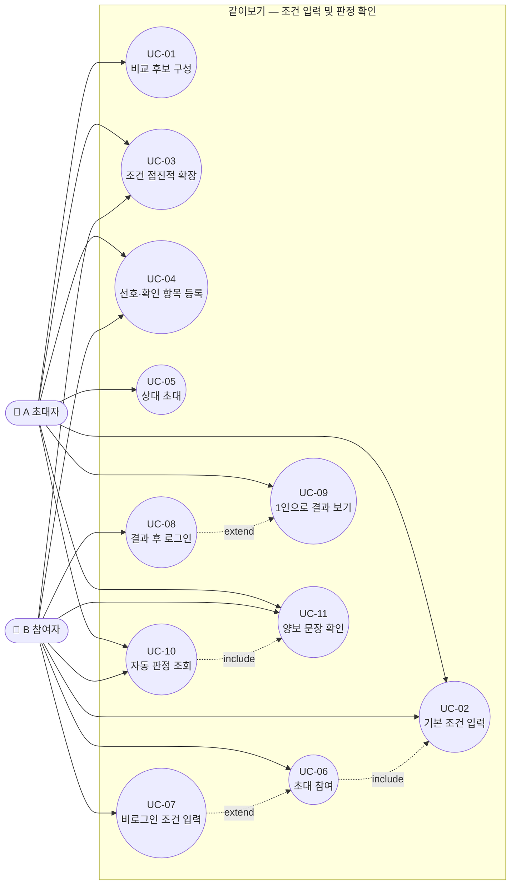

**읽는 법**: UC-06(초대 참여)은 UC-02(기본 조건 입력)를 반드시 포함한다(REQ-FUNC-006 AC-06-01 — 조건 입력 전에 맥락을 먼저 보여줄 뿐, 결국 조건은 입력해야 함). UC-07(비로그인 입력)은 UC-06의 확장 경로다. UC-10(판정 조회)은 UC-11(양보 문장)의 전제 조건이다 — 판정 없이는 양보 문장을 만들 수 없다.

### UC-2. 완화·재탐색·방문 후보 결정 (REQ-FUNC-012~019)

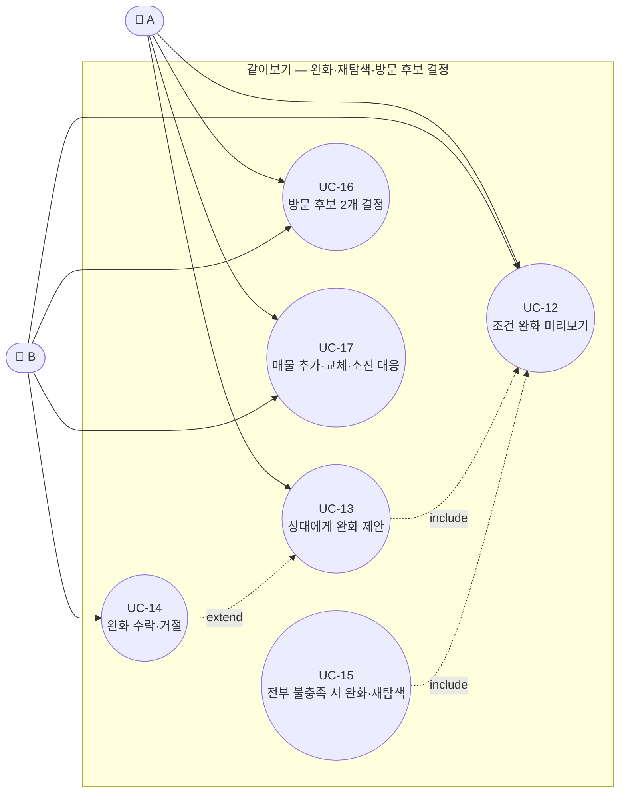

**읽는 법**: UC-16(방문 후보 결정)은 UC-1의 UC-10(판정 조회)을 전제로 하지만 두 다이어그램이 별도라 화살표로 표시하지 않았다 — 판정 없이는 후보를 그룹화할 수 없다는 점은 §9.5 서술에서 텍스트로 명시한다.

### UC-3. 방문 전후 기록 및 알림 (REQ-FUNC-022~024)

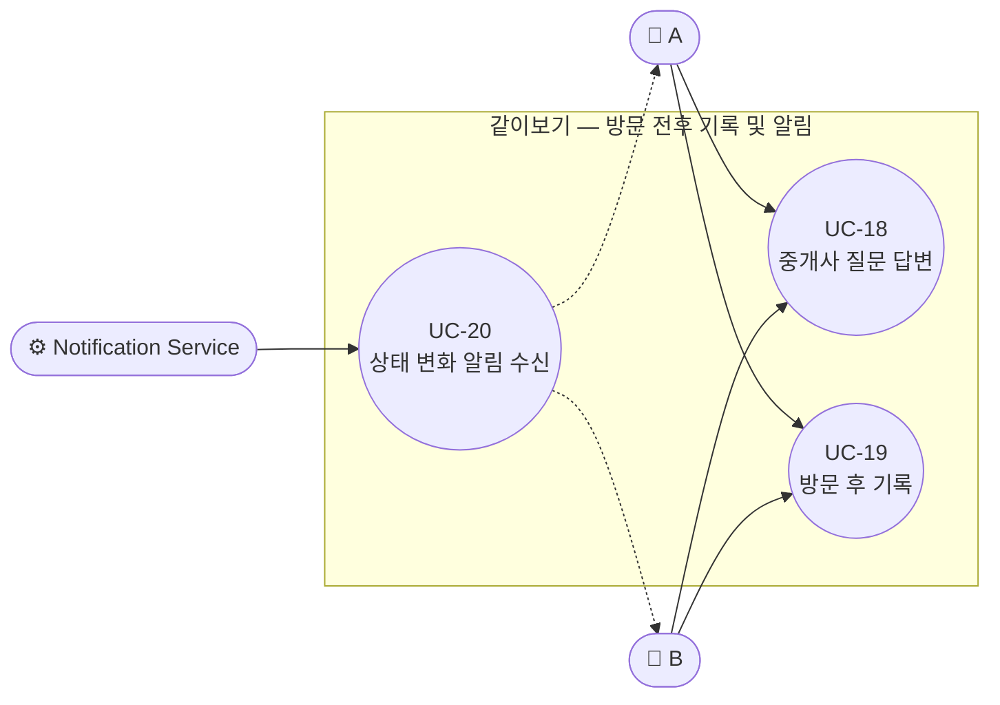

**읽는 법**: UC-20(알림 수신)은 사람이 시작하는 use case가 아니라 시스템(Notification Service)이 먼저 시작해 A·B에게 전달하는 **수신형 use case**다.

---

## 2. Entity Relationship Diagram (ERD-1)

SRS §6.2와 동일하다. 완결성을 위해 재수록한다.

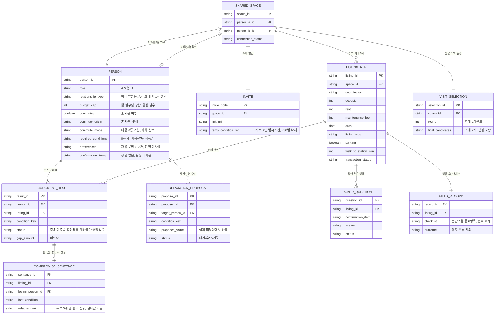

---

## 3. Component Diagram (CMP-1)

SRS §3.1 "시스템 맥락도"는 서비스 간 데이터 흐름 방향만 보여준다. 이 다이어그램은 한 단계 더 들어가 **각 컴포넌트가 무엇을 제공(provided interface)하고 무엇을 요구(required interface)하는지**를 SRS §6.1 API 목록 그대로 붙인 것이다.

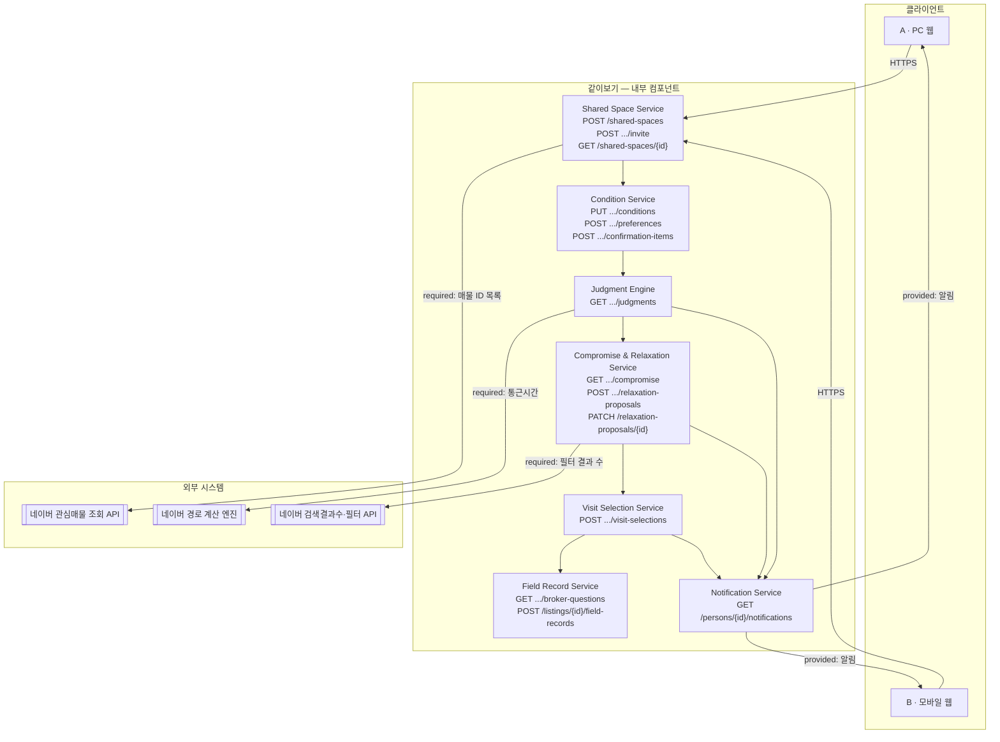

**읽는 법**: 화살표에 붙은 `required:` 라벨은 해당 컴포넌트가 외부 시스템에 의존하는 지점이며, SRS §11.2(외부 시스템발 제약)·§12.2(외부 의존성)와 1:1로 대응한다. `provided:`는 Notification Service가 클라이언트에 제공하는 인터페이스다.

---

## 4. Sequence Diagram

### SEQ-2. 조건 완화 제안-수락 (REQ-FUNC-014)

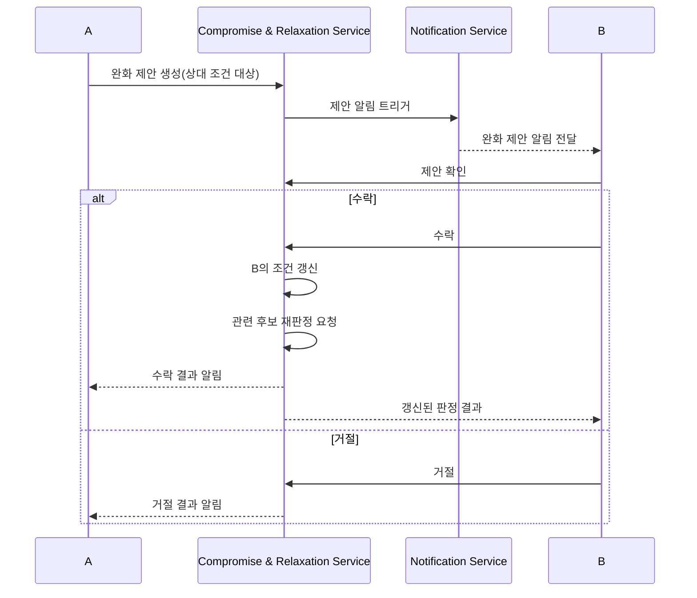

### SEQ-3. 매물 소진 처리 (REQ-FUNC-019)

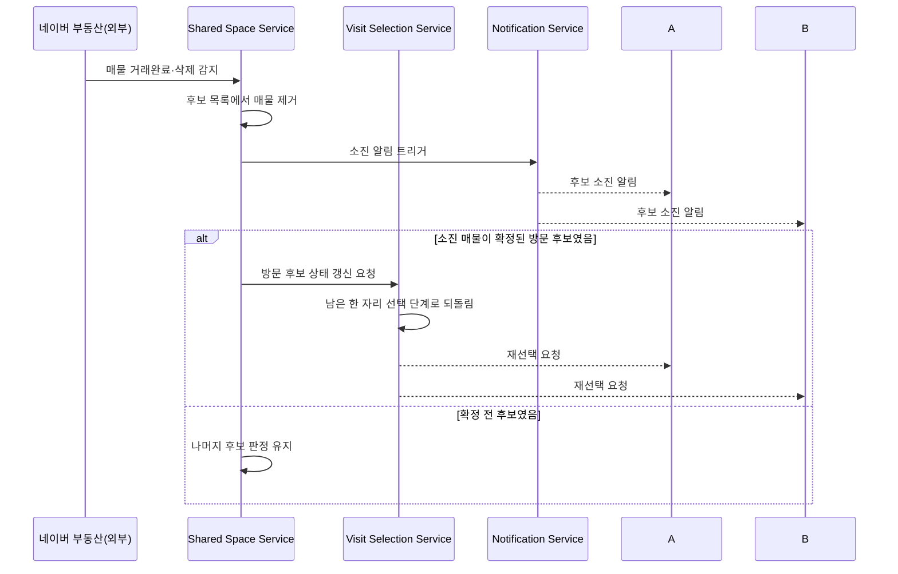

### SEQ-4. 방문 전후 기록 — 단계 2 (REQ-FUNC-022, 023)

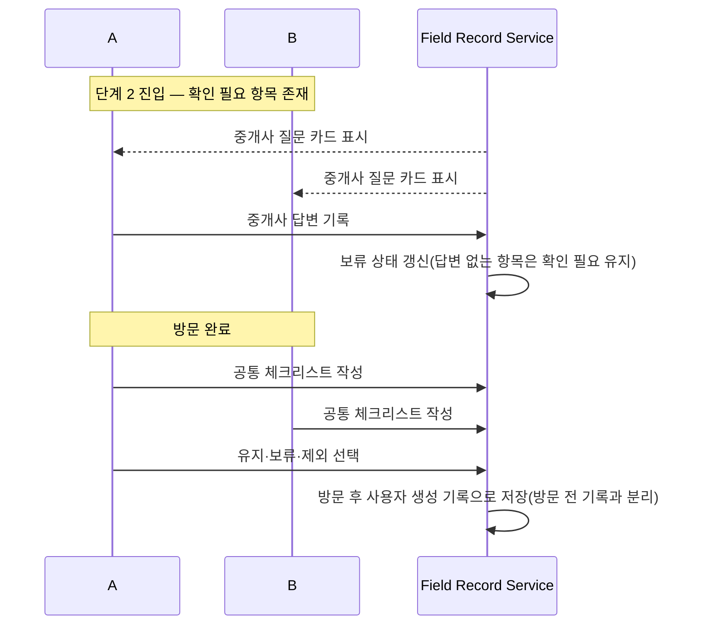

### SEQ-5. B 비로그인 조건 → 로그인 이관 (REQ-FUNC-007, 008)

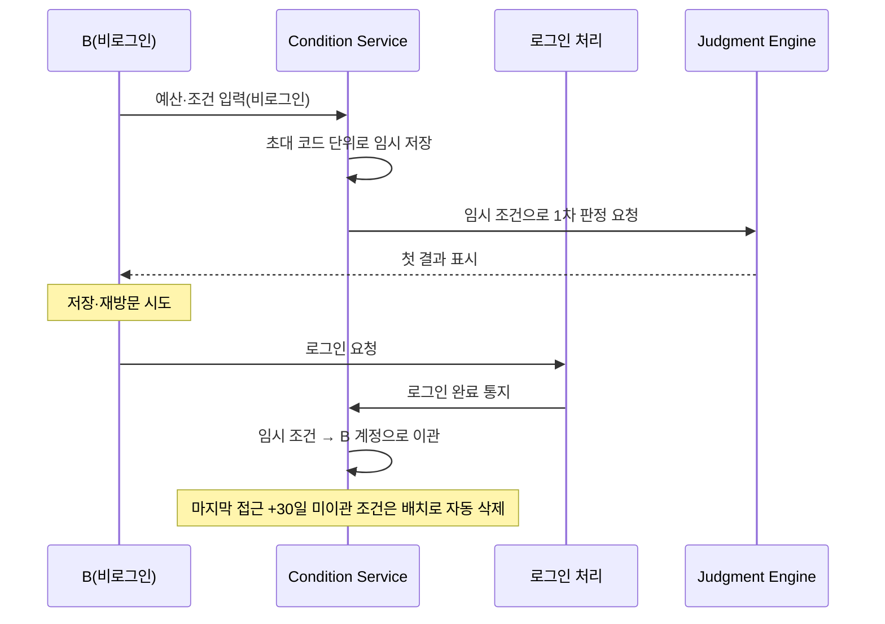

---

## 5. Causal Loop Diagram (CLD-1) — KPI 가드레일 피드백 루프

SRS §10.1의 가드레일 지표 3종은 "한 지표를 올리려다 다른 지표를 망가뜨리는" 되먹임 관계를 감시하기 위한 것이다(PRD §24.4). 이 관계를 인과 루프 다이어그램으로 표현한다. 셋 모두 **균형 루프(Balancing loop, B)** — 한 변수가 과도하게 오르면 감시 신호가 반대 방향으로 개선 압력을 되돌리는 구조다.

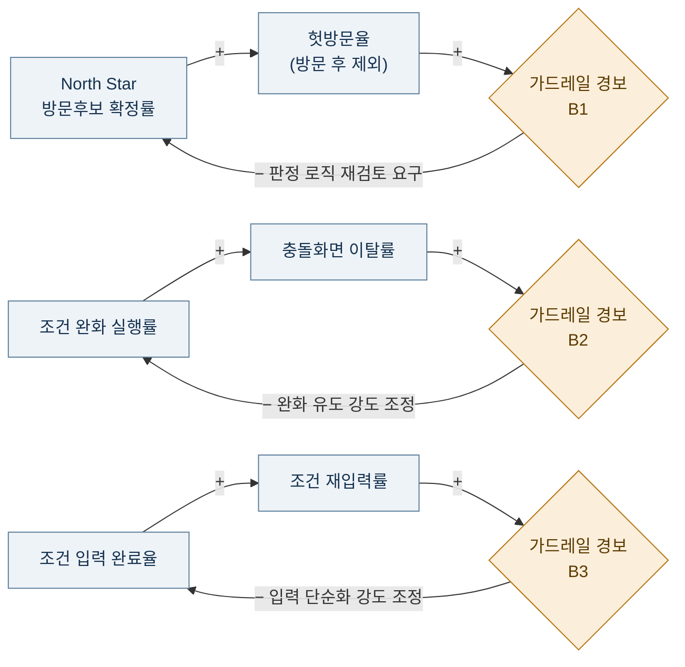

**읽는 법**: `+`는 두 변수가 같은 방향으로 움직인다는 뜻(예: North Star가 오르면 헛방문율도 같이 오를 수 있다), `−`는 가드레일 경보가 원인 변수를 반대 방향으로 되돌리려는 교정 압력이다. 이 세 루프가 균형을 이루지 못하고 계속 같은 방향으로만 움직이면 "숫자만 맞춘 가짜 확정"(PRD §24.4)이 발생한 것으로 판정한다.

---

## 6. Flow Chart

FLOW-1~4는 SRS §4.1.1~4.1.3, §10.4에 이미 있다(목록 참조). 아래 2개가 이번에 추가되는 흐름이다.

### FLOW-5. 이벤트 카운팅 파이프라인 (SRS §10.2 보완)

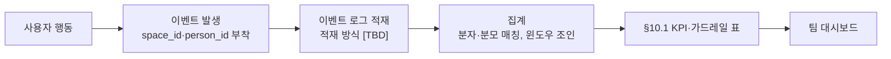

### FLOW-6. 알림 발생 로직 (REQ-FUNC-024)

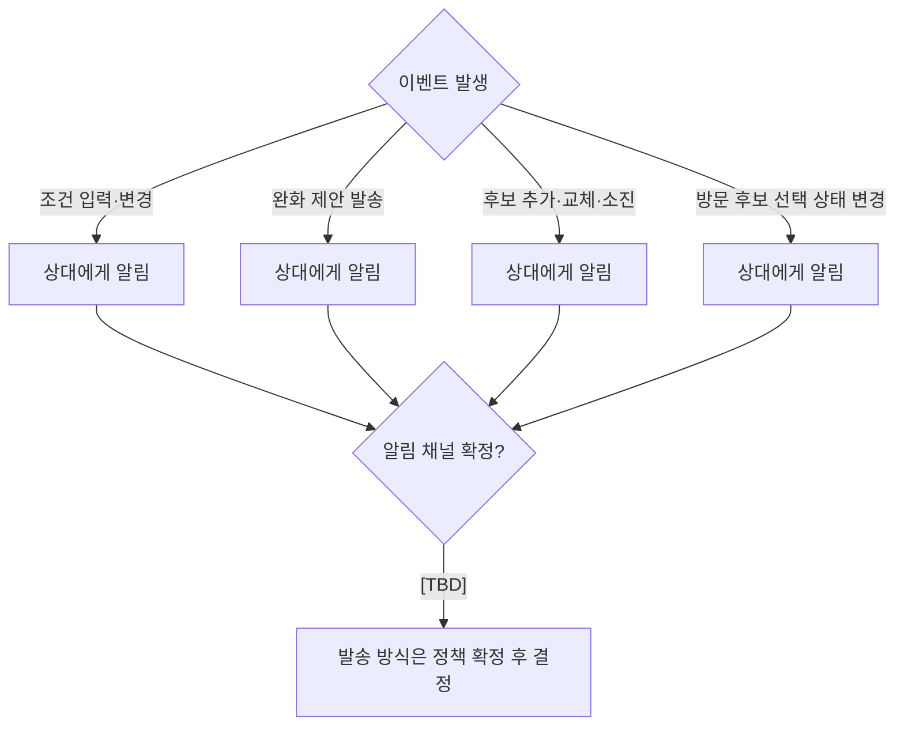

---

## 부록 — 다이어그램 ↔ SRS/PRD 대응표

| 다이어그램 | 근거 SRS/PRD |
| --- | --- |
| UC-1~3 | SRS §4.1 REQ-FUNC 표, §9 수용 기준 명세 |
| ERD-1 | SRS §6.2, PRD §21.9 |
| CMP-1 | SRS §3, §6.1 API 목록, §11.2, §12.2 |
| SEQ-2 | SRS §9.4, REQ-FUNC-014 AC-14-01/02 |
| SEQ-3 | SRS §9.5, REQ-FUNC-019 AC-19-01/02 |
| SEQ-4 | SRS §9.7, REQ-FUNC-022/023 |
| SEQ-5 | SRS §9.2, REQ-FUNC-007/008 AC-07/08 |
| CLD-1 | SRS §10.1 가드레일 지표 표, PRD §24.4 |
| FLOW-5 | SRS §10.2 KPI 사용자 행동 카운팅 계획 |
| FLOW-6 | SRS §9.6, REQ-FUNC-024 AC-24-01/02 |

---

*작성자: 기획 분석가 (IT), 검토자: 개발팀 리드, 승인자: 기획 매니저 (PM)*
