# [설계 문서] 같이보기 (한글)

# 소프트웨어 설계 명세서 (SDD)

**문서 ID:** SDD-JOINTHOME-MVP-001

**개정 버전:** 1.0

**날짜:** 2026-08-24

**상위 문서:** SRS-JOINTHOME-MVP-001 v1.0 (`같이보기-srs-v1_0.md`)

본 문서는 SRS가 정한 요구사항을 **어떻게 구현할 것인지**를 그림으로 설명한다. 새로운 요구사항을 만들지 않으며, 모든 설계 요소는 SRS의 요구사항 ID로 되짚을 수 있다.

---

## 0. 이 문서를 읽는 법

설계 문서는 여러 종류의 그림을 섞어 쓴다. 각 그림이 **무엇에 답하는지**만 알면 배경지식 없이도 읽을 수 있다.

| 그림 종류 | 답하는 질문 | 읽는 법 | 본문 위치 |
| --- | --- | --- | --- |
| **컨텍스트 다이어그램** | 우리 시스템의 **경계는 어디까지인가** | 가운데 상자가 우리가 만드는 것. 바깥은 우리가 만들지 않는 것 | §1.1 |
| **컴포넌트 다이어그램** | 시스템 **안은 어떻게 나뉘는가** | 상자는 서비스, 화살표는 호출 방향 | §1.2 |
| **유스케이스 다이어그램** | **누가 무엇을 할 수 있는가** | 사람 모양이 행위자, 둥근 것이 할 수 있는 일 | §2.1 |
| **ERD** (개체-관계도) | 데이터가 **어떤 모양으로 저장되는가** | 상자는 테이블, 선의 기호는 개수 관계 (`\|\|`=1개, `o{`=0개 이상) | §3.1 |
| **상태 다이어그램** | 하나의 데이터가 **어떤 상태를 거치는가** | 검은 점에서 시작해 화살표를 따라간다 | §3.2 |
| **클래스 다이어그램 (CLD)** | 코드가 **어떤 부품으로 짜이는가** | 상자는 클래스, `+`는 외부 공개 기능 | §4 |
| **시퀀스 다이어그램** | 요청 하나가 **어떤 순서로 처리되는가** | 위에서 아래로 시간이 흐른다. 세로선은 참여자 | §5 |
| **플로차트** | **판단 분기**가 어떻게 갈리는가 | 마름모가 판단 지점, 화살표 글자가 조건 | §6 |

### 설계를 지배하는 다섯 가지 규칙

그림을 읽기 전에 알아 두면 왜 이렇게 생겼는지 이해가 빠르다. 다섯 모두 SRS·PRD에서 온 규칙이다.

| 규칙 | 내용 | 출처 |
| --- | --- | --- |
| **총점은 만들지 않는다** | 두 사람의 조건을 하나의 총점·공동 적합도·복합 순위로 합산하지 않는다 | SRS §6.4-2 · `decisions/0001` |
| **미충족과 확인 필요·계산 불가는 다르다** | 데이터 부재·계산 실패는 미충족이 아니라 확인 필요·계산 불가로 분리 표시한다 | REQ-FUNC-020 · §4.1.1 결정 트리 |
| **AI는 최종 선택을 하지 않는다** | AI는 조건을 대조·설명할 뿐, 최종 선택·강제 타협을 만들지 않는다 | PRD §15 · LIM-03 |
| **A/B는 동일 비중이다** | 판정·trade-off·최종 비교 화면은 A/B를 동일한 순서·시각적 비중으로 표시한다 | REQ-FUNC-025 · `decisions/0001` |
| **초대~B 첫 화면 30초** | 초대 클릭부터 B의 첫 화면 응답까지 P95 기준 30초를 넘지 않는다 | REQ-NF-001 |

---

## 1. 시스템 개관

### 1.1 컨텍스트 다이어그램 — 시스템의 경계

**이 그림이 말하는 것:** 가운데 점선 안이 우리가 만드는 것이고, 바깥은 우리가 만들지 않고 **연결만** 하는 것이다. 매물 탐색 자체와 계약·대출 실행은 직접 만들지 않는다(PRD §9, §23).

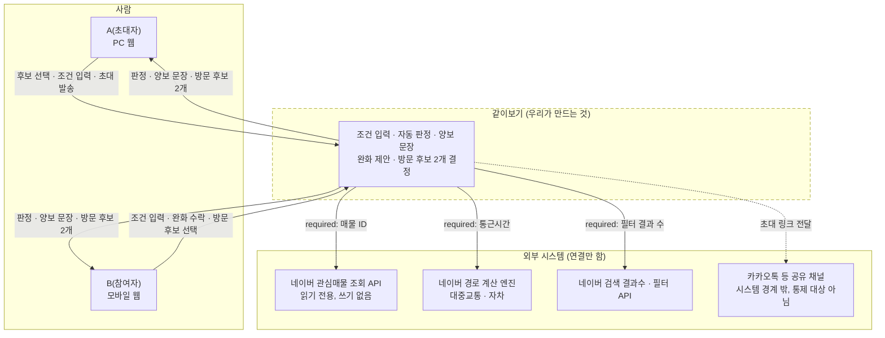
```mermaid
flowchart TB
    subgraph users["사람"]
        U1["A(초대자)<br/>PC 웹"]
        U2["B(참여자)<br/>모바일 웹"]
    end

    subgraph sys["같이보기 (우리가 만드는 것)"]
        CORE["조건 입력 · 자동 판정 · 양보 문장<br/>완화 제안 · 방문 후보 2개 결정"]
    end

    subgraph ext["외부 시스템 (연결만 함)"]
        E1["네이버 관심매물 조회 API<br/>읽기 전용, 쓰기 없음"]
        E2["네이버 경로 계산 엔진<br/>대중교통 · 자차"]
        E3["네이버 검색 결과수 · 필터 API"]
        E4["카카오톡 등 공유 채널<br/>시스템 경계 밖, 통제 대상 아님"]
    end

    U1 -->|"후보 선택 · 조건 입력 · 초대 발송"| CORE
    U2 -->|"조건 입력 · 완화 수락 · 방문 후보 선택"| CORE
    CORE -->|"판정 · 양보 문장 · 방문 후보 2개"| U1
    CORE -->|"판정 · 양보 문장 · 방문 후보 2개"| U2
    CORE -->|"required: 매물 ID"| E1
    CORE -->|"required: 통근시간"| E2
    CORE -->|"required: 필터 결과 수"| E3
    CORE -.->|"초대 링크 전달"| E4

    style sys stroke-dasharray: 6 4
```

**핵심 판단** — 매물 데이터를 쓰지 않고 필요한 필드만 읽는다(LIM-01, `decisions` G5). 계약·대출·법률 판단, 매물 DB 신규 구축은 시스템 경계 밖이다(PRD §23).

### 1.2 컴포넌트 다이어그램 — 시스템 내부 구조

**이 그림이 말하는 것:** 시스템 안이 7개 서비스로 나뉘고, 어느 서비스가 어느 서비스를 부르는지를 보여준다. **Judgment Engine이 가운데** 있는 것이 중요하다 — 판정 없이는 완화도, 방문 후보 결정도 시작할 수 없다.

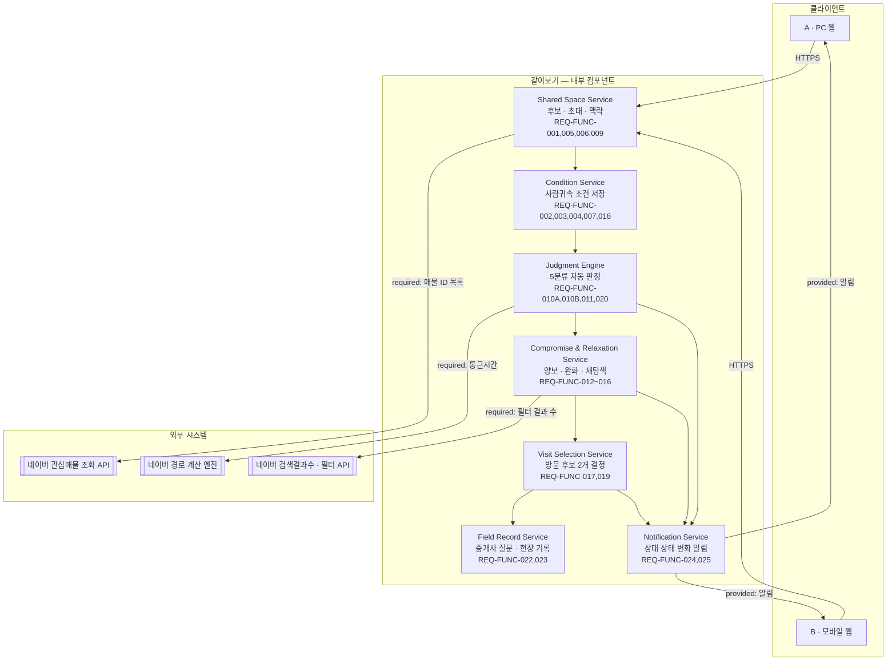
```mermaid
flowchart TB
    subgraph Clients["클라이언트"]
        AW["A · PC 웹"]
        BW["B · 모바일 웹"]
    end

    subgraph Components["같이보기 — 내부 컴포넌트"]
        SSS["Shared Space Service<br/>후보 · 초대 · 맥락<br/>REQ-FUNC-001,005,006,009"]
        CS["Condition Service<br/>사람귀속 조건 저장<br/>REQ-FUNC-002,003,004,007,018"]
        JE["Judgment Engine<br/>5분류 자동 판정<br/>REQ-FUNC-010A,010B,011,020"]
        CRS["Compromise &amp; Relaxation Service<br/>양보 · 완화 · 재탐색<br/>REQ-FUNC-012~016"]
        VSS["Visit Selection Service<br/>방문 후보 2개 결정<br/>REQ-FUNC-017,019"]
        FRS["Field Record Service<br/>중개사 질문 · 현장 기록<br/>REQ-FUNC-022,023"]
        NS["Notification Service<br/>상대 상태 변화 알림<br/>REQ-FUNC-024,025"]
    end

    subgraph External["외부 시스템"]
        LISTAPI[["네이버 관심매물 조회 API"]]
        ROUTEAPI[["네이버 경로 계산 엔진"]]
        SEARCHAPI[["네이버 검색결과수 · 필터 API"]]
    end

    AW -->|HTTPS| SSS
    BW -->|HTTPS| SSS
    SSS -->|"required: 매물 ID 목록"| LISTAPI
    SSS --> CS --> JE
    JE -->|"required: 통근시간"| ROUTEAPI
    JE --> CRS
    CRS -->|"required: 필터 결과 수"| SEARCHAPI
    CRS --> VSS --> FRS
    JE --> NS
    CRS --> NS
    VSS --> NS
    NS -->|"provided: 알림"| AW
    NS -->|"provided: 알림"| BW
```

`required:` 라벨은 해당 컴포넌트가 외부 시스템에 의존하는 지점이며 §11.2(외부 시스템발 제약)·§12.2(외부 의존성)와 대응한다. `provided:`는 Notification Service가 클라이언트에 제공하는 인터페이스다.

### 1.3 서비스 책임과 경계

| 서비스 | 책임 | 하지 않는 것 | 요구사항 |
| --- | --- | --- | --- |
| **Shared Space Service** | 공유 객체 생성, 초대 링크·코드 발급, 후보 매물(최대 5개) 관리, B 맥락 진입 | 매물 데이터를 쓰지 않는다 | REQ-FUNC-001, 005, 006, 009 |
| **Condition Service** | 사람귀속 조건(예산·출퇴근·필수조건·선호·확인항목) 저장, B 비로그인 임시 보관·이관 | 판정을 하지 않는다 | REQ-FUNC-002, 003, 004, 007, 018 |
| **Judgment Engine** | 조건별 자동 판정, 5분류 상태 산출, 후보 그룹화 | 총점·순위를 만들지 않는다 | REQ-FUNC-010A, 010B, 011, 020 |
| **Compromise & Relaxation Service** | 양보 문장 생성, 완화 시뮬레이션, 완화 제안-수락, 재탐색 필터 전달 | 판정을 대신하거나 자동 적용하지 않는다 | REQ-FUNC-012 ~ 016 |
| **Visit Selection Service** | 방문 후보 2개 결정, 2라운드 분할 프로토콜, 매물 소진 대응 | 투표·순위·자동 선택으로 대체하지 않는다 | REQ-FUNC-017, 019 |
| **Field Record Service** | 중개사 질문 카드(단계 2), 방문 후 공통 체크리스트 기록 | 방문 전/후 기록을 섞지 않는다 | REQ-FUNC-022, 023 |
| **Notification Service** | 조건 입력·변경, 완화 제안, 후보 변경·소진, 방문 후보 상태 변화를 상대에게 알림 | 사용자 요청 경로에 끼어들지 않는다 | REQ-FUNC-024, 025 |

---

## 2. 유스케이스

### 2.1 유스케이스 다이어그램

**이 그림이 말하는 것:** 왼쪽·오른쪽의 사람 모양이 **행위자**, 가운데 둥근 상자가 그 사람이 **할 수 있는 일**이다. 점선 `«include»`는 "그 일을 하면 반드시 이것도 일어난다", `«extend»`는 "특정 조건에서만 덧붙는 경로"라는 뜻이다.

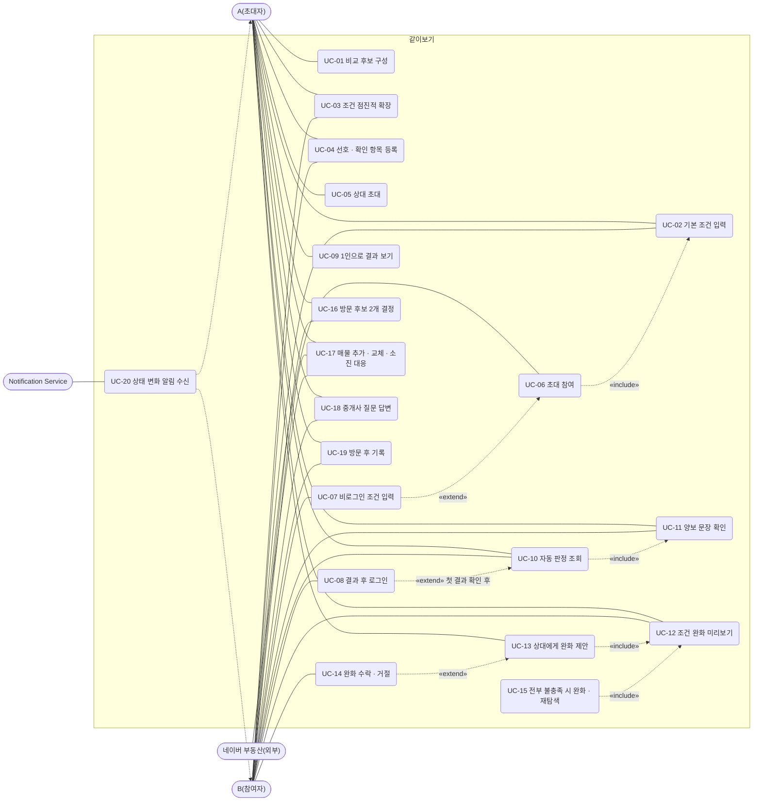
```mermaid
flowchart LR
    actorA(["A(초대자)"])
    actorB(["B(참여자)"])
    sysNaver(["네이버 부동산(외부)"])
    sysNotif(["Notification Service"])

    subgraph SYS["같이보기"]
        uc01("UC-01 비교 후보 구성")
        uc02("UC-02 기본 조건 입력")
        uc03("UC-03 조건 점진적 확장")
        uc04("UC-04 선호 · 확인 항목 등록")
        uc05("UC-05 상대 초대")
        uc06("UC-06 초대 참여")
        uc07("UC-07 비로그인 조건 입력")
        uc08("UC-08 결과 후 로그인")
        uc09("UC-09 1인으로 결과 보기")
        uc10("UC-10 자동 판정 조회")
        uc11("UC-11 양보 문장 확인")
        uc12("UC-12 조건 완화 미리보기")
        uc13("UC-13 상대에게 완화 제안")
        uc14("UC-14 완화 수락 · 거절")
        uc15("UC-15 전부 불충족 시 완화 · 재탐색")
        uc16("UC-16 방문 후보 2개 결정")
        uc17("UC-17 매물 추가 · 교체 · 소진 대응")
        uc18("UC-18 중개사 질문 답변")
        uc19("UC-19 방문 후 기록")
        uc20("UC-20 상태 변화 알림 수신")
    end

    actorA --- uc01 & uc02 & uc03 & uc04 & uc05 & uc09 & uc10 & uc11 & uc12 & uc13 & uc16 & uc17 & uc18 & uc19
    actorB --- uc02 & uc03 & uc04 & uc06 & uc07 & uc08 & uc10 & uc11 & uc12 & uc14 & uc16 & uc17 & uc18 & uc19
    sysNaver --- uc17
    sysNotif --- uc20
    uc20 -.-> actorA
    uc20 -.-> actorB

    uc06 -.->|"«include»"| uc02
    uc07 -.->|"«extend»"| uc06
    uc08 -.->|"«extend» 첫 결과 확인 후"| uc10
    uc10 -.->|"«include»"| uc11
    uc13 -.->|"«include»"| uc12
    uc14 -.->|"«extend»"| uc13
    uc15 -.->|"«include»"| uc12
```

**행위자 `네이버 부동산(외부)`이 사람이 아닌 이유** — 매물 소진 대응(UC-17)의 절반은 A·B의 행동이 아니라 **매물의 거래완료·삭제 감지**라는 외부 신호로 시작된다(REQ-FUNC-019 AC-19-01). 시작 주체가 없으면 유스케이스가 성립하지 않으므로 외부 시스템을 행위자로 세운다. `UC-20`도 마찬가지로 Notification Service가 먼저 시작해 A·B에게 전달하는 **수신형 use case**다.

### 2.2 유스케이스 명세

| ID | 유스케이스 | 주 행위자 | 사전 조건 | 주 흐름 요약 | 대체 · 실패 흐름 | 요구사항 | AC |
| --- | --- | --- | --- | --- | --- | --- | --- |
| **UC-01** | 비교 후보 구성 | A | `같이 고르기` 진입, 관심매물 보유 | 관심매물 중 1~5개 선택 → 해당 매물 ID만 포함한 공유 객체 초안 구성 | 6개째 추가는 초안에 반영하지 않음 | REQ-FUNC-001 | AC-01-01 · 02 |
| **UC-02** | 기본 조건 입력 | A · B | 공유 객체 진입 | 예산 입력(필수) → 출퇴근 여부 응답 → `출근함`이면 출근지·이동수단 입력 | 예산 없이는 완료 불가, `출근 안 함`이면 통근·교통비를 판정에서 제외 | REQ-FUNC-002 | AC-02-01 ~ 03 |
| **UC-03** | 조건 점진적 확장 | A · B | 첫 결과 확인됨 | `더 좁히기`로 추가 필수 조건 1개씩 등록 → 즉시 현재 후보에 재적용 | 사용자당 4개 초과 시 추가 거부 | REQ-FUNC-003 | AC-03-01 · 02 |
| **UC-04** | 선호 · 확인 항목 등록 | A · B | 조건 입력 화면 | 선호(자유 문장 0~3개) 등록, 확인 필요 항목 등록 | 확인 필요 항목은 방문 후 체크리스트와 다른 목록으로 분리 저장 | REQ-FUNC-004 | AC-04-01 · 02 |
| **UC-05** | 상대 초대 | A | 관계 유형 선택 상태 | 공유 실행 → 링크(기본) · 코드(보조) 발급 → B 참여 전까지 대기 표시 | — | REQ-FUNC-005 | AC-05-01 · 02 |
| **UC-06** | 초대 참여 «include» UC-02 | B | 유효한 링크 · 코드 수신 | 참여 시도 → 후보 최대 5개 · A 선호 카드 먼저 표시 → 조건 입력 진행 | 만료 · 무효 초대 시 후보 · 선호 카드 비노출 | REQ-FUNC-006 | AC-06-01 · 02 |
| **UC-07** | 비로그인 조건 입력 «extend» UC-06 | B(비로그인) | 초대 코드 보유 | 예산 · 조건 입력 → 초대 코드 단위로 임시 저장 | 마지막 접근 +30일 미이관 시 삭제 | REQ-FUNC-007 | AC-07-01 ~ 03 |
| **UC-08** | 결과 후 로그인 «extend» UC-10 | B | 첫 결과 확인함 | 저장 · 재방문 시도 시점에만 로그인 요청 | 비로그인 열람 미허용 확정 시 조건 입력 이전 로그인으로 전환(`[TBD]`) | REQ-FUNC-008 | AC-08-01 · 02 |
| **UC-09** | 1인으로 결과 보기 | A | B 미참여 또는 조건 미입력 | A 조건만으로 실부담 · 판정 조회, 진입 차단 없음 | `출근 안 함` 선택 시 통근 행 미표시 | REQ-FUNC-009 | AC-09-01 · 02 |
| **UC-10** | 자동 판정 조회 «include» UC-11 | A · B | 조건 입력 완료 | 후보별 충족 · 미충족 · 확인 필요 · 계산 불가 · 해당 없음 5분류 판정 조회 | 데이터 누락은 계산 불가로, 미확인 항목은 확인 필요로 분리(미충족과 혼동 금지) | REQ-FUNC-010A · 010B · 011 · 020 | AC-10a-01 ~ AC-20-03 |
| **UC-11** | 양보 문장 확인 | A · B | 판정 조회 완료, 한쪽만 충족 후보 존재 | 매물 상세에서 누가 무엇을 얼마나 감수하는지 문장으로 확인 | 미충족 조건 3개 이상이면 앞 2개만 문장화, 나머지는 목록 | REQ-FUNC-012 | AC-12-01 ~ 03 |
| **UC-12** | 조건 완화 미리보기 | A · B | 트레이드오프 상세 화면 진입 | 슬라이더 조작 → 조건 변경 확정 전 판정 등급 변화를 즉시 미리보기 | 두 조건 동시 완화, 미달량과 무관한 값은 제시하지 않음 | REQ-FUNC-013 | AC-13-01 ~ 03 |
| **UC-13** | 상대에게 완화 제안 «include» UC-12 | A 또는 B | 완화 미리보기 확인함 | 상대 조건을 직접 바꾸지 않고 변경 제안을 발송 | — | REQ-FUNC-014 | AC-14-01 |
| **UC-14** | 완화 수락 · 거절 «extend» UC-13 | 제안 수신자 | 완화 제안 도착함 | 수락 시에만 조건 갱신 · 재판정, 거절 시 미반영 | 미수락 제안은 판정에 반영하지 않음 | REQ-FUNC-014 | AC-14-02 |
| **UC-15** | 전부 불충족 시 완화 · 재탐색 «include» UC-12 | A · B | 둘 다 충족 · 한쪽만 충족 후보 0개 | 조건 1개씩 완화 시뮬레이션 → 회복 안 되면 네이버 재탐색 필터 제안 | 2조건 동시 완화안 미제시, 필터는 `이 필터로 찾아보기` 클릭 시에만 이동 | REQ-FUNC-015 · 016 | AC-15-01 · 02, AC-16-01 · 02 |
| **UC-16** | 방문 후보 2개 결정 | A · B | 판정 완료 | 각자 후보 2개 선택 → 겹치면 확정, 안 겹치면 최대 2라운드 내 분할로 종료 | 라운드 상한 2회, 투표 · 순위 · 자동 선택으로 대체하지 않음 | REQ-FUNC-017 | AC-17-01 ~ 03 |
| **UC-17** | 매물 추가 · 교체 · 소진 대응 | A · B · 네이버 부동산(외부) | 후보 매물 존재 | 매물 추가 · 교체 시 조건 유지 · 자동 재판정 / 거래완료 · 삭제 감지 시 후보 제거 · 알림, 확정 후보였다면 재선택 복귀 | — | REQ-FUNC-018 · 019 | AC-18-01 · 02, AC-19-01 · 02 |
| **UC-18** | 중개사 질문 답변 | A · B | 단계 2 진입, 확인 필요 항목 존재 | 질문 카드 표시 → 답변 기록 → 보류 상태 갱신 | 방문 후 체크리스트와 혼합 표시하지 않음 | REQ-FUNC-022 | AC-22-01 ~ 03 |
| **UC-19** | 방문 후 기록 | A · B | 방문 완료 | 공통 체크리스트 6항목 전부 표시 → 유지 · 보류 · 제외 선택 | 방문 전 확인 필요 기록과 혼입하지 않음 | REQ-FUNC-023 | AC-23-01 · 02 |
| **UC-20** | 상태 변화 알림 수신 | Notification Service → A · B | 조건 입력 · 변경, 완화 제안, 후보 변경 · 소진, 방문 후보 상태 변화 중 하나가 발생함 | 상대에게 무엇이 바뀌었는지 알림 | 균형 가드레일(A/B 동일 비중, 총점 · 추천 배지 금지)은 알림 화면에도 적용 | REQ-FUNC-024 · 025 | AC-24-01 · 02, AC-25-01 ~ 03 |

---

## 3. 데이터 설계

### 3.1 ERD — 개체와 관계

**이 그림이 말하는 것:** 상자는 저장 단위(테이블), 선은 관계다. 선 끝 기호가 개수를 뜻한다 — `||`은 정확히 1개, `o{`은 0개 이상, `o|`은 0개 또는 1개.

**가장 중요한 관계는 조건이 매물이 아니라 `PERSON`에 저장되는 것이다.** 매물이 바뀌어도 조건은 유지된다(`decisions/0003`) — 이것이 조건 지속·자동 재판정(REQ-FUNC-018)의 구조적 근거다.

```mermaid
erDiagram
    PERSON {
        string person_id PK
        string role "A 또는 B"
        string relationship_type "예비부부 등, A가 초대 시 1회 선택"
        int budget_cap "월 실부담 상한, 항상 필수"
        boolean commutes "출퇴근 여부"
        string commute_origin "출퇴근 시에만"
        string commute_mode "대중교통 기본, 자차 선택"
        string required_conditions "0~4개, 항목+연산자+값"
        string preferences "자유 문장 0~3개, 판정 미사용"
        string confirmation_items "상한 없음, 판정 미사용"
    }
    SHARED_SPACE {
        string space_id PK
        string person_a_id FK
        string person_b_id FK
        string connection_status
    }
    INVITE {
        string invite_code PK
        string space_id FK
        string link_url
        string temp_condition_ref "B 비로그인 임시조건, +30일 삭제"
    }
    LISTING_REF {
        string listing_id PK
        string space_id FK
        string coordinates
        int deposit
        int rent
        int maintenance_fee
        float area
        string listing_type
        boolean parking
        int walk_to_station_min
        string transaction_status
    }
    JUDGMENT_RESULT {
        string result_id PK
        string person_id FK
        string listing_id FK
        string condition_key
        string status "충족·미충족·확인필요·계산불가·해당없음"
        string gap_amount "미달량"
    }
    COMPROMISE_SENTENCE {
        string sentence_id PK
        string listing_id FK
        string losing_person_id FK
        string lost_condition
        string relative_rank "후보 5개 안 상대 순위, 절대값 아님"
    }
    RELAXATION_PROPOSAL {
        string proposal_id PK
        string proposer_id FK
        string target_person_id FK
        string condition_key
        string proposed_value "실제 미달량에서 산출"
        string status "대기·수락·거절"
    }
    VISIT_SELECTION {
        string selection_id PK
        string space_id FK
        int round "최대 2라운드"
        string final_candidates "최대 2개, 분할 포함"
    }
    BROKER_QUESTION {
        string question_id PK
        string listing_id FK
        string confirmation_item
        string answer
        string status
    }
    FIELD_RECORD {
        string record_id PK
        string listing_id FK
        string checklist "층간소음 등 6항목, 전부 표시"
        string outcome "유지·보류·제외"
    }

    SHARED_SPACE ||--|| PERSON : "A(초대자) 보유"
    SHARED_SPACE ||--o| PERSON : "B(참여자) 참여"
    SHARED_SPACE ||--|| INVITE : "초대 발급"
    SHARED_SPACE ||--o{ LISTING_REF : "후보 최대 5개"
    SHARED_SPACE ||--|| VISIT_SELECTION : "방문 후보 결정"
    PERSON ||--o{ JUDGMENT_RESULT : "조건을 대입"
    LISTING_REF ||--o{ JUDGMENT_RESULT : "판정 대상"
    JUDGMENT_RESULT ||--o| COMPROMISE_SENTENCE : "한쪽만 충족 시 생성"
    PERSON ||--o{ RELAXATION_PROPOSAL : "발신 또는 수신"
    LISTING_REF ||--o{ BROKER_QUESTION : "확인 필요 항목"
    LISTING_REF ||--o| FIELD_RECORD : "방문 후, 단계 2"
```

### 3.2 상태 다이어그램 — 데이터의 생애

**이 그림이 말하는 것:** 하나의 데이터가 시간에 따라 어떤 상태를 거치는지다. 검은 점이 시작, 검은 겹점이 종료다.

#### 3.2.1 Judgment Result — 판정 상태

`확인 필요`와 `계산 불가`를 분리하는 이유가 이 그림의 핵심이다. **데이터가 없어서 못 판정한 것**과 **계산했는데 기준을 못 채운 것**은 사용자에게 완전히 다른 의미다.

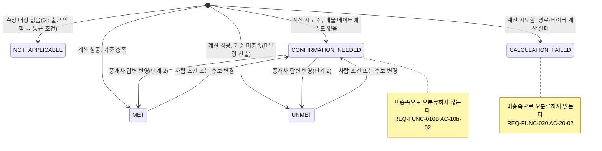
```mermaid
stateDiagram-v2
    [*] --> NOT_APPLICABLE : 측정 대상 없음(예: 출근 안 함 → 통근 조건)
    [*] --> CONFIRMATION_NEEDED : 계산 시도 전, 매물 데이터에 필드 없음
    [*] --> CALCULATION_FAILED : 계산 시도함, 경로·데이터 계산 실패
    [*] --> MET : 계산 성공, 기준 충족
    [*] --> UNMET : 계산 성공, 기준 미충족(미달량 산출)

    CONFIRMATION_NEEDED --> MET : 중개사 답변 반영(단계 2)
    CONFIRMATION_NEEDED --> UNMET : 중개사 답변 반영(단계 2)
    MET --> CONFIRMATION_NEEDED : 사람 조건 또는 후보 변경
    UNMET --> CONFIRMATION_NEEDED : 사람 조건 또는 후보 변경

    note right of CONFIRMATION_NEEDED
        미충족으로 오분류하지 않는다
        REQ-FUNC-010B AC-10b-02
    end note
    note right of CALCULATION_FAILED
        미충족으로 오분류하지 않는다
        REQ-FUNC-020 AC-20-02
    end note
```

#### 3.2.2 Invite / 임시 조건 — 초대의 생애

B의 비로그인 조건이 언제 사람 조건으로 확정되는지가 이 그림의 핵심이다.

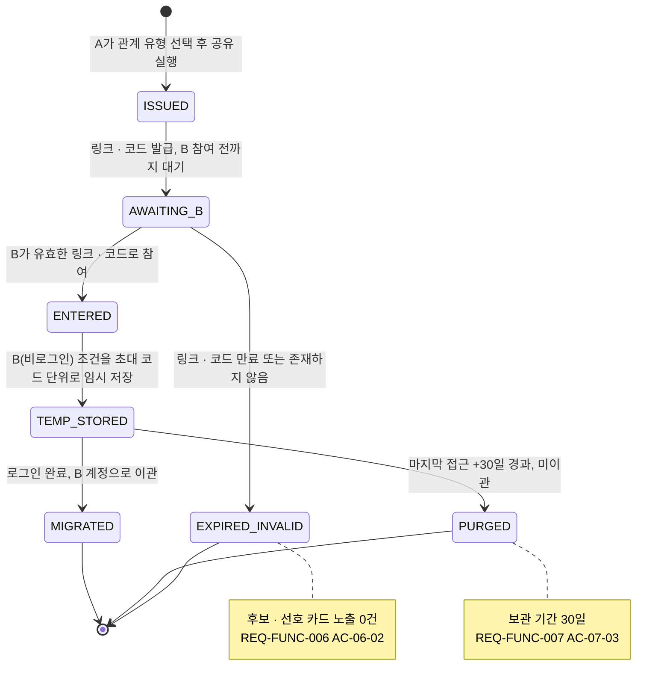
```mermaid
stateDiagram-v2
    [*] --> ISSUED : A가 관계 유형 선택 후 공유 실행
    ISSUED --> AWAITING_B : 링크 · 코드 발급, B 참여 전까지 대기
    AWAITING_B --> ENTERED : B가 유효한 링크 · 코드로 참여
    AWAITING_B --> EXPIRED_INVALID : 링크 · 코드 만료 또는 존재하지 않음
    ENTERED --> TEMP_STORED : B(비로그인) 조건을 초대 코드 단위로 임시 저장
    TEMP_STORED --> MIGRATED : 로그인 완료, B 계정으로 이관
    TEMP_STORED --> PURGED : 마지막 접근 +30일 경과, 미이관
    MIGRATED --> [*]
    PURGED --> [*]
    EXPIRED_INVALID --> [*]

    note right of EXPIRED_INVALID
        후보 · 선호 카드 노출 0건
        REQ-FUNC-006 AC-06-02
    end note
    note right of PURGED
        보관 기간 30일
        REQ-FUNC-007 AC-07-03
    end note
```

#### 3.2.3 Relaxation Proposal — 완화 제안의 생애

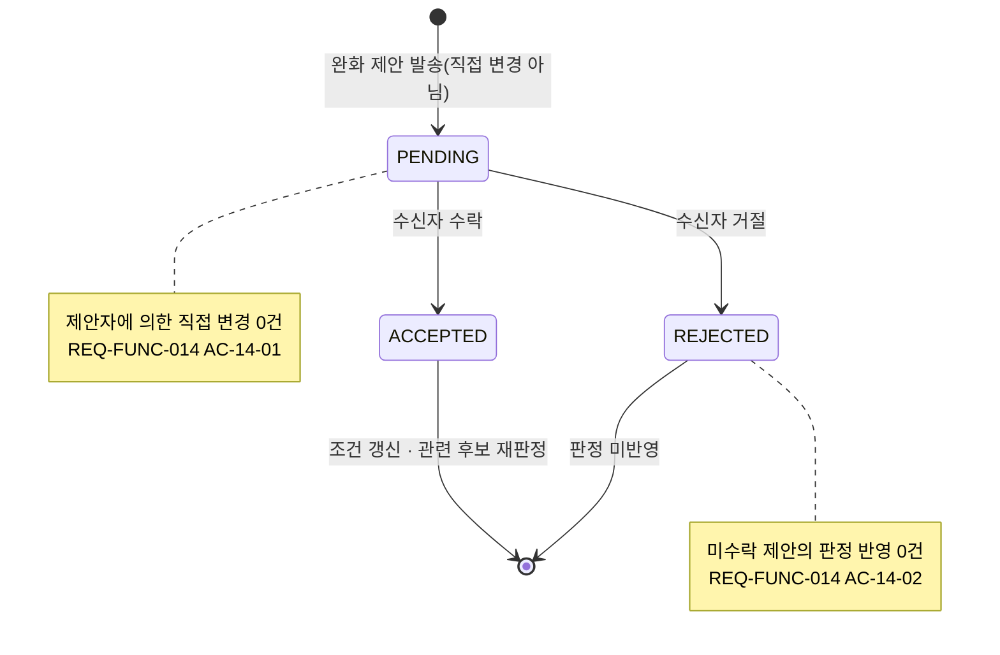
```mermaid
stateDiagram-v2
    [*] --> PENDING : 완화 제안 발송(직접 변경 아님)
    PENDING --> ACCEPTED : 수신자 수락
    PENDING --> REJECTED : 수신자 거절
    ACCEPTED --> [*] : 조건 갱신 · 관련 후보 재판정
    REJECTED --> [*] : 판정 미반영

    note right of PENDING
        제안자에 의한 직접 변경 0건
        REQ-FUNC-014 AC-14-01
    end note
    note right of REJECTED
        미수락 제안의 판정 반영 0건
        REQ-FUNC-014 AC-14-02
    end note
```

#### 3.2.4 Visit Selection — 방문 후보 결정의 생애

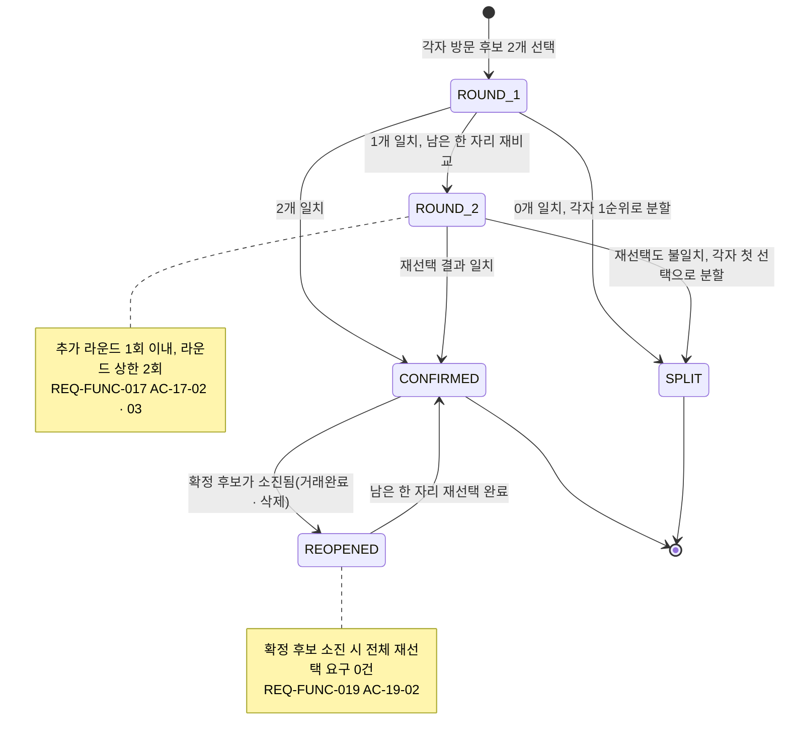
```mermaid
stateDiagram-v2
    [*] --> ROUND_1 : 각자 방문 후보 2개 선택
    ROUND_1 --> CONFIRMED : 2개 일치
    ROUND_1 --> ROUND_2 : 1개 일치, 남은 한 자리 재비교
    ROUND_1 --> SPLIT : 0개 일치, 각자 1순위로 분할
    ROUND_2 --> CONFIRMED : 재선택 결과 일치
    ROUND_2 --> SPLIT : 재선택도 불일치, 각자 첫 선택으로 분할
    CONFIRMED --> REOPENED : 확정 후보가 소진됨(거래완료 · 삭제)
    REOPENED --> CONFIRMED : 남은 한 자리 재선택 완료
    CONFIRMED --> [*]
    SPLIT --> [*]

    note right of ROUND_2
        추가 라운드 1회 이내, 라운드 상한 2회
        REQ-FUNC-017 AC-17-02 · 03
    end note
    note right of REOPENED
        확정 후보 소진 시 전체 재선택 요구 0건
        REQ-FUNC-019 AC-19-02
    end note
```

### 3.3 데이터베이스 물리 설계 요점

| 항목 | 설계 | 근거 |
| --- | --- | --- |
| `listing_refs` | 네이버 매물 원본을 저장하지 않고 필요한 필드만 참조 컬럼으로 둔다 | LIM-01 · `decisions` G5 |
| `shared_spaces.candidate_count` | 후보 상한 5개는 스키마 제약이 아니라 애플리케이션 레벨에서 강제한다 | LIM-10 · REQ-FUNC-001 |
| `persons.required_conditions` | 사용자당 상한 4개를 애플리케이션에서 검증, 조건 유형은 4개 `ConditionType` enum으로 확장 | LIM-10 · REQ-NF-007 |
| `invites.temp_condition_ref` | `last_accessed_at` 인덱스 — 마지막 접근 +30일 배치 삭제 | REQ-FUNC-007 AC-07-03 · LIM-12 |
| `judgment_results` | 사람 조건 또는 매물 변경 시에만 재계산(캐시 무효화 트리거), 5분류 상태를 미충족으로 병합하지 않음 | AC-03-01 · REQ-FUNC-020 |
| `relaxation_proposals.status` | 기본값 `PENDING`, 수락 전까지 관련 `judgment_results`를 갱신하지 않음 | REQ-FUNC-014 AC-14-02 |
| 경로 API 캐시 키 | `(출근지, 매물좌표, 이동수단)` 복합 키, 완화 재계산 시 재호출 0회 목표 | REQ-NF-002 · 003 |
| 접근 제어 | `shared_spaces`는 초대된 두 사람만 열람, B 비로그인 조건은 초대 코드 단위로 격리 | REQ-NF-005 |

---

## 4. 정적 구조 — 클래스 다이어그램 (CLD)

클래스 이름은 §5 추적성 매트릭스에 등재된 것과 동일하다. `+`는 외부에 공개하는 기능, `-`는 내부용이다.

### 4.1 Shared Space Service — 후보 · 초대 · 맥락

**이 그림이 말하는 것:** 관심매물을 공유 객체로 묶고, 초대를 발급하고, B에게 조건 입력보다 먼저 맥락을 보여주는 부품들이다.

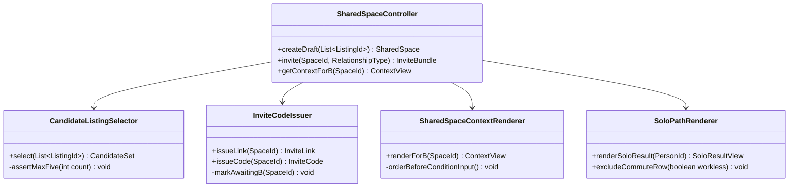
```mermaid
classDiagram
    class SharedSpaceController {
        +createDraft(List~ListingId~) SharedSpace
        +invite(SpaceId, RelationshipType) InviteBundle
        +getContextForB(SpaceId) ContextView
    }
    class CandidateListingSelector {
        +select(List~ListingId~) CandidateSet
        -assertMaxFive(int count) void
    }
    class InviteCodeIssuer {
        +issueLink(SpaceId) InviteLink
        +issueCode(SpaceId) InviteCode
        -markAwaitingB(SpaceId) void
    }
    class SharedSpaceContextRenderer {
        +renderForB(SpaceId) ContextView
        -orderBeforeConditionInput() void
    }
    class SoloPathRenderer {
        +renderSoloResult(PersonId) SoloResultView
        +excludeCommuteRow(boolean workless) void
    }

    SharedSpaceController --> CandidateListingSelector
    SharedSpaceController --> InviteCodeIssuer
    SharedSpaceController --> SharedSpaceContextRenderer
    SharedSpaceController --> SoloPathRenderer
```

**`renderForB()`가 조건 입력 API보다 먼저 호출돼야 하는 이유** — B의 조건 입력 화면보다 먼저 후보 최대 5개와 A 선호 카드를 보여줘야 한다(REQ-FUNC-006 AC-06-01).

### 4.2 Condition Service — 사람귀속 조건을 저장하는 부품

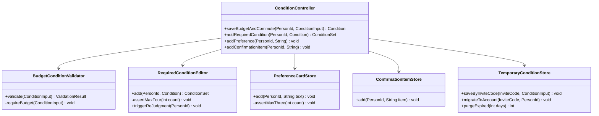
```mermaid
classDiagram
    class ConditionController {
        +saveBudgetAndCommute(PersonId, ConditionInput) Condition
        +addRequiredCondition(PersonId, Condition) ConditionSet
        +addPreference(PersonId, String) void
        +addConfirmationItem(PersonId, String) void
    }
    class BudgetConditionValidator {
        +validate(ConditionInput) ValidationResult
        -requireBudget(ConditionInput) void
    }
    class RequiredConditionEditor {
        +add(PersonId, Condition) ConditionSet
        -assertMaxFour(int count) void
        +triggerReJudgment(PersonId) void
    }
    class PreferenceCardStore {
        +add(PersonId, String text) void
        -assertMaxThree(int count) void
    }
    class ConfirmationItemStore {
        +add(PersonId, String item) void
    }
    class TemporaryConditionStore {
        +saveByInviteCode(InviteCode, ConditionInput) void
        +migrateToAccount(InviteCode, PersonId) void
        +purgeExpired(int days) int
    }

    ConditionController --> BudgetConditionValidator
    ConditionController --> RequiredConditionEditor
    ConditionController --> PreferenceCardStore
    ConditionController --> ConfirmationItemStore
    ConditionController --> TemporaryConditionStore
```

**`TemporaryConditionStore.purgeExpired()`가 있는 이유** — B의 비로그인 조건은 초대 코드 단위로 격리 저장되며, 마지막 접근 +30일이 지나면 배치로 삭제해야 한다(REQ-FUNC-007 AC-07-03).

### 4.3 Judgment Engine — 조건을 판정하는 부품

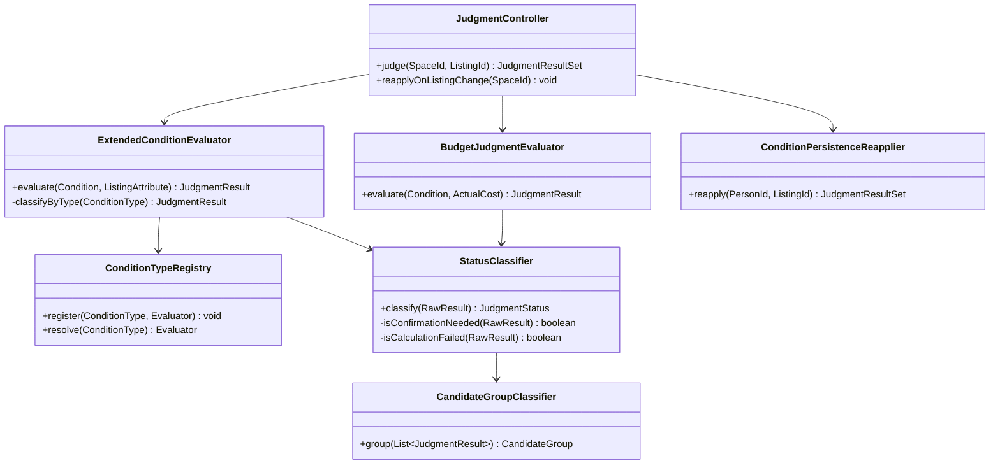
```mermaid
classDiagram
    class JudgmentController {
        +judge(SpaceId, ListingId) JudgmentResultSet
        +reapplyOnListingChange(SpaceId) void
    }
    class BudgetJudgmentEvaluator {
        +evaluate(Condition, ActualCost) JudgmentResult
    }
    class ExtendedConditionEvaluator {
        +evaluate(Condition, ListingAttribute) JudgmentResult
        -classifyByType(ConditionType) JudgmentResult
    }
    class ConditionTypeRegistry {
        +register(ConditionType, Evaluator) void
        +resolve(ConditionType) Evaluator
    }
    class StatusClassifier {
        +classify(RawResult) JudgmentStatus
        -isConfirmationNeeded(RawResult) boolean
        -isCalculationFailed(RawResult) boolean
    }
    class CandidateGroupClassifier {
        +group(List~JudgmentResult~) CandidateGroup
    }
    class ConditionPersistenceReapplier {
        +reapply(PersonId, ListingId) JudgmentResultSet
    }

    JudgmentController --> BudgetJudgmentEvaluator
    JudgmentController --> ExtendedConditionEvaluator
    ExtendedConditionEvaluator --> ConditionTypeRegistry
    BudgetJudgmentEvaluator --> StatusClassifier
    ExtendedConditionEvaluator --> StatusClassifier
    StatusClassifier --> CandidateGroupClassifier
    JudgmentController --> ConditionPersistenceReapplier
```

**`StatusClassifier`가 `미충족`과 `확인 필요` · `계산 불가`를 분리하는 이유** — 데이터가 없어서 계산 못한 것과 계산해서 기준을 못 채운 것을 같은 상태로 두면 사용자가 잘못된 이유로 매물을 포기한다(REQ-FUNC-020, §4.1.1 결정 트리).

### 4.4 Compromise & Relaxation Service — 양보와 완화를 다루는 부품

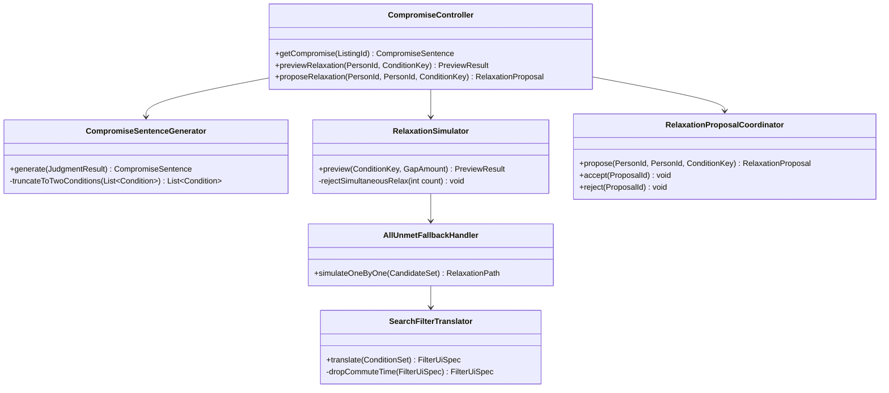
```mermaid
classDiagram
    class CompromiseController {
        +getCompromise(ListingId) CompromiseSentence
        +previewRelaxation(PersonId, ConditionKey) PreviewResult
        +proposeRelaxation(PersonId, PersonId, ConditionKey) RelaxationProposal
    }
    class CompromiseSentenceGenerator {
        +generate(JudgmentResult) CompromiseSentence
        -truncateToTwoConditions(List~Condition~) List~Condition~
    }
    class RelaxationSimulator {
        +preview(ConditionKey, GapAmount) PreviewResult
        -rejectSimultaneousRelax(int count) void
    }
    class RelaxationProposalCoordinator {
        +propose(PersonId, PersonId, ConditionKey) RelaxationProposal
        +accept(ProposalId) void
        +reject(ProposalId) void
    }
    class AllUnmetFallbackHandler {
        +simulateOneByOne(CandidateSet) RelaxationPath
    }
    class SearchFilterTranslator {
        +translate(ConditionSet) FilterUiSpec
        -dropCommuteTime(FilterUiSpec) FilterUiSpec
    }

    CompromiseController --> CompromiseSentenceGenerator
    CompromiseController --> RelaxationSimulator
    CompromiseController --> RelaxationProposalCoordinator
    RelaxationSimulator --> AllUnmetFallbackHandler
    AllUnmetFallbackHandler --> SearchFilterTranslator
```

**`RelaxationProposalCoordinator.accept()`가 있어야만 조건이 바뀌는 이유** — 상대 조건은 직접 변경할 수 없고 제안-수락 구조를 거쳐야 한다(REQ-FUNC-014 AC-14-02).

### 4.5 Visit Selection Service · Field Record Service — 방문 후보 결정과 현장 기록

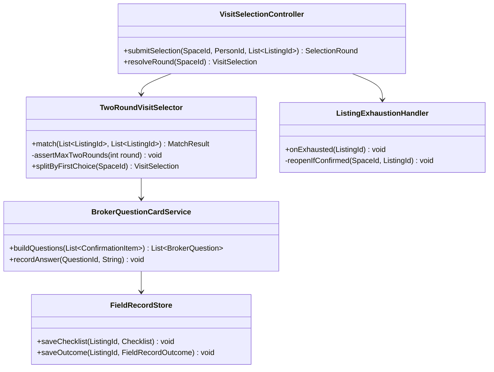
```mermaid
classDiagram
    class VisitSelectionController {
        +submitSelection(SpaceId, PersonId, List~ListingId~) SelectionRound
        +resolveRound(SpaceId) VisitSelection
    }
    class TwoRoundVisitSelector {
        +match(List~ListingId~, List~ListingId~) MatchResult
        -assertMaxTwoRounds(int round) void
        +splitByFirstChoice(SpaceId) VisitSelection
    }
    class ListingExhaustionHandler {
        +onExhausted(ListingId) void
        -reopenIfConfirmed(SpaceId, ListingId) void
    }
    class BrokerQuestionCardService {
        +buildQuestions(List~ConfirmationItem~) List~BrokerQuestion~
        +recordAnswer(QuestionId, String) void
    }
    class FieldRecordStore {
        +saveChecklist(ListingId, Checklist) void
        +saveOutcome(ListingId, FieldRecordOutcome) void
    }

    VisitSelectionController --> TwoRoundVisitSelector
    VisitSelectionController --> ListingExhaustionHandler
    TwoRoundVisitSelector --> BrokerQuestionCardService
    BrokerQuestionCardService --> FieldRecordStore
```

**`ListingExhaustionHandler.reopenIfConfirmed()`가 하는 일** — 소진된 매물이 이미 확정된 방문 후보였다면, 나머지는 유지하고 남은 한 자리만 재선택 단계로 되돌린다(REQ-FUNC-019 AC-19-02).

### 4.6 Notification Service · 횡단 관심사 — 알림 · 전제 공개 · 가드레일 · 성능

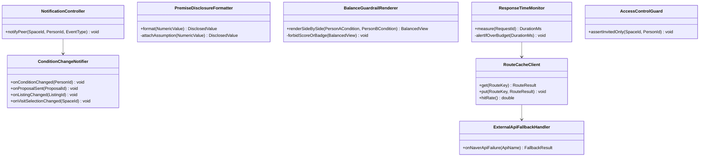
```mermaid
classDiagram
    class NotificationController {
        +notifyPeer(SpaceId, PersonId, EventType) void
    }
    class ConditionChangeNotifier {
        +onConditionChanged(PersonId) void
        +onProposalSent(ProposalId) void
        +onListingChanged(ListingId) void
        +onVisitSelectionChanged(SpaceId) void
    }
    class PremiseDisclosureFormatter {
        +format(NumericValue) DisclosedValue
        -attachAssumption(NumericValue) DisclosedValue
    }
    class BalanceGuardrailRenderer {
        +renderSideBySide(PersonACondition, PersonBCondition) BalancedView
        -forbidScoreOrBadge(BalancedView) void
    }
    class ResponseTimeMonitor {
        +measure(RequestId) DurationMs
        -alertIfOverBudget(DurationMs) void
    }
    class RouteCacheClient {
        +get(RouteKey) RouteResult
        +put(RouteKey, RouteResult) void
        +hitRate() double
    }
    class ExternalApiFallbackHandler {
        +onNaverApiFailure(ApiName) FallbackResult
    }
    class AccessControlGuard {
        +assertInvitedOnly(SpaceId, PersonId) void
    }

    NotificationController --> ConditionChangeNotifier
    ResponseTimeMonitor --> RouteCacheClient
    RouteCacheClient --> ExternalApiFallbackHandler
```

**`RouteCacheClient`가 `ExternalApiFallbackHandler`와 이어지는 이유** — 경로 API 캐시가 미스이고 재호출도 실패하면 미충족이 아니라 계산 불가로 분리해야 한다(REQ-NF-002 · 004).

---

## 5. 동적 흐름 — 시퀀스 다이어그램

**읽는 법:** 위에서 아래로 시간이 흐른다. 세로선은 참여자, 실선 화살표는 요청, 점선 화살표는 응답이다. `alt`는 분기다.

### SD-01 초대 ~ 조건 입력 ~ 판정 확인 (핵심 정상 흐름)

이미 SRS §4.1.4에 게재되어 있어 본문에서는 중복하지 않는다. A의 후보 선택 · 조건 입력부터 초대, B의 참여 · 조건 입력, 양쪽 조건에 대한 자동 판정, 방문 후보 2개 확정까지의 전체 정상 경로를 다룬다.

### SD-02 조건 완화 제안-수락 (REQ-FUNC-014)

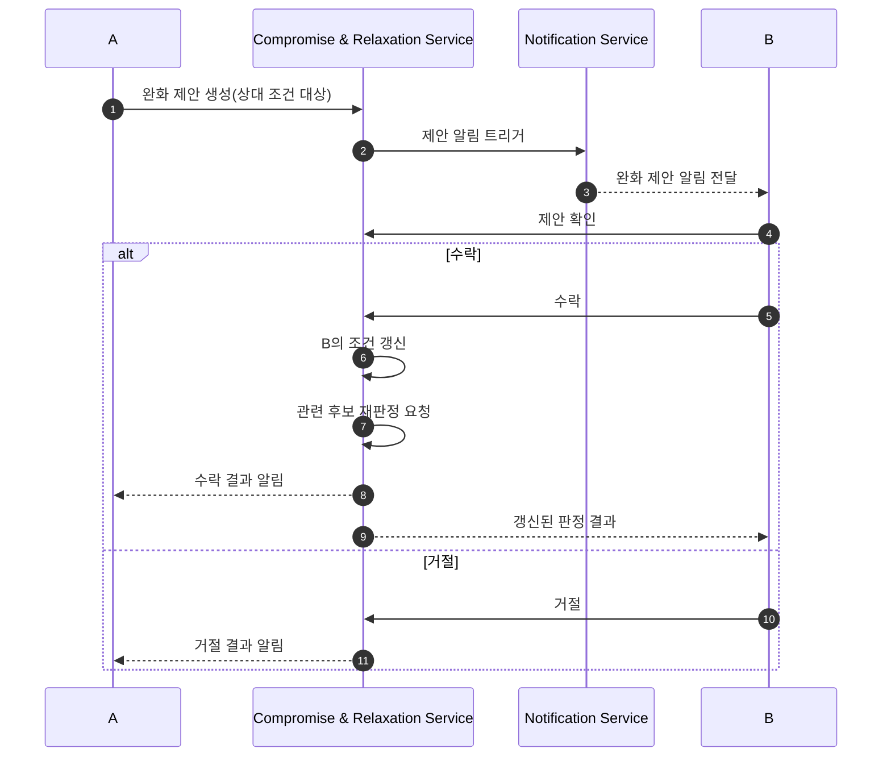
```mermaid
sequenceDiagram
    autonumber
    participant A as A
    participant CRS as Compromise & Relaxation Service
    participant Notif as Notification Service
    participant B as B

    A->>CRS: 완화 제안 생성(상대 조건 대상)
    CRS->>Notif: 제안 알림 트리거
    Notif-->>B: 완화 제안 알림 전달
    B->>CRS: 제안 확인
    alt 수락
        B->>CRS: 수락
        CRS->>CRS: B의 조건 갱신
        CRS->>CRS: 관련 후보 재판정 요청
        CRS-->>A: 수락 결과 알림
        CRS-->>B: 갱신된 판정 결과
    else 거절
        B->>CRS: 거절
        CRS-->>A: 거절 결과 알림
    end
```

**설계 판단** — 제안자가 직접 상대 조건을 바꿀 수 있는 경로는 존재하지 않는다. `accept()`가 호출되기 전까지 `judgment_results`는 갱신되지 않는다(AC-14-02).

### SD-03 매물 소진 처리 (REQ-FUNC-019)

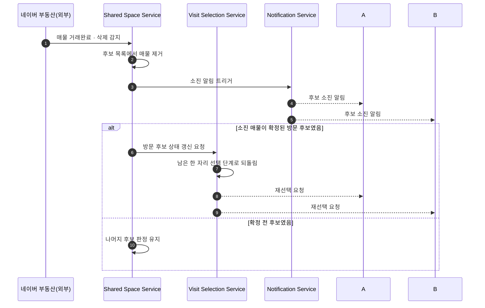
```mermaid
sequenceDiagram
    autonumber
    participant NV as 네이버 부동산(외부)
    participant SSS as Shared Space Service
    participant VSS as Visit Selection Service
    participant Notif as Notification Service
    participant A as A
    participant B as B

    NV->>SSS: 매물 거래완료 · 삭제 감지
    SSS->>SSS: 후보 목록에서 매물 제거
    SSS->>Notif: 소진 알림 트리거
    Notif-->>A: 후보 소진 알림
    Notif-->>B: 후보 소진 알림
    alt 소진 매물이 확정된 방문 후보였음
        SSS->>VSS: 방문 후보 상태 갱신 요청
        VSS->>VSS: 남은 한 자리 선택 단계로 되돌림
        VSS-->>A: 재선택 요청
        VSS-->>B: 재선택 요청
    else 확정 전 후보였음
        SSS->>SSS: 나머지 후보 판정 유지
    end
```

### SD-04 방문 전후 기록 — 단계 2 (REQ-FUNC-022, 023)

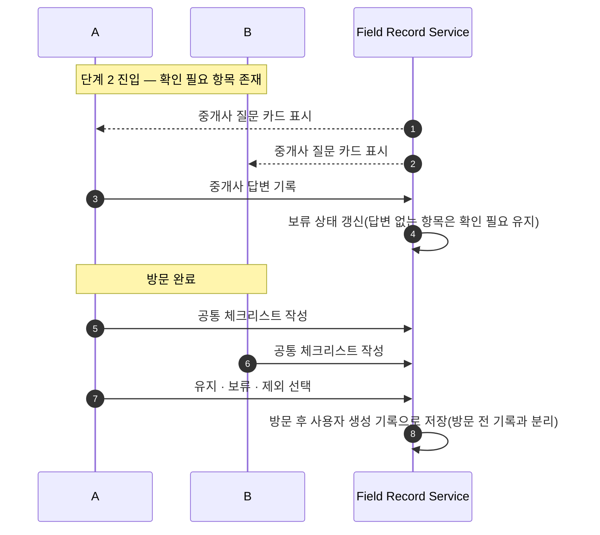
```mermaid
sequenceDiagram
    autonumber
    participant A as A
    participant B as B
    participant FRS as Field Record Service

    Note over A,B: 단계 2 진입 — 확인 필요 항목 존재
    FRS-->>A: 중개사 질문 카드 표시
    FRS-->>B: 중개사 질문 카드 표시
    A->>FRS: 중개사 답변 기록
    FRS->>FRS: 보류 상태 갱신(답변 없는 항목은 확인 필요 유지)
    Note over A,B: 방문 완료
    A->>FRS: 공통 체크리스트 작성
    B->>FRS: 공통 체크리스트 작성
    A->>FRS: 유지 · 보류 · 제외 선택
    FRS->>FRS: 방문 후 사용자 생성 기록으로 저장(방문 전 기록과 분리)
```

### SD-05 B 비로그인 조건 → 로그인 이관 (REQ-FUNC-007, 008)

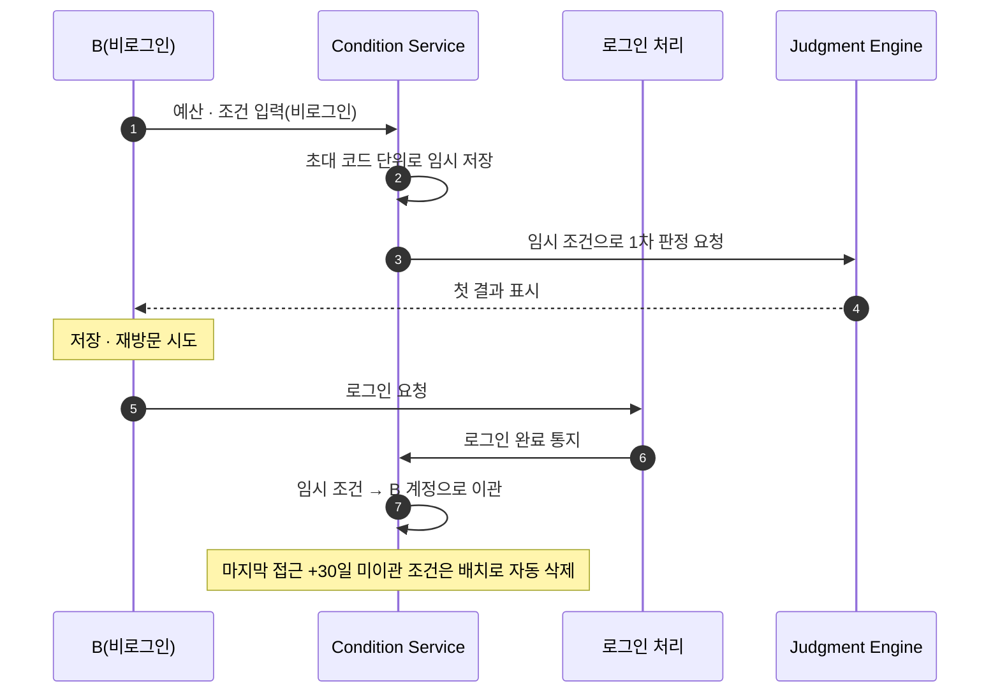
```mermaid
sequenceDiagram
    autonumber
    participant B as B(비로그인)
    participant CS as Condition Service
    participant Auth as 로그인 처리
    participant JE as Judgment Engine

    B->>CS: 예산 · 조건 입력(비로그인)
    CS->>CS: 초대 코드 단위로 임시 저장
    CS->>JE: 임시 조건으로 1차 판정 요청
    JE-->>B: 첫 결과 표시
    Note over B: 저장 · 재방문 시도
    B->>Auth: 로그인 요청
    Auth->>CS: 로그인 완료 통지
    CS->>CS: 임시 조건 → B 계정으로 이관
    Note over CS: 마지막 접근 +30일 미이관 조건은 배치로 자동 삭제
```

### SD-06 조건 지속 · 자동 재판정 (REQ-FUNC-018)

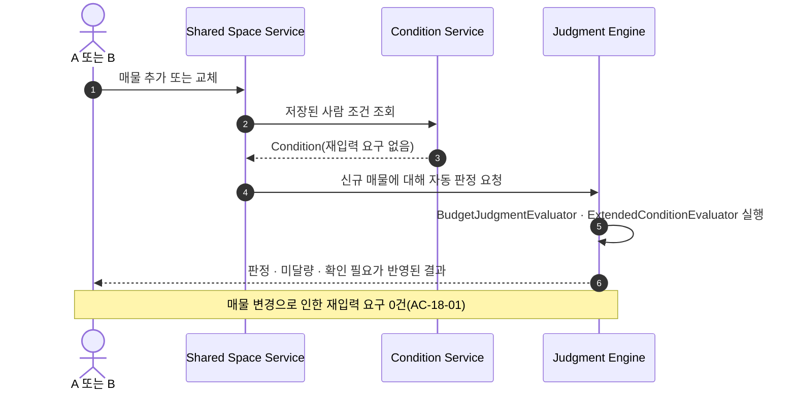
```mermaid
sequenceDiagram
    autonumber
    actor P as A 또는 B
    participant SSS as Shared Space Service
    participant CS as Condition Service
    participant JE as Judgment Engine

    P->>SSS: 매물 추가 또는 교체
    SSS->>CS: 저장된 사람 조건 조회
    CS-->>SSS: Condition(재입력 요구 없음)
    SSS->>JE: 신규 매물에 대해 자동 판정 요청
    JE->>JE: BudgetJudgmentEvaluator · ExtendedConditionEvaluator 실행
    JE-->>P: 판정 · 미달량 · 확인 필요가 반영된 결과
    Note over P,JE: 매물 변경으로 인한 재입력 요구 0건(AC-18-01)
```

---

## 6. 논리 흐름 — 플로차트

**읽는 법:** 마름모가 판단 지점이고, 화살표에 붙은 글자가 그 판단의 결과다.

### FC-01 판정 상태 결정 흐름 (REQ-FUNC-010A, 010B, 020)

이미 SRS §4.1.1에 게재되어 있다. 측정 대상 존재 여부 → 계산 시도 여부 → 기준 충족 여부 순으로 판단해 충족 · 미충족 · 확인 필요 · 계산 불가 · 해당 없음 5분류를 산출하는 결정 트리다. §3.2.1 상태 다이어그램이 같은 규칙을 데이터의 생애 관점에서 다시 보여준다.

### FC-02 방문 후보 2라운드 분할 흐름 (REQ-FUNC-017)

이미 SRS §4.1.2에 게재되어 있다. 각자 선택한 후보 2개의 일치 개수(0 · 1 · 2개)에 따라 확정 · 재비교 · 분할로 갈리는 흐름이며, §3.2.4 상태 다이어그램과 §14.1 결정을 시각적으로 재현한다.

### FC-03 전부 불충족 시 완화 · 재탐색 분기 (REQ-FUNC-015, 016)

이미 SRS §4.1.3에 게재되어 있다. 조건 1개씩 완화를 시뮬레이션해 회복되면 그 경로만 제시하고, 회복되지 않으면 재탐색 필터를 제안하되 검색 결과 0건이면 필터를 제안하지 않는 흐름이다.

### FC-04 알림 발생 흐름 (REQ-FUNC-024)

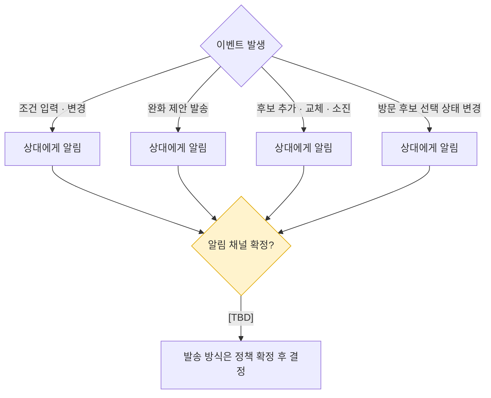
```mermaid
flowchart TD
    EVT{이벤트 발생}
    EVT -->|조건 입력 · 변경| N1[상대에게 알림]
    EVT -->|완화 제안 발송| N2[상대에게 알림]
    EVT -->|후보 추가 · 교체 · 소진| N3[상대에게 알림]
    EVT -->|방문 후보 선택 상태 변경| N4[상대에게 알림]
    N1 & N2 & N3 & N4 --> Q{알림 채널 확정?}
    Q -->|"[TBD]"| SEND[발송 방식은 정책 확정 후 결정]

    style Q fill:#fff3cd,stroke:#e0a800
```

**판단 근거** — 트리거 4종(조건 변경, 완화 제안, 후보 변경, 방문 후보 상태 변경)은 모두 상대에게 알려야 한다는 점에서 동일하게 취급한다(AC-24-01·02). 채널(푸시·문자·앱 내)만 정책 확정 전이라 `[TBD]`다.

### FC-05 릴리스 게이트 (검증 순서)

이미 SRS §10.4에 게재되어 있다. H1 선행 측정 → H1 게이트 → 단계 1 프로토타입 → H3 게이트 → 단계 2 완성으로 이어지며, H1 게이트를 통과하지 못하면 본 투자를 시작하지 않는다는 순서를 시각화한 것이다(PRD §25.2).

---

## 7. 계측 파이프라인 — 데이터 흐름

**이 그림이 말하는 것:** 사용자 행동이 어떻게 §10.1의 KPI · 가드레일 숫자가 되는지다. 사용자 요청 경로와 분리되어 있어서, 계측이 실패해도 A · B는 영향을 받지 않는다.

```mermaid
flowchart LR
    subgraph src["발생원"]
        C["클라이언트<br/>화면 상호작용"]
        SVC["7개 마이크로서비스<br/>서버 이벤트"]
    end

    EV["이벤트 발생<br/>space_id · person_id 부착<br/>SRS §10.2"]
    LOG[("이벤트 로그 적재<br/>적재 방식 [TBD]")]
    AGG["집계<br/>분자 · 분모 매칭, 윈도우 조인<br/>SRS §10.2 표"]
    KPI["§10.1 KPI · 가드레일 표"]
    OBS["§10.3 관측 항목<br/>임계 · 채널 [TBD]"]
    DASH["팀 대시보드"]
    ALERT["알림 발송<br/>채널 [TBD]"]
    GATE["§10.4 검증 순서 · 릴리스 게이트"]

    C --> EV
    SVC --> EV
    EV --> LOG --> AGG --> KPI
    AGG --> OBS
    KPI --> DASH
    KPI --> GATE
    OBS -->|"임계 초과"| ALERT

    style LOG stroke-dasharray: 5 3
```

| 설계 결정 | 이유 |
| --- | --- |
| 이벤트 필수 속성을 `space_id` · `person_id`로 고정한다 | 이 둘이 있어야 §10.2의 모든 분자 · 분모 이벤트를 짝지을 수 있다 |
| 적재 방식(배치 · 실시간)을 지금 확정하지 않는다 | 구현 전에는 어떤 이벤트가 실제로 관측 가능한지조차 알 수 없다(SRS §10.2) |
| 품질 · 임계 판단을 집계 뒤, 릴리스 게이트 앞에 둔다 | 계측 결함과 제품 실패를 구분하지 못하면 §10.4 게이트 판정이 잘못될 수 있다 |
| 알림 채널을 `[TBD]`로 남긴다 | 운영 채널 정책이 아직 확정되지 않았다(SRS §10.3) |

---

## 8. 성능 예산 배분

REQ-NF-001의 **초대 클릭 → B 첫 화면 응답 P95 ≤ 30초**를 구간별로 쪼갠 것이다. 아래 구간별 수치는 구현 착수 전 **설계 제안**이며 확정 스펙이 아니다 — APM 실측 후 재조정한다.

```mermaid
flowchart LR
    A["클라이언트 → API Gateway<br/>모바일 네트워크 포함<br/>≤ 3,000ms"] --> B["초대 코드 유효성 검증<br/>≤ 1,000ms"]
    B --> C["후보 매물 · A 선호 카드 조회<br/>네이버 관심매물 API<br/>≤ 15,000ms"]
    C --> D["컨텍스트 조립 · 직렬화<br/>≤ 1,000ms"]
    D --> E["클라이언트 렌더링<br/>≤ 2,000ms"]
    E --> F(["합계 ≤ 22,000ms<br/>여유 버퍼 약 8,000ms<br/>P95 ≤ 30,000ms"])

    style F fill:#d1e7dd,stroke:#198754
```

| 구간 | 예산(제안) | 초과 시 대응 | 관측 |
| --- | --- | --- | --- |
| 클라이언트 → API Gateway | ≤ 3,000ms | 모바일 웹 초기 자산 경량화 검토 | APM 트레이스 |
| 초대 코드 유효성 검증 | ≤ 1,000ms | 초대 코드 조회 인덱스 점검 | `TC-NF-001` |
| 후보 매물 · A 선호 카드 조회 | ≤ 15,000ms(외부 API 의존) | 관심매물 API 지연 시 계산 불가 폴백(REQ-NF-004) | 외부 API 오류율 · 지연 로그(§10.3) |
| 컨텍스트 조립 · 직렬화 | ≤ 1,000ms | 응답 payload 축소 검토 | APM 트레이스 |
| 클라이언트 렌더링 | ≤ 2,000ms | 초기 렌더 리소스 점검 | 프런트엔드 RUM |
| 전체 | P95 ≤ 30,000ms | 10분간 P95 초과 시 알림(채널 `[TBD]`) | `ResponseTimeMonitor` · §10.3 |

---

## 9. 요구사항 ↔ 설계 산출물 추적표

SRS의 모든 기능 · 비기능 요구사항이 최소 한 개의 설계 산출물로 이어지는지 확인하는 표다.

| 요구사항 | 유스케이스 | 클래스(§4) | 시퀀스(§5) | 플로차트(§6) | 상태(§3.2) |
| --- | --- | --- | --- | --- | --- |
| REQ-FUNC-001 후보 구성 | UC-01 | §4.1 | — | — | — |
| REQ-FUNC-002 기본 조건 입력 | UC-02 | §4.2 | — | — | — |
| REQ-FUNC-003 조건 점진적 확장 | UC-03 | §4.2 | — | — | — |
| REQ-FUNC-004 선호 · 확인 항목 | UC-04 | §4.2 | — | — | — |
| REQ-FUNC-005 상대 초대 | UC-05 | §4.1 | — | — | §3.2.2 |
| REQ-FUNC-006 초대 참여 | UC-06 | §4.1 | — | — | §3.2.2 |
| REQ-FUNC-007 비로그인 임시 보관 | UC-07 | §4.2 | SD-05 | — | §3.2.2 |
| REQ-FUNC-008 결과 후 로그인 | UC-08 | §4.6 | SD-05 | — | §3.2.2 |
| REQ-FUNC-009 1인 빈 경로 | UC-09 | §4.1 | — | — | — |
| REQ-FUNC-010A · 010B 자동 판정 | UC-10 | §4.3 | — | FC-01 | §3.2.1 |
| REQ-FUNC-011 후보 그룹화 | UC-10 | §4.3 | — | FC-01 | §3.2.1 |
| REQ-FUNC-012 trade-off 설명 | UC-11 | §4.4 | — | — | — |
| REQ-FUNC-013 완화 미리보기 | UC-12 | §4.4 | — | — | — |
| REQ-FUNC-014 완화 제안 | UC-13 · 14 | §4.4 | SD-02 | — | §3.2.3 |
| REQ-FUNC-015 전부 불충족 분기 | UC-15 | §4.4 | — | FC-03 | — |
| REQ-FUNC-016 재탐색 필터 전달 | UC-15 | §4.4 | — | FC-03 | — |
| REQ-FUNC-017 방문 후보 2개 결정 | UC-16 | §4.5 | — | FC-02 | §3.2.4 |
| REQ-FUNC-018 조건 지속 · 재판정 | UC-17 | §4.3 | SD-06 | — | — |
| REQ-FUNC-019 매물 소진 처리 | UC-17 | §4.5 | SD-03 | — | §3.2.4 |
| REQ-FUNC-020 상태 · 계산 오류 분리 | UC-10 | §4.3 | — | FC-01 | §3.2.1 |
| REQ-FUNC-021 숫자 전제 공개 | — | §4.6 | — | — | — |
| REQ-FUNC-022 중개사 질문 카드 | UC-18 | §4.5 | SD-04 | — | — |
| REQ-FUNC-023 방문 후 기록 | UC-19 | §4.5 | SD-04 | — | — |
| REQ-FUNC-024 상태 변화 알림 | UC-20 | §4.6 | — | FC-04 | — |
| REQ-FUNC-025 균형 가드레일 | UC-20 | §4.6 | — | — | — |
| REQ-NF-001 E2E 응답 시간 | — | §4.6(ResponseTimeMonitor) | SD-01 | — | §8 성능 예산 |
| REQ-NF-002 경로 API 재호출 0회 | — | §4.6(RouteCacheClient) | — | — | — |
| REQ-NF-003 캐시 확장성 | — | §4.6(RouteCacheClient) | — | — | — |
| REQ-NF-004 외부 API 폴백 | — | §4.6(ExternalApiFallbackHandler) | — | FC-01 | — |
| REQ-NF-005 접근 제어 | — | §4.6(AccessControlGuard) | — | — | §3.2.2 |
| REQ-NF-006 전제 없는 숫자 금지 | — | §4.6(PremiseDisclosureFormatter) | — | — | — |
| REQ-NF-007 판정 조건 타입 확장 | — | §4.3(ConditionTypeRegistry) | — | — | — |

**REQ-FUNC-021에 시퀀스 · 상태 다이어그램이 없는 이유** — 전제 공개는 특정 흐름이 아니라 숫자를 표시하는 모든 화면에 걸리는 횡단 규칙(`PremiseDisclosureFormatter`)이라, 하나의 시퀀스로 대표할 수 없다.

---

## 부록 — 가드레일 피드백 관계 (참고)

§7 계측 파이프라인이 "행동이 숫자가 되는 경로"를 다뤘다면, 이 부록은 "그 숫자들이 서로 어떻게 되먹임하는가"를 다룬다. 원본은 SRS §10.1에 동일하게 게재되어 있다.

North Star나 입력 지표를 올리려는 시도가 다른 지표를 망가뜨리는지 감시하는 가드레일 3종(SRS §10.1, PRD §24.4)은 세 개의 **균형 루프(Balancing loop)**로 표현된다.

```mermaid
flowchart LR
    classDef var fill:#EEF3F8,stroke:#5C7F9C,color:#16324F;
    classDef gate fill:#FBEEDA,stroke:#B5730E,color:#5C3A00;

    NS["North Star<br/>방문후보 확정률"]:::var
    HB["헛방문율<br/>(방문 후 제외)"]:::var
    G1{"가드레일 경보<br/>B1"}:::gate

    RA["조건 완화 실행률"]:::var
    CE["충돌화면 이탈률"]:::var
    G2{"가드레일 경보<br/>B2"}:::gate

    CC["조건 입력 완료율"]:::var
    RR["조건 재입력률"]:::var
    G3{"가드레일 경보<br/>B3"}:::gate

    NS -->|"+"| HB
    HB -->|"+"| G1
    G1 -->|"− 판정 로직 재검토 요구"| NS

    RA -->|"+"| CE
    CE -->|"+"| G2
    G2 -->|"− 완화 유도 강도 조정"| RA

    CC -->|"+"| RR
    RR -->|"+"| G3
    G3 -->|"− 입력 단순화 강도 조정"| CC
```

`+`는 두 변수가 같은 방향으로 움직인다는 뜻, `−`는 가드레일 경보가 원인 변수를 반대로 되돌리려는 교정 압력이다.

---

**SDD-JOINTHOME-MVP-001 · v1.0 · 2026-08-24**

상위 문서: `같이보기-srs-v1_0.md` · `같이보기-prd-v1_0.md`
